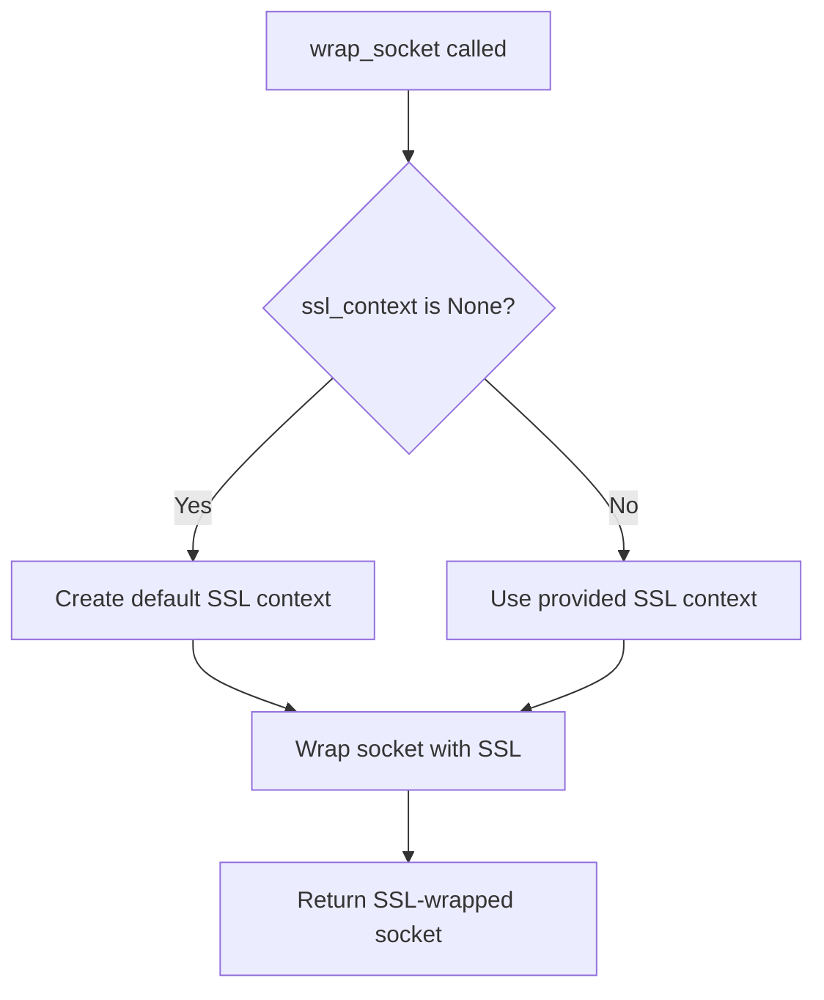
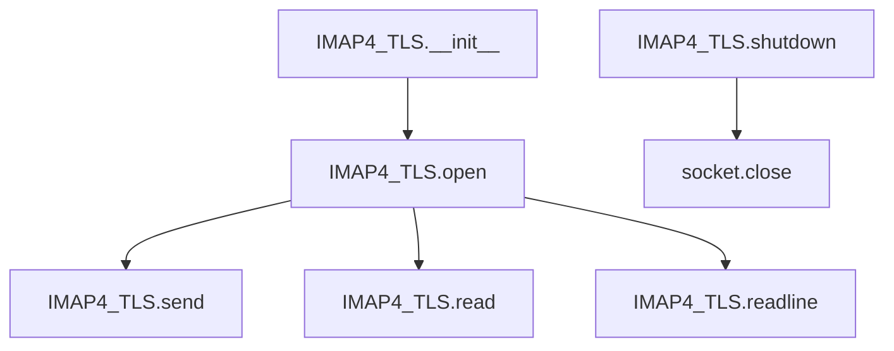

# `tls.py`

## `imapclient.tls.wrap_socket` · *function*

## Summary:
Establishes a secure SSL/TLS connection by wrapping a plain socket with encryption.

## Description:
Wraps a standard socket with SSL/TLS encryption using the provided SSL context. If no SSL context is provided, it creates a default context appropriate for server authentication. This function abstracts the SSL wrapping process to ensure consistent secure connection establishment across the IMAP client.

## Args:
    sock (socket.socket): The underlying socket to be wrapped with SSL/TLS encryption
    ssl_context (Optional[ssl.SSLContext]): SSL context configuration for the secure connection. If None, a default context is created using ssl.create_default_context() with SERVER_AUTH purpose
    host (str): The hostname of the server for certificate validation and SNI (Server Name Indication) extension

## Returns:
    socket.socket: A new socket object that wraps the original socket with SSL/TLS encryption

## Raises:
    ssl.SSLError: When SSL/TLS handshake fails due to certificate issues, protocol errors, or other security violations
    OSError: When underlying socket operations fail (network issues, timeouts, etc.)

## Constraints:
    Preconditions:
        - The sock parameter must be a valid, connected socket
        - The host parameter must be a valid hostname string
        - The ssl_context parameter, if provided, must be a valid ssl.SSLContext instance
    
    Postconditions:
        - The returned socket is ready for secure communication
        - The SSL/TLS handshake has been completed successfully

## Side Effects:
    - Initiates SSL/TLS handshake with the remote server
    - May perform certificate validation and hostname matching
    - Network I/O operations during the handshake process

## Control Flow:


## Examples:
```python
import socket
import ssl
from imapclient.tls import wrap_socket

# Basic usage with automatic context creation
sock = socket.socket(socket.AF_INET, socket.SOCK_STREAM)
sock.connect(('imap.example.com', 993))
secure_sock = wrap_socket(sock, None, 'imap.example.com')

# Usage with custom SSL context
context = ssl.create_default_context()
context.check_hostname = False
context.verify_mode = ssl.CERT_NONE
secure_sock = wrap_socket(sock, context, 'imap.example.com')
```

## `imapclient.tls.IMAP4_TLS` · *class*

## Summary:
IMAP4_TLS is a secure IMAP client that extends the standard IMAP4 class to support TLS-encrypted connections to IMAP servers.

## Description:
This class provides a TLS-encrypted interface for communicating with IMAP servers. It inherits from imaplib.IMAP4 and adds SSL/TLS encryption capabilities while maintaining compatibility with the standard IMAP protocol. The class is designed to be instantiated by IMAP clients that require secure communication with email servers over encrypted channels.

## State:
- ssl_context: ssl.SSLContext object used for SSL/TLS configuration, or None to use default context
- _timeout: Optional float representing the default connection timeout in seconds
- host: String containing the hostname of the IMAP server (inherited from imaplib.IMAP4)
- port: Integer representing the port number (inherited from imaplib.IMAP4)
- sock: Socket object used for the underlying network connection
- file: io.BufferedReader object for reading data from the connection

## Lifecycle:
- Creation: Instantiate with host, port, ssl_context, and optional timeout parameters
- Usage: Call open() to establish connection, then use read(), readline(), send() methods for communication
- Destruction: Call shutdown() or use as context manager to clean up resources

## Method Map:


## Raises:
- socket.timeout: When connection or operation exceeds the specified timeout
- ssl.SSLError: When SSL/TLS handshake fails or certificate validation fails
- ConnectionRefusedError: When the server refuses the connection
- OSError: When network-related errors occur during connection establishment

## Example:
```python
import ssl
from imapclient.tls import IMAP4_TLS

# Create SSL context
ssl_context = ssl.create_default_context()

# Connect to IMAP server
imap = IMAP4_TLS('imap.example.com', 993, ssl_context, timeout=30.0)
imap.open()  # Establishes TLS connection

# Send commands and read responses
imap.send(b'LOGIN user password\r\n')
response = imap.readline()

# Clean up
imap.shutdown()
```

### `imapclient.tls.IMAP4_TLS.__init__` · *method*

## Summary:
Initializes an IMAP4_TLS connection with SSL configuration and timeout settings, establishing the foundation for secure IMAP communication.

## Description:
Configures an IMAP4_TLS client instance with the specified host, port, SSL context, and optional timeout. This constructor prepares the object for secure IMAP operations by setting up SSL/TLS parameters and initializing the underlying IMAP4 protocol infrastructure. The method is typically called during object instantiation to establish connection parameters before attempting to connect to an IMAP server.

## Args:
    host (str): The hostname or IP address of the IMAP server to connect to.
    port (int): The port number on which the IMAP server is listening.
    ssl_context (ssl.SSLContext or None): SSL context configuration for secure connections, or None to use default SSL settings.
    timeout (float or None): Connection timeout in seconds, or None for no timeout. Defaults to None.

## Returns:
    None: This method initializes the object state and does not return a value.

## Raises:
    None explicitly raised: Based on the source code, no exceptions are explicitly caught or raised by this method.

## State Changes:
    Attributes READ: None
    Attributes WRITTEN: 
        - self.ssl_context: Set to the provided ssl_context parameter
        - self._timeout: Set to the provided timeout parameter
        - self.file: Declared as io.BufferedReader (initialization occurs in parent class)

## Constraints:
    Preconditions:
        - host must be a valid string representing a network address
        - port must be a positive integer representing a valid network port
        - ssl_context must be either an ssl.SSLContext object or None
        - timeout must be a positive float or None
    Postconditions:
        - The instance is initialized with the provided connection parameters
        - The underlying IMAP4 protocol infrastructure is set up with host and port
        - self.file attribute is declared for future use in I/O operations

## Side Effects:
    None: This method performs initialization only and doesn't cause external I/O or service calls.

### `imapclient.tls.IMAP4_TLS.open` · *method*

## Summary:
Establishes a secure TLS connection to an IMAP server by creating a socket connection and wrapping it with SSL/TLS encryption.

## Description:
This method initializes a secure connection to an IMAP server using TLS encryption. It creates a TCP socket connection to the specified host and port, wraps it with SSL/TLS security, and prepares a file-like object for reading server responses. This method is typically called during the initialization phase of an IMAP client session to establish a secure communication channel with the mail server.

## Args:
    host (str): The hostname or IP address of the IMAP server. Defaults to empty string.
    port (int): The port number to connect to. Defaults to 993 (standard IMAPS port).
    timeout (Optional[float]): Connection timeout in seconds. If None, uses the instance's default timeout.

## Returns:
    None: This method does not return a value.

## Raises:
    socket.error: Raised when the socket connection fails or times out.
    ssl.SSLError: Raised when SSL/TLS handshake fails or certificate validation fails.

## State Changes:
    Attributes READ: 
        - self._timeout (used when timeout parameter is None)
        - self.ssl_context (used by wrap_socket function)
    Attributes WRITTEN:
        - self.host (set to the provided host parameter)
        - self.port (set to the provided port parameter)
        - self.sock (set to the SSL-wrapped socket)
        - self.file (set to a file-like object created from the SSL socket)

## Constraints:
    Preconditions:
        - The host parameter must be a valid hostname or IP address
        - The port parameter must be a valid port number (1-65535)
        - The timeout parameter, if provided, must be a positive number
    Postconditions:
        - Instance variables host, port, sock, and file are initialized
        - A secure SSL connection is established to the IMAP server
        - The sock attribute contains an SSL-wrapped socket ready for communication

## Side Effects:
    - Establishes a network connection to the remote IMAP server
    - May perform DNS resolution for the hostname
    - Creates and opens a socket connection
    - May initiate SSL/TLS handshake with the server
    - Opens a file descriptor for reading server responses

### `imapclient.tls.IMAP4_TLS.read` · *method*

## Summary:
Reads a specified number of bytes from the underlying SSL socket connection.

## Description:
This method provides a direct interface to read binary data from the IMAP server connection. It delegates to the underlying `io.BufferedReader` instance (`self.file`) which was created from an SSL-wrapped socket connection during the `open()` method call. This method is typically used internally by the IMAP protocol handling code to read server responses.

## Args:
    size (int): The maximum number of bytes to read from the connection.

## Returns:
    bytes: The bytes read from the connection. May return fewer bytes than requested if EOF is reached.

## Raises:
    None explicitly raised - inherits behavior from `io.BufferedReader.read()` which may raise `OSError` or `IOError` on I/O errors.

## State Changes:
    Attributes READ: self.file
    Attributes WRITTEN: None

## Constraints:
    Preconditions: 
    - The IMAP connection must be established (i.e., `open()` method must have been called successfully)
    - `self.file` must be a valid `io.BufferedReader` instance
    - The `size` parameter must be a non-negative integer
    
    Postconditions:
    - Returns exactly `size` bytes if available, or fewer if EOF is encountered
    - The internal file position is advanced by the number of bytes read

## Side Effects:
    - Performs network I/O operation by reading from the SSL socket
    - May block until data is available or connection is closed
    - Modifies the internal file position of the underlying `io.BufferedReader`

### `imapclient.tls.IMAP4_TLS.readline` · *method*

## Summary:
Reads a single line from the TLS-encrypted IMAP connection's underlying file buffer.

## Description:
This method reads a line of data from the IMAP connection's buffered file handle, which is used for reading responses from the IMAP server. It's part of the IMAP protocol implementation that handles TLS-encrypted communication with email servers.

## Args:
    None

## Returns:
    bytes: A bytes object containing a single line of data (including the newline character) from the IMAP server response, or an empty bytes object if EOF is reached.

## Raises:
    None explicitly raised, but may raise exceptions from the underlying file object's readline() method such as:
    - OSError: If an I/O error occurs during reading
    - ValueError: If the file is closed or not readable

## State Changes:
    Attributes READ: self.file
    Attributes WRITTEN: None

## Constraints:
    Preconditions:
    - The IMAP connection must be established (self.file must be initialized)
    - The underlying socket connection must be active
    - The file handle must be readable
    
    Postconditions:
    - The file position advances by one line
    - Returns exactly one line of data from the server response

## Side Effects:
    I/O operations on the underlying TLS socket connection through the file handle

### `imapclient.tls.IMAP4_TLS.send` · *method*

## Summary:
Sends raw data through the secure socket connection to the IMAP server.

## Description:
This method transmits binary data through the underlying TLS socket connection to the IMAP server. It's used internally by the IMAP client to send commands and data during the IMAP protocol communication session.

## Args:
    data (Buffer): A buffer-like object containing the raw bytes to be sent over the socket connection.

## Returns:
    None: This method does not return any value.

## Raises:
    OSError: If the socket connection is closed or becomes unavailable during transmission.
    TypeError: If the data parameter is not a buffer-like object.

## State Changes:
    Attributes READ: self.sock
    Attributes WRITTEN: None

## Constraints:
    Preconditions: The socket connection (self.sock) must be established and active before calling this method.
    Postconditions: The data is transmitted through the socket connection, though the success of delivery is not guaranteed by this method.

## Side Effects:
    I/O operation: Writes data to the underlying network socket connection.
    Network communication: Transmits data over the TLS-encrypted connection to the IMAP server.

### `imapclient.tls.IMAP4_TLS.shutdown` · *method*

## Summary:
Closes the underlying network connection and cleans up associated socket and file resources.

## Description:
This method terminates the IMAP session by closing the underlying SSL socket connection and associated file handles. It is typically called during object cleanup or when explicitly disconnecting from an IMAP server.

The method delegates to the parent `imaplib.IMAP4.shutdown()` implementation, which handles proper cleanup of network resources including closing the socket connection and releasing associated file descriptors.

## Args:
    None

## Returns:
    None

## Raises:
    OSError: May be raised during socket cleanup if underlying I/O operations fail
    AttributeError: May be raised if the connection was not properly initialized

## State Changes:
    Attributes READ: self.sock, self.file (accessed during cleanup)
    Attributes WRITTEN: None

## Constraints:
    Preconditions: The IMAP connection must be established (sock and file attributes should be valid)
    Postconditions: Network resources are closed and the connection state is reset

## Side Effects:
    I/O operations: Closes the underlying SSL socket connection and file handles
    Resource cleanup: Releases network resources and associated file descriptors
    Socket state change: The socket is closed and cannot be used for further communication

