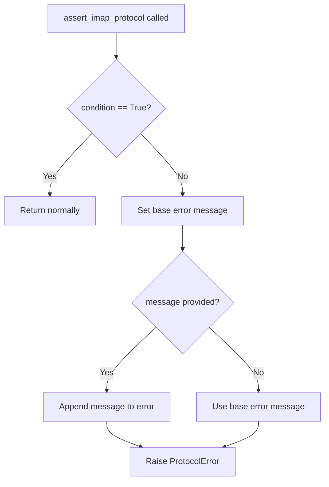

# `util.py`

## `imapclient.util.to_unicode` · *function*

## Summary:
Converts bytes to ASCII-encoded unicode string with graceful fallback handling.

## Description:
Transforms byte sequences into unicode strings using ASCII decoding. When ASCII decoding fails due to non-ASCII characters, it falls back to ignoring problematic characters and logs a warning message. Strings are returned unchanged.

## Args:
    s (Union[bytes, str]): Input value to convert, either bytes or string

## Returns:
    str: Unicode string representation of the input

## Raises:
    None explicitly raised, but UnicodeDecodeError may occur internally during decoding

## Constraints:
    Preconditions:
        - Input must be either bytes or str type
    Postconditions:
        - Return value is always a unicode string
        - Non-ASCII bytes are handled gracefully with character stripping

## Side Effects:
    - Writes warning message to logger when fallback decoding occurs

## Control Flow:
```mermaid
flowchart TD
    A[Input s] --> B{isinstance(s, bytes)?}
    B -- Yes --> C[Try ASCII decode]
    C --> D{UnicodeDecodeError?}
    D -- Yes --> E[Log warning]
    E --> F[Decode with 'ignore']
    D -- No --> G[Return decoded string]
    B -- No --> H[Return s unchanged]
    F --> I[Return fallback result]
    G --> I
    I --> J[Output str]
```

## Examples:
    # Convert bytes to string
    result = to_unicode(b"hello")  # Returns "hello"
    
    # Handle non-ASCII bytes with fallback
    result = to_unicode(b"hello\xff")  # Logs warning, returns "hello"
    
    # String input unchanged
    result = to_unicode("hello")  # Returns "hello"
```

## `imapclient.util.to_bytes` · *function*

## Summary:
Converts strings to bytes using the specified character encoding, or returns bytes unchanged.

## Description:
This utility function provides a consistent way to handle string-to-bytes conversion in IMAP operations. It accepts either a string or bytes object and ensures the result is always bytes, making it safe to use when interfacing with IMAP protocol operations that require byte strings.

## Args:
    s (Union[bytes, str]): Input value that can be either a string or bytes object to be converted to bytes
    charset (str): Character encoding to use when converting strings to bytes. Defaults to "ascii". Must be a valid encoding recognized by Python's encode() method.

## Returns:
    bytes: The input converted to bytes. If input was already bytes, returns unchanged. If input was string, returns encoded bytes.

## Raises:
    UnicodeEncodeError: When attempting to encode a string containing characters that cannot be represented in the specified charset

## Constraints:
    Preconditions:
        - The charset parameter must be a valid encoding name recognized by Python's encode() method
        - Input s must be either a string or bytes object
    
    Postconditions:
        - Always returns a bytes object
        - If input was bytes, output equals input
        - If input was string, output equals s.encode(charset)

## Side Effects:
    None

## Control Flow:
```mermaid
flowchart TD
    A[Input s: Union[bytes,str]] --> B{isinstance(s, str)?}
    B -- Yes --> C[s.encode(charset)]
    B -- No --> D[s]
    C --> E[Return bytes]
    D --> E
```

## Examples:
    # Convert string to bytes with default ascii encoding
    result = to_bytes("hello")  # Returns b"hello"
    
    # Convert string to bytes with utf-8 encoding
    result = to_bytes("café", "utf-8")  # Returns b'caf\xe9'
    
    # Pass bytes through unchanged
    result = to_bytes(b"already bytes")  # Returns b"already bytes"
    
    # Handle encoding errors
    try:
        result = to_bytes("emoji 😊", "ascii")
    except UnicodeEncodeError:
        # Handle encoding failure
        pass

## `imapclient.util.assert_imap_protocol` · *function*

## Summary:
Validates IMAP protocol compliance and raises a protocol error when server responses violate expected standards.

## Description:
This utility function serves as a protocol validation checkpoint for IMAP server communications. It ensures that server responses conform to the IMAP protocol specification by checking boolean conditions. When a protocol violation is detected, it raises a dedicated ProtocolError with contextual information about the violation.

The function is extracted into its own utility to centralize protocol validation logic and enforce clear responsibility boundaries between protocol parsing and application logic. This makes the codebase more maintainable and allows for consistent error handling across different IMAP operations.

## Args:
    condition (bool): The boolean condition that must evaluate to True for protocol compliance
    message (Optional[bytes]): Optional server response message to include in error details, defaults to None

## Returns:
    None: This function does not return any value when successful

## Raises:
    ProtocolError: Raised when the condition parameter evaluates to False, indicating an IMAP protocol violation

## Constraints:
    Preconditions:
    - The condition parameter must be a boolean value
    - If message is provided, it must be valid bytes that can be decoded to ASCII
    
    Postconditions:
    - Function either completes normally (when condition is True) or raises ProtocolError (when condition is False)

## Side Effects:
    None: This function has no side effects beyond raising an exception

## Control Flow:


## Examples:
```python
# Valid protocol response
assert_imap_protocol(True)

# Invalid protocol response with message
server_response = b"BAD Unexpected command"
assert_imap_protocol(False, server_response)
# Raises: ProtocolError("Server replied with a response that violates the IMAP protocol")
```

## `imapclient.util.chunk` · *function*

## Summary:
Generates successive chunks of a sequence with a specified maximum size.

## Description:
This function splits a sequence (such as a list or tuple) into smaller subsequences of a fixed maximum size. It's commonly used to process large datasets in batches or to comply with API limitations that restrict the number of items in a single operation.

## Args:
    lst (Union[Tuple, list]): The input sequence to be chunked. Should support indexing and slicing operations.
    size (int): The maximum number of elements in each chunk. Must be positive.

## Returns:
    Iterator[Union[Tuple, list]]: An iterator yielding chunks of the original sequence, each containing at most `size` elements.

## Raises:
    None explicitly raised by this function.

## Constraints:
    Preconditions:
    - The `size` parameter must be a positive integer.
    - The `lst` parameter should be a sequence-like object (list, tuple, etc.) that supports slicing.

    Postconditions:
    - All elements from the original sequence will be included in exactly one of the returned chunks.
    - Each yielded chunk will contain at most `size` elements.
    - The last chunk may contain fewer elements if the total length is not evenly divisible by `size`.

## Side Effects:
    None.

## Control Flow:
```mermaid
flowchart TD
    A[chunk() called] --> B{size > 0?}
    B -- No --> C[Stop iteration]
    B -- Yes --> D[Initialize i=0]
    D --> E{i < len(lst)?}
    E -- No --> F[Stop iteration]
    E -- Yes --> G[Yield lst[i:i+size]]
    G --> H[i += size]
    H --> E
```

## Examples:
    >>> list(chunk([1, 2, 3, 4, 5], 2))
    [[1, 2], [3, 4], [5]]
    
    >>> list(chunk(('a', 'b', 'c', 'd'), 3))
    [('a', 'b', 'c'), ('d',)]
```

