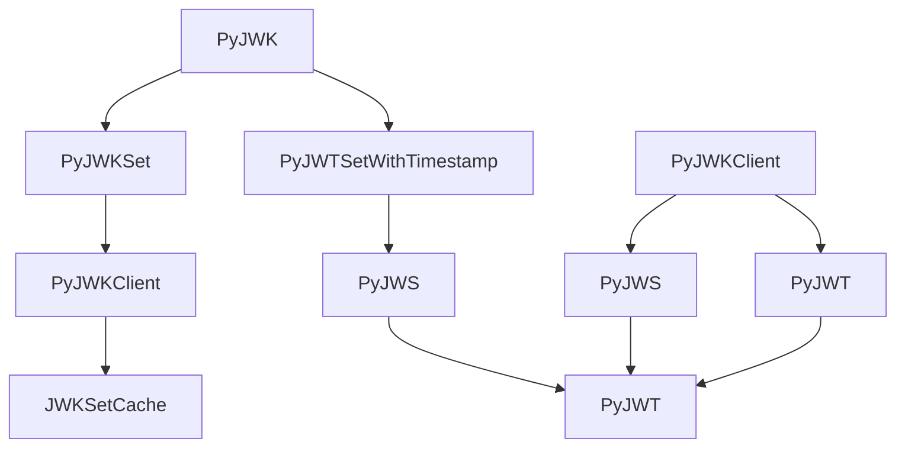

# `jwt`

## Tree:
jwt/
├── api_jwk.py
├── api_jws.py
├── api_jwt.py
├── exceptions.py
├── help.py
├── jwk_set_cache.py
├── jwks_client.py
└── warnings.py

## Role:
Provides comprehensive JSON Web Token (JWT) functionality including encoding, decoding, key management, and validation.

## Description:
The jwt module serves as the core JWT processing library, offering secure token creation, verification, and key management capabilities. It handles various JWT operations such as signing, encryption, and validation according to RFC standards. This module is used throughout the application for authentication, authorization, and secure communication between services.

The module is organized around three main layers:
1. JWK (JSON Web Key) handling for key management
2. JWS (JSON Web Signature) for signing and verification operations  
3. JWT (JSON Web Token) for high-level token operations with claims validation

## Components:
*   `PyJWK` - Represents a JSON Web Key with methods for key creation and properties access
*   `PyJWKSet` - Manages collections of JWKs with lookup capabilities
*   `PyJWTSetWithTimestamp` - Wraps JWK sets with timestamp for caching
*   `PyJWS` - Implements JSON Web Signature operations for signing and verification
*   `PyJWT` - Provides high-level JWT encoding and decoding with claims validation
*   `PyJWKClient` - Fetches and manages JWK sets from remote endpoints
*   `JWKSetCache` - Caches JWK sets with expiration support
*   `info()` - Returns system and library information for debugging

## Public API:
*   `PyJWK.from_dict(obj, algorithm)` - Creates a PyJWK instance from a dictionary
*   `PyJWK.from_json(data, algorithm)` - Creates a PyJWK instance from JSON string
*   `PyJWKSet.from_dict(obj)` - Creates a PyJWKSet from a dictionary
*   `PyJWKSet.from_json(data)` - Creates a PyJWKSet from JSON string
*   `PyJWS.encode(payload, key, algorithm, headers, json_encoder, is_payload_detached, sort_headers)` - Encodes a payload into a signed JWT
*   `PyJWS.decode(jwt, key, algorithms, options, detached_payload)` - Decodes and verifies a JWT, returning only the payload portion
*   `PyJWS.decode_complete(jwt, key, algorithms, options, detached_payload)` - Decodes and verifies a JWT, returning all components (payload, header, signature)
*   `PyJWT.encode(payload, key, algorithm, headers, json_encoder, sort_headers)` - Encodes a payload into a JWT with claims validation
*   `PyJWT.decode(jwt, key, algorithms, options, verify, detached_payload)` - Decodes and validates a JWT, returning only the payload portion
*   `PyJWT.decode_complete(jwt, key, algorithms, options, verify, detached_payload)` - Decodes and validates a JWT, returning all components (payload, header, signature)
*   `PyJWKClient(uri, cache_keys, max_cached_keys, cache_jwk_set, lifespan, headers, timeout, ssl_context)` - Initializes a client for fetching JWK sets
*   `PyJWKClient.get_jwk_set(refresh)` - Fetches or retrieves cached JWK set
*   `PyJWKClient.get_signing_keys(refresh)` - Retrieves signing keys from JWK set
*   `PyJWKClient.get_signing_key(kid)` - Gets a specific signing key by key ID
*   `PyJWKClient.get_signing_key_from_jwt(token)` - Extracts signing key from a JWT
*   `info()` - Returns system and library information

## Dependencies:
*   Internal: `api_jwk`, `api_jws`, `api_jwt`, `exceptions`, `help`, `jwk_set_cache`, `jwks_client`, `warnings`
*   External: `json`, `base64`, `binascii`, `urllib`, `time`, `datetime`, `timedelta`, `timezone`, `lru_cache`, `ssl`, `platform`, `sys`, `cryptography`

## Constraints:
*   All JWT operations require proper algorithms to be specified when verifying signatures
*   JWK sets must contain valid keys with appropriate key types (RSA, EC, etc.)
*   When using JWK clients, network connectivity is required for fetching JWK sets
*   Thread safety: The module is generally thread-safe for read operations, but caching mechanisms may require synchronization in concurrent environments
*   Key management: Keys must be properly formatted according to JWK specifications

---

## Files

- [`api_jwk.py`](jwt/api_jwk.md)
- [`api_jws.py`](jwt/api_jws.md)
- [`api_jwt.py`](jwt/api_jwt.md)
- [`exceptions.py`](jwt/exceptions.md)
- [`help.py`](jwt/help.md)
- [`jwk_set_cache.py`](jwt/jwk_set_cache.md)
- [`jwks_client.py`](jwt/jwks_client.md)
- [`warnings.py`](jwt/warnings.md)

