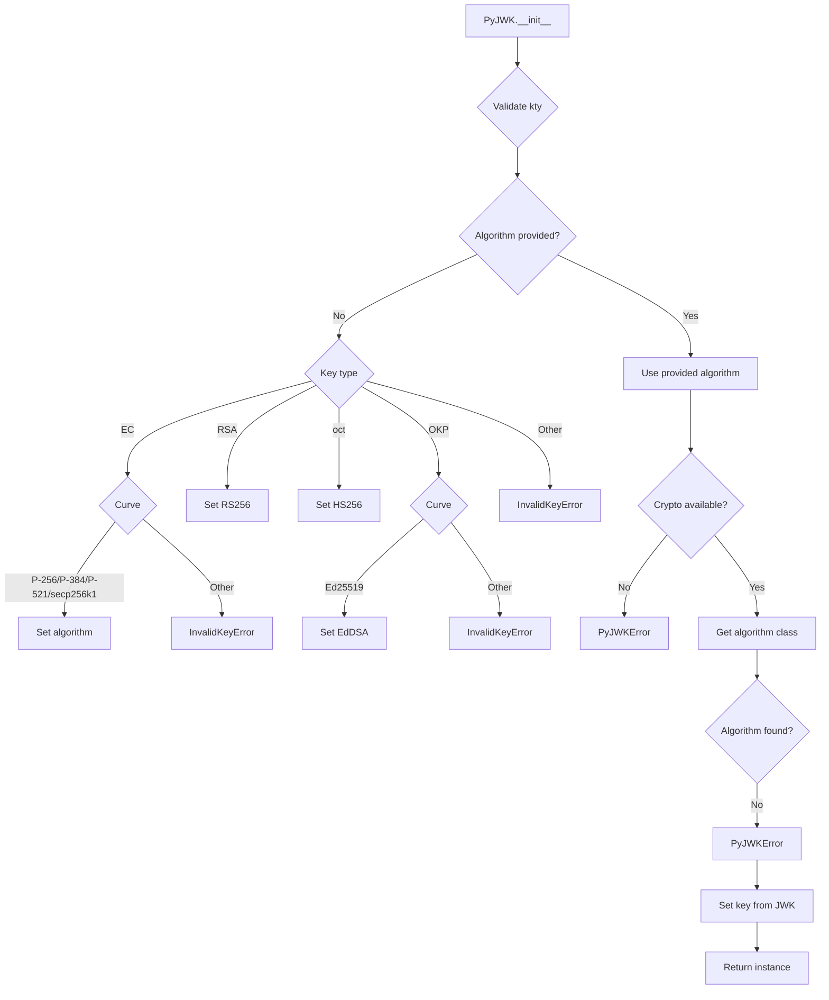
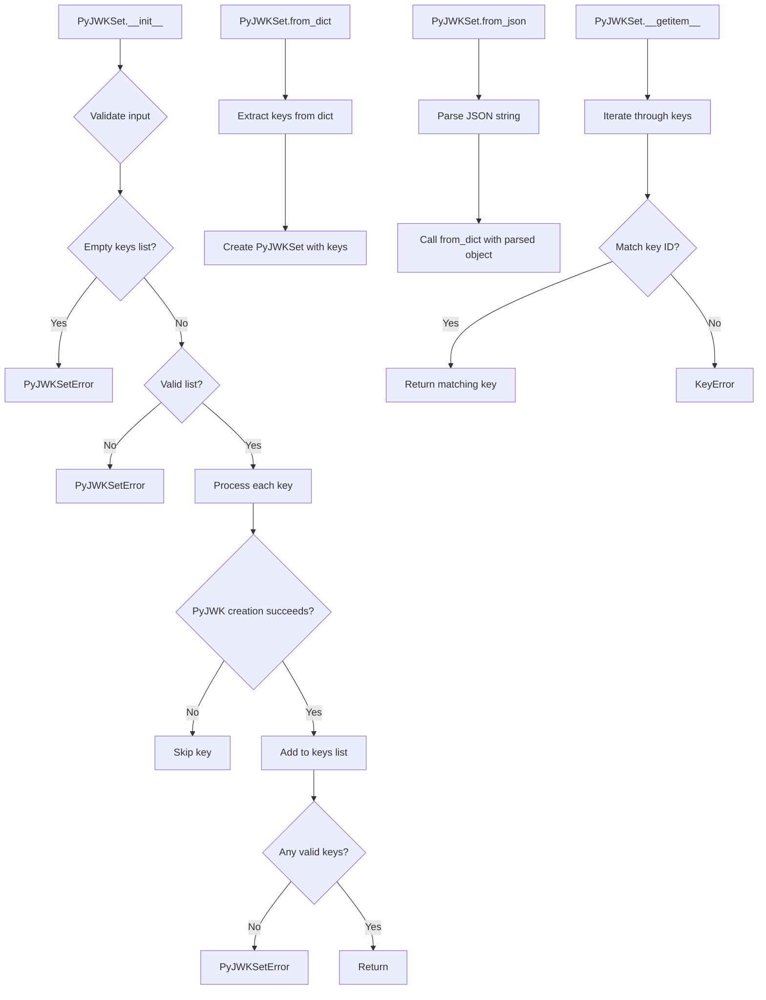
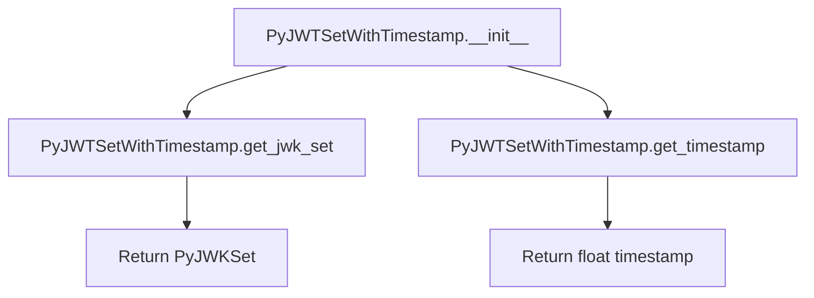

# `api_jwk.py`

## `jwt.api_jwk.PyJWK` · *class*

## Summary:
Represents a JSON Web Key (JWK) with associated cryptographic algorithm and key material.

## Description:
The PyJWK class encapsulates a JSON Web Key and provides the necessary infrastructure to work with cryptographic keys in JWT operations. It automatically determines the appropriate cryptographic algorithm based on the key type and curve, and can be instantiated from JWK dictionary data or JSON string representations.

This class serves as a bridge between raw JWK data and the actual cryptographic implementations, handling the mapping between JWK parameters and the underlying cryptographic libraries.

## State:
- _algorithms: dict - Mapping of algorithm names to their respective algorithm classes
- _jwk_data: JWKDict - Raw JWK data containing key parameters
- Algorithm: class - The cryptographic algorithm class associated with this key
- key: object - The actual cryptographic key instance created from JWK data

## Lifecycle:
- Creation: Instances are created via constructor with JWK data and optional algorithm, or via static factory methods from_dict() or from_json()
- Usage: Access key metadata through properties (key_type, key_id, public_key_use) and use the key for cryptographic operations
- Destruction: No explicit cleanup required; uses standard Python garbage collection

## Method Map:


## Raises:
- InvalidKeyError: When kty is missing, unsupported key type is provided, or unsupported curve is specified
- PyJWKError: When required cryptography package is not installed for the selected algorithm, or when unable to find an algorithm for the key

## Example:
```python
# Create from dictionary
jwk_dict = {
    "kty": "EC",
    "crv": "P-256",
    "x": "MKBCTNIcKUSDii11ySs3526iDZ8AiTo7Tu6KPAqv7D4",
    "y": "4Etl6SRW2YiLUrN5vfvVH2p3b8tq55X3dA8QhFJ3f80"
}
key = PyJWK.from_dict(jwk_dict)

# Create from JSON string
jwk_json = '{"kty":"RSA","n":"0vx7agoebGcQSuuPiLJXZptN9nndrQmbXEps2aiAFb..."'
key = PyJWK.from_json(jwk_json)

# Access key metadata
print(key.key_type)  # EC
print(key.key_id)    # None (if not set)
print(key.public_key_use)  # None (if not set)
```

### `jwt.api_jwk.PyJWK.__init__` · *method*

## Summary:
Initializes a PyJWK object with JWK data and determines the appropriate cryptographic algorithm.

## Description:
This method serves as the constructor for the PyJWK class, setting up the cryptographic key and algorithm based on the provided JWK data. It automatically infers the algorithm from the key type (kty) and curve (crv) when not explicitly provided, ensuring proper cryptographic handling of different key formats including RSA, EC, octet sequences, and OKP keys.

## Args:
    jwk_data (JWKDict): Dictionary containing the JSON Web Key data with required fields like 'kty' (key type)
    algorithm (str | None, optional): Cryptographic algorithm to use. If not provided, it's inferred from the key data

## Returns:
    None: This method initializes instance attributes and does not return a value

## Raises:
    InvalidKeyError: When required key fields like 'kty' are missing or unsupported key types/curves are encountered
    PyJWKError: When a required cryptographic algorithm is not available due to missing dependencies

## State Changes:
    Attributes READ: self._jwk_data
    Attributes WRITTEN: self._algorithms, self._jwk_data, self.Algorithm, self.key

## Constraints:
    Preconditions: 
    - The jwk_data dictionary must contain a 'kty' field identifying the key type
    - For OKP keys, the 'crv' field must be present
    - For EC keys, supported curves are P-256, P-384, P-521, and secp256k1
    - Required cryptography libraries must be installed for algorithms requiring them
    
    Postconditions:
    - self.Algorithm is set to a valid algorithm class from the default algorithms registry
    - self.key is initialized with the appropriate key format for the algorithm

## Side Effects:
    None: This method performs no I/O operations or external service calls. It only initializes internal object state.

### `jwt.api_jwk.PyJWK.from_dict` · *method*

## Summary:
Creates a PyJWK instance from a dictionary representation of a JSON Web Key.

## Description:
This static method serves as a factory constructor for creating PyJWK objects from dictionary-formatted JWK data. It provides a clean interface for instantiating JWK objects without directly calling the constructor, making the API more intuitive for users who work with dictionary-based JWK representations.

## Args:
    obj (JWKDict): A dictionary containing the JSON Web Key data with required fields such as 'kty' (key type)
    algorithm (str | None, optional): The algorithm associated with the key. If not provided, it will be inferred from the key data based on key type and curve parameters. Defaults to None.

## Returns:
    PyJWK: A new PyJWK instance initialized with the provided JWK dictionary and algorithm.

## Raises:
    InvalidKeyError: When the JWK dictionary is missing required fields like 'kty', or contains unsupported key types or curves.
    PyJWKError: When the specified algorithm is not supported or when cryptography libraries are missing for algorithms requiring them.

## State Changes:
    Attributes READ: None
    Attributes WRITTEN: None (the returned object's state is set during construction)

## Constraints:
    Preconditions: The obj parameter must be a valid dictionary containing at least the 'kty' field. If algorithm is not provided, the key data must contain sufficient information to infer the appropriate algorithm.
    Postconditions: The returned PyJWK object will have its Algorithm attribute properly set based on the provided or inferred algorithm, and its key attribute will be initialized from the JWK data.

## Side Effects:
    None

### `jwt.api_jwk.PyJWK.from_json` · *method*

## Summary:
Creates a PyJWK instance from JSON-formatted key data.

## Description:
This static method parses JSON-formatted key data and constructs a PyJWK object from the resulting dictionary. It serves as a convenient factory method for creating PyJWK instances from serialized key representations, enabling easy deserialization of JWK data.

## Args:
    data (str): A JSON-formatted string representing JWK key data.
    algorithm (None, optional): Algorithm hint for key processing. Defaults to None.

## Returns:
    PyJWK: A new PyJWK instance constructed from the parsed JSON data.

## Raises:
    json.JSONDecodeError: When the input data string is not valid JSON.
    InvalidKeyError: When the parsed JWK data lacks required fields like "kty".
    PyJWKError: When the algorithm cannot be determined or is unsupported.

## State Changes:
    None: This is a static method that doesn't modify instance state.

## Constraints:
    Preconditions:
        - The data parameter must be a valid JSON string representation of a JWK object.
        - The parsed JSON must contain valid JWK fields such as "kty" (key type).
    Postconditions:
        - Returns a valid PyJWK instance with proper algorithm resolution.
        - The returned instance contains all necessary key material for cryptographic operations.

## Side Effects:
    None: This method performs no I/O operations or external service calls.

### `jwt.api_jwk.PyJWK.key_type` · *method*

## Summary:
Returns the key type identifier from the JWK data structure.

## Description:
Retrieves the "kty" (key type) parameter from the JSON Web Key data. This method provides access to the fundamental key type information that determines how the key should be used and processed within the JWT ecosystem.

## Args:
    None

## Returns:
    str | None: The key type identifier (e.g., "RSA", "EC", "oct", "OKP") if present in the JWK data, otherwise None.

## Raises:
    None

## State Changes:
    Attributes READ: self._jwk_data
    Attributes WRITTEN: None

## Constraints:
    Preconditions: The instance must have been initialized with valid JWK data containing a _jwk_data attribute.
    Postconditions: The returned value is either a string representing the key type or None, with no modification to the object's state.

## Side Effects:
    None

### `jwt.api_jwk.PyJWK.key_id` · *method*

## Summary:
Returns the Key ID (kid) from the JSON Web Key data, or None if not present.

## Description:
This property extracts the Key ID ("kid") field from the underlying JWK data dictionary. It is commonly used to identify specific keys within a JWK Set for key selection during JWT operations such as signature verification or encryption.

## Args:
    None

## Returns:
    str | None: The Key ID string if present in the JWK data, otherwise None

## Raises:
    None

## State Changes:
    Attributes READ: self._jwk_data
    Attributes WRITTEN: None

## Constraints:
    Preconditions: The instance must have been initialized with valid JWK data
    Postconditions: The returned value is either a string representing the key identifier or None

## Side Effects:
    None

### `jwt.api_jwk.PyJWK.public_key_use` · *method*

## Summary:
Returns the public key use value from the JWK data dictionary.

## Description:
Retrieves the value associated with the "use" key from the internal JWK data storage. This value indicates the intended use of the key (such as "sig" for signing or "enc" for encryption) according to RFC 7517.

## Args:
    None

## Returns:
    str | None: The value of the "use" field from the JWK data, or None if the field is not present.

## Raises:
    None

## State Changes:
    Attributes READ: self._jwk_data
    Attributes WRITTEN: None

## Constraints:
    Preconditions: The instance must have been initialized with valid JWK data
    Postconditions: The returned value is either a string representing the key use or None

## Side Effects:
    None

## `jwt.api_jwk.PyJWKSet` · *class*

## Summary:
Manages a collection of JSON Web Keys (JWKs) and provides access to individual keys by key ID.

## Description:
The PyJWKSet class serves as a container for multiple JSON Web Keys, commonly used in JWT (JSON Web Token) operations for key management. It accepts a list of JWK dictionaries during initialization, validates and processes them into PyJWK objects, and provides convenient methods for creating instances from dictionary or JSON data. The class supports key lookup by key ID (kid) and gracefully handles invalid keys by skipping them rather than failing completely.

This class acts as a central abstraction for managing cryptographic keys in JWT operations, providing a clean interface for key retrieval while encapsulating the complexity of key validation and processing.

## State:
- `keys`: list[PyJWK] - A list of validated PyJWK objects representing the keys in this set. This list is populated during initialization by processing the input JWK dictionaries.

## Lifecycle:
- Creation: Instances are created either through direct initialization with a list of JWK dictionaries, or via static factory methods `from_dict()` or `from_json()`
- Usage: Keys can be accessed by key ID using bracket notation (`jwk_set[key_id]`) or by iterating over the `keys` attribute
- Destruction: No explicit cleanup required; standard Python garbage collection handles resource management

## Method Map:


## Raises:
- `PyJWKSetError`: Raised when the input keys list is empty, not a list, or contains no valid keys after processing
- `KeyError`: Raised when attempting to access a key by kid that doesn't exist in the set
- `PyJWTError`: Raised during key processing when a JWK dictionary is invalid or unsupported

## Example:
```python
# Create from dictionary
jwk_dict = {
    "keys": [
        {
            "kty": "RSA",
            "kid": "key1",
            "n": "example_modulus",
            "e": "AQAB"
        }
    ]
}
jwk_set = PyJWKSet.from_dict(jwk_dict)

# Access key by kid
key = jwk_set["key1"]

# Create from JSON string
json_string = '{"keys": [{"kty": "RSA", "kid": "key1", "n": "example", "e": "AQAB"}]}'
jwk_set2 = PyJWKSet.from_json(json_string)

# Access key by kid
key = jwk_set2["key1"]
```

### `jwt.api_jwk.PyJWKSet.__init__` · *method*

## Summary:
Initializes a JWK Set by processing a list of JWK dictionaries into PyJWK objects, skipping invalid entries.

## Description:
This method constructs a JWK Set by validating and converting a list of JSON Web Key dictionaries into PyJWK objects. It performs validation on the input list and handles cases where individual keys may be invalid or unusable by skipping them. This method is designed to be robust against malformed or unsupported keys in the input set.

## Args:
    keys (list[JWKDict]): A list of JSON Web Key dictionaries to be processed into the JWK Set

## Returns:
    None: This method initializes the instance and does not return a value

## Raises:
    PyJWKSetError: When the input keys list is empty, not a list, or contains no usable keys after processing

## State Changes:
    Attributes READ: None
    Attributes WRITTEN: self.keys (populated with valid PyJWK objects, if any)

## Constraints:
    Preconditions: 
    - Input keys must be a list-like object
    - Keys must be valid JWK dictionaries that can be processed by PyJWK
    
    Postconditions:
    - self.keys will contain a list of PyJWK objects that were successfully processed
    - If successful, self.keys will not be empty
    - If unsuccessful, a PyJWKSetError will be raised

## Side Effects:
    None: This method does not perform I/O operations or mutate external state

### `jwt.api_jwk.PyJWKSet.from_dict` · *method*

## Summary:
Creates a new PyJWKSet instance from a dictionary representation containing JWK keys.

## Description:
This static method serves as a factory constructor for PyJWKSet objects, enabling instantiation from dictionary data. It extracts the "keys" array from the input dictionary and passes it to the PyJWKSet constructor. This method is typically called as part of the deserialization pipeline when converting JSON-formatted JWK sets back into PyJWKSet objects.

## Args:
    obj (dict[str, Any]): Dictionary containing JWK set data with a "keys" key mapping to a list of JWK dictionaries.

## Returns:
    PyJWKSet: A new PyJWKSet instance initialized with the keys extracted from the input dictionary.

## Raises:
    PyJWKSetError: When the input dictionary contains invalid JWK set data such as:
        - Empty keys list
        - Non-list value for "keys" key
        - No usable keys after processing individual JWK entries

## State Changes:
    Attributes READ: None
    Attributes WRITTEN: None (creates new instance)

## Constraints:
    Preconditions:
        - Input obj must be a dictionary
        - The "keys" key in obj should map to a list of valid JWK dictionaries
    Postconditions:
        - Returns a valid PyJWKSet instance with processed keys
        - All keys in the returned instance are valid PyJWK objects

## Side Effects:
    None

### `jwt.api_jwk.PyJWKSet.from_json` · *method*

*No documentation generated.*

### `jwt.api_jwk.PyJWKSet.__getitem__` · *method*

## Summary:
Retrieves a JWK from the set by its key ID.

## Description:
Enables dictionary-style access to JWKs within the set using the key ID as the lookup identifier. This method is part of the PyJWKSet class which manages a collection of JSON Web Keys.

## Args:
    kid (str): The key ID to search for among the JWKs in the set.

## Returns:
    PyJWK: The JWK object matching the provided key ID.

## Raises:
    KeyError: When no JWK in the set has a key ID matching the provided `kid`.

## State Changes:
    Attributes READ: self.keys
    Attributes WRITTEN: None

## Constraints:
    Preconditions: The PyJWKSet instance must have been initialized with valid keys.
    Postconditions: The returned PyJWK object is a reference to an existing key in self.keys.

## Side Effects:
    None

## `jwt.api_jwk.PyJWTSetWithTimestamp` · *class*

## Summary:
A wrapper class that associates a PyJWKSet with a timestamp for tracking when the key set was created or last updated.

## Description:
The PyJWTSetWithTimestamp class acts as a container that pairs a PyJWKSet object (which manages a collection of JSON Web Keys) with a timestamp. This enables systems to track when JWK sets were retrieved or generated, supporting cache invalidation strategies and ensuring that stale key sets are not used in JWT validation processes.

## State:
- jwk_set: PyJWKSet - The wrapped JWK set object containing cryptographic keys
- timestamp: float - A monotonic timestamp indicating when this wrapper was created, obtained via time.monotonic()

## Lifecycle:
- Creation: Instantiate with a PyJWKSet object; the timestamp is automatically set using time.monotonic()
- Usage: Access the wrapped JWK set and timestamp using get_jwk_set() and get_timestamp() methods respectively
- Destruction: No special cleanup required; relies on Python's garbage collection

## Method Map:


## Raises:
- No explicit exceptions are raised by __init__ as it simply stores the provided PyJWKSet and creates a timestamp
- The underlying PyJWKSet constructor may raise PyJWKSetError if invalid key data is provided

## Example:
```python
# Create a JWK set
jwk_set = PyJWKSet.from_json(json_data)

# Wrap it with timestamp
jwt_set_with_timestamp = PyJWTSetWithTimestamp(jwk_set)

# Retrieve the wrapped JWK set and timestamp
retrieved_set = jwt_set_with_timestamp.get_jwk_set()
timestamp = jwt_set_with_timestamp.get_timestamp()
```

### `jwt.api_jwk.PyJWTSetWithTimestamp.__init__` · *method*

## Summary:
Initializes a PyJWTSetWithTimestamp object with a JWK set and current timestamp.

## Description:
Creates a wrapper object that associates a JWK set with a timestamp representing when it was created or last updated. This allows for tracking the freshness of JWK sets in JWT operations. The JWK set parameter should be a valid PyJWKSet instance containing usable cryptographic keys.

## Args:
    jwk_set (PyJWKSet): A valid JWK set containing cryptographic keys to wrap and associate with a timestamp.

## Returns:
    None: This method initializes instance attributes and does not return a value.

## Raises:
    None: This method does not explicitly raise exceptions.

## State Changes:
    Attributes READ: None
    Attributes WRITTEN: 
    - self.jwk_set: Set to the provided JWK set parameter
    - self.timestamp: Set to the current monotonic time using time.monotonic()

## Constraints:
    Preconditions:
    - The jwk_set parameter must be a valid PyJWKSet instance
    - The jwk_set parameter must not be None
    
    Postconditions:
    - self.jwk_set will reference the provided JWK set
    - self.timestamp will contain a monotonic time value representing when this object was initialized

## Side Effects:
    None: This method performs no I/O operations or external service calls. It only assigns values to instance attributes.

### `jwt.api_jwk.PyJWTSetWithTimestamp.get_jwk_set` · *method*

## Summary:
Returns the JSON Web Key Set stored in this timestamped wrapper.

## Description:
Provides access to the underlying JWK Set object while maintaining the timestamp tracking functionality of this wrapper class. This method allows external code to retrieve the JWK Set without directly accessing the internal attribute, following encapsulation principles.

## Args:
    None

## Returns:
    PyJWKSet: The JSON Web Key Set object that was originally provided during initialization.

## Raises:
    None

## State Changes:
    Attributes READ: self.jwk_set
    Attributes WRITTEN: None

## Constraints:
    Preconditions: The PyJWTSetWithTimestamp instance must have been properly initialized with a valid PyJWKSet.
    Postconditions: The returned PyJWKSet object maintains the same state as originally stored.

## Side Effects:
    None

### `jwt.api_jwk.PyJWTSetWithTimestamp.get_timestamp` · *method*

## Summary:
Returns the timestamp associated with this JWK set wrapper instance.

## Description:
This method provides access to the timestamp that was recorded when the PyJWTSetWithTimestamp instance was created. It serves as a getter for the internal timestamp attribute, allowing clients to determine when the wrapped JWK set was last updated or initialized.

## Args:
    None

## Returns:
    float: The timestamp value representing when this JWK set wrapper was created, measured in seconds since an unspecified epoch.

## Raises:
    None

## State Changes:
    Attributes READ: self.timestamp
    Attributes WRITTEN: None

## Constraints:
    Preconditions: The PyJWTSetWithTimestamp instance must have been properly initialized with a timestamp value.
    Postconditions: The returned timestamp value remains constant for the lifetime of the instance.

## Side Effects:
    None

