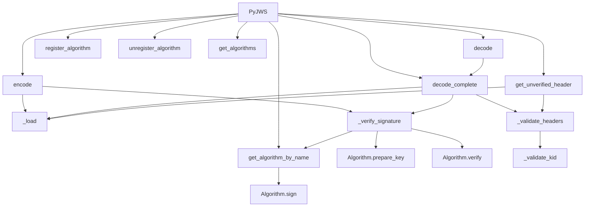

# `api_jws.py`

## `jwt.api_jws.PyJWS` · *class*

## Summary:
A JSON Web Signature (JWS) implementation for creating and verifying JWT tokens with support for various cryptographic algorithms.

## Description:
The PyJWS class provides functionality for encoding and decoding JSON Web Tokens (JWTs) using the JSON Web Signature (JWS) standard. It manages cryptographic algorithms for signing and verification operations, supports registration of custom algorithms, and handles JWT header processing and validation. This class serves as the core interface for JWS operations in the pyjwt library.

## State:
- `_algorithms`: dict[str, Algorithm] - Dictionary mapping algorithm names to their implementations
- `_valid_algs`: set[str] - Set containing names of currently valid/registered algorithms  
- `options`: dict[str, Any] - Configuration options for token processing, including signature verification settings
- `header_typ`: str - Default type value for JWT headers ("JWT")

## Lifecycle:
- Creation: Instantiate with optional algorithms list and options dictionary
- Usage: Call encode() to create signed JWTs or decode() to verify and extract payloads
- Destruction: No explicit cleanup required; uses standard Python garbage collection

## Method Map:


## Raises:
- `ValueError`: When attempting to register an algorithm that already exists
- `TypeError`: When trying to register a non-Algorithm object
- `KeyError`: When attempting to unregister a non-existent algorithm
- `DecodeError`: When JWT parsing fails due to invalid format or structure
- `InvalidAlgorithmError`: When an unsupported or unspecified algorithm is encountered
- `InvalidSignatureError`: When signature verification fails
- `NotImplementedError`: When a required cryptographic algorithm is not available
- `InvalidTokenError`: When header validation fails (e.g., invalid kid type)

## Example:
```python
import jwt

# Create a PyJWS instance
jws = jwt.PyJWS()

# Encode a JWT
payload = {"user_id": 123, "exp": 1609459200}
secret = "my_secret_key"
token = jws.encode(payload, secret, algorithm="HS256")

# Decode and verify the JWT
decoded_payload = jws.decode(token, secret, algorithms=["HS256"])
print(decoded_payload)  # {"user_id": 123, "exp": 1609459200}
```

### `jwt.api_jws.PyJWS.__init__` · *method*

## Summary:
Initializes a PyJWS object with specified algorithms and options for JWT signing and verification operations.

## Description:
Configures the PyJWS instance with a subset of available cryptographic algorithms and default options. This method sets up the internal algorithm registry and configuration options that will be used for subsequent JWT operations like encoding and decoding.

## Args:
    algorithms (list[str] | None): List of algorithm names to allow for signing/verification. If None, all default algorithms are enabled.
    options (dict[str, Any] | None): Dictionary of configuration options that override default settings. If None, uses default options.

## Returns:
    None: This method initializes instance attributes and does not return a value.

## Raises:
    None explicitly raised by this method.

## State Changes:
    Attributes READ: None
    Attributes WRITTEN: 
        - self._algorithms: Dictionary mapping algorithm names to algorithm objects
        - self._valid_algs: Set of algorithm names that are currently enabled
        - self.options: Dictionary containing merged default and provided options

## Constraints:
    Preconditions:
        - If algorithms are provided, they must be valid algorithm identifiers recognized by the library
        - Options dictionary should contain valid option keys expected by the JWT processing pipeline
    
    Postconditions:
        - self._algorithms contains only the algorithms specified in the algorithms parameter or all default algorithms
        - self._valid_algs contains the set of currently enabled algorithm names
        - self.options contains the merged configuration options

## Side Effects:
    None: This method performs no I/O operations or external service calls. It only initializes internal state.

### `jwt.api_jws.PyJWS._get_default_options` · *method*

## Summary:
Returns the default verification options for JWT signature validation.

## Description:
This static method provides the default configuration options for JWT decoding operations, specifically enabling signature verification by default. It is called during the initialization of the PyJWS class and in decode operations to establish baseline verification settings.

## Args:
    None

## Returns:
    dict[str, bool]: A dictionary containing default verification options with the key "verify_signature" set to True, indicating that signature verification is enabled by default.

## Raises:
    None

## State Changes:
    Attributes READ: None
    Attributes WRITTEN: None

## Constraints:
    Preconditions: None
    Postconditions: Always returns a dictionary with the exact structure {"verify_signature": True}

## Side Effects:
    None

### `jwt.api_jws.PyJWS.register_algorithm` · *method*

## Summary:
Registers a new cryptographic algorithm with the JWT signing instance, making it available for encoding and decoding operations.

## Description:
This method allows users to extend the JWT library with custom cryptographic algorithms by registering them with the PyJWS instance. It validates that the algorithm ID is unique and that the provided object is of the correct type before adding it to the internal collections used for algorithm management.

## Args:
    alg_id (str): The identifier for the algorithm to register (e.g., "RS256", "ES384").
    alg_obj (Algorithm): An instance of an Algorithm subclass that implements the cryptographic operations.

## Returns:
    None: This method does not return any value.

## Raises:
    ValueError: Raised when attempting to register an algorithm ID that is already registered.
    TypeError: Raised when the provided alg_obj is not an instance of the Algorithm class.

## State Changes:
    Attributes READ: None
    Attributes WRITTEN: 
        - self._algorithms: Updated with the new algorithm ID and object mapping
        - self._valid_algs: Added the algorithm ID to the set of valid algorithms

## Constraints:
    Preconditions:
        - The alg_id must be a string that is not already present in self._algorithms
        - The alg_obj must be an instance of the Algorithm class
    Postconditions:
        - The algorithm is added to both self._algorithms and self._valid_algs collections
        - The algorithm becomes available for use in JWT encoding/decoding operations

## Side Effects:
    None: This method only modifies internal state and does not perform I/O operations or external service calls.

### `jwt.api_jws.PyJWS.unregister_algorithm` · *method*

## Summary:
Removes a cryptographic algorithm from the available set of algorithms that can be used for JWT signing and verification.

## Description:
This method removes a specified algorithm from the internal registry of available algorithms. It ensures that both the main algorithm dictionary (`_algorithms`) and the set of valid algorithms (`_valid_algs`) are properly updated to maintain consistency. This method is typically used to disable specific cryptographic algorithms that are either insecure, unsupported, or should not be used in a particular context.

The method is part of the PyJWS class and is the counterpart to the `register_algorithm` method, allowing dynamic management of available cryptographic algorithms at runtime.

## Args:
    alg_id (str): The identifier of the algorithm to be unregistered. Must be a string that corresponds to an existing algorithm in the registry.

## Returns:
    None: This method does not return any value.

## Raises:
    KeyError: Raised when attempting to unregister an algorithm that is not currently registered in the system.

## State Changes:
    Attributes READ: 
        - self._algorithms: Used to verify the algorithm exists before removal
        - self._valid_algs: Used to verify the algorithm exists before removal
    
    Attributes WRITTEN:
        - self._algorithms: Deleted entry corresponding to the alg_id parameter
        - self._valid_algs: Removed alg_id from the set of valid algorithms

## Constraints:
    Preconditions:
        - The alg_id parameter must correspond to an algorithm that is currently registered in self._algorithms
        - The method should only be called on instances of PyJWS that have been properly initialized
    
    Postconditions:
        - The specified algorithm will no longer be available for JWT signing or verification operations
        - Both self._algorithms and self._valid_algs will be consistent (the algorithm will be removed from both)

## Side Effects:
    None: This method only modifies internal state and does not perform any I/O operations or external service calls.

### `jwt.api_jws.PyJWS.get_algorithms` · *method*

## Summary:
Returns a list of currently valid algorithm names that can be used for JWT signing and verification operations.

## Description:
This method provides access to the set of algorithm names that are currently enabled for use with this PyJWS instance. The returned list reflects the current state of valid algorithms, which may be modified by registering or unregistering algorithms through the `register_algorithm` and `unregister_algorithm` methods. This allows runtime modification of which algorithms are permitted for JWT operations.

## Args:
    None

## Returns:
    list[str]: A list containing the names of currently valid algorithms. The list is a copy of the internal set of valid algorithms and can be safely modified without affecting the internal state.

## Raises:
    None

## State Changes:
    Attributes READ: self._valid_algs
    Attributes WRITTEN: None

## Constraints:
    Preconditions: None
    Postconditions: The returned list contains all algorithm names currently stored in self._valid_algs, converted to a list format.

## Side Effects:
    None

### `jwt.api_jws.PyJWS.get_algorithm_by_name` · *method*

## Summary:
Retrieves an algorithm instance by its name from the registered algorithms collection, handling cases where cryptography is required but not available.

## Description:
This method serves as a lookup mechanism for retrieving algorithm instances by their string identifiers. It is called during JWT encoding and decoding operations when an algorithm needs to be accessed by name. The method provides specific error handling for cases where a requested algorithm requires cryptographic libraries that are not installed.

## Args:
    alg_name (str): The name of the algorithm to retrieve (e.g., "HS256", "RS256")

## Returns:
    Algorithm: The algorithm instance associated with the given name

## Raises:
    NotImplementedError: When the algorithm is not found in the registered algorithms collection. Specifically raises a detailed error message when:
        - Cryptography is not available and the requested algorithm requires cryptographic operations
        - The algorithm is not supported by the library

## State Changes:
    Attributes READ: self._algorithms
    Attributes WRITTEN: None

## Constraints:
    Preconditions: 
        - The PyJWS instance must have been initialized with valid algorithms
        - The alg_name parameter must be a string representing a valid algorithm identifier
    
    Postconditions:
        - If successful, returns a valid Algorithm instance
        - If unsuccessful, raises NotImplementedError with appropriate context

## Side Effects:
    None

### `jwt.api_jws.PyJWS.encode` · *method*

## Summary:
Encodes a JWT token by creating a signed message from payload, key, and algorithm parameters, producing a compact, URL-safe string representation.

## Description:
This method constructs a JSON Web Token (JWT) by combining a header, payload, and signature into a compact, URL-safe string format. It handles various header configurations, payload detachment options, and supports multiple cryptographic algorithms for signing. The method is part of the PyJWS (JSON Web Signature) class and follows JWT specification requirements for token construction. This method is typically called during the token creation phase of a JWT workflow, before sending tokens to clients or storing them.

## Args:
    payload (bytes): The payload data to be encoded in the JWT token. This represents the claims/data being transmitted.
    key (AllowedPrivateKeys | str | bytes): The cryptographic key used for signing the token. Must be compatible with the specified algorithm.
    algorithm (str | None, optional): The signing algorithm to use. Defaults to "HS256". If None, defaults to "none".
    headers (dict[str, Any] | None, optional): Additional header parameters to include in the token. If provided, the "alg" field in headers overrides the algorithm parameter, and "b64": False in headers sets is_payload_detached=True. Defaults to None.
    json_encoder (type[json.JSONEncoder] | None, optional): Custom JSON encoder for serializing headers. Defaults to None.
    is_payload_detached (bool, optional): Whether to detach the payload from the signature calculation. When True, the payload is not included in the signing process. Defaults to False.
    sort_headers (bool, optional): Whether to sort header keys when serializing. Defaults to True.

## Returns:
    str: A URL-safe base64url-encoded JWT token string consisting of exactly three dot-separated segments: header.payload.signature. The header segment contains the token type and algorithm information, the payload segment contains the encoded claims, and the signature segment contains the cryptographic signature.

## Raises:
    NotImplementedError: When the specified algorithm is not supported or cryptography is required but not installed.
    InvalidAlgorithmError: When the algorithm is not in the list of valid algorithms.
    InvalidSignatureError: When signature verification fails (though this is primarily raised during decoding).

## State Changes:
    Attributes READ: self.header_typ, self._algorithms, self._valid_algs
    Attributes WRITTEN: None

## Constraints:
    Preconditions:
        - The payload must be bytes
        - The key must be compatible with the specified algorithm
        - If algorithms list is provided during decoding, it must be non-empty when verify_signature is True
    Postconditions:
        - Returns a properly formatted JWT token string with exactly three dot-separated segments
        - The returned token follows JWT specification format
        - Header segment contains valid JSON with typ and alg fields
        - Payload segment is properly base64url encoded (unless detached)
        - Signature segment is properly base64url encoded

## Side Effects:
    None

### `jwt.api_jws.PyJWS.decode_complete` · *method*

## Summary:
Decodes a JWT token and returns its constituent parts including payload, header, and signature.

## Description:
This method processes a JSON Web Token (JWT) string or bytes, extracting and returning its payload, header, and signature components. It performs signature verification when enabled and handles special cases such as JWTs with b64 header set to false. This method is designed to provide detailed access to all components of a JWT for further processing or validation.

## Args:
    jwt (str | bytes): The JWT token to decode
    key (AllowedPublicKeys | str | bytes): The key used for signature verification. Defaults to empty string
    algorithms (list[str] | None): List of allowed algorithms for signature verification. Required when verify_signature is enabled
    options (dict[str, Any] | None): Additional decoding options that merge with default options
    detached_payload (bytes | None): The detached payload when b64 header is False
    **kwargs: Deprecated keyword arguments that will be removed in pyjwt version 3

## Returns:
    dict[str, Any]: A dictionary containing:
        - "payload": The decoded payload bytes
        - "header": The decoded header dictionary
        - "signature": The signature bytes

## Raises:
    DecodeError: When the JWT is malformed, signature verification fails, or required parameters are missing
    InvalidAlgorithmError: When an unsupported algorithm is specified
    InvalidSignatureError: When signature verification fails
    InvalidTokenError: When the token is invalid

## State Changes:
    Attributes READ: self.options
    Attributes WRITTEN: None

## Constraints:
    Preconditions:
        - When verify_signature is enabled, algorithms must be provided
        - When b64 header is False, detached_payload must be provided
    Postconditions:
        - Returns a dictionary with exactly three keys: payload, header, and signature
        - All returned values are properly decoded from the JWT

## Side Effects:
    - Issues deprecation warning when kwargs are provided
    - May raise various decoding exceptions during processing

### `jwt.api_jws.PyJWS.decode` · *method*

## Summary:
Extracts and returns the payload portion from a decoded JWT token.

## Description:
This method decodes a JSON Web Token and returns only the payload portion, discarding the header and signature information. It serves as a convenience method that wraps the more comprehensive `decode_complete` method, providing direct access to the token's payload data.

## Args:
    jwt (str | bytes): The JWT token to decode, either as a string or bytes.
    key (AllowedPublicKeys | str | bytes): The key used for signature verification. Defaults to empty string.
    algorithms (list[str] | None): List of allowed algorithms for signature verification. Required when verify_signature is True.
    options (dict[str, Any] | None): Additional decoding options. Defaults to None.
    detached_payload (bytes | None): The detached payload when the token has b64 header set to false. Defaults to None.
    **kwargs: Deprecated keyword arguments that will be removed in pyjwt version 3.

## Returns:
    Any: The decoded payload data, which can be any JSON-serializable object (dict, list, str, etc.).

## Raises:
    DecodeError: When the JWT token is malformed or invalid.
    InvalidAlgorithmError: When the specified algorithm is not allowed or supported.
    InvalidSignatureError: When the signature verification fails.
    NotImplementedError: When a required cryptographic algorithm is not available.

## State Changes:
    Attributes READ: None
    Attributes WRITTEN: None

## Constraints:
    Preconditions:
        - The JWT token must be properly formatted with three dot-separated segments
        - If signature verification is enabled, the `algorithms` parameter must be provided
        - When using detached payloads, the `detached_payload` parameter must be provided
    Postconditions:
        - Returns only the payload portion of the decoded JWT
        - The returned payload maintains its original data structure and type

## Side Effects:
    - Issues a deprecation warning when additional kwargs are passed
    - May perform cryptographic operations during signature verification
    - May raise exceptions during token validation and parsing

### `jwt.api_jws.PyJWS.get_unverified_header` · *method*

## Summary:
Extracts and validates the header portion of a JWT without performing signature verification.

## Description:
Retrieves the header component from a JSON Web Token (JWT) string or bytes, validates the header structure, and returns it as a dictionary. This method parses the JWT without verifying its signature, making it useful for inspecting token metadata before applying signature verification or for accessing header fields like algorithm and key ID.

## Args:
    jwt (str | bytes): The JWT string or bytes to parse. Must be a valid JWT with three dot-separated base64url-encoded components.

## Returns:
    dict[str, Any]: A dictionary containing the parsed JWT header fields. Includes standard fields like 'alg' (algorithm) and 'typ' (token type), plus any custom header parameters.

## Raises:
    DecodeError: If the JWT is malformed, contains invalid base64url encoding, or has insufficient segments.
    InvalidTokenError: If the header contains invalid structure or unsupported fields (e.g., 'kid' is not a string).

## State Changes:
    Attributes READ: None
    Attributes WRITTEN: None

## Constraints:
    Preconditions: 
    - The jwt parameter must be a valid JWT string or bytes with three dot-separated base64url-encoded components
    - The header portion must be valid JSON
    
    Postconditions:
    - The returned dictionary contains validated header fields
    - The method does not modify any instance state

## Side Effects:
    None

### `jwt.api_jws.PyJWS._load` · *method*

## Summary:
Parses a JWT string into its constituent components: payload, signing input, header dictionary, and signature bytes.

## Description:
This method extracts and validates the components of a JSON Web Token (JWT) by splitting it at the period ('.') delimiters and decoding the base64url-encoded segments. It performs validation on the token structure and ensures proper formatting of all segments before returning them.

The method is typically called during JWT decoding operations when the token needs to be parsed into its fundamental parts for further processing such as signature verification or payload extraction.

## Args:
    jwt (str | bytes): The JWT string or bytes to parse. Must be either a UTF-8 encoded string or bytes object.

## Returns:
    tuple[bytes, bytes, dict[str, Any], bytes]: A tuple containing:
        - payload (bytes): The decoded payload segment as bytes
        - signing_input (bytes): The concatenation of header and payload segments (without signature)
        - header (dict[str, Any]): The decoded header as a dictionary
        - signature (bytes): The decoded signature segment as bytes

## Raises:
    DecodeError: Raised when:
        - The jwt parameter is neither a string nor bytes
        - The token doesn't contain enough segments (less than 3)
        - Header segment has invalid base64url padding
        - Header segment cannot be parsed as valid JSON
        - Header is not a dictionary object
        - Payload segment has invalid base64url padding
        - Signature segment has invalid base64url padding

## State Changes:
    Attributes READ: None
    Attributes WRITTEN: None

## Constraints:
    Preconditions:
        - The jwt parameter must be either a string or bytes object
        - The jwt must contain at least 3 segments separated by periods
        - All segments must have valid base64url encoding
        - The header segment must decode to valid JSON that represents a dictionary

    Postconditions:
        - Returns exactly 4 values in the specified order
        - All returned values are properly decoded from the JWT
        - The signing_input contains the header and payload portions concatenated

## Side Effects:
    None

### `jwt.api_jws.PyJWS._verify_signature` · *method*

## Summary:
Verifies the cryptographic signature of a JWT token by validating the algorithm, preparing the key, and checking the signature against the signing input.

## Description:
This private method performs the core signature verification logic for JWT tokens. It extracts the algorithm from the token header, validates that it's supported and allowed, prepares the cryptographic key, and finally verifies that the signature matches the signing input. This method is called internally by the decode_complete method during JWT validation.

## Args:
    signing_input (bytes): The raw bytes of the signing input (header.payload)
    header (dict[str, Any]): The decoded JWT header containing the algorithm identifier
    signature (bytes): The raw signature bytes to verify
    key (AllowedPublicKeys | str | bytes): The cryptographic key used for verification (default: "")
    algorithms (list[str] | None): List of allowed algorithms for verification (default: None)

## Returns:
    None: This method does not return a value but raises exceptions on failure

## Raises:
    InvalidAlgorithmError: When the algorithm is not specified, not allowed, or not supported
    InvalidSignatureError: When the signature verification fails

## State Changes:
    Attributes READ: None
    Attributes WRITTEN: None

## Constraints:
    Preconditions:
        - The header dictionary must contain an "alg" key
        - The signing_input must be properly formatted bytes
        - The signature must be properly formatted bytes
        - If algorithms parameter is provided, the header algorithm must be in that list
    Postconditions:
        - Either the method completes successfully (returns None) or raises an exception

## Side Effects:
    None: This method performs no I/O operations or external service calls

### `jwt.api_jws.PyJWS._validate_headers` · *method*

## Summary:
Validates JWT header parameters, specifically checking that the Key ID (kid) header is a string if present.

## Description:
This method performs validation on JWT headers by checking for the presence of a Key ID (kid) header and ensuring it conforms to the expected format. It is designed to be called during JWT encoding and header inspection operations to maintain header integrity.

The method is called during the JWT encoding process when custom headers are provided to the encode() method, and also during header inspection via get_unverified_header().

This logic is separated into its own method to provide a clean interface for header validation while keeping the validation logic centralized and reusable.

## Args:
    headers (dict[str, Any]): A dictionary containing JWT header parameters

## Returns:
    None: This method does not return any value

## Raises:
    InvalidTokenError: Raised by _validate_kid when the kid header is present but not a string

## State Changes:
    Attributes READ: None
    Attributes WRITTEN: None

## Constraints:
    Preconditions: The headers parameter must be a dictionary-like object
    Postconditions: If a kid header is present, it must be a string; otherwise, no validation occurs

## Side Effects:
    None: This method performs no I/O operations or external service calls

### `jwt.api_jws.PyJWS._validate_kid` · *method*

## Summary:
Validates that the Key ID header parameter is a string type.

## Description:
This method ensures that the Key ID (kid) header parameter in a JWT is a string type. It is called during header validation to enforce type consistency for the kid parameter. This validation prevents potential security issues or parsing errors that could occur if the kid were not a string.

## Args:
    kid (Any): The Key ID value to validate, typically extracted from the JWT header.

## Returns:
    None: This method does not return any value.

## Raises:
    InvalidTokenError: Raised when the kid parameter is not a string type.

## State Changes:
    Attributes READ: None
    Attributes WRITTEN: None

## Constraints:
    Preconditions: The method expects the kid parameter to be passed from a JWT header validation context.
    Postconditions: If the method completes successfully, the kid parameter is confirmed to be a string.

## Side Effects:
    None: This method performs no I/O operations or external service calls. It only performs type validation.

