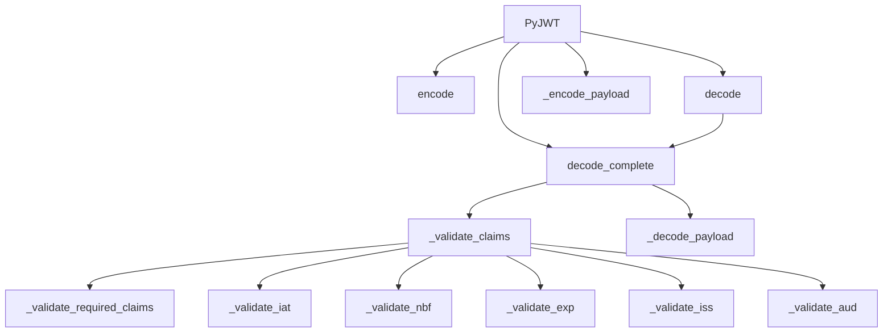

# `api_jwt.py`

## `jwt.api_jwt.PyJWT` · *class*

## Summary:
A JSON Web Token (JWT) implementation that provides encoding and decoding functionality with configurable validation options.

## Description:
The PyJWT class serves as the main interface for creating and validating JWT tokens. It handles the encoding of payload data into JWT format and decoding of JWT tokens back into payload data, with built-in validation of standard JWT claims such as expiration time, issued-at time, and not-before time. The class allows customization of validation behavior through configurable options and supports various cryptographic algorithms for signing tokens.

## State:
- `options`: dict[str, Any] - Configuration options that control validation behavior. Includes keys like "verify_signature", "verify_exp", "verify_nbf", "verify_iat", "verify_aud", "verify_iss", and "require". These options can be overridden during instantiation or method calls.

## Lifecycle:
- Creation: Instantiate with optional configuration options via `__init__(options)`
- Usage: Call `encode()` to create JWT tokens or `decode()`/`decode_complete()` to validate and extract payload data
- Destruction: No special cleanup required; follows standard Python object lifecycle

## Method Map:


## Raises:
- `TypeError`: When payload is not a dictionary in encode() method
- `DecodeError`: When JWT decoding fails due to invalid format or signature issues
- `ExpiredSignatureError`: When token expiration time has passed
- `ImmatureSignatureError`: When token is not yet valid (issued or not-before time in future)
- `InvalidIssuedAtError`: When issued-at claim is not an integer
- `InvalidAudienceError`: When audience validation fails
- `InvalidIssuerError`: When issuer validation fails
- `MissingRequiredClaimError`: When required claims are missing

## Example:
```python
# Create a JWT instance
jwt = PyJWT()

# Encode a payload
payload = {"sub": "1234567890", "name": "John Doe", "iat": 1516239022}
token = jwt.encode(payload, "secret-key", algorithm="HS256")

# Decode and validate the token
decoded_payload = jwt.decode(token, "secret-key", algorithms=["HS256"])

# Decode with complete information
complete_result = jwt.decode_complete(token, "secret-key", algorithms=["HS256"])
```

### `jwt.api_jwt.PyJWT.__init__` · *method*

## Summary:
Initializes a PyJWT instance with configurable options for JWT processing.

## Description:
Configures the JWT processing behavior by combining default validation options with user-provided overrides. This method establishes the baseline configuration that governs how JWT tokens are encoded and decoded, particularly regarding signature verification and claim validation.

## Args:
    options (dict[str, Any] | None): Optional dictionary of configuration options. When None, defaults to an empty dictionary. These options override the default settings for JWT validation behaviors.

## Returns:
    None: This method does not return a value.

## Raises:
    None: This method does not explicitly raise exceptions.

## State Changes:
    Attributes READ: None
    Attributes WRITTEN: self.options

## Constraints:
    Preconditions: None
    Postconditions: self.options is initialized as a dictionary containing merged default and user-provided options.

## Side Effects:
    None: This method performs no I/O operations or external service calls.

### `jwt.api_jwt.PyJWT._get_default_options` · *method*

## Summary:
Returns a dictionary of default JWT verification options with all verification flags enabled and empty required claims list.

## Description:
This method provides default configuration options for JWT verification operations. It establishes the baseline verification behavior that can be overridden by user-provided options. The returned dictionary contains boolean flags for various JWT claim verifications and a list for required claims.

The method is called during PyJWT instance initialization to set default options and is also referenced in decode operations to establish baseline verification settings.

## Args:
    None

## Returns:
    dict[str, bool | list[str]]: A dictionary containing default verification options:
        - "verify_signature": bool - Whether to verify the JWT signature (default: True)
        - "verify_exp": bool - Whether to verify expiration time (default: True)
        - "verify_nbf": bool - Whether to verify not-before time (default: True)
        - "verify_iat": bool - Whether to verify issued-at time (default: True)
        - "verify_aud": bool - Whether to verify audience claim (default: True)
        - "verify_iss": bool - Whether to verify issuer claim (default: True)
        - "require": list[str] - List of required claims (default: empty list)

## Raises:
    None

## State Changes:
    Attributes READ: None
    Attributes WRITTEN: None

## Constraints:
    Preconditions: None
    Postconditions: The returned dictionary always contains the same set of keys with their respective default values

## Side Effects:
    None

### `jwt.api_jwt.PyJWT.encode` · *method*

## Summary:
Encodes a JWT payload with the specified signing key and algorithm, converting datetime objects in time claims to Unix timestamps.

## Description:
This method creates a JSON Web Token (JWT) by encoding a payload dictionary with a cryptographic signature. It ensures that datetime objects in time-related claims (exp, iat, nbf) are converted to Unix timestamp integers before encoding. The method serves as the primary interface for creating signed JWT tokens within the PyJWT library.

## Args:
    payload (dict[str, Any]): The payload to encode as a JWT. Must be a dictionary object.
    key (AllowedPrivateKeys | str | bytes): The key to sign the JWT with. Can be a private key, string, or bytes.
    algorithm (str | None, optional): The signing algorithm to use. Defaults to "HS256".
    headers (dict[str, Any] | None, optional): Additional header parameters to include in the JWT. Defaults to None.
    json_encoder (type[json.JSONEncoder] | None, optional): Custom JSON encoder class for serializing the payload. Defaults to None.
    sort_headers (bool, optional): Whether to sort headers alphabetically. Defaults to True.

## Returns:
    str: The encoded JWT string containing the base64url-encoded header, payload, and signature.

## Raises:
    TypeError: If the payload is not a dictionary object.

## State Changes:
    Attributes READ: None
    Attributes WRITTEN: None

## Constraints:
    Preconditions:
        - The payload must be a dictionary object
        - The key must be a valid signing key for the specified algorithm
        - The algorithm must be supported by the library
    Postconditions:
        - Returns a valid JWT string with proper base64url encoding
        - Time claims (exp, iat, nbf) in the payload are converted to Unix timestamps if they are datetime objects

## Side Effects:
    None

### `jwt.api_jwt.PyJWT._encode_payload` · *method*

## Summary:
Converts a dictionary payload into a JSON-encoded byte string with compact formatting.

## Description:
Encodes a dictionary payload into a JSON byte string using compact formatting (no extra whitespace) suitable for JWT payload serialization. This method is called internally by the `encode` method to prepare the payload before signing.

## Args:
    payload (dict[str, Any]): The dictionary payload to encode
    headers (dict[str, Any] | None): Optional headers to include in the encoding (not used in this method)
    json_encoder (type[json.JSONEncoder] | None): Optional custom JSON encoder class to use for serialization

## Returns:
    bytes: A JSON-encoded byte string with compact formatting (no extra whitespace)

## Raises:
    None explicitly raised by this method

## State Changes:
    Attributes READ: None
    Attributes WRITTEN: None

## Constraints:
    Preconditions: 
    - payload must be a dictionary
    - headers parameter is accepted but not used in the implementation
    - json_encoder, if provided, must be a valid JSONEncoder subclass
    
    Postconditions:
    - Returns a UTF-8 encoded byte string
    - Output uses compact JSON formatting with no extra whitespace

## Side Effects:
    None

### `jwt.api_jwt.PyJWT.decode_complete` · *method*

## Summary:
Decodes a JSON Web Token and validates its claims, returning the complete decoded information including payload and header.

## Description:
This method performs complete decoding of a JWT token, including signature verification and claim validation. It serves as the primary interface for decoding JWT tokens while ensuring security requirements are met through claim validation. The method handles various verification options and provides detailed error reporting through exceptions.

## Args:
    jwt (str | bytes): The encoded JWT token to decode
    key (AllowedPublicKeys | str | bytes): The key to use for signature verification. Defaults to empty string
    algorithms (list[str] | None): List of supported algorithms for signature verification. Required when verify_signature is True
    options (dict[str, Any] | None): Dictionary of verification options. Defaults to None
    verify (bool | None): Deprecated parameter for signature verification. Defaults to None
    detached_payload (bytes | None): Detached payload for signature verification. Defaults to None
    audience (str | Iterable[str] | None): Expected audience value(s) for validation. Defaults to None
    issuer (str | None): Expected issuer value for validation. Defaults to None
    leeway (float | timedelta): Time leeway for expiration and not-before validation. Defaults to 0
    **kwargs (Any): Deprecated keyword arguments that will be removed in version 3

## Returns:
    dict[str, Any]: A dictionary containing the complete decoded JWT information including:
        - header: The decoded header
        - payload: The decoded payload
        - signature: The signature bytes
        - algorithm: The algorithm used

## Raises:
    DecodeError: When the JWT token is malformed or when signature verification fails and algorithms are not provided
    ExpiredSignatureError: When the token has expired and verify_exp is enabled
    ImmatureSignatureError: When the token is used before its validity period
    InvalidAudienceError: When the audience claim doesn't match expected values
    InvalidIssuedAtError: When the issued-at timestamp is invalid
    InvalidIssuerError: When the issuer claim doesn't match expected value
    MissingRequiredClaimError: When required claims are missing from the token

## State Changes:
    Attributes READ: self.options
    Attributes WRITTEN: None

## Constraints:
    Preconditions:
        - When verify_signature is True, algorithms must be provided
        - The JWT token must be properly formatted
        - If audience is specified, the token must contain matching audience claim
        - If issuer is specified, the token must contain matching issuer claim
    
    Postconditions:
        - Returns a dictionary with complete decoded JWT information
        - All claims are validated according to specified options
        - Payload is properly decoded and attached to the returned dictionary

## Side Effects:
    - Issues deprecation warnings for unsupported kwargs and verify parameter
    - May raise various validation exceptions based on claim violations
    - Calls external JWS decoding functionality

### `jwt.api_jwt.PyJWT._decode_payload` · *method*

## Summary:
Parses and validates the JSON payload from a decoded JWT token.

## Description:
Extracts and deserializes the payload field from a decoded JWT token dictionary, ensuring it contains valid JSON that represents a dictionary object. This method is part of the JWT decoding process and handles the conversion of the payload string into a usable Python dictionary structure.

## Args:
    decoded (dict[str, Any]): A dictionary containing the decoded JWT components, specifically requiring a "payload" key with a JSON string value.

## Returns:
    dict[str, Any]: A Python dictionary representing the parsed JSON payload from the JWT token.

## Raises:
    DecodeError: When the payload string is not valid JSON or when the parsed payload is not a dictionary object.

## State Changes:
    Attributes READ: None
    Attributes WRITTEN: None

## Constraints:
    Preconditions: The decoded parameter must be a dictionary containing a "payload" key with a string value that represents valid JSON.
    Postconditions: The returned value is guaranteed to be a dictionary object representing the parsed JSON payload.

## Side Effects:
    None

### `jwt.api_jwt.PyJWT.decode` · *method*

## Summary:
Decodes a JSON Web Token and returns only the payload portion, without header or signature information.

## Description:
This method provides a simplified interface for JWT decoding by extracting and returning only the payload portion from the decoded token. It internally calls `decode_complete` to perform the full decoding and validation process, then returns just the payload data. This is useful when you only need the token's payload content without accessing the header or signature information.

The method performs standard JWT validation checks including signature verification, expiration time, issued-at time, and audience/issuer validation based on configured options and provided parameters.

## Args:
    jwt (str | bytes): The encoded JWT string or bytes to decode
    key (AllowedPublicKeys | str | bytes): The key used for signature verification. Defaults to empty string
    algorithms (list[str] | None): List of supported algorithms for signature verification. Required when verify_signature is True
    options (dict[str, Any] | None): Dictionary of options for validation behavior
    verify (bool | None): Deprecated parameter for signature verification control
    detached_payload (bytes | None): Payload for detached signatures
    audience (str | Iterable[str] | None): Expected audience value(s) for validation
    issuer (str | None): Expected issuer value for validation
    leeway (float | timedelta): Time leeway for expiration and not-before validations
    **kwargs (Any): Deprecated keyword arguments that will be removed in version 3

## Returns:
    Any: The decoded payload data (typically a dict) extracted from the JWT

## Raises:
    DecodeError: When the JWT format is invalid or cannot be decoded
    ExpiredSignatureError: When the token has expired and verify_exp is enabled
    ImmatureSignatureError: When the token is not yet valid (issued in future)
    InvalidAudienceError: When the audience claim doesn't match expectations
    InvalidIssuerError: When the issuer claim doesn't match expectations
    MissingRequiredClaimError: When required claims are missing from the token
    TypeError: When audience parameter is not a string, iterable, or None

## State Changes:
    Attributes READ: None
    Attributes WRITTEN: None

## Constraints:
    Preconditions:
        - If signature verification is enabled, algorithms must be provided
        - The JWT must be properly formatted according to RFC 7519
        - If verify_signature is True, a valid key must be provided for verification
    
    Postconditions:
        - Returns a parsed JSON object (typically dict) representing the token payload
        - All validation checks defined by options and parameters are applied

## Side Effects:
    - Issues deprecation warnings when kwargs are provided
    - Issues deprecation warning when verify parameter is used
    - May raise various validation exceptions based on token content and configuration

### `jwt.api_jwt.PyJWT._validate_claims` · *method*

## Summary:
Validates JWT claims including issued-at, not-before, expiration, issuer, and audience timestamps against current time with configurable leeway.

## Description:
This method performs comprehensive validation of standard JWT claims by checking timestamp validity and identity claims. It serves as the central validation entry point that delegates to specialized validators for each claim type. The method respects configuration options to selectively enable/disable specific validations and handles leeway for time-based comparisons.

## Args:
    payload (dict[str, Any]): The decoded JWT payload containing claim values to validate
    options (dict[str, Any]): Configuration dictionary controlling which validations to perform
    audience (str, Iterable, or None): Expected audience value(s) for validation, defaults to None
    issuer (str or None): Expected issuer value for validation, defaults to None
    leeway (float or timedelta): Time margin in seconds for timestamp comparisons, defaults to 0

## Returns:
    None: This method performs validation checks and raises exceptions on failure, returning nothing

## Raises:
    TypeError: When audience parameter is not a string, iterable, or None
    MissingRequiredClaimError: When required claims are missing from payload
    InvalidIssuedAtError: When issued-at timestamp is invalid
    ImmatureSignatureError: When not-before timestamp indicates future validity
    ExpiredSignatureError: When expiration timestamp indicates past validity
    InvalidIssuerError: When issuer claim doesn't match expected value
    InvalidAudienceError: When audience claim doesn't match expected value

## State Changes:
    Attributes READ: None - this method only reads from parameters and doesn't modify instance state
    Attributes WRITTEN: None - this method doesn't modify instance state

## Constraints:
    Preconditions:
        - payload must be a dictionary containing JWT claims
        - options must be a dictionary with boolean validation flags
        - leeway must be convertible to float seconds
        - audience must be a string, iterable, or None
    Postconditions:
        - All enabled validations are performed successfully
        - Method completes without raising validation exceptions for valid claims

## Side Effects:
    None: This method performs only local computations and validation checks without external I/O or state mutations

### `jwt.api_jwt.PyJWT._validate_required_claims` · *method*

## Summary:
Validates that all required claims specified in the options are present in the JWT payload.

## Description:
This method checks if all claims listed in the `options["require"]` list are present in the provided payload dictionary. It's part of the JWT claim validation process and is called during the decoding phase to ensure that mandatory claims are included in the token.

The method is invoked as part of the `_validate_claims` process, which is triggered during JWT decoding operations in the `decode_complete` method. This separation allows for modular validation of different aspects of JWT claims while maintaining clean code organization.

## Args:
    payload (dict[str, Any]): The decoded JWT payload dictionary containing claim-value pairs
    options (dict[str, Any]): Configuration options dictionary that contains a "require" key with a list of required claim names

## Returns:
    None: This method does not return any value. It raises an exception if validation fails.

## Raises:
    MissingRequiredClaimError: Raised when any claim listed in options["require"] is missing from the payload (i.e., payload.get(claim) is None)

## State Changes:
    Attributes READ: None - This method only reads from the parameters passed to it
    Attributes WRITTEN: None - This method does not modify any instance attributes

## Constraints:
    Preconditions:
        - The payload parameter must be a dictionary
        - The options parameter must be a dictionary containing a "require" key with a list of claim names
        - All claim names in options["require"] should be strings
    
    Postconditions:
        - If execution completes successfully, all required claims from options["require"] are present in the payload
        - If execution raises MissingRequiredClaimError, at least one required claim is missing from the payload

## Side Effects:
    None: This method performs no I/O operations or external service calls. It only performs in-memory validation checks.

### `jwt.api_jwt.PyJWT._validate_iat` · *method*

## Summary:
Validates that the issued-at timestamp in a JWT payload is not in the future.

## Description:
Checks that the "issued at" (iat) timestamp in the JWT payload is not later than the current time plus the specified leeway period. This ensures tokens cannot be issued in the future and are valid for immediate use.

## Args:
    payload (dict[str, Any]): The JWT payload containing the iat claim
    now (float): Current timestamp for comparison
    leeway (float): Time margin in seconds to allow for clock skew

## Returns:
    None: This method does not return a value but raises exceptions on validation failure

## Raises:
    InvalidIssuedAtError: When the iat claim cannot be converted to an integer
    ImmatureSignatureError: When the iat timestamp is later than (now + leeway)

## State Changes:
    Attributes READ: None
    Attributes WRITTEN: None

## Constraints:
    Preconditions: 
    - The payload must contain an "iat" key
    - The "iat" value must be convertible to an integer
    - The "iat" value must be a valid timestamp
    
    Postconditions:
    - If validation passes, the token's issued-at timestamp is valid
    - If validation fails, an appropriate exception is raised

## Side Effects:
    None: This method performs no I/O operations or external service calls

### `jwt.api_jwt.PyJWT._validate_nbf` · *method*

## Summary:
Validates that the token's Not Before (nbf) claim is not in the future, accounting for leeway.

## Description:
This method checks the "Not Before" claim in a JWT payload to ensure the token is not being used before its valid time window. It verifies that the nbf timestamp is either in the past or within an acceptable leeway period. This validation prevents tokens from being used prematurely.

The method is called during JWT decoding and validation processes, typically as part of a chain of claim validations that ensure token integrity and proper timing.

## Args:
    payload (dict[str, Any]): The decoded JWT payload containing the nbf claim
    now (float): Current timestamp (in seconds since epoch) for comparison
    leeway (float): Time margin in seconds to allow for clock skew

## Returns:
    None: This method does not return a value but raises exceptions on validation failure

## Raises:
    DecodeError: When the nbf claim is present but cannot be converted to an integer
    ImmatureSignatureError: When the nbf timestamp is in the future (beyond current time plus leeway)

## State Changes:
    Attributes READ: None - this method only reads from the payload parameter
    Attributes WRITTEN: None - this method does not modify any instance attributes

## Constraints:
    Preconditions:
        - The payload dictionary must contain an "nbf" key
        - The payload["nbf"] value must be convertible to an integer
        - The now parameter must represent a valid timestamp
        - The leeway parameter must be a non-negative number
    
    Postconditions:
        - If validation passes, the method completes normally
        - If validation fails, an appropriate exception is raised

## Side Effects:
    None: This method performs no I/O operations or external service calls

### `jwt.api_jwt.PyJWT._validate_exp` · *method*

## Summary:
Validates that a JSON Web Token has not expired by checking the expiration time claim against the current time with leeway allowance.

## Description:
This method performs expiration validation for JWT tokens by extracting the "exp" (expiration time) claim from the token payload and comparing it against the current timestamp adjusted by a leeway period. This validation ensures tokens are rejected if they have surpassed their valid lifetime.

The method is typically called during the JWT decoding process as part of a series of signature and claim validations. It's separated into its own method to encapsulate expiration logic and make it reusable across different validation flows.

## Args:
    payload (dict[str, Any]): The decoded JWT payload containing claims
    now (float): Current timestamp for comparison
    leeway (float): Time in seconds to allow for clock skew or early expiration

## Returns:
    None: This method does not return a value but raises exceptions on validation failure

## Raises:
    DecodeError: When the expiration time claim (exp) cannot be converted to an integer
    ExpiredSignatureError: When the token's expiration time is less than or equal to (current_time - leeway)

## State Changes:
    Attributes READ: None - this method only reads from the payload parameter
    Attributes WRITTEN: None - this method does not modify any instance attributes

## Constraints:
    Preconditions:
        - The payload dictionary must contain an "exp" key
        - The "exp" value must be convertible to an integer
        - The now parameter must be a valid timestamp
        - The leeway parameter must be a non-negative number
    
    Postconditions:
        - If validation passes, the method completes normally
        - If validation fails, an appropriate exception is raised

## Side Effects:
    None: This method performs no I/O operations or external service calls

### `jwt.api_jwt.PyJWT._validate_aud` · *method*

## Summary:
Validates that the audience claim in a JWT payload matches the expected audience value(s).

## Description:
This method performs audience validation for JWT tokens, ensuring that the "aud" claim in the token payload matches the expected audience. It supports both strict and non-strict validation modes and handles various data types for audience claims and expected audiences.

## Args:
    payload (dict[str, Any]): The decoded JWT payload containing the "aud" claim to validate
    audience (str | Iterable[str] | None): The expected audience value(s) to match against the token's audience claim. Can be a string, iterable of strings, or None
    strict (bool): When True, enforces strict validation rules including exact string matching and format validation. Defaults to False

## Returns:
    None: This method does not return a value but raises exceptions on validation failure

## Raises:
    InvalidAudienceError: Raised when audience validation fails in either strict or non-strict mode
    MissingRequiredClaimError: Raised when the "aud" claim is missing from the payload but is required

## State Changes:
    Attributes READ: None - this method only reads from parameters
    Attributes WRITTEN: None - this method does not modify instance state

## Constraints:
    Preconditions:
        - The payload parameter must be a dictionary containing JWT claims
        - The audience parameter must be a string, iterable of strings, or None
        - The strict parameter must be a boolean value
    
    Postconditions:
        - If validation passes, the method returns normally
        - If validation fails, an appropriate exception is raised

## Side Effects:
    None: This method performs no I/O operations or external service calls

### `jwt.api_jwt.PyJWT._validate_iss` · *method*

## Summary:
Validates that the issuer claim in a JWT payload matches the expected issuer value.

## Description:
This method performs validation of the 'iss' (issuer) claim in a JSON Web Token payload against an expected issuer value. It ensures that the token was issued by the expected authority. This validation occurs during the JWT decoding process when issuer validation is configured.

## Args:
    payload (dict[str, Any]): The decoded JWT payload containing claims
    issuer (Any): The expected issuer value to validate against the payload's 'iss' claim

## Returns:
    None: This method does not return a value but raises exceptions on validation failure

## Raises:
    MissingRequiredClaimError: Raised when the 'iss' claim is missing from the payload
    InvalidIssuerError: Raised when the 'iss' claim in the payload does not match the expected issuer

## State Changes:
    Attributes READ: None - this method only reads from parameters
    Attributes WRITTEN: None - this method does not modify any instance attributes

## Constraints:
    Preconditions:
        - The payload parameter must be a dictionary containing JWT claims
        - The issuer parameter can be any hashable type that supports equality comparison
    Postconditions:
        - If validation passes, the method completes normally
        - If validation fails, an appropriate exception is raised

## Side Effects:
    None: This method performs no I/O operations or external service calls

