# `exceptions.py`

## `jwt.exceptions.PyJWTError` · *class*

## Summary:
Base exception class for all PyJWT-related errors.

## Description:
PyJWTError serves as the root exception class for the PyJWT library, providing a common base for all JWT-specific exceptions. This allows users to catch all JWT-related errors with a single except clause. It is intended to be inherited by more specific exception types such as ExpiredSignatureError, InvalidTokenError, etc.

## State:
- No instance attributes beyond those inherited from Exception
- No constructor parameters required (inherits default Exception behavior)
- Invariant: All instances represent JWT-related failures

## Lifecycle:
- Creation: Instantiated by raising the exception or through inheritance by more specific exception types
- Usage: Typically raised when JWT validation or processing fails
- Destruction: Handled by Python's exception handling mechanism

## Method Map:
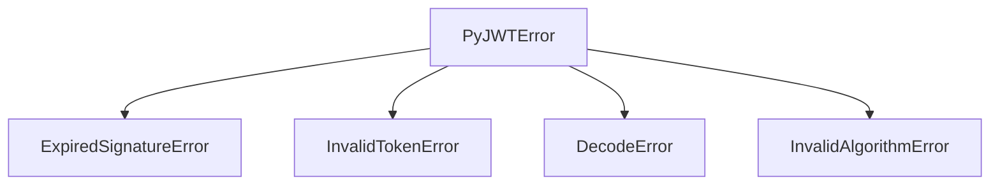

## Raises:
- None directly raised by __init__ (inherits Exception behavior)
- Instances are raised when JWT operations fail

## Example:
```python
try:
    # Some JWT operation that fails
    jwt.decode(token, key, algorithms=['HS256'])
except jwt.PyJWTError as e:
    print(f"JWT error occurred: {e}")
```

## `jwt.exceptions.InvalidTokenError` · *class*

## Summary:
Represents an error that occurs when a JSON Web Token is invalid or cannot be processed.

## Description:
The InvalidTokenError exception is raised when a JWT token fails validation checks or cannot be properly decoded. This exception inherits from PyJWTError and serves as a specific indicator that the token itself is malformed, expired, or otherwise invalid for processing. It is typically raised during token decoding operations when the token doesn't meet the expected format or security requirements.

## State:
This class has no instance attributes beyond those inherited from Exception. It serves purely as an exception type marker with no additional state.

## Lifecycle:
Creation: Instantiated automatically by the JWT library when token validation fails. Can also be manually raised by application code when detecting invalid tokens.

Usage: Used in exception handling blocks to catch and respond to invalid token scenarios. Typically caught by code that handles JWT token validation.

Destruction: No special cleanup required; follows standard Python exception lifecycle.

## Method Map:
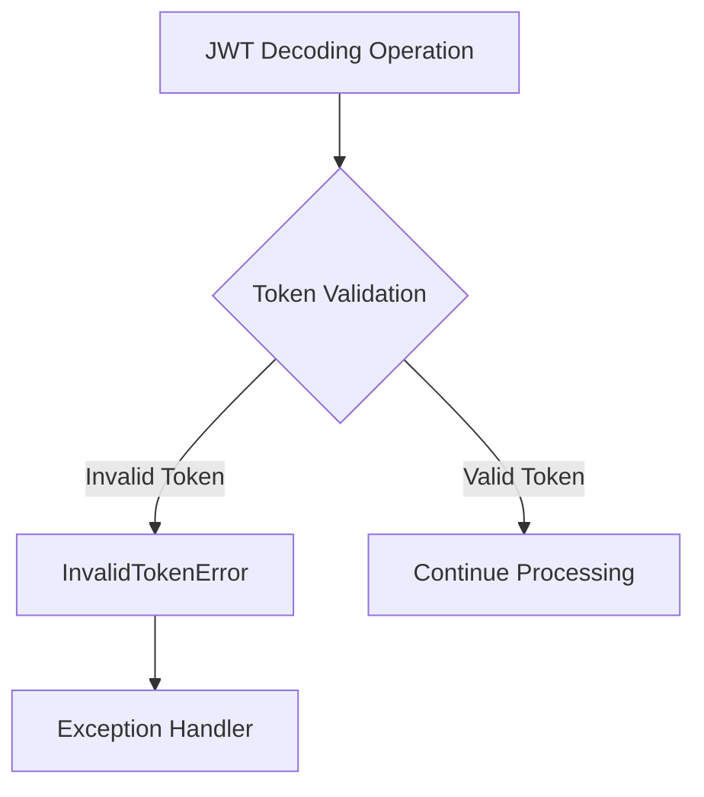

## Raises:
This class itself doesn't raise exceptions, but it is raised by JWT processing functions when token validation fails.

## Example:
```python
import jwt
from jwt.exceptions import InvalidTokenError

try:
    payload = jwt.decode(token, key, algorithms=['HS256'])
except InvalidTokenError:
    print("Token is invalid")
    # Handle invalid token scenario
```

## `jwt.exceptions.DecodeError` · *class*

## Summary:
Exception raised when a JWT token fails to decode properly.

## Description:
DecodeError is a subclass of InvalidTokenError used by the JWT library to indicate failures during token decoding operations. When a JWT token cannot be decoded due to formatting issues, invalid encoding, or other parsing problems, this exception is raised.

## State:
- Inherits from InvalidTokenError (which inherits from PyJWTError)
- No additional attributes or methods beyond the inheritance chain
- Exception message contains details about the specific decoding failure

## Lifecycle:
- Creation: Raised automatically by JWT decoding functions upon decoding failure
- Usage: Caught by application code when handling JWT tokens
- Destruction: Standard Python exception cleanup

## Method Map:
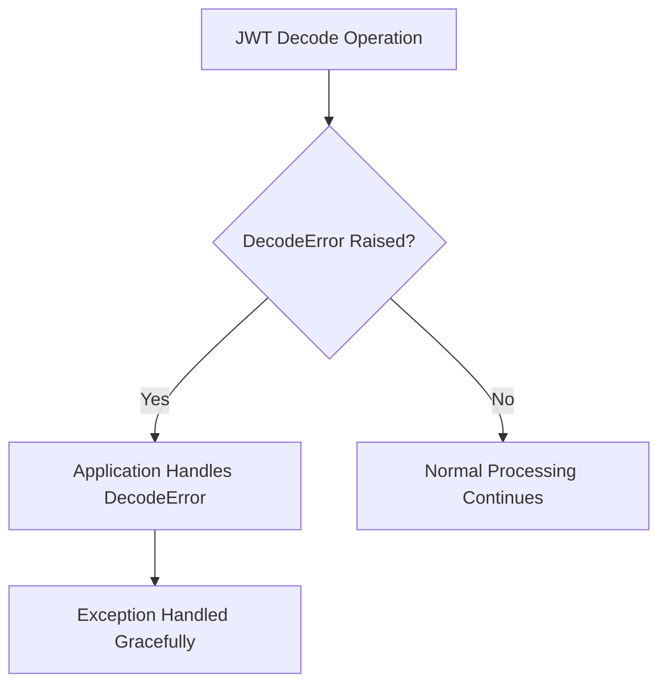

## Raises:
- Raised by JWT decoding functions when token structure is invalid or cannot be parsed
- Triggered by malformed JWT tokens, incorrect base64 encoding, or other decoding issues

## Example:
```python
import jwt
from jwt.exceptions import DecodeError

try:
    token = "invalid.jwt.token"
    payload = jwt.decode(token, "secret", algorithms=["HS256"])
except DecodeError as e:
    print(f"Token decoding failed: {e}")
    # Handle invalid token format specifically
```

## `jwt.exceptions.InvalidSignatureError` · *class*

## Summary:
Represents an error that occurs when a JSON Web Token (JWT) has an invalid signature during decoding.

## Description:
This exception is raised when the signature verification process fails during JWT decoding. It indicates that either the token was tampered with, the signing key is incorrect, or the token was not properly signed. This exception inherits from DecodeError, which means it's part of the JWT decoding error hierarchy and can be caught by handlers expecting decoding-related errors.

## State:
This is a simple exception class with no additional attributes beyond those inherited from its parent classes. It follows the standard Python exception pattern with no instance variables to manage.

## Lifecycle:
- Creation: Instantiated automatically by the JWT library when signature validation fails during token decoding
- Usage: Should be caught by application code when handling JWT decoding operations
- Destruction: Standard Python exception cleanup when the exception propagates out of scope

## Method Map:
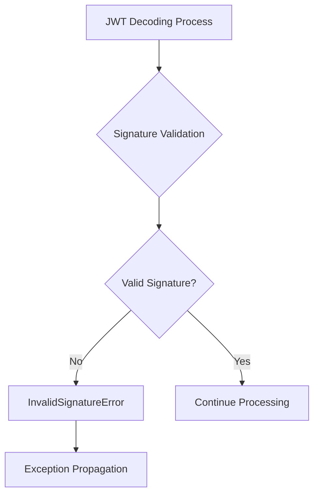

## Raises:
This class itself doesn't raise any exceptions, but it is raised by the JWT library when:
- A token's signature doesn't match the expected signature
- The signing key used for verification is incorrect
- The token has been modified after signing

## Example:
```python
import jwt

try:
    # Attempt to decode a token with an invalid signature
    payload = jwt.decode('invalid.token.here', 'secret', algorithms=['HS256'])
except jwt.InvalidSignatureError:
    print("Token signature is invalid")
    # Handle the invalid signature case
```

## `jwt.exceptions.ExpiredSignatureError` · *class*

## Summary:
Represents an error that occurs when a JSON Web Token has expired and is no longer valid for authentication.

## Description:
The `ExpiredSignatureError` exception is a subclass of `InvalidTokenError` that is raised during JWT validation when a token's expiration timestamp (exp claim) has passed the current time. This exception inherits all behavior from `InvalidTokenError` and provides a specific error type for expired token scenarios.

This class enables applications to distinguish expired tokens from other types of invalid tokens through exception handling.

## State:
- Inherits all state from `InvalidTokenError` (no additional attributes)
- No constructor parameters as it's a simple pass-through class
- Maintains the standard Python Exception behavior with message and args

## Lifecycle:
- Creation: Instantiated automatically by the JWT library when token expiration is detected
- Usage: Caught by application code to handle expired token scenarios specifically
- Destruction: Standard Python exception cleanup when leaving the except block

## Method Map:
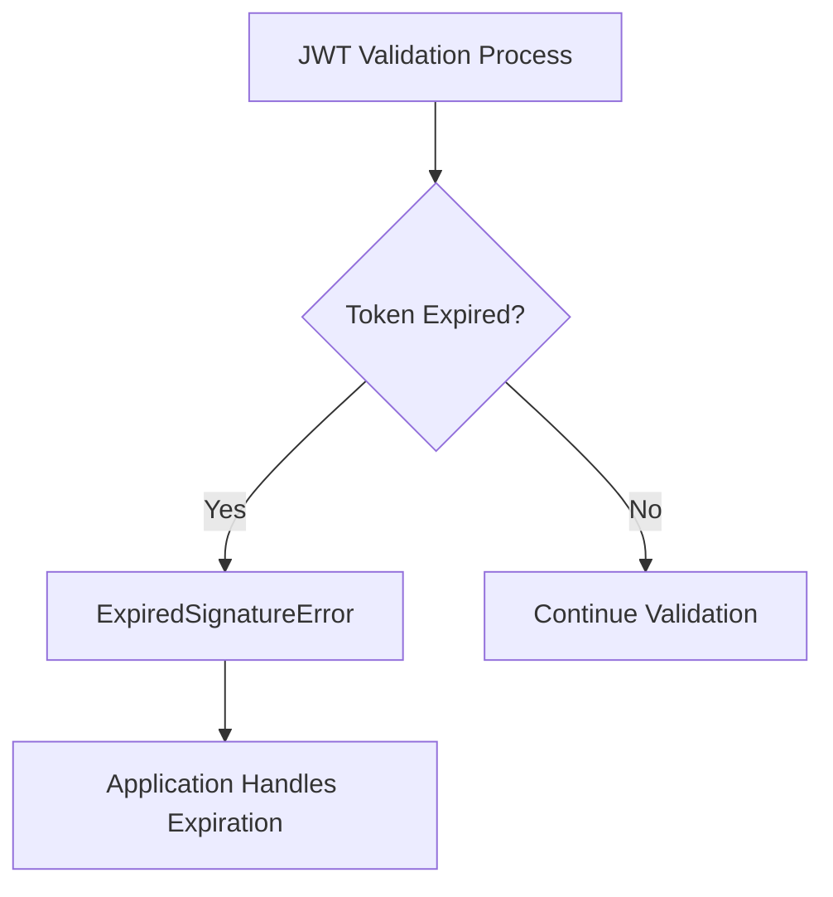

## Raises:
- Automatically raised by JWT validation functions when token expiration is detected
- Triggered when the 'exp' claim in the token payload is earlier than current UTC time
- No explicit constructor parameters required for instantiation

## Example:
```python
import jwt
from jwt.exceptions import ExpiredSignatureError

try:
    payload = jwt.decode(token, secret_key, algorithms=['HS256'])
except ExpiredSignatureError:
    # Handle expired token specifically
    print("Token has expired")
    # Redirect user to login page or refresh token
```

## `jwt.exceptions.InvalidAudienceError` · *class*

## Summary:
Represents an error that occurs when a JWT token's audience claim is invalid or unexpected.

## Description:
The InvalidAudienceError is a specialized exception that indicates a JWT token contains an audience (aud) claim that does not match the expected value during validation. This exception inherits from InvalidTokenError, which is itself a subclass of PyJWTError, forming part of the JWT library's error hierarchy for handling token validation failures.

This class serves as a distinct abstraction to differentiate audience validation failures from other types of token validation errors, allowing applications to handle audience-specific issues separately from other validation problems like expired tokens, malformed tokens, or signature verification failures.

## State:
- Inherits all state from InvalidTokenError (which inherits from PyJWTError)
- No additional instance attributes beyond those inherited from the parent class hierarchy
- The exception message typically contains details about the invalid audience validation

## Lifecycle:
- Creation: Instantiated automatically by JWT libraries when audience validation fails
- Usage: Raised during JWT token validation process when aud claim doesn't match expected value
- Destruction: Standard Python exception cleanup when caught and handled

## Method Map:
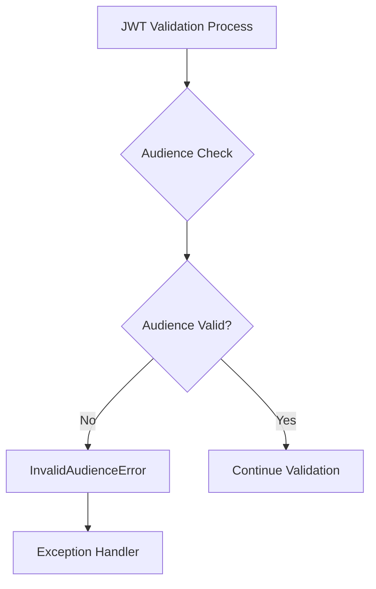

## Raises:
- Raised during JWT token validation when audience claim validation fails
- Triggered specifically when the token's aud claim does not match expected audience values
- Inherits all behaviors from InvalidTokenError parent class

## Example:
```python
import jwt
from jwt.exceptions import InvalidAudienceError

try:
    payload = jwt.decode(token, secret_key, algorithms=['HS256'], audience='expected_audience')
except InvalidAudienceError as e:
    print(f"Audience validation failed: {e}")
    # Handle audience-specific error
```

## `jwt.exceptions.InvalidIssuerError` · *class*

## Summary:
Represents an error that occurs when a JSON Web Token contains an invalid issuer claim.

## Description:
This exception is raised during JWT validation when the token's issuer (iss) claim fails validation checks. The issuer is a critical security component in JWT tokens that identifies the entity that issued the token. This exception specifically indicates that the issuer value either doesn't match expected values, is missing when required, or violates configured validation rules.

## State:
- Inherits all state from InvalidTokenError parent class
- No additional attributes beyond those inherited from PyJWTError

## Lifecycle:
- Creation: Instantiated automatically by JWT validation libraries when issuer validation fails
- Usage: Typically caught and handled by application code during JWT verification processes
- Destruction: Standard Python exception cleanup via garbage collection

## Method Map:
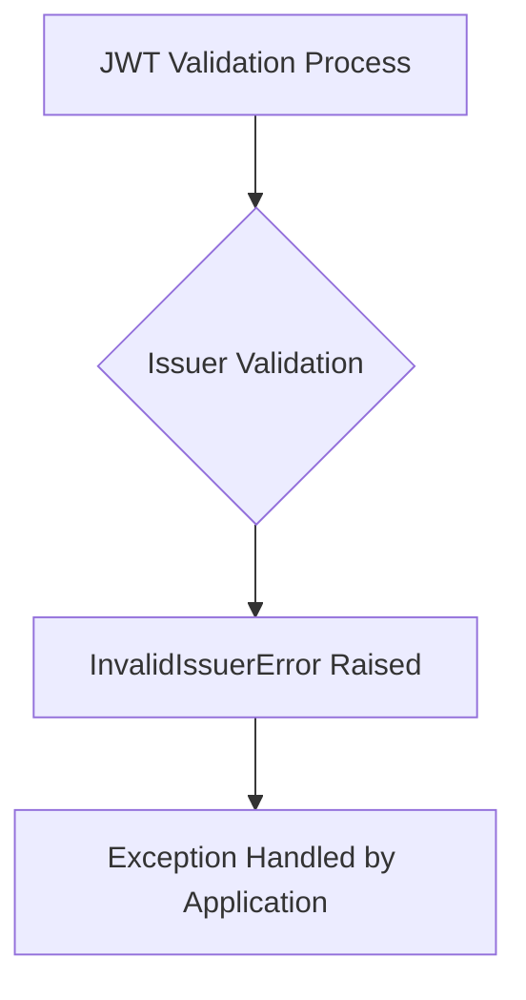

## Raises:
- Raised during JWT decoding/validation when issuer claim fails validation
- Triggered when issuer value doesn't meet configured validation criteria

## Example:
```python
import jwt
from jwt.exceptions import InvalidIssuerError

try:
    payload = jwt.decode(token, key, algorithms=['HS256'], issuer='expected_issuer')
except InvalidIssuerError:
    # Handle invalid issuer scenario
    print("Token was issued by an unauthorized party")
```

## `jwt.exceptions.InvalidIssuedAtError` · *class*

## Summary:
Represents an error that occurs when a JSON Web Token has an invalid issued-at timestamp.

## Description:
The InvalidIssuedAtError exception is raised when a JWT token's issued-at (iat) claim is invalid. This typically happens when the token was issued in the future or when the timestamp is malformed. This exception inherits from InvalidTokenError, making it part of the standard JWT validation error hierarchy.

## State:
This class has no instance attributes beyond those inherited from its parent classes. It serves purely as an exception type marker with no additional state.

## Lifecycle:
- Creation: Instantiated automatically by the JWT library when an invalid issued-at timestamp is detected during token validation
- Usage: Raised during JWT decoding/validation operations when the iat claim fails validation
- Destruction: Standard Python exception cleanup when the exception propagates out of scope

## Method Map:
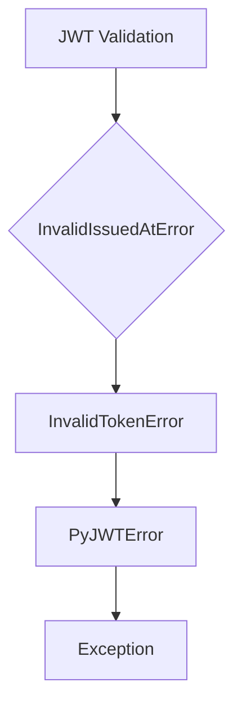

## Raises:
This class does not raise any exceptions itself as it's an exception class. It is raised by the JWT validation process when an invalid issued-at timestamp is encountered.

## Example:
```python
import jwt
from jwt.exceptions import InvalidIssuedAtError

try:
    payload = jwt.decode(token, key, algorithms=['HS256'])
except InvalidIssuedAtError:
    print("Token has invalid issued-at timestamp")
```

## `jwt.exceptions.ImmatureSignatureError` · *class*

## Summary:
Represents an error that occurs when a JWT token's signature is not yet valid due to a future "nbf" (not before) timestamp.

## Description:
This exception is raised during JWT token validation when the token contains a "nbf" (not before) claim that specifies a future timestamp, indicating the token should not be considered valid until that time has passed. It is a specialized exception that inherits from InvalidTokenError, which serves as a base exception type for all JWT validation errors.

## State:
- Inherits from InvalidTokenError (no additional instance attributes)
- Serves as a type marker for specific validation failure scenario
- No additional state or constructor parameters

## Lifecycle:
- Creation: Automatically instantiated by JWT decoding/validation libraries when encountering tokens with future nbf timestamps
- Usage: Caught by application code during token validation to handle premature token validity scenarios
- Destruction: Standard Python exception cleanup

## Method Map:
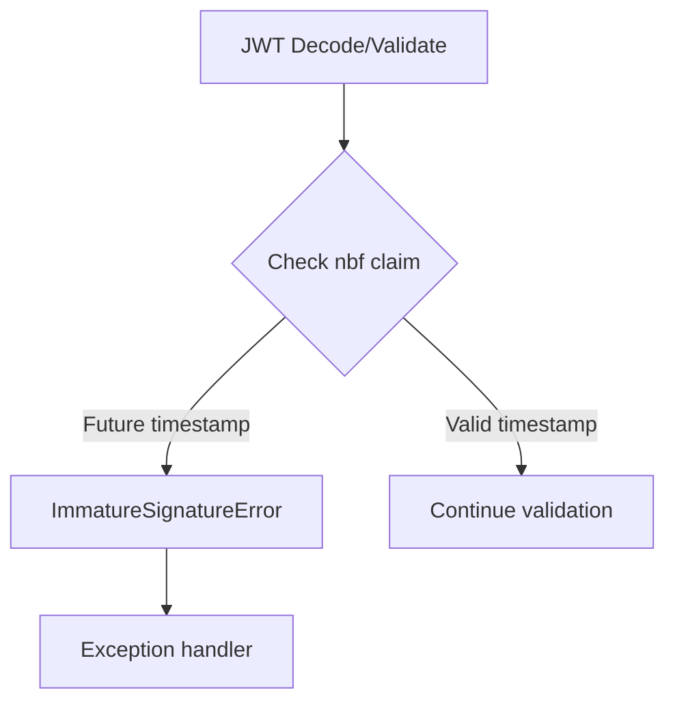

## Raises:
- Raised during JWT token decoding when the "nbf" (not before) claim is set to a future timestamp
- Triggered automatically by JWT validation libraries when token validation fails due to premature validity

## Example:
```python
import jwt
from jwt.exceptions import ImmatureSignatureError

try:
    payload = jwt.decode(token, key, algorithms=['HS256'])
except ImmatureSignatureError:
    print("Token is not yet valid - check the 'nbf' claim")
```

## `jwt.exceptions.InvalidKeyError` · *class*

## Summary:
Represents an error that occurs when a JWT key is invalid or cannot be processed.

## Description:
The InvalidKeyError exception is raised when a JWT operation encounters an invalid key during decoding or encoding operations. This exception inherits from PyJWTError, making it part of the standard JWT error hierarchy. It is typically raised when the provided key is malformed, unsupported, or incompatible with the JWT algorithm being used.

This exception serves as a distinct error type to differentiate key-related issues from other JWT processing errors such as token expiration, signature verification failures, or malformed tokens.

## State:
This class has no additional attributes beyond those inherited from Exception. It maintains the standard exception behavior with message and args properties.

## Lifecycle:
Creation: Instantiated automatically by the JWT library when an invalid key is detected during JWT operations. No explicit instantiation is typically required from user code.

Usage: When caught, this exception indicates that the key provided for JWT signing or verification is invalid and needs to be corrected.

Destruction: Handled by Python's normal exception handling mechanisms. No special cleanup is required.

## Method Map:
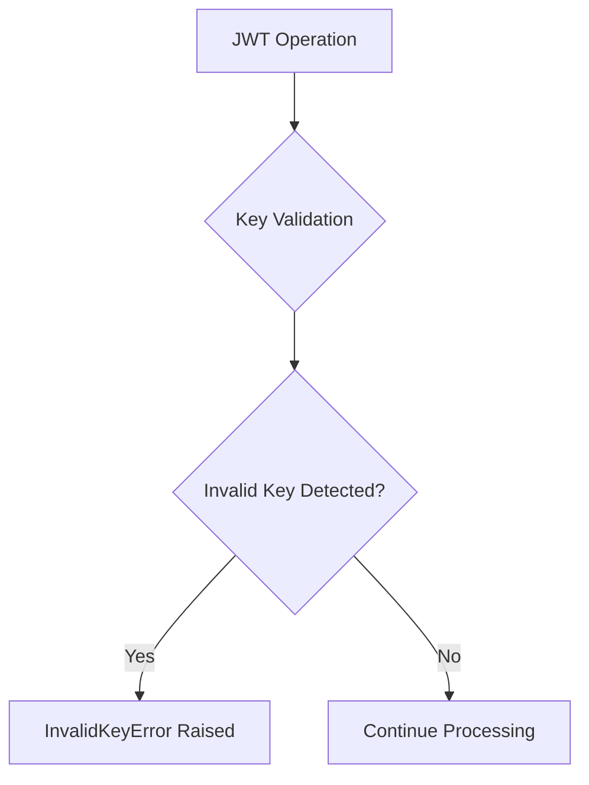

## Raises:
This exception is raised by JWT library functions when they encounter an invalid key during signing or verification operations.

## Example:
```python
import jwt

try:
    # Attempt to decode a token with an invalid key
    payload = jwt.decode('token', 'invalid_key', algorithms=['HS256'])
except jwt.InvalidKeyError:
    print("The provided key is invalid")
```

## `jwt.exceptions.InvalidAlgorithmError` · *class*

## Summary:
Represents an error that occurs when a JWT token uses an invalid or unsupported algorithm during decoding or validation.

## Description:
The `InvalidAlgorithmError` exception is raised when a JSON Web Token (JWT) is processed using an algorithm that is not supported or considered invalid by the JWT library. This typically happens when the token's header contains an algorithm that is either not recognized, not allowed, or not properly configured for validation. This exception inherits from `InvalidTokenError`, which itself is a subclass of `PyJWTError`, making it part of the standard error handling hierarchy for JWT operations.

## State:
This class is a simple exception with no additional instance attributes beyond those inherited from its parent classes. It does not maintain any internal state or configuration parameters.

## Lifecycle:
- Creation: Instantiated automatically by the JWT library when an invalid algorithm is detected during token processing
- Usage: Raised during JWT decoding/validation operations when algorithm validation fails
- Destruction: Standard Python exception cleanup; no special cleanup required

## Method Map:
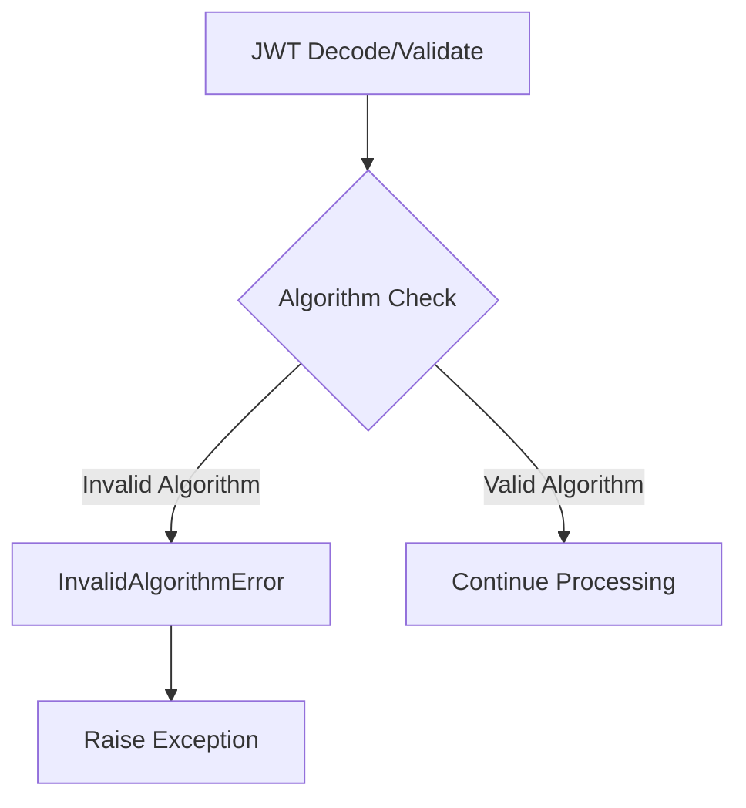

## Raises:
This exception is raised by the JWT library during token validation when:
- The token's header specifies an algorithm that is not supported
- The algorithm is not in the list of allowed algorithms for validation
- An unexpected or malformed algorithm string is encountered

## Example:
```python
import jwt
from jwt.exceptions import InvalidAlgorithmError

try:
    # Attempt to decode a token with an unsupported algorithm
    payload = jwt.decode(token, key, algorithms=['HS256'])
except InvalidAlgorithmError:
    print("Token was signed with an invalid or unsupported algorithm")
```

## `jwt.exceptions.MissingRequiredClaimError` · *class*

## Summary:
Represents an error that occurs when a JWT token is missing a required claim during validation.

## Description:
This exception is raised when a JSON Web Token validation process detects that a token is missing a claim that was marked as required. It inherits from InvalidTokenError, which itself inherits from PyJWTError, making it part of the standard exception hierarchy for JWT-related errors. This class serves as a distinct abstraction to specifically identify missing required claims, allowing callers to handle this particular validation failure case appropriately.

## State:
- claim (str): The name of the missing required claim. This is set during initialization and represents the specific claim that caused the validation to fail.

## Lifecycle:
- Creation: Instantiated by passing a string argument representing the name of the missing claim to the constructor
- Usage: Typically raised during JWT token validation when claim requirements are not met
- Destruction: No special cleanup required; follows standard Python exception handling patterns

## Method Map:
```mermaid
graph TD
    A[JWT Validation Process] --> B{Check Required Claims}
    B --> C{Claim Missing?}
    C -->|Yes| D[MissingRequiredClaimError(claim)]
    C -->|No| E[Continue Validation]
    D --> F[Exception Raised]
```

## Raises:
- MissingRequiredClaimError is raised when a required claim is not present in a JWT token during validation
- Trigger condition: A token validation process determines that a claim marked as required is absent from the token payload

## Example:
```python
# Example of raising the exception
try:
    # Simulate JWT validation that finds a missing required claim
    raise MissingRequiredClaimError("exp")
except MissingRequiredClaimError as e:
    print(f"Error: {e}")
    # Output: Error: Token is missing the "exp" claim
```

### `jwt.exceptions.MissingRequiredClaimError.__init__` · *method*

## Summary:
Initializes a MissingRequiredClaimError instance with the name of the missing JWT claim.

## Description:
This constructor creates an exception instance that represents a JWT validation error where a required claim is missing from the token. The method stores the claim name that was expected but not found in the token payload.

## Args:
    claim (str): The name of the required JWT claim that is missing from the token.

## Returns:
    None: This method does not return a value.

## Raises:
    None: This method does not raise any exceptions.

## State Changes:
    Attributes READ: None
    Attributes WRITTEN: self.claim

## Constraints:
    Preconditions: The claim parameter must be a string representing the name of a JWT claim.
    Postconditions: After initialization, the instance will have a self.claim attribute containing the provided claim name.

## Side Effects:
    None: This method performs no I/O operations or external service calls. It only sets an instance attribute.

### `jwt.exceptions.MissingRequiredClaimError.__str__` · *method*

## Summary:
Returns a human-readable string representation of the missing required claim error.

## Description:
This method provides a formatted error message indicating which JWT claim is missing from the token. It is automatically invoked when the exception is converted to a string, such as during printing, logging, or exception handling.

## Args:
    None

## Returns:
    str: A formatted string message in the format 'Token is missing the "{claim}" claim' where {claim} is the name of the missing JWT claim.

## Raises:
    None

## State Changes:
    Attributes READ: self.claim
    Attributes WRITTEN: None

## Constraints:
    Preconditions: The exception instance must have been initialized with a valid claim name stored in self.claim
    Postconditions: The returned string is always formatted consistently with the pattern 'Token is missing the "{claim}" claim'

## Side Effects:
    None

## `jwt.exceptions.PyJWKError` · *class*

## Summary:
Represents a generic error that occurs during JSON Web Key (JWK) operations within the PyJWT library.

## Description:
PyJWKError is a specialized exception class that extends PyJWTError and is raised when issues occur during JSON Web Key processing operations such as key generation, parsing, validation, or usage. This exception serves as a distinct error type to differentiate JWK-specific failures from other JWT-related errors in the library.

## State:
- Inherits from: PyJWTError (Exception)
- No additional instance attributes beyond those inherited from Exception
- No constructor parameters required as it's a pass-through inheritance

## Lifecycle:
- Creation: Instantiated automatically by the JWT library when JWK-related operations fail
- Usage: Caught and handled by application code when JWK operations encounter problems
- Destruction: Standard Python exception cleanup when the exception propagates out of scope

## Method Map:
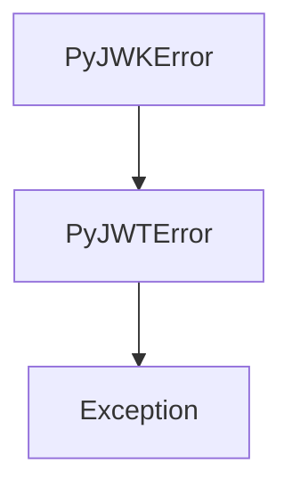

## Raises:
- Raised during JWK processing operations when underlying issues occur
- Typically raised by internal JWT library functions when JWK validation or processing fails
- Not raised directly by the constructor as it inherits from Exception without custom initialization

## Example:
```python
from jwt.exceptions import PyJWKError

try:
    # Some JWK operation that fails
    key = get_jwk_from_string(invalid_jwk_string)
except PyJWKError as e:
    print(f"JWK processing failed: {e}")
    # Handle the JWK-specific error appropriately
```

## `jwt.exceptions.PyJWKSetError` · *class*

## Summary:
Represents an exception that occurs during JWK Set processing in JWT authentication workflows.

## Description:
PyJWKSetError is a specialized exception class that extends PyJWTError for handling errors specifically related to JSON Web Key Sets (JWK Sets) in JWT operations. It serves as a distinct error type to differentiate JWK Set processing failures from other JWT-related errors, enabling more granular error handling in authentication systems that utilize JWK sets for key management.

This exception is typically raised when operations involving JWK Sets fail, such as when parsing malformed JWK Set documents, retrieving keys from a JWK Set endpoint, or validating JWK Set structures.

## State:
- Inherits all state from PyJWTError (which is just the standard Exception base class)
- No additional instance attributes or parameters
- No specific invariants beyond those of Exception

## Lifecycle:
- Creation: Instantiated like any standard exception using `raise PyJWKSetError("message")` or `raise PyJWKSetError()` 
- Usage: Caught and handled in exception handlers that specifically target JWK Set processing errors
- Destruction: Standard Python exception cleanup behavior

## Method Map:
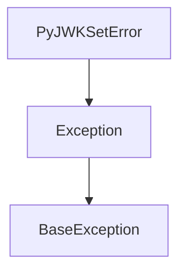

## Raises:
- Raised during JWK Set processing operations when validation, parsing, or retrieval fails
- Typically raised by JWK Set related functions in the jwt library when encountering invalid JWK Set data or configuration issues

## Example:
```python
try:
    # Some JWK Set operation that might fail
    jwk_set = load_jwk_set_from_url("https://example.com/.well-known/jwks.json")
except PyJWKSetError as e:
    print(f"JWK Set processing failed: {e}")
    # Handle JWK Set specific error
```

## `jwt.exceptions.PyJWKClientError` · *class*

## Summary:
Custom exception class extending PyJWTError for JWK client operations.

## Description:
PyJWKClientError is a minimal exception class that inherits from PyJWTError. It is used within the PyJWT library's JWK client component to represent errors specific to JSON Web Key operations. As a subclass of PyJWTError, it follows the same error handling patterns as other PyJWT exceptions but provides a distinct exception type for JWK-related failures.

## State:
- Inherits from: PyJWTError (which itself inherits from Exception)
- No additional instance attributes beyond those inherited from Exception
- No constructor parameters required as it's a minimal inheritance

## Lifecycle:
- Creation: Instantiated like any standard Exception class, typically via 'raise PyJWKClientError("error message")'
- Usage: Raised during JWK client operations when validation or processing fails
- Destruction: Handled by standard Python exception mechanisms; no special cleanup required

## Method Map:
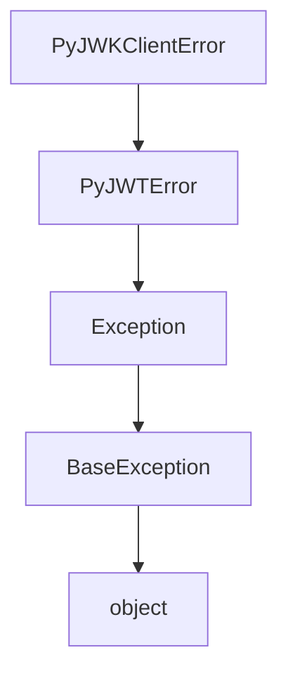

## Raises:
- Raised by: PyJWKClient operations when JWK-specific errors occur
- Trigger conditions: Invalid JWK formats, failed key retrieval, cryptographic operation failures, or other JWK client processing issues

## Example:
```python
try:
    # Some JWK client operation
    key = jwk_client.get_key(key_id)
except PyJWKClientError as e:
    print(f"JWK client error occurred: {e}")
    # Handle JWK-specific error appropriately
```

## `jwt.exceptions.PyJWKClientConnectionError` · *class*

## Summary:
Represents connection-related errors that occur when communicating with a JSON Web Key (JWK) client.

## Description:
This exception is raised when a PyJWKClient encounters network or connectivity issues while attempting to fetch or communicate with a JWK endpoint. It serves as a specialized exception type that allows callers to distinguish connection failures from other types of JWK client errors.

The exception inherits from PyJWKClientError, which itself inherits from PyJWTError, forming a hierarchy that categorizes JWT-related errors by their source and nature.

## State:
This class has no additional attributes beyond those inherited from its parent classes. It maintains the standard Exception behavior with message and args properties.

## Lifecycle:
Creation: Instances are created automatically by the PyJWKClient when connection-related failures occur during JWK fetching operations. Callers should not instantiate this class directly.

Usage: This exception is typically raised during JWK retrieval operations and should be caught by code that handles network or connectivity issues gracefully.

Destruction: Like all Python exceptions, cleanup is handled automatically by the Python runtime when the exception propagates out of scope.

## Method Map:
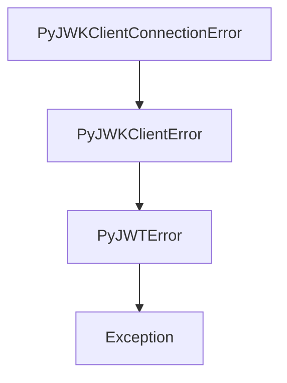

## Raises:
This exception is raised by the PyJWKClient when connection failures occur during JWK retrieval operations, such as:
- Network timeouts
- DNS resolution failures
- Connection refused errors
- SSL/TLS handshake failures

## Example:
```python
from jwt.exceptions import PyJWKClientConnectionError

try:
    # Attempt to fetch JWK set from remote endpoint
    jwk_set = client.get_jwk_set()
except PyJWKClientConnectionError as e:
    # Handle network/connection related failures
    print(f"Connection failed: {e}")
    # Retry logic or fallback mechanism
```

