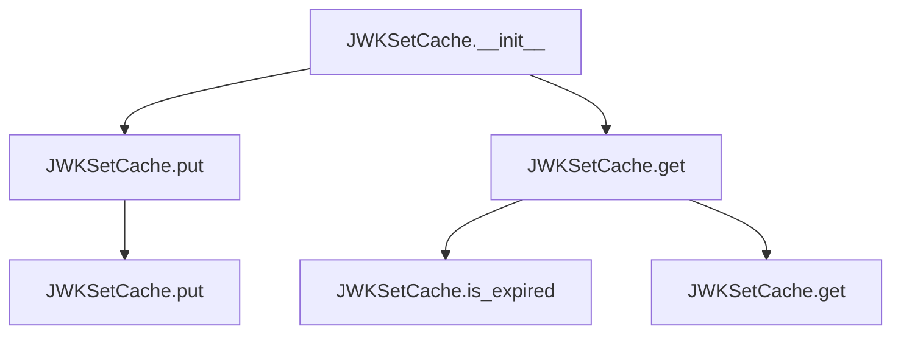

# `jwk_set_cache.py`

## `jwt.jwk_set_cache.JWKSetCache` · *class*

## Summary:
Caching layer for JSON Web Key sets with automatic expiration based on configurable lifespan.

## Description:
JWKSetCache provides a thread-safe caching mechanism for storing and retrieving JSON Web Key sets (JWK Sets) with automatic expiration. It wraps JWK sets with timestamp metadata to track when they were last updated, enabling time-based cache invalidation. This class is commonly used in JWT validation contexts where JWK sets need to be periodically refreshed from remote sources.

## State:
- jwk_set_with_timestamp: Optional[PyJWTSetWithTimestamp]
  - Stores the cached JWK set wrapped with timestamp metadata
  - Initially None, set via put() method
  - Valid range: None or PyJWTSetWithTimestamp instance
- lifespan: int
  - Maximum age in seconds for cached JWK sets
  - Must be >= -1 (where -1 means infinite lifetime)
  - Default value: provided during initialization
  - Invariant: controls cache expiration behavior

## Lifecycle:
- Creation: Instantiate with lifespan parameter (int)
- Usage: Call put() to store JWK sets, get() to retrieve them (automatically handles expiration)
- Destruction: No explicit cleanup required; object can be garbage collected

## Method Map:


## Raises:
- No explicit exceptions raised by __init__
- All operations are safe and handle None values gracefully

## Example:
```python
# Create cache with 3600 second (1 hour) lifespan
cache = JWKSetCache(lifespan=3600)

# Store a JWK set
jwk_set = PyJWKSet.from_dict({"keys": [...]})
cache.put(jwk_set)

# Retrieve JWK set (returns None if expired)
retrieved_set = cache.get()

# Cache automatically expires after 1 hour
```

### `jwt.jwk_set_cache.JWKSetCache.__init__` · *method*

## Summary:
Initializes a JWK set cache with a specified lifespan for cached JWK sets.

## Description:
Configures the cache instance with a time-to-live duration for cached JWK sets. This method sets up the internal state by initializing the cached JWK set to None and storing the lifespan parameter for future expiration checks.

## Args:
    lifespan (int): Maximum age in seconds for cached JWK sets. A negative value indicates infinite lifetime.

## Returns:
    None: This method does not return any value.

## Raises:
    None: This method does not raise any exceptions.

## State Changes:
    Attributes READ: None
    Attributes WRITTEN: 
    - self.jwk_set_with_timestamp: Initialized to None
    - self.lifespan: Set to the provided lifespan parameter

## Constraints:
    Preconditions: The lifespan parameter should be an integer value.
    Postconditions: After execution, self.jwk_set_with_timestamp will be None and self.lifespan will be set to the provided value.

## Side Effects:
    None: This method performs no I/O operations or external service calls.

### `jwt.jwk_set_cache.JWKSetCache.put` · *method*

## Summary:
Stores a JWK set in the cache with timestamp metadata or clears the cache when None is provided.

## Description:
This method serves as the primary interface for updating the cached JWK set within the JWKSetCache instance. It wraps the provided JWK set in a timestamped container for expiration tracking, or clears the cache when None is passed. This method is typically called during token validation workflows when new JWK sets are fetched from remote sources or when cache invalidation is required.

## Args:
    jwk_set (PyJWKSet): The JWK set to cache, or None to clear the cache

## Returns:
    None: This method does not return any value

## Raises:
    None: This method does not explicitly raise exceptions

## State Changes:
    Attributes READ: None
    Attributes WRITTEN: self.jwk_set_with_timestamp

## Constraints:
    Preconditions: The jwk_set parameter must be either a valid PyJWKSet instance or None
    Postconditions: After execution, self.jwk_set_with_timestamp will contain either a PyJWTSetWithTimestamp wrapper around the provided jwk_set or None

## Side Effects:
    None: This method performs no I/O operations or external service calls

### `jwt.jwk_set_cache.JWKSetCache.get` · *method*

## Summary:
Retrieves the cached JWK set if it exists and hasn't expired, otherwise returns None.

## Description:
This method provides access to the cached JWK set while ensuring its validity. It first checks if a cached JWK set exists and whether it has expired based on the configured lifespan. If either condition is true, it returns None to indicate that a fresh JWK set needs to be obtained. Otherwise, it returns the cached JWK set.

The method is designed as a separate utility to encapsulate the cache validation logic and provide a clean interface for accessing cached JWK sets throughout the application's lifecycle.

## Args:
    None

## Returns:
    Optional[PyJWKSet]: The cached JWK set if valid and available, otherwise None

## Raises:
    None explicitly raised

## State Changes:
    Attributes READ: self.jwk_set_with_timestamp, self.lifespan
    Attributes WRITTEN: None

## Constraints:
    Preconditions: None
    Postconditions: Returns either a valid PyJWKSet or None, with no side effects on the cache state

## Side Effects:
    None

### `jwt.jwk_set_cache.JWKSetCache.is_expired` · *method*

## Summary:
Determines whether the cached JWK set has exceeded its configured lifetime.

## Description:
Checks if the currently cached JWK set has expired based on the timestamp of when it was cached and the maximum allowed lifespan. This method is used internally by the cache to validate whether cached keys are still usable.

## Args:
    None

## Returns:
    bool: True if the JWK set has expired (current time > timestamp + lifespan), False otherwise.

## Raises:
    None

## State Changes:
    Attributes READ: self.jwk_set_with_timestamp, self.lifespan
    Attributes WRITTEN: None

## Constraints:
    Preconditions: 
    - self.lifespan must be an integer
    - self.jwk_set_with_timestamp must be either None or a valid PyJWTSetWithTimestamp instance
    
    Postconditions:
    - Returns boolean indicating expiration status
    - Does not modify any object state

## Side Effects:
    None

