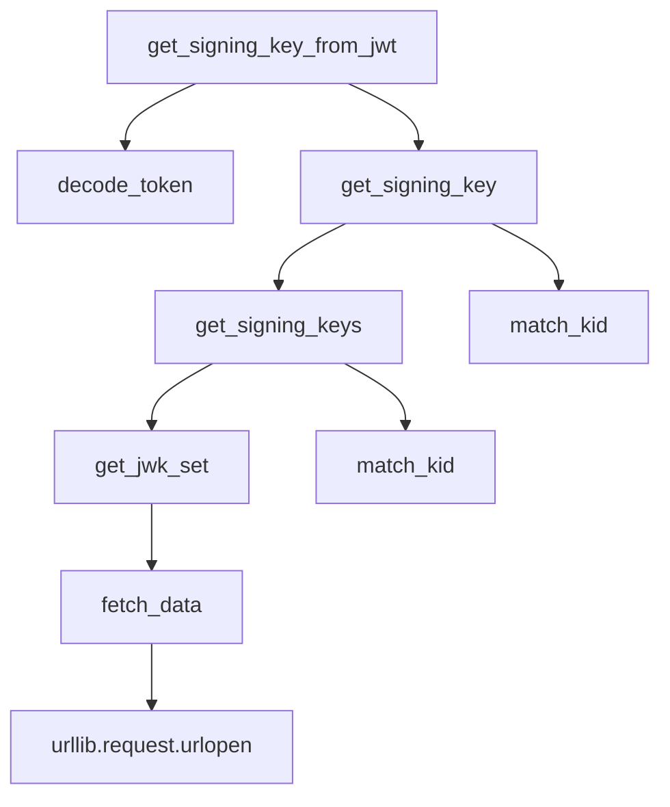

# `jwks_client.py`

## `jwt.jwks_client.PyJWKClient` · *class*

## Summary:
A client for fetching, caching, and managing JSON Web Key Sets (JWKS) used for JWT signature verification.

## Description:
The PyJWKClient class provides functionality to retrieve JSON Web Key Sets from a remote URI, cache them for performance, and extract signing keys for verifying JWT signatures. It handles HTTP communication, caching strategies, and key matching based on Key IDs (kid) from JWT headers.

This class serves as the primary interface for working with JWKS endpoints in JWT verification workflows, providing both cached and fresh key retrieval capabilities while handling connection errors gracefully.

## State:
- uri (str): The URL endpoint from which JWKS data is fetched
- jwk_set_cache (Optional[JWKSetCache]): Cache for storing previously fetched JWKS data with expiration
- headers (Dict[str, Any]): HTTP headers to include in requests
- timeout (int): Request timeout in seconds
- ssl_context (Optional[SSLContext]): SSL context for secure connections
- max_cached_keys (int): Maximum number of signing keys to cache when cache_keys is enabled

## Lifecycle:
Creation: Instantiate with a URI and optional configuration parameters. The client can be configured for caching behavior via cache_keys and cache_jwk_set flags.

Usage: Typically used by calling get_signing_key_from_jwt() with a JWT token, which internally retrieves the appropriate signing key based on the token's kid header. Alternatively, get_signing_key() can be called directly with a specific key ID.

Destruction: No explicit cleanup required; the client is lightweight and doesn't hold persistent connections.

## Method Map:


## Raises:
- PyJWKClientError: Raised when JWKS endpoint returns invalid data (not a JSON object) or when no signing keys are found
- PyJWKClientConnectionError: Raised when HTTP request fails due to network issues or timeouts
- ValueError: Raised when lifespan parameter is not greater than 0 during initialization

## Example:
```python
# Create client with caching enabled
client = PyJWKClient('https://example.com/.well-known/jwks.json', cache_keys=True)

# Get signing key from JWT token
token = "eyJhbGciOiJIUzI1NiIsInR5cCI6IkpXVCJ9..."
signing_key = client.get_signing_key_from_jwt(token)

# Or get signing key directly by kid
key = client.get_signing_key("specific-key-id")
```

### `jwt.jwks_client.PyJWKClient.__init__` · *method*

## Summary:
Initializes a PyJWKClient instance with configuration options for fetching and caching JSON Web Key Sets.

## Description:
Configures a PyJWKClient instance with URI endpoint, caching settings, and connection parameters. This method sets up internal state for fetching and caching JWK sets while validating configuration parameters such as cache lifespan.

## Args:
    uri (str): The URL endpoint from which to fetch JSON Web Key Sets.
    cache_keys (bool): Whether to cache signing keys using LRU cache. Defaults to False.
    max_cached_keys (int): Maximum number of signing keys to cache when cache_keys is True. Defaults to 16.
    cache_jwk_set (bool): Whether to cache the entire JWK set. Defaults to True.
    lifespan (int): Cache lifespan in seconds for JWK sets. Must be greater than 0 when caching is enabled. Defaults to 300.
    headers (Optional[Dict[str, Any]]): HTTP headers to include in requests. Defaults to None.
    timeout (int): Request timeout in seconds. Defaults to 30.
    ssl_context (Optional[SSLContext]): SSL context for secure connections. Defaults to None.

## Returns:
    None: This method initializes the object's state and returns nothing.

## Raises:
    PyJWKClientError: When cache_jwk_set is True and lifespan is less than or equal to 0.

## State Changes:
    Attributes READ: None
    Attributes WRITTEN: 
    - self.uri: Stores the JWK set endpoint URI
    - self.jwk_set_cache: Initializes cache for JWK sets or sets to None
    - self.headers: Stores HTTP headers
    - self.timeout: Stores request timeout value
    - self.ssl_context: Stores SSL context for secure connections
    - self.get_signing_key: Wraps the method with LRU cache decorator when cache_keys is True

## Constraints:
    Preconditions:
    - If cache_jwk_set is True, lifespan must be greater than 0
    - uri must be a valid string URL
    - headers, if provided, must be a dictionary-like object
    - ssl_context, if provided, must be a valid SSLContext instance
    
    Postconditions:
    - self.uri is set to the provided URI
    - self.jwk_set_cache is either initialized with a JWKSetCache or set to None
    - self.headers is initialized as a dictionary
    - self.timeout is set to the provided timeout value
    - self.ssl_context is set to the provided SSL context or None
    - self.get_signing_key is wrapped with lru_cache decorator if cache_keys is True

## Side Effects:
    None: This method only initializes internal state and does not perform I/O operations or external service calls.

### `jwt.jwks_client.PyJWKClient.fetch_data` · *method*

*No documentation generated.*

### `jwt.jwks_client.PyJWKClient.get_jwk_set` · *method*

## Summary:
Retrieves and returns the JSON Web Key Set (JWKS) from cache or remote endpoint, validating and converting it to a PyJWKSet object.

## Description:
This method serves as the primary interface for obtaining the JSON Web Key Set (JWKS) used for JWT validation. It implements a caching strategy to avoid repeated network requests while ensuring fresh data when requested. The method first attempts to retrieve cached data, falling back to fetching from the configured URI if no cached data exists or if refresh is explicitly requested. It validates that the retrieved data is a proper JSON object before converting it to a PyJWKSet instance.

## Args:
    refresh (bool): When True, bypasses cache and forces a fresh fetch from the remote endpoint. Defaults to False.

## Returns:
    PyJWKSet: A PyJWKSet object containing the parsed JSON Web Key Set.

## Raises:
    PyJWKClientError: When the JWKS endpoint does not return a valid JSON object (i.e., not a dictionary).

## State Changes:
    Attributes READ: self.jwk_set_cache, self.fetch_data
    Attributes WRITTEN: None

## Constraints:
    Preconditions: The PyJWKClient instance must be properly initialized with a valid URI and appropriate cache configuration.
    Postconditions: Returns a valid PyJWKSet object containing the JWKS data.

## Side Effects:
    I/O: Makes HTTP requests to the configured URI via urllib.request.urlopen
    External service calls: Fetches data from the remote JWKS endpoint
    Cache operations: May read from or write to the internal JWKSetCache if enabled

### `jwt.jwks_client.PyJWKClient.get_signing_keys` · *method*

*No documentation generated.*

### `jwt.jwks_client.PyJWKClient.get_signing_key` · *method*

## Summary:
Retrieves a signing key from the JWKS endpoint that matches the specified key ID, refreshing the cache if necessary.

## Description:
This method attempts to find a signing key in the cached or fetched JWKS (JSON Web Key Set) that matches the provided key ID. If no matching key is initially found, it will refresh the JWKS cache and try again. This method is designed to be robust in handling key rotation scenarios where keys may be updated on the server.

## Args:
    kid (str): The key ID to match against signing keys in the JWKS.

## Returns:
    PyJWK: The matching signing key object from the JWKS.

## Raises:
    PyJWKClientError: When no signing key matching the provided key ID can be found, even after refreshing the JWKS cache.

## State Changes:
    Attributes READ: self.jwk_set_cache, self.uri, self.headers, self.timeout, self.ssl_context
    Attributes WRITTEN: None

## Constraints:
    Preconditions: The PyJWKClient instance must be properly initialized with a valid URI and appropriate configuration.
    Postconditions: Either a matching PyJWK object is returned, or an exception is raised.

## Side Effects:
    I/O: Makes HTTP requests to fetch data from the configured URI.
    External service calls: Calls the JWKS endpoint to retrieve key sets.
    Cache operations: May update or refresh the JWKS set cache.

### `jwt.jwks_client.PyJWKClient.get_signing_key_from_jwt` · *method*

## Summary:
Retrieves a signing key from the JWKS using the key ID found in a JWT token header.

## Description:
This method decodes a JWT token to extract its header information, specifically the key ID ('kid') field, and then retrieves the corresponding signing key from the JWKS (JSON Web Key Set). This is commonly used in JWT verification workflows where the signing key needs to be dynamically fetched based on the token's key identifier.

## Args:
    token (str): A JSON Web Token string containing a header with a 'kid' field

## Returns:
    PyJWK: The signing key corresponding to the key ID found in the token header

## Raises:
    PyJWKClientError: If the token is malformed or if no signing key can be found for the extracted key ID
    PyJWKClientConnectionError: If there's a network error while fetching keys from a remote JWKS endpoint

## State Changes:
    Attributes READ: None
    Attributes WRITTEN: None

## Constraints:
    Preconditions: The token must be a valid JWT string with a header containing a 'kid' field
    Postconditions: Returns a valid PyJWK object that can be used for signature verification

## Side Effects:
    I/O: May perform network requests to fetch JWKS data if the key is not cached
    External service calls: May call remote endpoints to retrieve JWKS data when keys are not locally cached

### `jwt.jwks_client.PyJWKClient.match_kid` · *method*

## Summary:
Matches a signing key from a list by its key identifier.

## Description:
Searches through a collection of PyJWK objects to find and return the first key that matches the specified key identifier. This function is used to locate the appropriate signing key for JWT verification based on the key ID present in the JWT header.

## Args:
    signing_keys (List[PyJWK]): A list of PyJWK objects representing available signing keys.
    kid (str): The key identifier string to match against the key_id attribute of each PyJWK object.

## Returns:
    Optional[PyJWK]: The matching PyJWK object if found, or None if no key with the specified key ID exists in the list.

## Raises:
    None

## State Changes:
    None

## Constraints:
    Preconditions:
        - The signing_keys list should not be None
        - Each PyJWK object in the list should have a valid key_id attribute
    Postconditions:
        - Returns either a PyJWK object with matching key_id or None
        - Does not modify the input signing_keys list

## Side Effects:
    None

