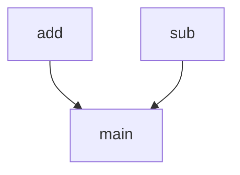

# `docs`

## Tree:
```
docs/
└── tasks.py
```

## Role:
Provides basic mathematical operations for task execution

## Description:
This module contains fundamental arithmetic operations used in task processing workflows. It serves as a utility module for performing simple mathematical computations within the system's task execution pipeline.

## Components:
- `add(x, y)` - Adds two numbers together
- `sub(x, y)` - Subtracts the second number from the first with a simulated delay



## Public API:
- `add(x: int, y: int) -> int`: Adds two integers and returns their sum
- `sub(x: int, y: int) -> int`: Subtracts y from x with a 30-second delay before returning result

## Dependencies:
- None

## Constraints:
- The `sub` function has a fixed 30-second sleep delay that cannot be configured
- Both functions expect integer inputs
- No thread safety considerations as these are pure functions

---

## Files

- [`tasks.py`](docs/tasks.md)

