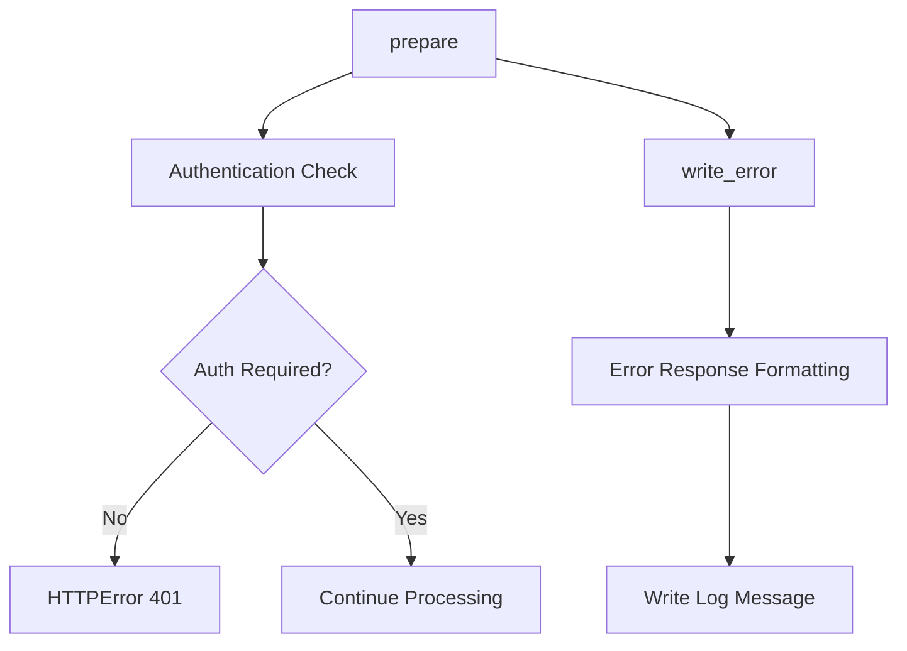

# `__init__.py`

## `flower.api.__init__.BaseApiHandler` · *class*

## Summary:
BaseApiHandler is an abstract base class that provides common API endpoint functionality and authentication enforcement for Flower's web API.

## Description:
This class extends BaseHandler to provide specialized behavior for API endpoints. It enforces authentication requirements for API access and customizes error handling specifically for API requests. The class should be inherited by all API endpoint handlers in the Flower application.

The motivation for this abstraction is to centralize API-specific authentication logic and error handling, ensuring consistent security policies and response formats across all API endpoints while maintaining compatibility with the existing BaseHandler infrastructure.

## State:
- Inherits all attributes from BaseHandler including request, application, and session management
- No additional instance attributes beyond those inherited from BaseHandler
- The authentication check in prepare() depends on:
  - self.application.options.basic_auth (boolean flag)
  - self.application.options.auth (authentication pattern)
  - FLOWER_UNAUTHENTICATED_API environment variable (parsed via strtobool)

## Lifecycle:
- Creation: Instantiated automatically by Tornado framework when handling API requests
- Usage: Tornado framework calls prepare() before request processing and write_error() when exceptions occur
- Destruction: Managed by Tornado's request lifecycle; no explicit cleanup required

## Method Map:


## Raises:
- tornado.web.HTTPError(401): Raised in prepare() when neither basic_auth nor auth options are configured and FLOWER_UNAUTHENTICATED_API is not enabled

## Example:
```python
# Typical usage in API endpoint implementation
class MyApiEndpoint(BaseApiHandler):
    def get(self):
        # API logic here
        self.write({"status": "success"})

# When accessed without proper authentication:
# If FLOWER_UNAUTHENTICATED_API is not set:
#   HTTP 401 Unauthorized response with message
#   "FLOWER_UNAUTHENTICATED_API environment variable is required to enable API without authentication"
```

### `flower.api.__init__.BaseApiHandler.prepare` · *method*

## Summary:
Validates that API access is permitted without authentication by checking environment configuration.

## Description:
This method ensures that API endpoints can only be accessed without authentication when explicitly enabled via the FLOWER_UNAUTHENTICATED_API environment variable. It is called during the request preparation phase to enforce authentication policies before processing API requests.

## Args:
    None

## Returns:
    None

## Raises:
    tornado.web.HTTPError: Raised with status code 401 when API access without authentication is not explicitly enabled, and neither basic_auth nor auth options are configured in the application.

## State Changes:
    Attributes READ: 
        - self.application.options.basic_auth
        - self.application.options.auth
    
    Attributes WRITTEN: 
        - None

## Constraints:
    Preconditions:
        - The method assumes self.application.options exists and has basic_auth and auth attributes
        - Environment variable FLOWER_UNAUTHENTICATED_API must be a valid boolean string representation
        
    Postconditions:
        - If authentication is required and not explicitly enabled, an HTTP 401 error is raised
        - If authentication is not required or is explicitly enabled, the method completes normally

## Side Effects:
    - Raises HTTPError which terminates the request processing with a 401 status code

### `flower.api.__init__.BaseApiHandler.write_error` · *method*

## Summary:
Writes an error response containing the exception's log message and sets the HTTP status code.

## Description:
Handles HTTP error responses by extracting and writing the exception's log message to the response body, then setting the appropriate HTTP status code and finishing the response. This method is typically invoked by the Tornado web framework when an exception occurs during request processing.

## Args:
    status_code (int): The HTTP status code to set for the response
    **kwargs: Additional keyword arguments, including 'exc_info' containing exception information

## Returns:
    None: This method does not return a value

## Raises:
    AttributeError: If exc_info is None or doesn't contain the expected structure
    KeyError: If exc_info[1] doesn't have a 'log_message' attribute

## State Changes:
    Attributes READ: None
    Attributes WRITTEN: None

## Constraints:
    Preconditions: 
    - The method must be called within a Tornado web request context
    - kwargs must contain 'exc_info' key with valid exception information
    - exc_info[1] must have a 'log_message' attribute
    
    Postconditions:
    - The HTTP response status is set to status_code
    - The response body contains the exception's log_message if available
    - The response is completed and sent to the client

## Side Effects:
    - Writes data to the HTTP response body
    - Sets HTTP status code on the response
    - Finishes the HTTP response

