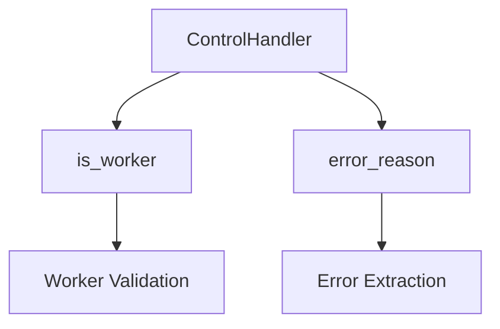
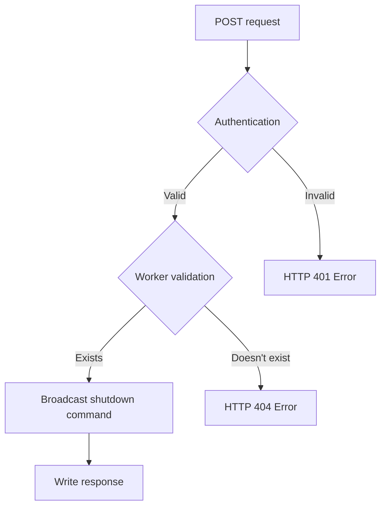
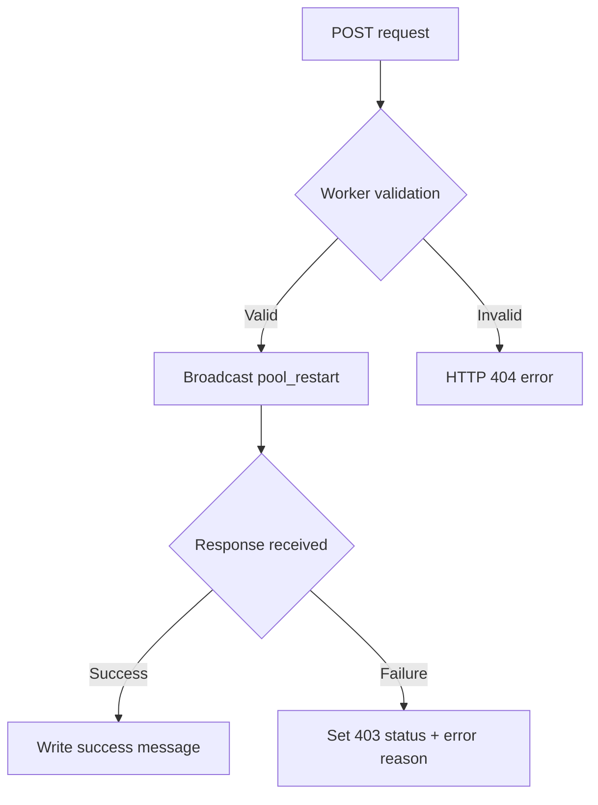
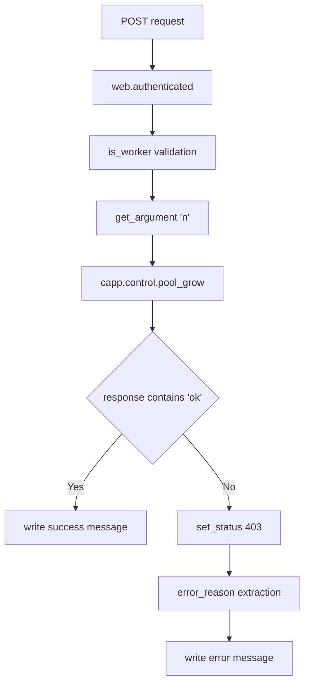

# `control.py`

## `flower.api.control.ControlHandler` · *class*

## Summary:
ControlHandler is an API handler that provides worker validation and error reason extraction utilities for the Flower monitoring interface.

## Description:
This class extends BaseApiHandler to provide helper methods for worker management and error handling within the Flower web application's API layer. It is specifically designed to support API endpoints that need to validate worker identities or extract error information from worker responses. The class leverages the application's worker registry to perform these operations.

## State:
- `self.application.workers`: Attribute containing worker information managed by the application. This is accessed during worker validation operations. The exact structure is determined by the application's worker discovery mechanism.

## Lifecycle:
- Creation: Automatically instantiated by the Tornado web framework when handling API requests that match the handler's route pattern
- Usage: Methods are invoked during API request processing when worker validation or error extraction is required
- Destruction: Managed by the Tornado framework's request lifecycle

## Method Map:


## Raises:
- No explicit exceptions are raised by the constructor (__init__)
- The error_reason method logs errors via the logger but doesn't raise exceptions

## Example:
```python
# Within an API endpoint handler
# Check if a worker exists
if self.is_worker(worker_name):
    # Worker is valid, proceed with operation
    
# Extract error reason from response
error_msg = self.error_reason(worker_name, response_data)
```

### `flower.api.control.ControlHandler.is_worker` · *method*

## Summary:
Checks if a worker name exists in the application's worker registry.

## Description:
Determines whether the specified worker name is registered in the application's workers collection. This method serves as a validation utility to verify worker existence before performing operations on specific workers.

## Args:
    workername (str): The name of the worker to check for existence. May be None or empty string.

## Returns:
    bool: True if workername is not None/empty and exists in self.application.workers, False otherwise.

## Raises:
    None explicitly raised.

## State Changes:
    Attributes READ: self.application.workers
    Attributes WRITTEN: None

## Constraints:
    Preconditions: None required beyond providing a workername argument.
    Postconditions: Returns a boolean indicating worker existence status.

## Side Effects:
    None.

### `flower.api.control.ControlHandler.error_reason` · *method*

## Summary:
Extracts error reason from worker response data, returning a default value when not found.

## Description:
This method iterates through a list of response dictionaries to find and return the error message associated with a specific worker. It handles cases where the worker key is missing or the error field is not present by falling back to a default 'Unknown reason' value. This method is typically called during worker status checking or error reporting operations to provide meaningful error messages to users.

## Args:
    self: Instance of ControlHandler class
    workername (str): Name identifier of the worker whose error reason is being extracted
    response (list[dict]): List of response dictionaries containing worker data, where each dict may contain workername as a key mapping to another dict with 'error' field

## Returns:
    str: Error reason string from the worker response, or 'Unknown reason' if not found

## Raises:
    None explicitly raised, though KeyError exceptions are caught internally when accessing response elements

## State Changes:
    Attributes READ: None
    Attributes WRITTEN: None

## Constraints:
    Preconditions: 
    - workername must be a string
    - response must be iterable and contain dictionaries
    - Each dictionary in response should potentially contain workername as a key mapping to a dict with an 'error' key
    
    Postconditions:
    - Returns a string value (either error message or default 'Unknown reason')
    - Method does not modify any instance state

## Side Effects:
    I/O: Writes error message to application logger when unable to extract error reason from response structure

## Usage Example:
    # Typical usage in error handling context
    error_msg = handler.error_reason(worker_name, response_list)
    # Returns actual error message or 'Unknown reason' if not found

## `flower.api.control.WorkerShutDown` · *class*

## Summary:
A web handler that manages worker shutdown requests through the Flower API.

## Description:
This class implements a POST endpoint for shutting down specific Celery workers via the Flower monitoring interface. It serves as part of the control API that allows administrators to remotely manage worker processes. The handler authenticates requests using the @web.authenticated decorator and validates that the requested worker exists before attempting to shut it down.

## State:
- workername (str): The identifier of the worker to be shut down, passed as a URL parameter
- self.application.workers: A collection containing registered worker information, used to validate worker existence
- self.capp: A property that provides access to the Celery application instance for broadcasting control commands

## Lifecycle:
- Creation: Automatically instantiated by the Tornado web framework when handling HTTP requests to the appropriate endpoint
- Usage: Called via HTTP POST requests to the '/worker/shutdown/{workername}' endpoint
- Destruction: Managed automatically by the Tornado framework; no explicit cleanup required

## Method Map:


## Raises:
- tornado.web.HTTPError(404): When the specified worker name does not exist in self.application.workers
- tornado.web.HTTPError(401): When authentication fails (handled by @web.authenticated decorator)

## Example:
```python
# Send POST request to: /worker/shutdown/myworker
# Response: {"message": "Shutting down!"}

# If worker doesn't exist:
# Response: HTTP 404 error with message "Unknown worker 'myworker'"
```

### `flower.api.control.WorkerShutDown.post` · *method*

## Summary:
Initiates shutdown of a specified worker node in the distributed task queue system.

## Description:
Handles HTTP POST requests to shut down a specific worker node by broadcasting a shutdown command to that worker. This method serves as the endpoint for worker termination operations in the Flower monitoring interface.

## Args:
    workername (str): Name identifier of the target worker node to shut down

## Returns:
    None: This method doesn't return a value directly, but writes an HTTP response

## Raises:
    tornado.web.HTTPError: Raised with status code 404 when the specified worker does not exist

## State Changes:
    Attributes READ: 
        - self.is_worker: Method used to validate worker existence
        - self.capp: Application instance containing control interface
    Attributes WRITTEN:
        - self.write: Method used to send HTTP response

## Constraints:
    Preconditions:
        - The worker identified by workername must exist in the system
        - The method must be called on an instance of a class that implements the required attributes (is_worker, capp)
    Postconditions:
        - A shutdown command is broadcast to the specified worker
        - An HTTP 200 OK response is sent to the client with a confirmation message

## Side Effects:
    - Writes log entry to INFO level indicating worker shutdown initiation
    - Broadcasts shutdown command to the specified worker node via Celery control interface
    - Sends HTTP response back to client requesting the shutdown operation

## `flower.api.control.WorkerPoolRestart` · *class*

## Summary:
A Tornado web handler that restarts a specific worker's process pool through the Celery control interface.

## Description:
This class implements a POST endpoint for restarting a worker's process pool in a Celery-based distributed task queue system. It serves as part of Flower's web API for managing Celery workers. The handler validates that the specified worker exists, sends a broadcast command to restart the worker's pool, and returns appropriate HTTP responses based on the outcome.

## State:
- Inherits from ControlHandler, which provides authentication and worker validation utilities
- Uses self.capp.control.broadcast to communicate with Celery workers
- Accesses self.application.workers for worker validation
- Uses logger for informational and error logging

## Lifecycle:
- Creation: Tornado framework instantiates this handler when a matching POST request is received
- Usage: The post() method is invoked automatically by Tornado when a request matches the route; handles authentication via @web.authenticated decorator
- Destruction: Managed by Tornado framework; no explicit cleanup required

## Method Map:


## Raises:
- web.HTTPError(404): When the specified workername is not found in self.application.workers
- web.HTTPError(403): When the pool restart operation fails (handled internally)

## Example:
```python
# Typical usage via HTTP POST request
# POST /api/workers/pool/restart/myworker
# Response on success:
# {"message": "Restarting 'myworker' worker's pool"}

# Response on failure:
# Failed to restart the 'myworker' pool: <error reason>
```

### `flower.api.control.WorkerPoolRestart.post` · *method*

## Summary:
Restarts the task pool of a specified worker process and returns the operation status.

## Description:
This method handles POST requests to restart a Celery worker's task pool. It validates the worker exists, sends a broadcast command to restart the worker's pool, and responds with either success or failure information. The method is decorated with `@web.authenticated`, indicating authentication is required.

## Args:
    workername (str): The name/id of the worker whose task pool should be restarted

## Returns:
    None: This method writes directly to the HTTP response rather than returning a value

## Raises:
    tornado.web.HTTPError: Raised with status 404 when the specified worker does not exist
    tornado.web.HTTPError: Raised with status 403 when the restart operation fails

## State Changes:
    Attributes READ: 
    - self.application.workers (via self.is_worker)
    - self.capp (via self.capp.control.broadcast)
    
    Attributes WRITTEN:
    - HTTP response via self.write() and self.set_status()

## Constraints:
    Preconditions:
    - The worker identified by workername must exist in self.application.workers
    - Authentication must be successful (decorated with @web.authenticated)
    
    Postconditions:
    - On successful restart initiation: HTTP 200 response with JSON message indicating restart started
    - On restart failure: HTTP 403 response with error details explaining the failure

## Side Effects:
    - Makes a broadcast call to the Celery worker via self.capp.control.broadcast
    - Writes to HTTP response stream
    - Logs informational and error messages using logger

## `flower.api.control.WorkerPoolGrow` · *class*

## Summary:
Handles HTTP POST requests to dynamically increase the size of a Celery worker pool.

## Description:
This class implements a REST endpoint for scaling up Celery worker processes by increasing their pool size. It serves as part of Flower's web API for managing Celery clusters. The handler requires authentication and validates that the specified worker exists before attempting to grow its pool.

## State:
- `workername` (str): The identifier of the target worker process to scale
- `n` (int): Number of additional worker processes to add to the pool (default: 1)
- Inherits state from `ControlHandler` including `self.capp` (Celery app instance) and `self.application.workers` (worker registry)

## Lifecycle:
- Usage: Handles HTTP POST requests with workername parameter; performs authentication, validation, and executes pool growth operation
- Destruction: Managed by Tornado framework; no explicit cleanup required

## Method Map:


## Raises:
- `tornado.web.HTTPError(404)`: When the specified workername is not found in the worker registry
- `tornado.web.HTTPError(403)`: When the pool growth operation fails on the worker

## Example:
```python
# POST /api/worker/pool/grow/myworker?n=3
# Response on success:
# {"message": "Growing 'myworker' worker's pool by 3"}

# POST /api/worker/pool/grow/nonexistent
# Response on failure:
# HTTP 404: "Unknown worker 'nonexistent'"
```

### `flower.api.control.WorkerPoolGrow.post` · *method*

## Summary:
Increases the size of a specified worker's processing pool by a given number of slots.

## Description:
This method handles HTTP POST requests to expand a Celery worker's pool size. It validates the worker exists, retrieves the number of slots to add (defaulting to 1), and communicates with the Celery control interface to grow the worker's pool. The method provides appropriate HTTP responses based on success or failure of the operation.

## Args:
    workername (str): The identifier of the worker whose pool needs to be grown

## Returns:
    None: This method writes directly to the HTTP response rather than returning a value

## Raises:
    web.HTTPError: Raised with status code 404 when the specified worker does not exist

## State Changes:
    Attributes READ: 
        - self.is_worker (method call)
        - self.get_argument (method call)
        - self.capp (attribute access)
        - self.error_reason (method call)
    Attributes WRITTEN:
        - self.write (method call)
        - self.set_status (method call)

## Constraints:
    Preconditions:
        - The worker identified by workername must exist in the system
        - The 'n' parameter (number of slots to add) must be a positive integer
    Postconditions:
        - If successful, the worker's pool size is increased by n slots
        - If failed, appropriate HTTP error status is set

## Side Effects:
    - Makes a remote procedure call to the Celery control interface via self.capp.control.pool_grow()
    - Writes HTTP response data to the client
    - Logs informational and error messages to the application log

## `flower.api.control.WorkerPoolShrink` · *class*

*No documentation generated.*

### `flower.api.control.WorkerPoolShrink.post` · *method*

## Summary:
Reduces the size of a specified worker's process pool by a given number of processes.

## Description:
This method handles HTTP POST requests to shrink a Celery worker's process pool. It validates the worker exists, retrieves the shrink count parameter, and communicates with the Celery control interface to reduce the worker pool size. The method provides appropriate HTTP responses based on success or failure of the operation.

## Args:
    workername (str): The name of the worker whose process pool should be shrunk.

## Returns:
    None: This method writes directly to the HTTP response rather than returning a value.

## Raises:
    web.HTTPError: Raised with status code 404 when the specified worker does not exist.

## State Changes:
    Attributes READ: 
        - self.is_worker: Used to validate worker existence
        - self.get_argument: Used to retrieve the 'n' parameter
        - self.capp: Used to access the Celery application control interface
        - self.error_reason: Used to generate error messages
    Attributes WRITTEN:
        - self.write: Used to send HTTP response content
        - self.set_status: Used to set HTTP status code

## Constraints:
    Preconditions:
        - The worker identified by workername must exist in the system
        - The 'n' parameter must be a positive integer (defaults to 1 if not provided)
    Postconditions:
        - If successful, the worker's process pool will be reduced by n processes
        - If failed, appropriate HTTP status code (403) and error message will be returned

## Side Effects:
    - Makes a call to the Celery control interface via self.capp.control.pool_shrink()
    - Writes HTTP response content using self.write()
    - Sets HTTP status code using self.set_status()
    - Logs informational and error messages using the logger

## `flower.api.control.WorkerPoolAutoscale` · *class*

## Summary:
A Tornado web handler that manages autoscaling of Celery worker processes by broadcasting autoscale commands to specific workers.

## Description:
This class implements a REST endpoint for controlling the scaling of Celery worker pools. It accepts POST requests with minimum and maximum worker count parameters and broadcasts autoscale commands to designated workers. The handler ensures proper authentication, validates worker existence, and handles both successful and failed autoscaling operations.

## State:
- Inherits from ControlHandler which provides worker validation and error handling capabilities
- Uses self.capp.control.broadcast to communicate with Celery workers
- Accesses self.application.workers for worker validation
- Uses logger for informational and error logging

## Lifecycle:
- Creation: Instantiated automatically by Tornado web framework when handling requests
- Usage: Handles POST requests with workername parameter, processes 'min' and 'max' arguments, broadcasts autoscale command
- Destruction: Managed by Tornado framework lifecycle

## Method Map:
```mermaid
graph TD
    A[post(workername)] --> B{is_worker(workername)}
    B -- False --> C[HTTPError(404)]
    B -- True --> D[get_argument(min)]
    D --> E[get_argument(max)]
    E --> F[broadcast('autoscale')]
    F --> G{response contains 'ok'}
    G -- True --> H[write(success message)]
    G -- False --> I[set_status(403)]
    I --> J[error_reason()]
    J --> K[write(error message)]
```

## Raises:
- web.HTTPError(404): When the specified workername is not found in application workers
- web.HTTPError(400): When invalid argument types are provided for 'min' or 'max'
- web.HTTPError(403): When autoscaling operation fails on the worker

## Example:
```python
# POST /worker/worker1/autoscale?min=2&max=10
# Response on success:
# {"message": "Autoscaling 'worker1' worker (min=2, max=10)"}

# POST /worker/worker1/autoscale?min=invalid&max=10  
# Response on invalid argument:
# HTTP 400: Invalid argument 'invalid' of type 'int'
```

### `flower.api.control.WorkerPoolAutoscale.post` · *method*

## Summary:
Configures autoscaling parameters for a specified Celery worker process.

## Description:
Handles HTTP POST requests to dynamically adjust the minimum and maximum worker pool sizes for a target Celery worker. This method validates worker existence, extracts autoscaling parameters ('min' and 'max') from request arguments, and broadcasts the autoscale command to the specified worker. It's part of the Flower monitoring interface for managing distributed Celery worker pools.

## Args:
    workername (str): Unique identifier of the target Celery worker process to configure.

## Returns:
    None: This method directly writes HTTP response data and does not return a value.

## Raises:
    web.HTTPError: Raised with status code 404 when the specified worker does not exist.

## State Changes:
    Attributes READ:
    - self.is_worker: Validates worker existence
    - self.get_argument: Extracts 'min' and 'max' integer parameters from request
    - self.capp: Provides access to Celery application control interface for broadcasting
    - self.error_reason: Generates error messages for failed operations
    
    Attributes WRITTEN:
    - self.write: Sends HTTP response to client (success or error message)
    - self.set_status: Sets HTTP status code (403 on failure)

## Constraints:
    Preconditions:
    - The worker identified by workername must exist in the system (validated by self.is_worker)
    - Request must contain 'min' and 'max' integer parameters
    - The capp attribute must reference a valid Celery application instance
    - The method must be called within a Tornado web handler context
    
    Postconditions:
    - On successful configuration, HTTP 200 response with success message is sent
    - On failure due to worker communication issues, HTTP 403 response with error message is sent

## Side Effects:
    - Invokes Celery's broadcast control mechanism to send autoscale command to specific worker
    - Writes HTTP response data to client connection
    - Logs informational messages at INFO level and errors at ERROR level

## `flower.api.control.WorkerQueueAddConsumer` · *class*

## Summary:
Adds a queue consumer to a specified worker through the Flower API control interface.

## Description:
This class implements a POST endpoint that allows adding a queue consumer to a specific Celery worker. It serves as part of the Flower monitoring dashboard's control API, enabling dynamic management of worker queue consumption. The handler authenticates requests, validates the target worker exists, and broadcasts an 'add_consumer' command to the worker via Celery's control interface.

## State:
- Inherits from ControlHandler, which provides worker validation and error handling utilities
- Uses self.capp.control.broadcast() to communicate with Celery workers
- Accesses self.application.workers for worker validation
- Uses self.get_argument('queue') to retrieve the target queue name
- Uses logger for informational and error logging

## Lifecycle:
- Creation: Instantiated automatically by Tornado routing system
- Usage: Handles POST requests to '/worker/queue/add/{workername}' endpoint
- Requires: Authentication via @web.authenticated decorator
- Destruction: Managed by Tornado framework lifecycle

## Method Map:
```mermaid
graph TD
    A[POST /worker/queue/add/{workername}] --> B{Authenticate}
    B --> C{Validate Worker}
    C --> D[Get Queue Argument]
    D --> E[Broadcast add_consumer Command]
    E --> F{Response Check}
    F -->|Success| G[Write OK Message]
    F -->|Failure| H[Write Error Message]
```

## Raises:
- web.HTTPError(404): When the specified worker does not exist
- web.HTTPError(403): When the add_consumer command fails on the worker

## Example:
```python
# Client request:
# POST /worker/queue/add/worker1?queue=my_queue
# Response on success:
# {"message": "Added consumer 'my_queue' to worker 'worker1'"}

# Response on failure:
# HTTP 403 Forbidden with error message about why the operation failed
```

### `flower.api.control.WorkerQueueAddConsumer.post` · *method*

## Summary:
Adds a queue consumer to a specified worker process.

## Description:
Handles POST requests to bind a queue to a worker process. Validates the worker exists, sends a broadcast command to add the consumer, and returns appropriate HTTP responses based on success or failure of the operation. This method is typically called during worker management operations when configuring queue consumption in a Celery-based distributed system.

## Args:
    workername (str): The name of the worker to add the queue consumer to.

## Returns:
    None: This method writes directly to the HTTP response rather than returning a value.

## Raises:
    web.HTTPError: Raised with status 404 when the specified worker does not exist.

## State Changes:
    Attributes READ:
    - self.capp: Used to access the Celery application control interface for broadcasting commands
    - self.get_argument: Used to extract the 'queue' parameter from the HTTP request
    - logger: Used for logging informational and error messages
    
    Attributes WRITTEN:
    - HTTP response: Through self.write() and self.set_status() calls

## Constraints:
    Preconditions:
    - The workername parameter must correspond to an existing worker in the system
    - The request must include a 'queue' argument
    - The worker must be able to accept the consumer addition command
    
    Postconditions:
    - On successful operation, the worker will have the queue consumer added and a success message returned
    - On failure, appropriate HTTP status codes (403) and error messages are returned

## Side Effects:
    - Makes a broadcast call to the Celery application control interface via self.capp.control.broadcast()
    - Writes HTTP response data to the client through self.write()
    - Sets HTTP status codes through self.set_status()
    - Logs informational and error messages to the application logger

## `flower.api.control.WorkerQueueCancelConsumer` · *class*

## Summary:
A Tornado web handler that cancels a consumer queue from a specific Celery worker.

## Description:
This class implements a POST endpoint that cancels a consumer queue from a designated worker by broadcasting a cancel_consumer command. It validates the worker exists, extracts the queue parameter from the request, and communicates with the worker to cancel the consumer. This handler is part of the Flower monitoring interface for Celery workers.

## State:
- Inherits from ControlHandler which provides authentication and worker validation capabilities
- Uses self.capp.control.broadcast to communicate with Celery workers
- Accesses self.application.workers for worker validation through inherited is_worker method
- Uses self.get_argument('queue') to extract the queue parameter from request
- Uses self.write() and self.set_status() for HTTP response handling
- Uses self.error_reason() method inherited from ControlHandler for error extraction

## Lifecycle:
- Creation: Automatically instantiated by the Tornado web framework when handling matching HTTP requests
- Usage: Processes POST requests containing worker name and queue parameters to cancel consumer queues
- Destruction: Managed automatically by the Tornado framework

## Method Map:
```mermaid
graph TD
    A[POST request with workername and queue] --> B[WorkerQueueCancelConsumer.post]
    B --> C{Worker validation via is_worker()}
    C -->|Invalid worker| D[raise web.HTTPError(404)]
    C -->|Valid worker| E[Get queue argument via get_argument('queue')]
    E --> F[Broadcast cancel_consumer command via capp.control.broadcast]
    F --> G{Response received}
    G -->|Success| H[Write success message with ok field]
    G -->|Failure| I[Set 403 status + error reason via error_reason()]
```

## Raises:
- web.HTTPError(404): When the specified worker name is not found in application workers
- web.HTTPError(403): When the cancel operation fails on the worker side

## Example:
```python
# Typical usage via HTTP POST:
# POST /api/worker/queue/cancel/worker1?queue=my_queue

# Successful response:
# {"message": "Consumer 'my_queue' canceled"}

# Error response:
# Failed to cancel 'my_queue' consumer from 'worker1' worker: Unknown reason
```

### `flower.api.control.WorkerQueueCancelConsumer.post` · *method*

## Summary:
Cancels a consumer queue from a specified worker by broadcasting a cancellation command.

## Description:
This method handles POST requests to cancel a consumer queue from a specific worker in a Celery-based distributed task queue system. It validates the worker exists, retrieves the target queue from request arguments, and broadcasts a cancel_consumer command to that worker. The method processes the response and returns appropriate HTTP status codes and messages based on success or failure.

This method is typically invoked during the control plane operations of a Flower monitoring service to manage worker consumer queues dynamically.

## Args:
    workername (str): The name of the worker from which to cancel the consumer queue.

## Returns:
    None: This method does not return a value but writes HTTP response data directly via self.write() and sets HTTP status codes via self.set_status().

## Raises:
    web.HTTPError: Raised with status code 404 when the specified worker does not exist.

## State Changes:
    Attributes READ: 
        - self.is_worker: Used to validate worker existence
        - self.get_argument: Used to extract 'queue' parameter from request
        - self.capp: Used to access the Celery app's control interface
        - self.error_reason: Used to generate error messages
    Attributes WRITTEN:
        - self.write: Used to send response data back to client
        - self.set_status: Used to set HTTP status codes

## Constraints:
    Preconditions:
        - The worker identified by workername must exist in the system
        - A 'queue' argument must be present in the request
        - The capp attribute must be properly initialized with a Celery app instance
    Postconditions:
        - On successful cancellation, HTTP 200 status with success message is returned
        - On failure due to communication issues or worker rejection, HTTP 403 status with error details is returned

## Side Effects:
    - Makes a broadcast call to the Celery worker(s) to cancel a consumer
    - Writes HTTP response data to the client
    - Logs informational and error messages to the application logger

## `flower.api.control.TaskRevoke` · *class*

## Summary:
A Tornado web handler for revoking Celery tasks via HTTP POST requests, restricted to tasks managed by available workers.

## Description:
Handles HTTP POST requests to revoke running Celery tasks through the Flower monitoring interface. This handler requires that the target task be managed by workers currently registered with the application. It provides an authenticated endpoint for task cancellation with optional termination and signal parameters, integrating with the Celery control interface for actual task management operations.

## State:
- taskid (str): The identifier of the task to be revoked, passed as a URL parameter
- terminate (bool): Optional flag indicating whether to forcefully terminate the task, defaults to False
- signal (str): Optional signal name to send for task termination, defaults to 'SIGTERM'
- capp: Celery app instance with control interface for task management operations
- logger: Logging instance for tracking task revocation operations

## Lifecycle:
- Creation: Instantiated automatically by Tornado web framework when handling matching HTTP requests
- Usage: Called via HTTP POST to endpoint with task ID parameter, followed by optional arguments
- Destruction: Managed by Tornado framework lifecycle, no explicit cleanup required

## Method Map:
```mermaid
graph TD
    A[POST Request] --> B[TaskRevoke.post]
    B --> C[get_argument(terminate)]
    B --> D[get_argument(signal)]
    B --> E[capp.control.revoke()]
    E --> F[write(message)]
```

## Raises:
- tornado.web.HTTPError: When authentication fails (due to @web.authenticated decorator)
- Any exceptions raised by capp.control.revoke() method during task revocation
- Potentially HTTPError if task cannot be revoked due to worker constraints

## Example:
```python
# Typical usage via HTTP POST request:
# POST /task/revoke/<task_id>?terminate=True&signal=SIGKILL
# Response: {"message": "Revoked '<task_id>'"}

# In code, instantiation is handled by Tornado framework:
handler = TaskRevoke(application, request)
```

### `flower.api.control.TaskRevoke.post` · *method*

## Summary:
Revokes a running task by sending a termination signal to the worker executing it.

## Description:
This method handles POST requests to revoke a specific task identified by its task ID. It allows specifying whether to forcefully terminate the task and what signal to send. The method integrates with Celery's control interface to communicate with workers and cancel the task execution.

## Args:
    taskid (str): The unique identifier of the task to be revoked

## Returns:
    None: This method does not return a value directly, but writes a JSON response

## Raises:
    None explicitly raised: The method relies on underlying Celery infrastructure for error handling

## State Changes:
    Attributes READ: 
        - self.capp: The Celery application instance containing control interface
        - self.application.workers: Used indirectly through parent class methods
    
    Attributes WRITTEN: 
        - None directly modified

## Constraints:
    Preconditions:
        - The task with the specified taskid must exist and be currently running
        - The user must be authenticated (inherited from @web.authenticated decorator)
        - The task must be managed by workers accessible through self.application.workers
    
    Postconditions:
        - The task revocation command is sent to the appropriate worker(s)
        - A success message is returned in the HTTP response

## Side Effects:
    - Makes a call to Celery's control.revoke() method which communicates with workers
    - Writes HTTP response data to the client
    - Logs information about the revocation operation

## `flower.api.control.TaskTimout` · *class*

## Summary:
Sets timeout configurations for Celery tasks via HTTP POST requests.

## Description:
The TaskTimout class is a Tornado web handler responsible for configuring timeout settings (both hard and soft limits) for Celery tasks through an HTTP API endpoint. It provides authenticated access to modify task timeout parameters for specific tasks or task-worker combinations. This class serves as part of Flower's web interface for managing Celery task execution timeouts.

## State:
- Inherits from ControlHandler which provides authentication and worker validation capabilities
- Uses self.capp to access the Celery application instance for timeout configuration
- Accesses self.application.workers for worker validation through self.is_worker()
- Uses logger for informational and error logging

## Lifecycle:
- Creation: Automatically instantiated by Tornado framework when handling HTTP requests to the appropriate endpoint
- Usage: Handles POST requests with taskname parameter and optional workername, hard, and soft timeout values
- Destruction: Managed automatically by Tornado framework lifecycle

## Method Map:
```mermaid
graph TD
    A[POST /task/timeout/{taskname}] --> B[web.authenticated]
    B --> C[get_argument(workername)]
    C --> D[get_argument(hard)]
    D --> E[get_argument(soft)]
    E --> F[Validate task exists]
    F --> G{taskname in self.capp.tasks?}
    G -->|No| H[raise HTTPError(404)]
    H --> I[Validate worker exists]
    I --> J{workername specified?}
    J -->|Yes| K[is_worker(workername)?]
    K -->|No| L[raise HTTPError(404)]
    L --> M[Set timeout via capp.control.time_limit]
    M --> N[Process response]
    N --> O{response contains 'ok'?}
    O -->|Yes| P[Write success message]
    P --> Q[End]
    O -->|No| R[Write error message]
    R --> S[Set 403 status]
    S --> Q
```

## Raises:
- tornado.web.HTTPError(404): When the specified taskname is not found in self.capp.tasks
- tornado.web.HTTPError(404): When workername is specified but the worker is not found in self.application.workers
- tornado.web.HTTPError(400): When invalid argument types are provided (e.g., non-float values for hard/soft parameters)

## Example:
```python
# Set soft timeout for 'my_task' to 30 seconds
curl -X POST "/task/timeout/my_task?soft=30.0"

# Set both hard and soft timeouts for 'my_task' on specific worker
curl -X POST "/task/timeout/my_task?workername=worker1&hard=60.0&soft=30.0"

# Response on success:
{"message": "Timeout set successfully"}

# Response on failure:
"Failed to set timeouts: 'Unknown reason'"
```

### `flower.api.control.TaskTimout.post` · *method*

## Summary:
Configures timeout limits for a specified Celery task, optionally targeting a specific worker.

## Description:
This method handles HTTP POST requests to set timeout parameters (hard and soft) for Celery tasks. It serves as an API endpoint for managing task execution timeouts within a Flower monitoring system. The method validates that the specified task exists and, if a worker is specified, that it's a valid worker before applying the timeout configuration through the Celery control interface.

## Args:
    taskname (str): Name of the Celery task to configure timeouts for
    workername (str, optional): Specific worker to target; if None, applies to all workers
    hard (float, optional): Hard timeout value in seconds; if None, uses existing setting
    soft (float, optional): Soft timeout value in seconds; if None, uses existing setting

## Returns:
    HTTP response containing either success message or error details

## Raises:
    web.HTTPError: Raised with status 404 when the specified task or worker doesn't exist
    web.HTTPError: Raised with status 403 when timeout configuration fails

## State Changes:
    Attributes READ: self.capp, self.capp.tasks, self.is_worker
    Attributes WRITTEN: None directly modified; response written via self.write() and self.set_status()

## Constraints:
    Preconditions: 
    - taskname must exist in self.capp.tasks
    - workername (if provided) must be a valid worker according to self.is_worker()
    Postconditions:
    - Timeout configuration is applied to the specified task and worker(s) via Celery control interface
    - Appropriate HTTP status codes are returned (200 for success, 403 for failure)

## Side Effects:
    - Makes a call to self.capp.control.time_limit() which communicates with Celery workers
    - Writes HTTP response data via self.write() and self.set_status()
    - Logs informational messages via logger.info() and error messages via logger.error()

## `flower.api.control.TaskRateLimit` · *class*

## Summary:
A Tornado web handler that sets rate limits for Celery tasks through the Flower monitoring interface, requiring authentication.

## Description:
This class implements a REST endpoint for configuring rate limits on Celery tasks within the Flower monitoring tool. It provides authenticated access to modify task execution rates, allowing administrators to control how frequently specific tasks can run either globally or for specific workers. The handler integrates with Celery's control interface to apply rate limit changes.

The class is designed to be used as part of Flower's web API interface for managing Celery task execution characteristics. It requires authentication via the @web.authenticated decorator and follows Flower's control handler pattern.

## State:
- `capp`: Celery application instance accessed via property from the base class
- `application`: Tornado application instance containing configuration and workers
- `workers`: Dictionary of registered workers maintained by the application
- `options`: Application configuration options

## Lifecycle:
- Creation: Instantiated automatically by Tornado framework when handling HTTP requests
- Usage: Called via HTTP POST requests to the rate limit endpoint with taskname parameter
- Destruction: Managed automatically by Tornado framework

## Method Map:
```mermaid
graph TD
    A[POST /api/task/rate-limit/{taskname}] --> B[TaskRateLimit.post]
    B --> C[Get workername and ratelimit arguments]
    C --> D{Validate task exists}
    D -->|No| E[HTTPError 404]
    D -->|Yes| F{Validate worker}
    F -->|No| G[HTTPError 404]
    F -->|Yes| H[Call capp.control.rate_limit]
    H --> I{Response contains 'ok'}
    I -->|Yes| J[Write success message]
    I -->|No| K[Write error message with 403 status]
```

## Raises:
- `tornado.web.HTTPError(404)`: When the specified task name doesn't exist in the application's task registry
- `tornado.web.HTTPError(404)`: When a worker name is provided but doesn't correspond to a known worker
- `tornado.web.HTTPError(403)`: When rate limit setting fails due to permission issues or invalid configuration

## Example:
```python
# Set global rate limit for a task
POST /api/task/rate-limit/send_email?ratelimit=10/s

# Set rate limit for a specific worker
POST /api/task/rate-limit/send_email?workername=worker1&ratelimit=5/s

# Response on success:
{"message": "Rate limit set to 10/s for send_email"}

# Response on failure:
Failed to set rate limit: 'Unknown reason'
```

### `flower.api.control.TaskRateLimit.post` · *method*

## Summary:
Sets the rate limit for a specified Celery task, optionally targeting a specific worker.

## Description:
This method handles POST requests to configure rate limits for Celery tasks. It validates the existence of the task and optional worker, then communicates with the Celery control interface to apply the rate limit configuration. The method operates within a Tornado web handler framework and provides appropriate HTTP responses based on success or failure conditions.

## Args:
    taskname (str): Name of the Celery task to configure rate limiting for

## Returns:
    None: This method writes directly to the HTTP response rather than returning a value

## Raises:
    web.HTTPError: Raised with status code 404 when the specified task or worker does not exist

## State Changes:
    Attributes READ: 
        - self.capp (accessed via self.capp.tasks, self.capp.control)
        - self.is_worker (method call)
        - self.error_reason (method call)
    Attributes WRITTEN: 
        - self.write (response writing)
        - self.set_status (HTTP status code setting)

## Constraints:
    Preconditions:
        - The task specified by taskname must exist in self.capp.tasks
        - If workername is provided, it must be a valid worker as determined by self.is_worker()
        - The ratelimit argument must be provided in the request
    Postconditions:
        - HTTP response is written with either success message or error details
        - HTTP status code is set appropriately (200 for success, 403 for failure)

## Side Effects:
    - Writes to HTTP response stream via self.write()
    - Sets HTTP status code via self.set_status()
    - Logs informational messages via logger.info()
    - Logs error messages via logger.error()
    - Makes a call to self.capp.control.rate_limit() which likely communicates with Celery workers

