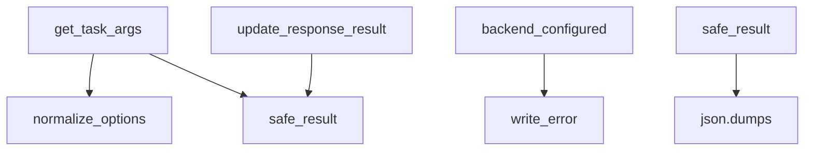
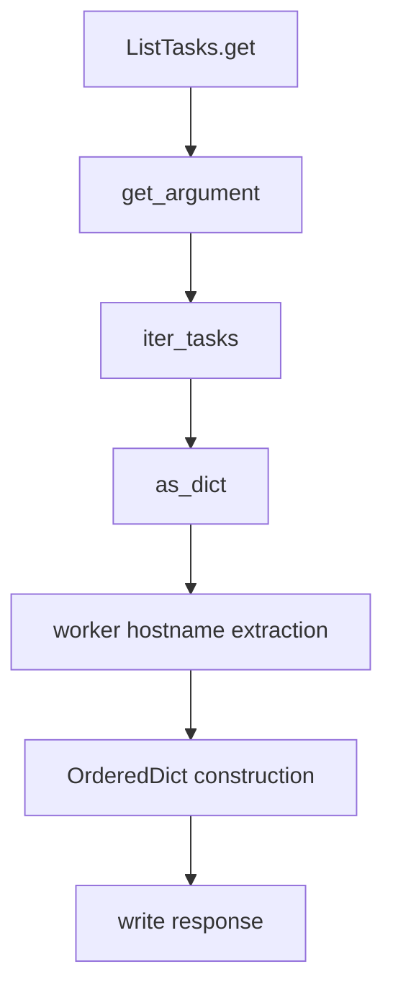

# `tasks.py`

## `flower.api.tasks.BaseTaskHandler` · *class*

## Summary:
BaseTaskHandler is an abstract base class that provides common functionality for handling Celery task operations in a web API context, including argument parsing, result processing, and option normalization.

## Description:
This class serves as a foundation for implementing API handlers that interact with Celery tasks. It provides utility methods for parsing task arguments from HTTP requests, normalizing task options, safely handling task results, and managing error responses. The class is designed to be inherited by concrete implementations that handle specific task-related endpoints.

## State:
- DATE_FORMAT (str): Class constant defining the date format string used for parsing datetime values in task options ('%Y-%m-%d %H:%M:%S.%f')
- Inherits from BaseApiHandler: Provides web request/response handling capabilities including self.request, self.set_status(), and other HTTP handling methods

## Lifecycle:
- Creation: Instantiated as part of inheritance hierarchy; requires no special construction parameters
- Usage: Typically used by subclasses that implement specific task endpoints
- Destruction: Managed by the web framework's lifecycle; no explicit cleanup required

## Method Map:


## Raises:
- HTTPError(400): Raised in get_task_args when JSON parsing fails or when arguments are invalid
- HTTPError(400): Raised in get_task_args when options are not a dictionary or args are not an array

## Example:
```python
# Typical usage pattern in subclass
class MyTaskHandler(BaseTaskHandler):
    async def post(self):
        args, kwargs, options = self.get_task_args()
        self.normalize_options(options)
        # Process task with args, kwargs, and options
        result = my_celery_task.delay(*args, **kwargs, **options)
        response = {'task_id': result.id}
        self.update_response_result(response, result)
        self.write(response)
```

### `flower.api.tasks.BaseTaskHandler.get_task_args` · *method*

## Summary:
Extracts task arguments, keyword arguments, and additional options from a JSON request body.

## Description:
Parses the request body as JSON and extracts task execution parameters including positional arguments, keyword arguments, and additional configuration options. This method serves as a common utility for handling task submission requests in the Flower API.

## Args:
    self: The BaseTaskHandler instance containing the request data.

## Returns:
    tuple[list, dict, dict]: A tuple containing:
        - args (list): Positional arguments for the task
        - kwargs (dict): Keyword arguments for the task  
        - options (dict): Additional configuration options not related to arguments

## Raises:
    HTTPError: Raised with status code 400 when:
        - JSON parsing fails due to malformed request body
        - The parsed JSON is not a dictionary
        - The 'args' field is not a list or tuple

## State Changes:
    Attributes READ: 
        - self.request.body: Raw request body content
    Attributes WRITTEN: None

## Constraints:
    Preconditions:
        - The request body must be valid JSON or empty
        - The parsed JSON must be a dictionary-like object
        - The 'args' field must be a list or tuple type
    Postconditions:
        - Returns a tuple with exactly three elements: [args, kwargs, options]
        - The returned args and kwargs are extracted from the original options dictionary
        - The options dictionary contains all remaining key-value pairs after extracting args and kwargs

## Side Effects:
    None

### `flower.api.tasks.BaseTaskHandler.backend_configured` · *method*

## Summary:
Checks whether a Celery task result has a configured backend for storing task metadata.

## Description:
Determines if a Celery task result object has a backend configured for storing task state and results. This is used to verify that task results can be properly tracked and retrieved from a storage backend.

## Args:
    result (AsyncResult): A Celery AsyncResult object representing a task execution

## Returns:
    bool: True if the result has a configured backend (not DisabledBackend), False if the backend is disabled

## Raises:
    None

## State Changes:
    None

## Constraints:
    Preconditions:
        - The result parameter must be a valid Celery AsyncResult object
        - The result.backend attribute must be accessible
    
    Postconditions:
        - Returns a boolean indicating backend configuration status
        - Does not modify the input result object

## Side Effects:
    None

### `flower.api.tasks.BaseTaskHandler.write_error` · *method*

## Summary:
Sets the HTTP status code for the response without writing error content.

## Description:
Overrides the parent class's write_error method to provide a minimal implementation that only sets the HTTP status code. This method is called by the Tornado web framework when an error occurs during request processing, allowing subclasses to customize error responses.

## Args:
    status_code (int): The HTTP status code to set for the response
    **kwargs: Additional keyword arguments passed by the Tornado framework

## Returns:
    None: This method does not return a value

## Raises:
    None: This method does not explicitly raise exceptions

## State Changes:
    Attributes READ: None
    Attributes WRITTEN: None

## Constraints:
    Preconditions: The method should only be called by the Tornado framework during error handling
    Postconditions: The response's HTTP status code will be set to the provided status_code

## Side Effects:
    I/O: Calls self.set_status() which writes the HTTP status header to the response
    External service calls: None
    Mutations to objects outside self: None

### `flower.api.tasks.BaseTaskHandler.update_response_result` · *method*

*No documentation generated.*

### `flower.api.tasks.BaseTaskHandler.normalize_options` · *method*

## Summary:
Converts string representations of dates and numeric values in task options to appropriate Python types for processing.

## Description:
Processes a dictionary of task options to normalize date and numeric values. This method transforms string representations of ETA (estimated time of arrival), countdown, and expiration times into proper Python datetime or float objects. It's designed to handle various input formats for these time-related parameters and ensure they're in the correct data types for further processing by the Celery task system.

This method is typically called during task submission or execution flows when incoming task options need to be normalized before being passed to Celery's task queue.

## Args:
    options (dict): Dictionary containing task options that may include 'eta', 'countdown', and/or 'expires' keys with string representations of dates or numbers.

## Returns:
    None: This method modifies the options dictionary in-place and doesn't return a value.

## Raises:
    ValueError: When 'eta' or 'expires' contain invalid date strings that don't match the expected DATE_FORMAT pattern ('%Y-%m-%d %H:%M:%S.%f').

## State Changes:
    Attributes READ: self.DATE_FORMAT
    Attributes WRITTEN: The options dictionary is modified in-place by converting 'eta', 'countdown', and 'expires' values.

## Constraints:
    Preconditions: The options parameter must be a dictionary-like object.
    Postconditions: The 'eta' key, if present, will be converted to a datetime object; the 'countdown' key, if present, will be converted to a float; the 'expires' key, if present, will be either a float or datetime object depending on the input format.

## Side Effects:
    None: This method only modifies the input options dictionary in-place and doesn't cause any external I/O or service calls.

### `flower.api.tasks.BaseTaskHandler.safe_result` · *method*

## Summary:
Converts a task result to a JSON-serializable format, falling back to string representation if needed.

## Description:
This method attempts to serialize a task result to JSON format. When the result contains non-serializable objects that cause a TypeError during JSON serialization, it gracefully falls back to using the `repr()` function to create a string representation of the result. This ensures that task results can always be safely included in API responses regardless of their data type.

The method is primarily used by `update_response_result` to prepare task results for JSON serialization in HTTP responses.

## Args:
    result: Any Python object representing a task result that may or may not be JSON serializable

## Returns:
    str or the original result: If the result is JSON serializable, returns the original result. If not serializable, returns the string representation via `repr(result)`.

## Raises:
    None explicitly raised - handles TypeError internally

## State Changes:
    Attributes READ: None
    Attributes WRITTEN: None

## Constraints:
    Preconditions: The method accepts any Python object as input
    Postconditions: The returned value is either the original result (if JSON serializable) or a string representation of the result

## Side Effects:
    None - No I/O, external service calls, or mutations to objects outside the method scope

## `flower.api.tasks.TaskApply` · *class*

## Summary:
A Tornado web handler implementing a POST endpoint for asynchronous Celery task execution.

## Description:
The TaskApply class extends BaseTaskHandler to provide a Tornado web handler that implements a POST endpoint for executing Celery tasks asynchronously. When a client sends an HTTP POST request to this endpoint, the handler parses the request body for task arguments and options, validates the requested task exists in the Celery application, executes the task asynchronously, and returns the task identifier along with execution results.

This handler is part of the Flower monitoring interface API, providing programmatic access to trigger Celery tasks through HTTP requests while maintaining proper authentication and request validation.

## State:
- taskname (str): The name of the Celery task to execute, provided as a URL parameter
- args (list): Positional arguments for the task, parsed from request body
- kwargs (dict): Keyword arguments for the task, parsed from request body  
- options (dict): Additional execution options for the task, parsed from request body
- result (AsyncResult): The Celery AsyncResult object representing the asynchronous task execution
- response (dict): The response dictionary being built to send back to the client

## Lifecycle:
1. Creation: Instantiated automatically by Tornado framework when handling HTTP requests
2. Usage: Called via HTTP POST to endpoint matching pattern '/task/apply/(.*)'
3. Execution: 
   - Parses request body for task arguments and options via get_task_args()
   - Validates task exists in Celery app registry (self.capp.tasks)
   - Normalizes execution options using normalize_options()
   - Executes task asynchronously using task.apply_async()
   - Waits for completion in thread pool executor via run_in_executor
   - Updates response with results and state if backend is configured
   - Writes final response using self.write()
4. Destruction: Automatically cleaned up by Tornado framework after response is sent

## Method Map:
```mermaid
graph TD
    A[POST /task/apply/{taskname}] --> B[get_task_args()]
    B --> C[validate_task_exists]
    C --> D[normalize_options]
    D --> E[task.apply_async()]
    E --> F[wait_results]
    F --> G[self.write(response)]
```

## Raises:
- HTTPError(400): When request body contains invalid JSON, invalid options format, or invalid arguments
- HTTPError(404): When the specified task name is not found in the Celery app registry
- HTTPError(401): When authentication fails (handled by @web.authenticated decorator)

## Example:
```python
# Client makes POST request to /task/apply/add_task
# Request body:
{
    "args": [2, 3],
    "kwargs": {"operation": "add"},
    "options": {
        "countdown": 5,
        "expires": 300
    }
}

# Response:
{
    "task-id": "c6ca1a8b-1234-5678-90ab-cdef12345678",
    "result": 5,
    "state": "SUCCESS"
}
```

### `flower.api.tasks.TaskApply.post` · *method*

## Summary:
Asynchronously invokes a Celery task with provided arguments and waits for its result.

## Description:
This asynchronous method handles POST requests to execute Celery tasks. It parses incoming task arguments from the request body, validates that the requested task exists in the Celery application, normalizes execution options, and executes the task using Celery's async interface. The method then synchronously waits for the task result and writes the response containing the task ID and result.

This method is designed as a separate handler to encapsulate the complete workflow of task invocation, argument parsing, validation, and result waiting in a single logical unit.

## Args:
    taskname (str): Name of the Celery task to invoke

## Returns:
    None: Response is written directly to the HTTP handler via self.write()

## Raises:
    HTTPError: 
        - 404 when the requested task name is not found in self.capp.tasks
        - 400 when task options are invalid, malformed JSON is provided, or args/kwargs are not properly formatted

## State Changes:
    Attributes READ: 
        - self.capp (Celery application instance)
        - self.request.body (HTTP request body containing task parameters)
        - self.logger (logging instance for debug messages)
    Attributes WRITTEN: 
        - None (response is written via self.write())

## Constraints:
    Preconditions:
        - The task identified by taskname must exist in self.capp.tasks
        - The request body must contain valid JSON with optional 'args', 'kwargs', and 'options' keys
        - Task options must be valid for Celery's apply_async method
        - Arguments must be a list or tuple, and keyword arguments must be a dictionary
    Postconditions:
        - A task ID is returned in the response
        - The response contains either the task result or failure information
        - The HTTP response is written with appropriate status codes
        - The response includes task state information if backend is configured

## Side Effects:
    - Makes synchronous blocking calls to wait for task completion via run_in_executor
    - Writes HTTP response directly to client
    - May make network calls to broker for task execution
    - Logs debug information about task invocation using logger.debug

### `flower.api.tasks.TaskApply.wait_results` · *method*

## Summary:
Waits for a Celery task result and updates the response with result data and state information.

## Description:
This method synchronously waits for a Celery task to complete by calling `result.get(propagate=False)`, then updates the response dictionary with the task result data via `update_response_result`. If the task backend is configured, it also adds the task's current state to the response. This method is used in the TaskApply handler to process asynchronous task execution and return results to clients.

## Args:
    result (AsyncResult): The Celery AsyncResult object representing the task execution
    response (dict): Dictionary containing the response data to be updated with task results

## Returns:
    dict: The updated response dictionary containing task result data and potentially state information

## Raises:
    Exception: May raise exceptions from the underlying task execution or result retrieval if propagate=True were used

## State Changes:
    Attributes READ: None - this method doesn't read any instance attributes directly
    Attributes WRITTEN: None - this method doesn't modify any instance attributes directly

## Constraints:
    Preconditions: 
    - The result parameter must be a valid Celery AsyncResult object
    - The response parameter must be a mutable dictionary
    - The task associated with result must eventually complete
    
    Postconditions:
    - The response dictionary will contain the task result data via update_response_result
    - If backend is configured, the response will also contain the task state via response.update(state=result.state)

## Side Effects:
    - Blocks execution until the task result is available (synchronous wait)
    - Calls result.get(propagate=False) which blocks the current thread until task completion
    - Updates the response dictionary in-place by calling update_response_result and potentially response.update()
    - May make external calls to retrieve task results from the broker/backend

## `flower.api.tasks.TaskAsyncApply` · *class*

*No documentation generated.*

### `flower.api.tasks.TaskAsyncApply.post` · *method*

## Summary:
Invokes a Celery task asynchronously and returns the task identifier and optional state information.

## Description:
Handles POST requests to execute Celery tasks asynchronously. This method validates the task exists, normalizes execution options, applies the task with provided arguments, and returns a JSON response containing the task identifier. If a result backend is configured, it also includes the initial task state.

## Args:
    taskname (str): Name of the Celery task to execute

## Returns:
    None: Response is written directly via self.write()

## Raises:
    HTTPError: Raised with status 404 when the specified task does not exist
    HTTPError: Raised with status 400 when invalid options are provided

## State Changes:
    Attributes READ: 
        - self.capp.tasks (accessed to validate task existence)
        - self.backend_configured (called to check if backend is configured)
        - self.get_task_args (called to retrieve task arguments)
        - self.normalize_options (called to validate execution options)
        - self.write (called to send response)

## Constraints:
    Preconditions:
        - The task specified by taskname must exist in self.capp.tasks
        - Valid task arguments must be provided in the request body
        - Execution options must be valid according to normalize_options validation
    Postconditions:
        - A task is successfully queued for asynchronous execution
        - Response contains 'task-id' field with the unique identifier
        - If backend is configured, response also contains 'state' field

## Side Effects:
    - Makes a call to Celery's apply_async to queue the task
    - Writes HTTP response directly to the client
    - May make backend configuration checks

## `flower.api.tasks.TaskSend` · *class*

## Summary:
A web handler for submitting Celery tasks through HTTP POST requests.

## Description:
The TaskSend class is a Tornado web handler that processes HTTP POST requests to submit Celery tasks for asynchronous execution. It parses JSON-formatted task arguments from the request body, invokes the specified Celery task using the application's Celery instance, and returns a JSON response containing the task identifier and initial state when a backend is configured.

This handler is part of the Flower monitoring interface's API, enabling external clients to trigger background tasks in a Celery worker infrastructure. Authentication is required via the @web.authenticated decorator.

## State:
- `capp`: Celery application instance (inherited from BaseHandler via BaseApiHandler)
- `request.body`: Raw request body containing task parameters (inherited from RequestHandler)
- `logger`: Logger instance for debugging messages (inherited from BaseHandler)

## Lifecycle:
- Creation: Instantiated automatically by Tornado framework when handling HTTP requests to the /task/send/{taskname} endpoint
- Usage: Called via HTTP POST request with JSON payload containing task arguments
- Destruction: Automatically managed by Tornado framework

## Method Map:
```mermaid
graph TD
    A[POST /task/send/{taskname}] --> B[get_task_args]
    B --> C[send_task]
    C --> D[backend_configured]
    D --> E[write response]
```

## Raises:
- HTTPError(400): When request body contains invalid JSON or malformed arguments
- HTTPError(401): When authentication is required but not provided

## Example:
```python
# Send a task via HTTP POST
POST /task/send/my_task_name
{
    "args": [1, 2, 3],
    "kwargs": {"key": "value"},
    "options": {"priority": 5}
}

# Response
{
    "task-id": "abc123-def456-ghi789",
    "state": "PENDING"
}
```

### `flower.api.tasks.TaskSend.post` · *method*

## Summary:
Sends a Celery task with the specified name and arguments, returning the task ID and optional state information in an HTTP response.

## Description:
This method handles POST requests to invoke Celery tasks. It parses the request body to extract task arguments, sends the task via the Celery application, and returns a JSON response containing the task ID. If the Celery backend is configured, it also includes the initial task state in the response. This method is decorated with @web.authenticated, ensuring authentication is required.

## Args:
    taskname (str): The name of the Celery task to invoke

## Returns:
    None: This method writes the HTTP response directly using self.write() rather than returning a value

## Raises:
    HTTPError: Raised by get_task_args() when the request body contains invalid JSON, malformed arguments, or when arguments are not properly formatted (e.g., args must be an array)

## State Changes:
    Attributes READ: 
        - self.request.body: Used to parse task arguments from the request
        - self.capp: Used to send the task via Celery
        - self.backend_configured: Called to check if Celery backend is configured
        - self.write: Called to write the HTTP response
    Attributes WRITTEN: 
        - None: This method doesn't modify any instance attributes directly

## Constraints:
    Preconditions:
        - The request body must contain valid JSON with task arguments in the format {"args": [...], "kwargs": {...}}
        - The taskname must correspond to a registered Celery task
        - The request must be authenticated (handled by @web.authenticated decorator)
        - Arguments must be either a list or tuple, and kwargs must be a dictionary
    Postconditions:
        - A task is successfully queued in the Celery broker
        - An HTTP response is written with task ID and optionally state information

## Side Effects:
    - Makes a call to the Celery application's send_task method to queue the task
    - Writes HTTP response data using self.write()
    - Logs debug information about the task invocation using logger.debug()
    - May make external service calls if the Celery backend requires them (e.g., Redis, database)

## `flower.api.tasks.TaskResult` · *class*

## Summary:
Handles HTTP GET requests to retrieve the current state and result of a Celery task.

## Description:
The TaskResult class is a Tornado web handler that provides access to the current state and result of a Celery task identified by its task ID. It is designed to be used as part of a web API for monitoring Celery task execution. The class inherits from BaseTaskHandler, which provides common utilities for task-related operations.

This class is typically invoked when a client makes a GET request to an endpoint that retrieves task information, such as `/task/<taskid>/result`. It supports optional timeout parameter to wait for task completion.

## State:
- taskid (str): The unique identifier of the Celery task being queried
- timeout (float or None): Optional timeout value in seconds for waiting for task completion
- result (AsyncResult): The Celery AsyncResult object representing the task
- response (dict): The JSON response dictionary containing task information

The class maintains no persistent state beyond the request processing lifecycle. All state is derived from the incoming request parameters and the Celery task result.

## Lifecycle:
- Processing: Handles GET requests to retrieve task information
- Usage: The get() method processes the request and generates a response
- Response: The handler writes the JSON response directly to the HTTP response stream

## Method Map:
```mermaid
graph TD
    A[GET request] --> B[get(taskid)]
    B --> C[AsyncResult(taskid)]
    C --> D[backend_configured(result)]
    D --> E{backend_configured?}
    E -->|No| F[HTTPError(503)]
    E -->|Yes| G[response = {'task-id': taskid, 'state': result.state}]
    G --> H{timeout?}
    H -->|Yes| I[result.get(timeout=timeout, propagate=False)]
    I --> J[update_response_result(response, result)]
    H -->|No| K{result.ready()?}
    K -->|Yes| J
    K -->|No| L[Skip result processing]
    J --> M[write(response)]
    L --> M
```

## Raises:
- HTTPError(503): Raised when the Celery backend is not properly configured for the task
- HTTPError(400): Inherited from BaseTaskHandler.get_task_args() when invalid JSON is provided in request body (though not directly called in this method)

## Example:
```python
# Client makes GET request to: /task/abc123/result?timeout=30.0
# Response:
{
    "task-id": "abc123",
    "state": "SUCCESS",
    "result": {"processed_items": 100}
}

# Or when task is still running:
{
    "task-id": "abc123",
    "state": "PENDING"
}
```

### `flower.api.tasks.TaskResult.get` · *method*

## Summary:
Retrieves and returns the status and result of a Celery task identified by task ID, with optional blocking behavior.

## Description:
Handles HTTP GET requests to fetch task information from Celery. This method retrieves task state and either:
1. Waits for task completion with a specified timeout, or
2. Returns immediately if the task is already complete

The method constructs a JSON response containing task identification, execution state, and optionally task result data when the task is complete.

## Args:
    taskid (str): Unique identifier of the Celery task to retrieve information for.

## Returns:
    None: Writes JSON response directly to the HTTP response stream via self.write().

## Raises:
    HTTPError: Raised with status code 503 when the Celery backend is not properly configured.

## State Changes:
    Attributes READ: None - this method doesn't read any instance attributes directly
    Attributes WRITTEN: None - this method doesn't modify any instance attributes directly

## Constraints:
    Preconditions: 
    - The task ID must be a valid string identifying an existing Celery task
    - The Celery backend must be properly configured for the application
    - The method must be called within a Tornado web request context
    
    Postconditions:
    - A JSON response containing task-id and state is written to the HTTP response
    - When timeout is specified and task completes successfully, the response includes task result data
    - When result is ready without timeout, the response includes task result data

## Side Effects:
    - Makes blocking calls to Celery's result backend when timeout is specified or when result is ready
    - Writes JSON response data to HTTP response stream
    - May block execution while waiting for task completion when timeout is specified

## `flower.api.tasks.TaskAbort` · *class*

## Summary:
Handles HTTP POST requests to abort Celery tasks identified by their task ID.

## Description:
The TaskAbort class provides an authenticated endpoint for aborting running Celery tasks. It inherits from BaseTaskHandler and implements the POST method to process task abortion requests. This class enables external control over task execution in distributed processing environments by providing a RESTful interface for task cancellation.

## State:
- taskid (str): Required URL parameter identifying the task to abort, passed as part of the HTTP request path
- result (AbortableAsyncResult): Instance created from task ID for task manipulation and abortion operations
- logger (logging.Logger): Used for logging abort operations and informational messages

## Lifecycle:
- Creation: Automatically instantiated by the Tornado web framework when handling matching HTTP POST requests to `/task/abort/{taskid}`
- Usage: Processes authenticated POST requests where the task ID is extracted from the URL path
- Destruction: Managed by the web framework; no explicit cleanup needed

## Method Map:
```mermaid
graph TD
    A[POST /task/abort/{taskid}] --> B{Authenticate via @web.authenticated}
    B --> C{Check Backend Configuration}
    C --> D[Create AbortableAsyncResult(taskid)]
    D --> E{If backend configured?}
    E -->|No| F[Raise HTTPError(503)]
    E -->|Yes| G[Call result.abort()]
    G --> H[Write success response]
```

## Raises:
- HTTPError(503): Raised when the Celery backend is not properly configured for the specified task, making abortion impossible

## Example:
```python
# Client sends authenticated HTTP POST request:
# POST /task/abort/12345-abcde-67890-fghij

# Server logs:
# INFO: Aborting task '12345-abcde-67890-fghij'

# Server responds with:
# {"message": "Aborted '12345-abcde-67890-fghij'"}

# If backend is misconfigured:
# HTTP 503 Service Unavailable response with appropriate error handling
```

### `flower.api.tasks.TaskAbort.post` · *method*

## Summary:
Aborts a running task identified by its task ID and returns a confirmation message.

## Description:
This method handles POST requests to abort a running Celery task. It uses the AbortableAsyncResult class to retrieve the task result and attempts to abort it. The method ensures that the backend is properly configured before attempting the abort operation.

## Args:
    taskid (str): The unique identifier of the task to be aborted

## Returns:
    None: This method writes the response directly using self.write() and doesn't return a value

## Raises:
    HTTPError: Raised with status code 503 when the backend is not properly configured for the task result

## State Changes:
    Attributes READ: None
    Attributes WRITTEN: None

## Constraints:
    Preconditions: 
    - The task with the given taskid must exist and be running
    - The Celery result backend must be properly configured
    - The method must be called on an instance of TaskAbort class
    
    Postconditions:
    - The task will be marked as aborted if it was running
    - A success message will be written to the response

## Side Effects:
    - Writes a JSON response containing the abort confirmation message
    - Calls the abort() method on the AbortableAsyncResult object
    - Logs an informational message about the abort operation

## `flower.api.tasks.GetQueueLengths` · *class*

## Summary:
Retrieves queue length information from a message broker for active queues in the Celery application.

## Description:
This class implements an asynchronous HTTP GET endpoint that provides queue statistics by querying the configured message broker. It is designed to work with AMQP-compatible brokers (like RabbitMQ) that support the management API. The endpoint returns information about active queues including their current message counts and other metadata.

The class requires authentication and is part of the Flower monitoring interface for Celery applications. It leverages the Broker abstraction to support different broker backends (RabbitMQ, Redis, etc.) while providing a unified interface for queue information retrieval.

## State:
- `self.application`: Reference to the Tornado application instance containing broker configuration
- `self.capp`: Access to the Celery application instance for configuration
- The class inherits state from BaseTaskHandler and BaseApiHandler including authentication state and request handling capabilities

## Lifecycle:
- Creation: Instantiated automatically by Tornado routing when handling HTTP requests
- Usage: Called via HTTP GET request to the endpoint associated with this handler
- Authentication: Requires valid authentication via the Flower authentication system
- Response: Returns JSON-encoded queue information with key 'active_queues'

## Method Map:
```mermaid
graph TD
    A[GET request] --> B[GetQueueLengths.get]
    B --> C[application.transport check]
    C --> D{transport == 'amqp' AND broker_api available?}
    D -->|Yes| E[Set http_api from app.options.broker_api]
    D -->|No| F[Set http_api = None]
    E --> G[Create Broker instance]
    F --> G
    G --> H[Get active queue names]
    H --> I[broker.queues() call]
    I --> J[Return JSON response]
```

## Raises:
- HTTPError(401): When authentication fails or is not configured
- HTTPError(400): When request body parsing fails (though this is not typically triggered in GET requests)
- Various network-related exceptions when communicating with the broker management API
- HTTPError(500): When internal server errors occur during processing

## Example:
```python
# Typical usage would be via HTTP GET request to:
# GET /api/queues/lengths

# Response format:
{
    "active_queues": [
        {
            "name": "celery",
            "messages": 0,
            "consumers": 0,
            "message_stats": {
                "publish": 100,
                "deliver": 95,
                "get": 5
            }
        }
    ]
}
```

### `flower.api.tasks.GetQueueLengths.get` · *method*

## Summary:
Retrieves queue length information for active queues from the message broker.

## Description:
This asynchronous GET method fetches detailed queue statistics for all active queues in the system. It constructs a broker connection based on the application configuration and queries the broker for queue information. The method is typically called during API requests to monitor queue lengths and system load.

## Args:
    None

## Returns:
    None (writes JSON response directly via self.write)

## Raises:
    None explicitly raised, but underlying broker operations may raise exceptions during HTTP requests or connection failures

## State Changes:
    Attributes READ: 
    - self.application (accessed via self.application)
    - self.capp (accessed via self.capp)
    - self.application.workers (accessed via self.application.workers)
    - self.capp.conf.task_default_queue (accessed via self.capp.conf.task_default_queue)
    - self.capp.conf.task_queues (accessed via self.capp.conf.task_queues)
    - self.application.options.broker_api (accessed via self.application.options.broker_api)
    - self.capp.conf.broker_transport_options (accessed via self.capp.conf.broker_transport_options)
    - self.capp.conf.broker_use_ssl (accessed via self.capp.conf.broker_use_ssl)
    - self.application.transport (accessed via self.application.transport)

## Constraints:
    Preconditions:
    - Application must be configured with a valid broker transport (AMQP or Redis)
    - For AMQP brokers, broker_api option must be configured if transport is 'amqp'
    - Worker information must be available in self.application.workers
    - Celery app configuration must be properly initialized
    
    Postconditions:
    - Response written to HTTP client with active_queues data
    - Method completes asynchronously without blocking

## Side Effects:
    - Makes asynchronous HTTP requests to broker management API (for RabbitMQ)
    - Connects to message broker to retrieve queue information
    - Writes JSON response to HTTP client
    - May log errors if broker API calls fail

## `flower.api.tasks.ListTasks` · *class*

## Summary
A Tornado web handler that retrieves and filters task information from Celery, returning results as an ordered dictionary.

## Description
The ListTasks class implements a GET endpoint for retrieving task information from a Celery task queue. It provides filtering capabilities by worker, task type, state, date ranges, and search terms, along with sorting functionality. This handler is designed to support task monitoring and management through a RESTful API interface.

The class inherits from BaseTaskHandler, which itself inherits from BaseApiHandler, providing common functionality for task-related API endpoints including authentication handling, web request/response capabilities, and result formatting.

## State
- Inherits all state from BaseTaskHandler including application context and request handling capabilities
- Inherits web request/response handling capabilities from BaseApiHandler
- No additional instance attributes beyond those inherited from the base classes

## Lifecycle
- Creation: Instantiated automatically by Tornado framework when handling HTTP requests
- Usage: The get() method is invoked by Tornado's request routing when a GET request is made to the appropriate endpoint, processing query parameters and writing the response directly to the HTTP client
- Destruction: Managed automatically by Tornado framework lifecycle

## Method Map


## Raises
- HTTPError(400): When JSON parsing fails in BaseTaskHandler.get_task_args
- HTTPError(401): When authentication is required but not provided (inherited from BaseApiHandler)
- HTTPError(400): When invalid options are provided (inherited from BaseTaskHandler)

## Example
```python
# Typical usage would be via HTTP GET request:
# GET /api/tasks?workername=worker1&state=SUCCESS&limit=10

# This would return:
{
    "task_uuid_1": {
        "name": "myapp.tasks.my_task",
        "state": "SUCCESS",
        "worker": "worker1@hostname",
        "received": "2023-01-01 12:00:00.000000",
        "completed": "2023-01-01 12:00:05.000000"
    },
    "task_uuid_2": {
        "name": "myapp.tasks.another_task",
        "state": "SUCCESS",
        "worker": "worker1@hostname",
        "received": "2023-01-01 12:01:00.000000",
        "completed": "2023-01-01 12:01:03.000000"
    }
}
```

### `flower.api.tasks.ListTasks.get` · *method*

## Summary:
Retrieves and returns a filtered list of Celery tasks as JSON, with optional pagination, sorting, and filtering by worker, task type, state, and date ranges.

## Description:
This method handles HTTP GET requests to the /tasks endpoint, fetching task information from Celery events and returning it in a structured JSON format. It supports various filtering options including worker hostname, task type, state, date ranges, and search terms. The results can be paginated and sorted.

The method is designed as a separate handler to encapsulate the logic for retrieving and formatting task data, making it reusable and testable. It leverages the `tasks.iter_tasks` utility function to perform the actual task enumeration and filtering.

## Args:
    limit (int, optional): Maximum number of tasks to return. Defaults to None (no limit).
    offset (int): Number of tasks to skip for pagination. Defaults to 0.
    workername (str, optional): Filter tasks by worker hostname. 'All' means no filter.
    taskname (str, optional): Filter tasks by task name/type. 'All' means no filter.
    state (str, optional): Filter tasks by state (e.g., 'SUCCESS', 'FAILURE'). 'All' means no filter.
    received_start (str, optional): Filter tasks received after this timestamp ('YYYY-MM-DD HH:MM').
    received_end (str, optional): Filter tasks received before this timestamp ('YYYY-MM-DD HH:MM').
    sort_by (str, optional): Sort order ('received' or 'started').
    search (str, optional): Search term to filter tasks by content.

## Returns:
    None - Writes JSON response directly to HTTP client via self.write()

## Raises:
    HTTPError (400) - When invalid argument types are provided (e.g., non-integer limit)
    HTTPError (401) - When authentication is required but not provided
    HTTPError (403) - When access is forbidden
    HTTPError (404) - When resource is not found

## State Changes:
    Attributes READ: 
    - self.application (accesses app.events)
    - self.request.body (for potential JSON parsing)
    - self.request.headers (for authorization header)
    - self.get_argument() method calls for URL parameters

    Attributes WRITTEN: 
    - None - This method doesn't modify instance state

## Constraints:
    Preconditions:
    - The application must have event monitoring enabled
    - Authentication must be configured if required by the application settings
    - The Celery broker must be accessible
    
    Postconditions:
    - Response is written as JSON containing task information
    - Task data is formatted with worker hostname instead of worker object
    - Empty results return empty JSON object
    - Invalid parameter values cause HTTP 400 errors

## Side Effects:
    - Reads URL query parameters from HTTP request
    - Calls external Celery events processing functions (tasks.iter_tasks)
    - Writes JSON response to HTTP client
    - May perform database queries through Celery backend
    - Accesses application configuration and event state

## `flower.api.tasks.ListTaskTypes` · *class*

## Summary:
A Tornado web handler that retrieves and returns the list of all task types currently seen by the Celery event system.

## Description:
This class implements a REST endpoint that provides information about all task types that have been registered or encountered in the Celery cluster. It serves as part of Flower's API for monitoring and introspecting task execution patterns. The handler is designed to be accessed via HTTP GET requests and requires authentication.

The class leverages the Celery events system to collect task type information, making it useful for monitoring what types of tasks are being processed in the distributed system. The task types represent the unique names of tasks that have been executed or are available in the system.

## State:
- No instance attributes beyond those inherited from BaseTaskHandler
- The task types are retrieved dynamically from `self.application.events.state.task_types()` at runtime
- The response structure is a dictionary with a single key 'task-types' containing the list of task names

## Lifecycle:
- Creation: Instantiated automatically by the Tornado web framework when handling HTTP requests
- Usage: Called automatically by Tornado when a GET request is made to the associated URL route
- The handler requires authentication via the @web.authenticated decorator
- Response is written directly using `self.write()` method

## Method Map:
```mermaid
graph TD
    A[ListTaskTypes.get] --> B[self.application.events.state.task_types()]
    B --> C[response['task-types'] = seen_task_types]
    C --> D[self.write(response)]
```

## Raises:
- HTTPError(401): Raised by the @web.authenticated decorator when authentication fails
- HTTPError(400): Potentially raised by parent classes during request processing, though not directly in this implementation

## Example:
```python
# When accessed via HTTP GET request to the configured endpoint
# Response would be:
{
    "task-types": [
        "myapp.tasks.send_email",
        "myapp.tasks.process_data",
        "celery.backend_cleanup"
    ]
}
```

### `flower.api.tasks.ListTaskTypes.get` · *method*

## Summary:
Returns a JSON response containing all task types that have been observed by the Flower monitoring system.

## Description:
This method handles GET requests to retrieve the collection of task types that have been tracked by the Flower application's event monitoring system. It serves as an endpoint for clients to discover what types of tasks are currently being processed or have been processed by the monitored Celery workers. The method accesses the Flower application's event state to gather information about task types.

## Args:
    None

## Returns:
    None (writes directly to the HTTP response via self.write())

## Raises:
    None explicitly raised

## State Changes:
    Attributes READ: 
    - self.application.events.state.task_types() - reads the task types from the event state
    Attributes WRITTEN:
    - self.write() - writes the response to the HTTP output

## Constraints:
    Preconditions:
    - self.application must have an events attribute with a state property
    - self.application.events.state must have a task_types() method
    - self.write() must be available for writing HTTP responses
    
    Postconditions:
    - A JSON response containing task types is sent to the client
    - The response format is {"task-types": [list_of_task_types]}

## Side Effects:
    - Writes JSON response data to the HTTP connection
    - Reads from the Flower application's event monitoring state

## `flower.api.tasks.TaskInfo` · *class*

## Summary:
Represents a handler for retrieving detailed information about a specific Celery task by its ID.

## Description:
The TaskInfo class provides an HTTP GET endpoint to fetch comprehensive details about a Celery task, including its execution status, arguments, results, and associated worker information. It serves as part of Flower's web API for monitoring Celery task executions.

## State:
- taskid (str): The unique identifier of the target Celery task, passed as a URL parameter
- task: The Celery task object retrieved from the event state, containing execution metadata
- response: Dictionary containing serialized task information to be returned in the HTTP response
- task.worker: Worker instance associated with the task execution (optional)
- task.worker.hostname: String representing the hostname of the worker that executed the task

## Lifecycle:
- Creation: Instantiated automatically by the Tornado web framework when handling HTTP requests to the task info endpoint
- Usage: Called via HTTP GET request with a task ID parameter, processes the request, and returns JSON response
- Destruction: Managed automatically by the Tornado framework lifecycle

## Method Map:
```mermaid
graph TD
    A[GET request] --> B[TaskInfo.get]
    B --> C[tasks.get_task_by_id]
    C --> D[events.state.tasks.get(taskid)]
    D --> E[task.as_dict()]
    E --> F[response construction]
    F --> G[response['worker'] = task.worker.hostname]
    G --> H[self.write(response)]
```

## Raises:
- HTTPError(404): Raised when the specified task ID does not exist in the event state
- HTTPError(400): Potentially raised by parent classes during request processing (though not directly shown in this method)

## Example:
```python
# GET /api/task/info/<task_id>
# Response:
{
    "name": "myapp.tasks.my_task",
    "args": ["arg1", "arg2"],
    "kwargs": {"key": "value"},
    "state": "SUCCESS",
    "result": "task completed successfully",
    "date_done": "2023-01-01 12:00:00.000000",
    "worker": "worker-hostname"
}
```

### `flower.api.tasks.TaskInfo.get` · *method*

## Summary:
Retrieves and returns detailed information about a specific task identified by its task ID.

## Description:
This method serves as a REST endpoint to fetch comprehensive task details from the Celery task execution system. It retrieves task metadata from the application's event state, formats it as a JSON response, and optionally includes worker information when available. This method is typically called during task monitoring or debugging operations when detailed task status is required.

## Args:
    taskid (str): Unique identifier for the target task to retrieve

## Returns:
    None: This method doesn't return a value directly, but writes a JSON response containing task information to the HTTP response

## Raises:
    HTTPError: Raised with status code 404 when the specified task ID does not correspond to any known task in the system

## State Changes:
    Attributes READ: 
    - self.application.events: Used to access the task state tracking system
    - task.worker: Checked to determine if worker information should be included in response
    
    Attributes WRITTEN:
    - self.write(): Writes the constructed response to the HTTP response stream

## Constraints:
    Preconditions:
    - The task with the specified taskid must exist in the application's event tracking system
    - The application must have proper authentication configured (via @web.authenticated decorator)
    
    Postconditions:
    - A JSON response containing task information is written to the HTTP response
    - If the task exists, the response includes all task metadata via task.as_dict()
    - If the task has an associated worker, the worker's hostname is included in the response

## Side Effects:
    - Makes a read operation against the application's event tracking system
    - Writes data to the HTTP response stream
    - May trigger authentication checks due to @web.authenticated decorator

