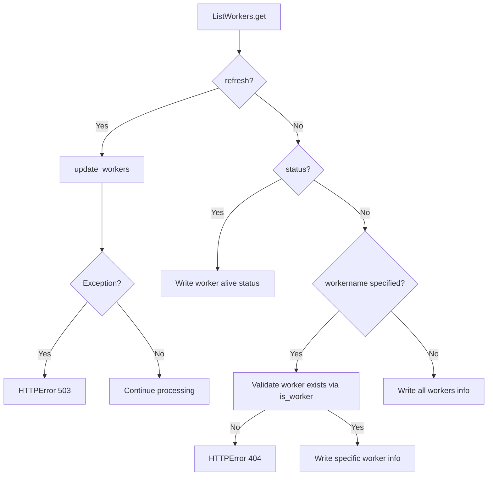

# `workers.py`

## `flower.api.workers.ListWorkers` · *class*

## Summary:
A Tornado web handler that provides endpoints for listing and managing Celery workers in the Flower monitoring interface.

## Description:
The ListWorkers class implements a RESTful API endpoint for retrieving information about Celery workers. It supports various query parameters to filter and refresh worker information. This handler is authenticated via the @web.authenticated decorator and is part of the Flower monitoring tool for Celery task queues. The handler processes GET requests to retrieve worker information with options for refreshing data, checking worker status, or filtering by specific worker names.

## State:
- Inherits from ControlHandler which provides worker validation capabilities via self.is_worker method
- Accesses self.application.workers dictionary containing worker information
- Accesses self.application.events.state.workers for worker status information
- Uses self.application.update_workers() method to refresh worker data when requested

## Lifecycle:
- Creation: Instantiated automatically by Tornado framework when handling HTTP requests
- Usage: Called via HTTP GET requests to the workers endpoint with optional query parameters:
  1. refresh=True - Forces updating worker information from the broker
  2. status=True - Returns worker alive status for all workers
  3. workername=<name> - Filters results to a specific worker
- Destruction: Managed by Tornado framework lifecycle

## Method Map:


## Raises:
- web.HTTPError(503): When worker update fails during refresh operation with refresh=True
- web.HTTPError(404): When a specific workername is requested but doesn't exist

## Example:
```python
# GET /workers?refresh=true
# Refreshes worker information and returns updated worker list

# GET /workers?status=true  
# Returns dictionary mapping worker names to their alive status

# GET /workers?workername=myworker
# Returns information about specific worker 'myworker'

# GET /workers
# Returns complete list of all workers
```

### `flower.api.workers.ListWorkers.get` · *method*

## Summary:
Retrieves and returns worker information with support for refreshing, status checking, and filtering by worker name.

## Description:
Handles HTTP GET requests to fetch worker information from the Flower monitoring system. This method supports multiple query parameters to customize the response, including refreshing worker data, retrieving worker status, and filtering results by specific worker names. The method is designed to be called during the HTTP request lifecycle when a client requests worker information from the Flower API.

## Args:
    None - All parameters are extracted from the HTTP request arguments

## Returns:
    None - Response is written directly to the HTTP response using self.write()

## Raises:
    tornado.web.HTTPError(404): When a specific worker name is requested but doesn't exist
    tornado.web.HTTPError(503): When worker refresh operation fails due to internal errors

## State Changes:
    Attributes READ:
        - self.application.workers: Contains cached worker information
        - self.application.events.state.workers: Contains real-time worker status information
        - self.application.update_workers: Method to refresh worker data
        - self.is_worker: Method to validate worker names
        - self.get_argument: Method to extract query parameters

## Constraints:
    Preconditions:
        - Must be called within a Tornado web request context
        - Application must have initialized worker tracking capabilities
        - HTTP request must contain valid query parameters if provided
        
    Postconditions:
        - Response is written to HTTP response stream
        - Worker data is refreshed if refresh=True parameter is specified
        - Appropriate HTTP status codes are returned for error conditions

## Side Effects:
    - Makes asynchronous calls to update worker information via self.application.update_workers()
    - Writes JSON response data to HTTP response stream via self.write()
    - Logs error messages to logger when refresh operations fail
    - May trigger external service calls when updating worker information

