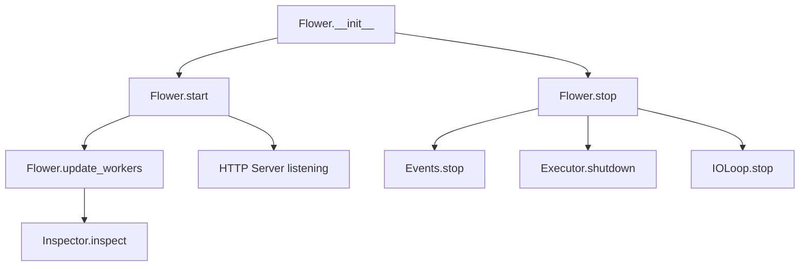

# `app.py`

## `flower.app.rewrite_handler` · *function*

## Summary:
Modifies a URL handler by prepending a URL prefix to its pattern.

## Description:
This function adjusts URL patterns in a Tornado web application by adding a prefix to the beginning of URL patterns. It handles both tornado.web.url objects and tuple-based URL configurations, ensuring consistent URL routing when applications are mounted under different paths.

## Args:
    handler (Union[tornado.web.url, tuple]): The URL handler to modify. If a tornado.web.url object, it must have a regex.pattern attribute. If a tuple, it must be in the form (pattern, handler_class).
    url_prefix (str): The URL prefix to prepend to the handler's pattern. Leading/trailing slashes are normalized.

## Returns:
    Union[tornado.web.url, tuple]: A new handler with the URL prefix prepended to its pattern. If input is a tornado.web.url, returns a new tornado.web.url object. If input is a tuple, returns a new tuple with the modified pattern.

## Raises:
    AttributeError: If handler is a tornado.web.url object but lacks expected attributes (regex, handler_class, etc.).

## Constraints:
    Preconditions:
        - handler must be either a tornado.web.url object or a tuple with at least two elements
        - url_prefix must be a string
    Postconditions:
        - The returned handler maintains the same handler class and configuration
        - The URL pattern is prefixed with url_prefix, normalized to remove duplicate slashes

## Side Effects:
    None

## Control Flow:
```mermaid
flowchart TD
    A[Input handler] --> B{Is tornado.web.url?}
    B -- Yes --> C[Extract handler.regex.pattern]
    B -- No --> D[Extract handler[0]]
    C --> E[Format new pattern "/{}{}".format(url_prefix.strip("/"), pattern)]
    D --> E
    E --> F[Return new tornado.web.url(...) or (new_pattern, handler[1])]
```

## Examples:
    # For tornado.web.url handler
    original = url(r'/api/users', UserHandler)
    prefixed = rewrite_handler(original, '/v1')
    # Result: url(r'/v1/api/users', UserHandler)
    
    # For tuple handler  
    original = (r'/users', UserHandler)
    prefixed = rewrite_handler(original, '/api')
    # Result: (r'/api/users', UserHandler)
``

## `flower.app.Flower` · *class*

## Summary:
Flower is a Tornado web application that provides a web-based interface for monitoring and managing Celery task queues.

## Description:
The Flower class serves as the main application entry point for the Flower monitoring system. It combines Tornado's web framework with Celery's task queue monitoring capabilities to provide real-time insights into Celery workers, tasks, and system performance. This class should be instantiated by the application startup process to initialize the monitoring web interface.

The class acts as a central coordinator that manages the lifecycle of the monitoring service, handles HTTP requests, maintains connections to Celery workers, and processes events from the task queue system. It's designed to be used as the main application object in a Tornado web server setup.

## State:
- options: Configuration options object, defaults to default_options if not provided
- io_loop: Tornado I/O loop instance, defaults to the current IOLoop instance
- ssl_options: SSL configuration options, extracted from kwargs during initialization
- capp: Celery application instance, defaults to a new Celery() instance
- executor: Thread pool executor for handling blocking operations
- inspector: Inspector instance for collecting worker information
- events: Events instance for capturing and processing Celery events
- started: Boolean flag indicating whether the application has been started

## Lifecycle:
Creation: Instantiate with optional configuration parameters (options, capp, events, io_loop). The constructor initializes the web application, sets up Celery connections, creates thread pools, and configures event handling.

Usage: Call start() method to begin serving HTTP requests and event processing. The application will continue running until stop() is called.

Destruction: Call stop() method to cleanly shut down the application, stopping event processing, shutting down executors, and stopping the I/O loop.

## Method Map:


## Raises:
- None explicitly raised by __init__ method, though underlying initialization may raise exceptions from:
  - Celery connection failures
  - Thread pool creation issues
  - Event handling initialization problems
  - I/O loop setup failures

## Example:
```python
# Create Flower application with default settings
app = Flower()

# Or with custom options
from options import default_options
options = default_options.copy()
options.port = 5555
app = Flower(options=options)

# Start the application
app.start()

# Later, stop the application
app.stop()
```

### `flower.app.Flower.__init__` · *method*

## Summary:
Initializes a Flower web application instance with Celery monitoring capabilities.

## Description:
Configures and initializes a Flower application instance that provides a web interface for monitoring Celery task queues. This method sets up the Tornado web application framework with appropriate handlers, initializes Celery integration, configures event handling, and prepares the application for serving monitoring endpoints.

## Args:
    options (Options, optional): Application configuration options. Defaults to None, which uses default_options.
    capp (celery.Celery, optional): Celery application instance. Defaults to None, which creates a new Celery instance.
    events (Events, optional): Events handler instance. Defaults to None, which creates a new Events instance.
    io_loop (tornado.ioloop.IOLoop, optional): Tornado I/O loop instance. Defaults to None, which uses the default IOLoop instance.
    **kwargs: Additional keyword arguments passed to the parent tornado.web.Application constructor.

## Returns:
    None: This method initializes the object's state and does not return a value.

## Raises:
    None explicitly raised in this method.

## State Changes:
    Attributes READ: 
        - self.max_workers (from class definition)
        - self.pool_executor_cls (from class definition)
        - self.options.inspect_timeout (from options)
        - self.options.db (from options)
        - self.options.persistent (from options)
        - self.options.state_save_interval (from options)
        - self.options.enable_events (from options)
        - self.options.max_workers (from options)
        - self.options.max_tasks (from options)
        - self.options.url_prefix (from options)
        - self.options.port (from options)
        - self.options.address (from options)
        - self.options.unix_socket (from options)
        - self.options.xheaders (from options)
        - self.options.inspect_timeout (from options)
        - self.ssl_options (from kwargs)

    Attributes WRITTEN:
        - self.options: Set to provided options or default_options
        - self.io_loop: Set to provided io_loop or default IOLoop instance
        - self.ssl_options: Set from kwargs or None
        - self.capp: Set to provided capp or new Celery instance
        - self.executor: Set to ThreadPoolExecutor instance
        - self.inspector: Set to Inspector instance
        - self.events: Set to provided events or new Events instance
        - self.started: Set to False

## Constraints:
    Preconditions:
        - The method assumes that the parent class (tornado.web.Application) can accept the provided kwargs
        - If options.url_prefix is provided, it must be a string
        - The max_workers attribute must be compatible with ThreadPoolExecutor constructor

    Postconditions:
        - self.options is initialized to either provided options or default_options
        - self.io_loop is initialized to either provided io_loop or default IOLoop instance
        - self.capp is initialized to either provided capp or new Celery instance with default modules imported
        - self.executor is initialized with appropriate thread pool settings
        - self.inspector is initialized with proper I/O loop, Celery app, and timeout settings
        - self.events is initialized with proper configuration from options
        - self.started is initialized to False

## Side Effects:
    - Creates a new Celery application instance if none provided
    - Imports default Celery modules
    - Initializes a thread pool executor
    - Sets the default executor on the I/O loop
    - Creates an Inspector instance for monitoring Celery workers
    - Creates an Events instance for handling Celery events
    - Sets up the application with handlers for web routes

### `flower.app.Flower.start` · *method*

## Summary:
Initializes and starts the Flower web application server, setting up event handling, HTTP listening, and worker monitoring.

## Description:
This method orchestrates the startup sequence for the Flower application by initializing event handling, configuring HTTP server listening (TCP or Unix socket), marking the application as started, updating worker information, and beginning the I/O event loop. It serves as the main entry point for launching the Flower monitoring interface.

## Args:
    None

## Returns:
    None

## Raises:
    None explicitly raised

## State Changes:
    Attributes READ: self.events, self.options, self.ssl_options, self.inspector, self.io_loop
    Attributes WRITTEN: self.started, self.inspector.workers (via update_workers)

## Constraints:
    Preconditions: 
    - The Flower instance must be properly initialized with required attributes
    - The options configuration must be valid
    - The I/O loop must be available
    
    Postconditions:
    - self.started flag is set to True
    - Event handling is initialized
    - HTTP server is configured and listening
    - Worker information is updated
    - I/O loop begins processing events

## Side Effects:
    - Starts event handling subsystem
    - Opens network socket (TCP or Unix) for HTTP requests
    - Begins continuous worker inspection process
    - Starts the Tornado I/O event loop which blocks execution

### `flower.app.Flower.stop` · *method*

## Summary:
Stops the Flower application by shutting down event processing, executors, and the I/O loop.

## Description:
This method provides a clean shutdown mechanism for the Flower application. It ensures that all running processes are properly terminated and resources are released. The method is typically called during application teardown or when a graceful shutdown is requested.

Known callers:
- Application teardown procedures
- Graceful shutdown handlers
- Manual stop operations initiated by users or system administrators

This logic is encapsulated in its own method rather than being inlined because it represents a distinct lifecycle operation that needs to be reusable and clearly separated from other application logic.

## State Changes:
- Attributes READ: self.started, self.events, self.executor, self.io_loop
- Attributes WRITTEN: self.started

## Constraints:
- Preconditions: The Flower instance must have been started (self.started must be True)
- Postconditions: All event processing is stopped, executors are shut down, I/O loop is stopped, and self.started is set to False

## Side Effects:
- Stops event processing via self.events.stop()
- Shuts down the thread pool executor with wait=False
- Stops the Tornado I/O loop
- Writes debug log messages indicating shutdown progress

### `flower.app.Flower.transport` · *method*

## Summary:
Returns the driver type of the Celery application's transport connection, or None if unavailable.

## Description:
This property provides access to the transport driver type used by the underlying Celery application. It safely navigates the connection/transport hierarchy and returns the driver type identifier, falling back to None if any part of the chain is unavailable or doesn't expose the driver_type attribute. This is commonly used to determine what messaging backend (AMQP, Redis, etc.) the Celery application is configured to use.

## Args:
    None

## Returns:
    str or None: The driver type string (e.g., 'redis', 'amqp') if available, otherwise None

## Raises:
    AttributeError: If the connection or transport structure doesn't support the expected attributes
    None explicitly raised - but may occur due to attribute access errors in the chain

## State Changes:
    Attributes READ: self.capp
    Attributes WRITTEN: None

## Constraints:
    Preconditions: 
    - self.capp must be initialized as a Celery application instance
    - self.capp.connection() must return a valid connection object
    - The connection object must have a transport attribute
    - The transport object must either have a driver_type attribute or be None

    Postconditions:
    - Returns a string representing the transport driver type or None
    - Does not modify any object state

## Side Effects:
    None - This is a read-only property that doesn't cause I/O operations or external service calls

### `flower.app.Flower.workers` · *method*

## Summary:
Returns the worker information dictionary managed by the inspector.

## Description:
Provides access to the worker statistics and status information collected by the inspector. This property serves as a convenient accessor to the underlying worker data structure that tracks information about registered Celery workers.

## Args:
    None

## Returns:
    collections.defaultdict: A dictionary-like object where keys are worker names and values are dictionaries containing worker-specific information such as stats, queues, registered tasks, etc.

## Raises:
    None

## State Changes:
    Attributes READ: self.inspector.workers
    Attributes WRITTEN: None

## Constraints:
    Preconditions: The Flower application must be initialized with an Inspector instance
    Postconditions: Returns a reference to the same workers dictionary object managed by the inspector

## Side Effects:
    None

### `flower.app.Flower.update_workers` · *method*

## Summary:
Updates worker inspection data by delegating to the inspector component.

## Description:
This method serves as a facade for the Inspector's inspect functionality, enabling asynchronous updates of worker information from Celery workers. It is primarily called during application startup to initialize worker state and can be invoked manually to refresh worker data on demand.

## Args:
    workername (str, optional): Specific worker name to inspect. If None, inspects all workers.

## Returns:
    list: A list of concurrent.futures.Future objects representing the asynchronous inspection operations for each worker method.

## Raises:
    None explicitly raised by this method.

## State Changes:
    Attributes READ: self.inspector
    Attributes WRITTEN: None directly modified by this method.

## Constraints:
    Preconditions: 
    - self.inspector must be initialized (which happens in Flower.__init__)
    - The Flower application must be running for the async operations to complete properly
    
    Postconditions:
    - Returns a list of Future objects that will eventually contain inspection results
    - The underlying inspector's workers dictionary will be updated asynchronously

## Side Effects:
    - Initiates asynchronous network calls to connected Celery workers
    - Triggers multiple background operations via ThreadPoolExecutor
    - May log debug and warning messages during inspection process

