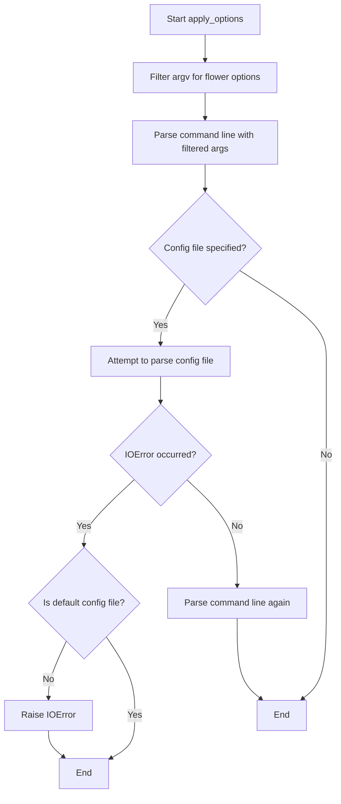
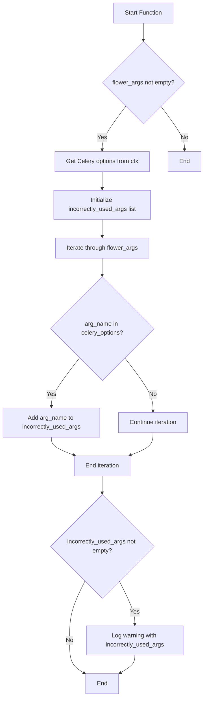
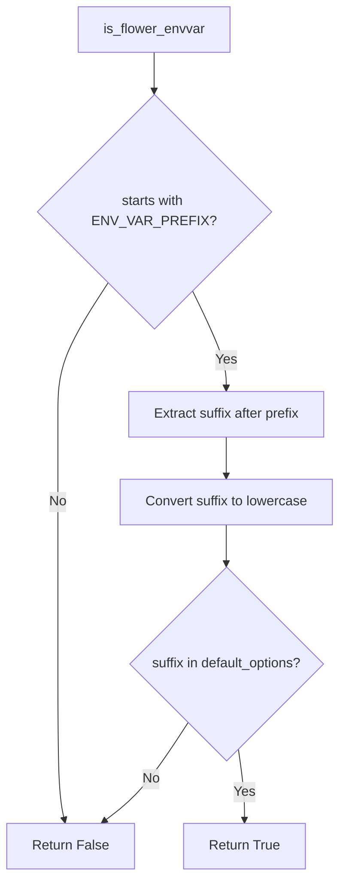

# `command.py`

## `flower.command.sigterm_handler` · *function*

## Summary:
Handles SIGTERM signals by logging the signal detection and performing graceful shutdown.

## Description:
This function serves as a signal handler for SIGTERM (termination signal) that enables graceful shutdown of the Flower application when it receives termination requests. It logs the detected signal number using a module-level logger and terminates the process with exit code 0.

As a signal handler, this function must be registered with Python's signal module using `signal.signal(signal.SIGTERM, sigterm_handler)` to be invoked when the process receives a SIGTERM signal.

## Args:
    signum (int): The signal number that triggered this handler (typically 15 for SIGTERM)
    _ (Any): Placeholder for the frame argument required by signal handlers, not used in implementation

## Returns:
    None: This function does not return a value as it terminates the process via sys.exit()

## Raises:
    SystemExit: Raised when sys.exit(0) is called, causing the program to terminate

## Constraints:
    Preconditions:
    - The function must be registered as a signal handler using `signal.signal()` before it can be invoked
    - A logger instance must be available in the module scope for logging purposes
    
    Postconditions:
    - The process will terminate with exit code 0
    - A log message will be written indicating the signal was received

## Side Effects:
    - Writes a log message to the configured logger instance
    - Terminates the current process via sys.exit(0)

## Control Flow:
```mermaid
flowchart TD
    A[Process Receives SIGTERM] --> B{Handler Registered?}
    B -->|Yes| C[Execute sigterm_handler]
    C --> D[logger.info("%s detected, shutting down", signum)]
    D --> E[sys.exit(0)]
    B -->|No| F[Process terminates normally]
```

## Examples:
```python
# Typical usage in a Flower application context:
import signal
# Register the signal handler
signal.signal(signal.SIGTERM, sigterm_handler)
# When SIGTERM is received, the application logs and exits gracefully
```

## `flower.command.flower` · *function*

## Summary:
Initializes and starts the Flower web application for monitoring Celery tasks.

## Description:
This function serves as the main entry point for launching the Flower web interface. It processes command-line arguments, configures the application environment, initializes logging, creates the Flower application instance, and starts the Tornado web server. The function handles graceful shutdown through signal handlers and provides informative startup banners.

## Args:
    ctx (click.Context): The Click context object containing command-line context and application configuration.
    tornado_argv (list[str]): Command-line arguments to be processed by Tornado's option parser.

## Returns:
    None: This function does not return a value.

## Raises:
    SystemExit: Raised when SIGTERM signal is received or invalid authentication options are provided.
    IOError: Raised when a specified configuration file cannot be read.

## Constraints:
    Preconditions:
    - The ctx parameter must contain a valid app object in ctx.obj.app
    - The ctx.obj must contain a quiet attribute
    - Valid Celery application instance must be available in ctx.obj.app
    
    Postconditions:
    - The Flower web application is initialized and running
    - Signal handlers are registered for graceful shutdown
    - Logging is configured according to options
    - Application settings are properly applied

## Side Effects:
    - Registers atexit handler to stop the Flower application on process exit
    - Sets up signal handlers for SIGTERM to gracefully shut down the application
    - Prints startup banner to console (when not in quiet mode)
    - Configures logging system
    - Starts the Tornado web server
    - May read configuration files from disk
    - May read environment variables

## Control Flow:
```mermaid
flowchart TD
    A[Start flower function] --> B[Process Celery args warning]
    B --> C[Apply environment options]
    C --> D[Apply command line options]
    D --> E[Extract application settings]
    E --> F[Setup logging]
    F --> G[Create Flower app instance]
    G --> H[Register atexit handler]
    H --> I[Set SIGTERM handler]
    I --> J[Print banner if not quiet]
    J --> K[Try to start Flower app]
    K --> L{KeyboardInterrupt/SystemExit?}
    L -- Yes --> M[Pass (graceful exit)]
    L -- No --> N[Application runs normally]
```

## Examples:
```python
# Typical usage would be called by Click CLI framework
# flower --port=5555 --address=0.0.0.0

# With SSL configuration
# flower --certfile=/path/to/cert.pem --keyfile=/path/to/key.pem

# With authentication
# flower --auth=user@example.com
```

## `flower.command.apply_env_options` · *function*

## Summary
Applies environment variables as configuration options for the Flower web application by mapping prefixed environment variables to tornado options.

## Description
Processes environment variables that match the Flower application naming convention and sets them as configuration options. This function enables configuration via environment variables instead of just command-line arguments or config files, providing flexibility for deployment in containerized environments or CI/CD pipelines.

The function filters environment variables using a prefix (likely "FLOWER_"), strips the prefix, converts the remaining part to lowercase, and maps it to the appropriate tornado options. It handles both single-value and multiple-value options, with special handling for boolean values.

## Args
None

## Returns
None

## Raises
None explicitly raised

## Constraints
Preconditions:
- Environment variables must follow the naming convention with the appropriate prefix
- The environment variable names must correspond to valid options in tornado.options
- The values must be convertible to the expected types (bool, int, str, etc.)

Postconditions:
- All matching environment variables are applied as tornado.options values
- Boolean values are properly converted using strtobool utility
- Multiple-value options are split by commas and converted appropriately

## Side Effects
- Modifies global tornado.options state by setting attributes
- No external I/O operations performed

## Control Flow
```mermaid
flowchart TD
    A[Start apply_env_options] --> B{Environment variables with prefix}
    B --> C[Filter with is_flower_envvar]
    C --> D[Process each matching var]
    D --> E[Strip prefix from var name]
    E --> F[Convert to lowercase]
    F --> G{Tornado option exists?}
    G -->|Yes| H[Get option object]
    G -->|No| I[Try hyphenated version]
    I --> J[Get option object]
    J --> K{Option is multiple?}
    K -->|Yes| L[Split by comma, convert each]
    K -->|No| M{Option type is bool?}
    M -->|Yes| N[Convert with strtobool]
    M -->|No| O[Convert with option.type]
    L --> P[Set option value]
    N --> P
    O --> P
    P --> Q[setattr(options, name, value)]
    Q --> R[End]
```

## Examples
```python
# Assuming FLOWER_BROKER_URL="redis://localhost:6379/0" is set
# This would set tornado.options.broker_url = "redis://localhost:6379/0"

# Assuming FLOWER_PORT="5555" is set  
# This would set tornado.options.port = 5555

# Assuming FLOWER_AUTO_REFRESH="true" is set
# This would set tornado.options.auto_refresh = True

# Assuming FLOWER_SSL_CERTFILE="/path/to/cert.pem, /path/to/key.pem" is set
# This would set tornado.options.ssl_certfile = ["/path/to/cert.pem", "/path/to/key.pem"]
```

## `flower.command.apply_options` · *function*

## Summary:
Processes and applies command-line options and configuration files for the Flower web application.

## Description:
This function serves as the primary option parsing entry point for Flower, filtering command-line arguments to only those recognized by the Flower application, parsing them, and attempting to load a configuration file. It is designed to be called early in the application startup process to initialize the configuration environment before other components are initialized.

The function extracts Flower-specific options from the full argument list, processes them through Tornado's command-line parser, and then attempts to load a configuration file if specified. It provides graceful handling for missing configuration files by only raising errors when a non-default configuration file is requested but not found.

## Args:
    prog_name (str): The name of the program being executed, typically used for command-line parsing.
    argv (list[str]): List of command-line arguments to process.

## Returns:
    None: This function does not return a value but modifies global state through option parsing.

## Raises:
    IOError: Raised when a configuration file is explicitly specified (not the default) but cannot be found or accessed.

## Constraints:
    Preconditions:
    - The `tornado.options` module must be properly initialized with Flower-specific options
    - The `is_flower_option` function must be available in the same module
    - Arguments should be properly formatted command-line arguments
    
    Postconditions:
    - Global `options` object will be populated with parsed command-line arguments
    - Configuration file (if specified) will be loaded into the options namespace
    - Command-line parsing will have been completed successfully

## Side Effects:
    - Modifies global state through `tornado.options` parsing
    - May read from the filesystem when loading configuration files
    - Initializes logging through `tornado.log.enable_pretty_logging` (indirectly via other imports)

## Control Flow:


## Examples:
    # Typical usage in main application entry point
    if __name__ == '__main__':
        apply_options(sys.argv[0], sys.argv[1:])
        # Continue with application initialization...
        
    # With custom arguments
    apply_options('flower', ['--port=5555', '--conf=myconfig.cfg'])
```

## `flower.command.warn_about_celery_args_used_in_flower_command` · *function*

## Summary:
Checks for Celery command arguments incorrectly specified after the flower command instead of before it.

## Description:
This function validates that Celery command-line arguments are properly positioned in the command line. When users run commands like `flower [flower args] [celery args]` instead of the correct `celery [celery args] flower [flower args]`, this function detects the misplaced arguments and issues a warning to guide users toward proper usage.

## Args:
    ctx: Click context object containing command information and parent command parameters
    flower_args: List of string arguments passed to the flower command

## Returns:
    None: This function does not return any value

## Raises:
    None: This function does not explicitly raise exceptions

## Constraints:
    Preconditions:
    - ctx must be a valid Click context object with a parent command
    - ctx.parent.command must have a params attribute containing command parameters
    - flower_args must be iterable containing string arguments

    Postconditions:
    - No modifications to input parameters occur
    - Only warning messages are logged via the logger

## Side Effects:
    - Writes warning message to the logger when incorrectly used Celery arguments are detected
    - No external state mutations or I/O operations beyond logging

## Control Flow:


## Examples:
    # Example usage in a Click command context:
    # When running: celery flower --broker=redis://localhost:6379 --port=5555
    # If --broker and --port are Celery options, they would be flagged as incorrectly placed
    
    # Correct usage would be:
    # celery --broker=redis://localhost:6379 flower --port=5555
```

## `flower.command.setup_logging` · *function*

## Summary:
Configures logging settings for the Flower web application based on debug mode and logging level options.

## Description:
This function sets up appropriate logging configuration for the Flower application. When debug mode is enabled and logging level is set to 'info', it promotes the logging level to 'debug' and enables pretty logging for better readability. In all other cases, it configures the tornado.access logger to use a NullHandler to suppress access logs, preventing excessive console output.

## Args:
    None

## Returns:
    None

## Raises:
    None

## Constraints:
    Preconditions:
    - The `tornado.options.options` global object must be properly initialized with 'debug' and 'logging' attributes
    - The 'debug' attribute should be a boolean value
    - The 'logging' attribute should be a string representing log level (e.g., 'info', 'debug')

    Postconditions:
    - The logging configuration is updated according to the debug and logging level settings
    - For debug mode with info logging, logging level is set to 'debug' and pretty logging is enabled
    - For non-debug mode or non-info logging, tornado.access logger is configured with NullHandler and no propagation

## Side Effects:
    - Modifies global logging configuration via `logging.getLogger("tornado.access")`
    - May enable pretty logging through `enable_pretty_logging()`
    - Changes the `options.logging` value when debug mode is active

## Control Flow:
```mermaid
flowchart TD
    A[setup_logging called] --> B{options.debug AND options.logging == 'info'}
    B -- True --> C[options.logging = 'debug']
    C --> D[enable_pretty_logging()]
    B -- False --> E[Get tornado.access logger]
    E --> F[Add NullHandler]
    F --> G[Set propagate = False]
```

## Examples:
```python
# Typical usage in main application startup
setup_logging()

# When debug=True and logging='info' in configuration:
# Results in logging level being set to 'debug' and pretty logging enabled

# When debug=False or logging!='info' in configuration:
# Results in tornado.access logger configured with NullHandler to suppress logs
```

## `flower.command.extract_settings` · *function*

## Summary:
Extracts and processes command-line configuration options into the application's global settings dictionary.

## Description:
This function serves as a centralized configuration processor that reads command-line options and translates them into application settings. It handles various configuration aspects including debugging mode, authentication, SSL settings, and URL routing. The function is designed to be called early in the application startup process to ensure all configuration is properly initialized before the application begins operation.

## Args:
    None

## Returns:
    None

## Raises:
    SystemExit: When an invalid '--auth' option is provided, causing the application to terminate with exit code 1.

## Constraints:
    Preconditions:
    - The `options` object from tornado.options must be properly initialized with command-line arguments
    - The `settings` global dictionary must be available for modification
    - The `logger` variable must be defined in the module scope for error reporting
    
    Postconditions:
    - The global `settings` dictionary is updated with processed configuration values
    - If authentication is enabled, the auth option is validated and rejected if invalid

## Side Effects:
    - Modifies the global `settings` dictionary
    - Writes error messages to stderr via the logger
    - Calls `sys.exit(1)` when invalid authentication options are detected
    - May modify global state through the `settings` dictionary

## Control Flow:
```mermaid
flowchart TD
    A[Start extract_settings] --> B{options.debug}
    B -- True --> C[settings['debug'] = True]
    B -- False --> D[settings['debug'] = False]
    C --> E{options.cookie_secret}
    D --> E
    E -- Set --> F[settings['cookie_secret'] = options.cookie_secret]
    E -- Not set --> G{options.url_prefix}
    F --> G
    G -- Set --> H[Process URL prefix]
    G -- Not set --> I{options.auth}
    H --> I
    I -- Set --> J[Process OAuth settings]
    I -- Not set --> K{options.certfile and options.keyfile}
    J --> K
    K -- Set --> L[Process SSL options]
    K -- Not set --> M{options.auth and not validate_auth_option}
    L --> M
    M -- Invalid --> N[logger.error + sys.exit(1)]
    M -- Valid --> O[End]
```

## Examples:
```python
# Typical usage in application startup
extract_settings()

# With authentication enabled
# Command: flower --auth=user@example.com
# Result: settings['oauth'] populated with OAuth configuration

# With SSL enabled
# Command: flower --certfile=cert.pem --keyfile=key.pem
# Result: settings['ssl_options'] populated with SSL certificate paths
```

## `flower.command.is_flower_option` · *function*

## Summary:
Determines whether a command-line argument corresponds to a valid Flower configuration option.

## Description:
Checks if a given command-line argument (typically starting with dashes) matches an attribute in the global tornado.options object. This function is used to distinguish between Flower-specific options and other command-line arguments that should be passed through to Celery or ignored.

## Args:
    arg (str): A command-line argument string that may start with one or two dashes followed by an option name.

## Returns:
    bool: True if the argument name corresponds to a valid option in tornado.options, False otherwise.

## Raises:
    None explicitly raised.

## Constraints:
    Preconditions:
    - The argument must be a string
    - The tornado.options module must be properly initialized
    
    Postconditions:
    - Returns a boolean value indicating option validity
    - Does not modify any global state

## Side Effects:
    None.

## Control Flow:
```mermaid
flowchart TD
    A[Input arg] --> B{arg starts with '-'}
    B -- Yes --> C[Strip leading dashes]
    C --> D[Split on '=' to get name]
    D --> E[Replace '-' with '_']
    E --> F[Check hasattr(options, name)]
    F --> G{Found in options?}
    G -- Yes --> H[Return True]
    G -- No --> I[Return False]
    B -- No --> J[Return False]
```

## Examples:
    >>> is_flower_option("--broker=redis://localhost:6379")
    True
    >>> is_flower_option("--invalid-option")
    False
    >>> is_flower_option("non-option-argument")
    False
```

## `flower.command.is_flower_envvar` · *function*

## Summary:
Determines whether an environment variable name corresponds to a valid Flower configuration option by checking against a predefined prefix and option set.

## Description:
This utility function identifies environment variables that are intended for configuring Flower by validating two conditions: (1) the environment variable name starts with a specific prefix (ENV_VAR_PREFIX), and (2) the portion of the variable name following this prefix (when converted to lowercase) exists in the set of default configuration options. This function is used to filter and process only relevant environment variables for Flower configuration.

## Args:
    name (str): The full name of an environment variable to validate.

## Returns:
    bool: True if the environment variable name starts with ENV_VAR_PREFIX and the suffix (after removing prefix and converted to lowercase) exists in default_options; False otherwise.

## Raises:
    None explicitly raised.

## Constraints:
    Preconditions:
    - The input `name` must be a string
    - The constant `ENV_VAR_PREFIX` must be defined in the module scope
    - The constant `default_options` must be defined in the module scope and contain valid configuration option names
    
    Postconditions:
    - Returns a boolean value indicating whether the environment variable qualifies as a Flower configuration option

## Side Effects:
    None.

## Control Flow:


## Examples:
    # Assuming ENV_VAR_PREFIX = "FLOWER_" and default_options = {"broker", "port", "address"}
    is_flower_envvar("FLOWER_BROKER")  # Returns True - valid Flower config var
    is_flower_envvar("FLOWER_PORT")   # Returns True - valid Flower config var  
    is_flower_envvar("OTHER_VAR")     # Returns False - not prefixed with FLOWER_
    is_flower_envvar("FLOWER_INVALID") # Returns False - suffix not in default_options
```

## `flower.command.print_banner` · *function*

## Summary:
Outputs application startup information including connection details, broker URI, and registered tasks to the logging system.

## Description:
This function logs key configuration and status information when the Flower web application starts up. It displays the URL where the application will be accessible, the broker connection details, and a list of registered tasks. The function handles both regular HTTP connections and Unix socket connections, making it suitable for different deployment scenarios.

The function is separated from the main execution flow to improve code organization and testability by encapsulating the logging behavior.

## Args:
    app: The application instance that provides connection and task information
    ssl: Boolean flag indicating whether SSL/TLS is enabled for the connection

## Returns:
    None: This function does not return any value

## Raises:
    None explicitly raised: This function does not raise any exceptions directly

## Constraints:
    Preconditions:
    - The `options` object from `tornado.options` must be properly configured with address, port, and other connection parameters
    - The `app` parameter must support a `connection()` method that returns an object with an `as_uri()` method
    - The `app` parameter must support a `tasks` attribute that behaves like a dictionary-like object with keys() method
    - The `logger` must be available in the module scope for info/debug logging

    Postconditions:
    - Configuration information is written to the application's logging system
    - Connection details, broker URI, and registered tasks are logged

## Side Effects:
    - Writes formatted informational messages to the application's logging system
    - Accesses global configuration options from tornado.options
    - Reads application state through the app parameter

## Control Flow:
```mermaid
flowchart TD
    A[Start print_banner] --> B{options.unix_socket set?}
    B -- No --> C{options.url_prefix set?}
    C -- Yes --> D[Set prefix_str = /{url_prefix}/]
    C -- No --> E[Set prefix_str = ""]
    D --> F[Log HTTP URL with prefix]
    E --> F
    B -- Yes --> G[Log Unix socket file]
    F --> H[Log Broker URI from app.connection().as_uri()]
    G --> H
    H --> I[Log Registered Tasks from app.tasks.keys()]
    I --> J[Log Settings (debug)]
```

## Examples:
    Typical usage would be in the startup sequence of a Flower application:
    
    ```python
    # In application startup code
    from app import Flower
    from tornado.options import options
    
    app = Flower()
    print_banner(app, ssl=False)
    ```
    
    This would output something like:
    ```
    Visit me at http://0.0.0.0:5555/
    Broker: redis://localhost:6379/0
    Registered tasks: 
    ['task1', 'task2', 'task3']
    Settings: {'debug': True, ...}
    ```

