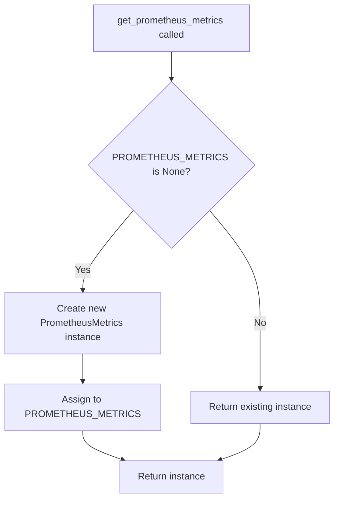
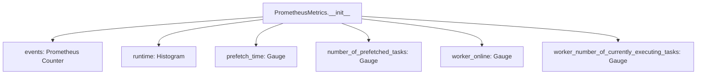
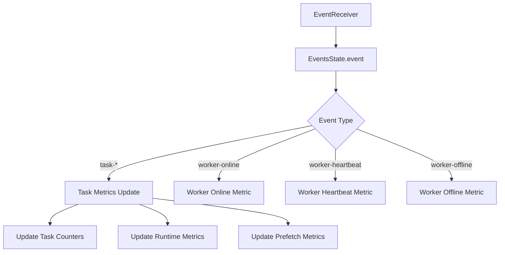
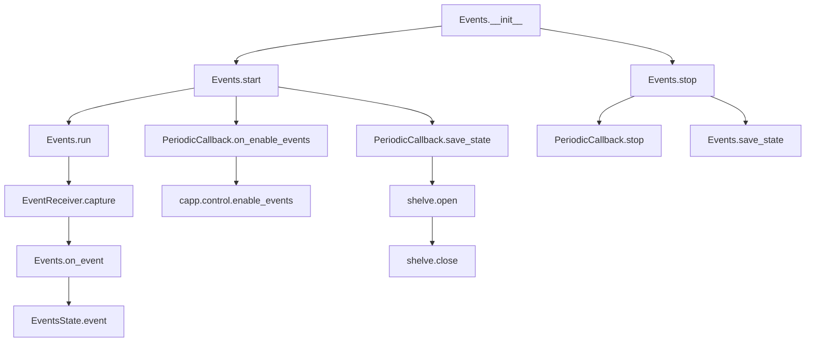

# `events.py`

## `flower.events.get_prometheus_metrics` · *function*

## Summary:
Returns the singleton instance of PrometheusMetrics for collecting and exposing Celery task metrics.

## Description:
This function implements a lazy singleton pattern to ensure only one instance of PrometheusMetrics is created and shared throughout the application. It initializes the Prometheus metrics collector on first access and returns the same instance on subsequent calls. This allows centralized collection and exposure of various Celery task and worker metrics through Prometheus.

## Args:
    None

## Returns:
    PrometheusMetrics: A singleton instance of the PrometheusMetrics class containing various metric collectors for monitoring Celery tasks and workers.

## Raises:
    None

## Constraints:
    Preconditions:
    - The global PROMETHEUS_METRICS variable must be accessible (either None or already initialized)
    
    Postconditions:
    - Returns a valid PrometheusMetrics instance
    - The same instance is returned on all subsequent calls

## Side Effects:
    None

## Control Flow:


## Examples:
```python
# Usage in a monitoring context
metrics = get_prometheus_metrics()
# metrics now contains the singleton PrometheusMetrics instance
# that can be used to collect various Celery task metrics
```

## `flower.events.PrometheusMetrics` · *class*

## Summary:
A class that manages Prometheus metrics for monitoring Celery worker events and task execution statistics.

## Description:
The PrometheusMetrics class provides a centralized interface for creating and maintaining various Prometheus metrics that track Celery worker activity, task execution times, and worker states. This class is designed to be instantiated once and used throughout the application to record monitoring data that can be scraped by Prometheus servers.

This abstraction encapsulates the creation and management of multiple Prometheus metric types (Counters, Gauges, and Histograms) with standardized label schemas, making it easier to maintain consistent metric naming and labeling conventions across the Flower monitoring application.

## State:
- events: Prometheus Counter metric tracking total number of events with labels ['worker', 'type', 'task']
- runtime: Prometheus Histogram metric measuring task runtime in seconds with labels ['worker', 'task']  
- prefetch_time: Prometheus Gauge metric tracking time tasks spend waiting to execute with labels ['worker', 'task']
- number_of_prefetched_tasks: Prometheus Gauge metric tracking prefetched tasks per worker and task type with labels ['worker', 'task']
- worker_online: Prometheus Gauge metric tracking worker online/offline status with label ['worker']
- worker_number_of_currently_executing_tasks: Prometheus Gauge metric tracking currently executing tasks per worker with label ['worker']

All metrics are initialized with appropriate names, descriptions, and label schemas for consistent monitoring. These metrics are automatically registered with the global Prometheus registry.

## Lifecycle:
- Creation: Instantiated without arguments, automatically initializes all required Prometheus metrics through the prometheus_client library
- Usage: Metrics are updated by other components in the system through direct metric manipulation (incrementing counters, setting gauge values, observing histogram values)
- Destruction: No explicit cleanup required as Prometheus metrics are registered globally with the Prometheus client library

## Method Map:


## Raises:
- None explicitly raised in __init__
- May raise exceptions from prometheus_client library initialization if invalid configurations are provided

## Example:
```python
# Create the metrics collector
metrics = PrometheusMetrics()

# Later, update metrics in event handlers:
# metrics.events.labels(worker='worker1', type='task_received', task='my_task').inc()
# metrics.runtime.labels(worker='worker1', task='my_task').observe(0.5)
# metrics.prefetch_time.labels(worker='worker1', task='my_task').set(1.2)
```

### `flower.events.PrometheusMetrics.__init__` · *method*

*No documentation generated.*

## `flower.events.EventsState` · *class*

## Summary:
Processes Celery events and maintains Prometheus metrics for task and worker monitoring.

## Description:
The EventsState class extends Celery's State class to track event occurrences and expose relevant metrics via Prometheus. It processes incoming Celery events to update task and worker metrics while maintaining state tracking. This class enables monitoring of task execution lifecycle and worker status changes.

## State:
- counter: collections.defaultdict(Counter) - Tracks event counts per worker and event type
- metrics: Prometheus metrics object - Contains various metric collectors for event tracking
- tasks: Dictionary of task objects maintained by parent State class
- workers: Dictionary of worker objects maintained by parent State class

## Lifecycle:
- Creation: Instantiated automatically by Flower when monitoring Celery events
- Usage: Receives events through the event() method when Celery events are processed
- Destruction: Managed by the application lifecycle, no explicit cleanup required

## Method Map:


## Raises:
- AttributeError: If event data lacks required keys like 'hostname' or 'type'
- KeyError: If accessing task data that doesn't exist in self.tasks
- ValueError: If metric labels contain invalid characters or values

## Example:
```python
# Typically instantiated by Flower framework
events_state = EventsState()

# Events are processed automatically when received
# Example event processing:
event = {
    'type': 'task-received',
    'hostname': 'worker1@example.com',
    'uuid': 'task-uuid-123',
    'name': 'myapp.tasks.my_task'
}
events_state.event(event)

# Metrics are automatically updated:
# - events_total{worker="worker1@example.com", event_type="task-received", task_name="myapp.tasks.my_task"}
# - number_of_prefetched_tasks{worker="worker1@example.com", task_name="myapp.tasks.my_task"}
```

### `flower.events.EventsState.__init__` · *method*

## Summary:
Initializes the EventsState object by setting up event counting and Prometheus metrics tracking.

## Description:
This method initializes the EventsState instance by calling the parent class constructor and setting up internal data structures for tracking event counts and Prometheus metrics. It establishes the foundation for monitoring Celery task events and worker activity through metric collection.

## Args:
    *args: Variable length argument list passed to the parent class constructor
    **kwargs: Arbitrary keyword arguments passed to the parent class constructor

## Returns:
    None: This method does not return a value

## Raises:
    None explicitly raised

## State Changes:
    Attributes READ: None
    Attributes WRITTEN: 
    - self.counter: Initialized as collections.defaultdict(Counter) for tracking event counts by worker and event type
    - self.metrics: Initialized with the singleton instance of PrometheusMetrics for collecting and exposing Celery task metrics

## Constraints:
    Preconditions:
    - The parent State class must be properly initialized
    - get_prometheus_metrics() must be callable and return a valid PrometheusMetrics singleton instance
    
    Postconditions:
    - self.counter is initialized as a defaultdict of Counter objects
    - self.metrics is initialized with the singleton PrometheusMetrics instance for metric collection

## Side Effects:
    None: This method does not perform I/O operations or mutate external state beyond initializing instance attributes

### `flower.events.EventsState.event` · *method*

## Summary:
Processes incoming Celery events to update task and worker metrics while maintaining state tracking.

## Description:
This method handles Celery event processing by updating internal counters, task state tracking, and Prometheus metrics based on event type. It serves as the central event handler that processes task lifecycle events (received, started, succeeded, failed) and worker status events (online, heartbeat, offline) to maintain accurate monitoring and performance metrics.

## Args:
    event (dict): A Celery event dictionary containing event metadata including 'hostname', 'type', 'uuid', and other event-specific fields.

## Returns:
    None: This method does not return any value.

## Raises:
    KeyError: May raise KeyError if required keys ('hostname', 'type') are missing from the event dictionary.
    AttributeError: May raise AttributeError if task objects lack expected attributes like 'started', 'received', or 'name'.

## State Changes:
    Attributes READ:
        - self.counter: Dictionary tracking event counts by worker and event type
        - self.tasks: Dictionary mapping task IDs to task objects
        - self.metrics: Prometheus metrics collector instance
    
    Attributes WRITTEN:
        - self.counter[worker_name][event_type]: Increments event count for worker and event type
        - self.metrics.events: Increments event counter metric
        - self.metrics.runtime: Observes task runtime histogram
        - self.metrics.number_of_prefetched_tasks: Increments or decrements prefetched task counter
        - self.metrics.prefetch_time: Sets prefetch time gauge
        - self.metrics.worker_online: Sets worker online status
        - self.metrics.worker_number_of_currently_executing_tasks: Sets executing task count

## Constraints:
    Preconditions:
        - The event dictionary must contain 'hostname' and 'type' keys
        - Task objects referenced by event UUID must be accessible via self.tasks
        - Metrics collection system must be initialized
        
    Postconditions:
        - Event counters are updated appropriately
        - Prometheus metrics reflect current task and worker states
        - Task timing and prefetch metrics are calculated and recorded

## Side Effects:
    - Updates Prometheus metrics through the metrics collector
    - Modifies internal state counters and task tracking
    - May trigger metric recording operations in the Prometheus client

## `flower.events.Events` · *class*

## Summary:
Manages Celery event capturing, processing, and state persistence for Flower monitoring.

## Description:
The Events class is responsible for capturing Celery worker events, maintaining event state, and providing persistent storage for event data. It runs as a background thread to continuously monitor and process events from Celery workers, supporting both in-memory and persistent state management.

This class serves as the core event handling mechanism for Flower's monitoring capabilities, enabling real-time tracking of worker activities, task execution metrics, and system performance indicators.

## State:
- io_loop: Tornado IOLoop instance for asynchronous operations
- capp: Celery application instance for event connection and control
- db: Path to persistent storage file (when persistent=True)
- persistent: Boolean flag indicating whether to persist state to disk
- enable_events: Boolean flag controlling whether to enable Celery events
- state: EventsState instance managing event data and metrics
- state_save_timer: PeriodicCallback for saving state to disk (when state_save_interval > 0)
- timer: PeriodicCallback for enabling Celery events (at events_enable_interval ms intervals)

## Lifecycle:
Creation: Instantiate with required capp and io_loop parameters, optional persistence settings
Usage: Call start() to begin event capture and periodic operations, stop() to halt operations
Destruction: Thread terminates automatically when run() completes, with cleanup in stop()

## Method Map:


## Raises:
- Exception: When connecting to Celery broker fails, with exponential backoff retry logic implemented

## Example:
```python
# Create Events instance with persistent storage
events = Events(capp=celery_app, io_loop=tornado_ioloop, 
                db='/tmp/flower_events.db', persistent=True,
                state_save_interval=30000)  # Save every 30 seconds

# Start event capture
events.start()

# Stop event capture
events.stop()
```

### `flower.events.Events.__init__` · *method*

## Summary:
Initializes the Events handler thread with configuration options and sets up state management for Celery events.

## Description:
Configures the Events handler thread to capture and process Celery events from a broker. This method initializes the thread base class, sets up connection and state management parameters, and prepares periodic callbacks for enabling events and saving state when persistence is enabled.

## Args:
    capp (Celery): The Celery application instance used to connect to the message broker and control events.
    io_loop (tornado.ioloop.IOLoop): The Tornado IOLoop instance for asynchronous operations.
    db (str, optional): Path to the shelve database file for persistent state storage. Defaults to None.
    persistent (bool): Whether to load/save state from/to a persistent database. Defaults to False.
    enable_events (bool): Whether to automatically enable events on the Celery app. Defaults to True.
    state_save_interval (int): Interval in milliseconds to periodically save state to disk. Defaults to 0 (disabled).
    **kwargs: Additional keyword arguments passed to EventsState constructor.

## Returns:
    None: This method initializes instance attributes and does not return a value.

## Raises:
    None explicitly raised in this method.

## State Changes:
    Attributes READ: None
    Attributes WRITTEN: 
    - self.io_loop: Set to the provided io_loop parameter
    - self.capp: Set to the provided capp parameter
    - self.db: Set to the provided db parameter
    - self.persistent: Set to the provided persistent parameter
    - self.enable_events: Set to the provided enable_events parameter
    - self.state: Initialized to None, then potentially set to loaded state or new EventsState instance
    - self.state_save_timer: Initialized to None, then potentially set to a PeriodicCallback instance

## Constraints:
    Preconditions:
    - capp must be a valid Celery application instance
    - io_loop must be a valid Tornado IOLoop instance
    - If persistent=True, db must be a valid path string to a writable location
    - state_save_interval must be a non-negative integer if provided
    
    Postconditions:
    - self.daemon is set to True
    - self.state is initialized (either from persistent storage or new EventsState)
    - self.timer is initialized as a PeriodicCallback for enabling events

## Side Effects:
    - Creates a new thread that will run in daemon mode
    - May open and read from a shelve database file if persistent=True
    - May create periodic callbacks for state saving and event enabling
    - Uses logging for debug messages during initialization

### `flower.events.Events.start` · *method*

## Summary:
Starts the event processing thread and associated timers for event handling and state persistence.

## Description:
Overrides the standard threading.Thread.start() method to additionally initialize and start event-related timers. This method begins the main processing thread and activates auxiliary timers for event monitoring and state saving, enabling continuous event processing and periodic state persistence.

## Args:
    None

## Returns:
    None

## Raises:
    None explicitly raised

## State Changes:
    Attributes READ: self.enable_events, self.timer, self.state_save_timer
    Attributes WRITTEN: None

## Constraints:
    Preconditions: 
    - The object must be properly initialized with enable_events, timer, and state_save_timer attributes
    - The timer and state_save_timer must be valid PeriodicCallback instances if they exist
    
    Postconditions:
    - The main thread is started and running
    - Event monitoring timer is started if enable_events is True
    - State save timer is started if state_save_timer exists

## Side Effects:
    - Starts the main processing thread
    - Initiates event monitoring timer (if enabled)
    - Initiates state persistence timer (if configured)
    - May trigger I/O operations through timer callbacks

### `flower.events.Events.stop` · *method*

## Summary:
Stops event processing timers and saves persistent state when the events system is shutting down.

## Description:
This method performs cleanup operations when the Events thread is being stopped. It stops the periodic timers that handle event enabling and state saving, and saves the current state to persistent storage if persistence is enabled. This method is typically called during application shutdown or when the event processing needs to be terminated gracefully.

## Args:
    None

## Returns:
    None

## Raises:
    None explicitly raised

## State Changes:
    Attributes READ: self.enable_events, self.state_save_timer, self.persistent, self.timer
    Attributes WRITTEN: None

## Constraints:
    Preconditions: The Events instance must be properly initialized with valid timer and state attributes
    Postconditions: All active timers are stopped and persistent state is saved if applicable

## Side Effects:
    I/O operations: Writes state data to persistent storage when self.persistent is True
    Timer management: Stops PeriodicCallback instances to prevent further execution

### `flower.events.Events.run` · *method*

## Summary:
Continuously captures and processes Celery events with exponential backoff retry logic.

## Description:
The run method implements a continuous event capturing loop that monitors Celery events from the application's message broker. It creates an EventReceiver to listen for all event types and forwards them to the on_event handler for processing. The method employs exponential backoff retry strategy to handle connection failures and maintains a persistent event capture session.

This method serves as the main execution entry point for the Events thread, providing continuous monitoring of Celery events while gracefully handling interruptions and transient errors.

## Args:
    None

## Returns:
    None

## Raises:
    KeyboardInterrupt: When the process receives a keyboard interrupt signal
    SystemExit: When the process receives a system exit signal

## State Changes:
    Attributes READ: 
    - self.capp: Used to establish broker connection
    - self.on_event: Used as event handler callback
    - logger: Used for debug/error logging
    
    Attributes WRITTEN:
    - None

## Constraints:
    Preconditions:
    - self.capp must be a valid Celery application instance with working broker connection
    - self.on_event must be callable and properly configured to handle Celery events
    - The method should only be called on a started Events thread instance
    
    Postconditions:
    - The method runs indefinitely until interrupted or stopped
    - Event capture continues until explicit termination
    - Connection to broker is properly managed through context manager

## Side Effects:
    - Establishes and maintains persistent connections to the Celery broker
    - Processes and forwards all captured events to self.on_event handler
    - Logs debug and error messages to the configured logger
    - May cause thread interruption on SIGINT/SIGTERM signals
    - Uses time.sleep() for retry backoff periods

### `flower.events.Events.save_state` · *method*

## Summary:
Saves the current event state to a persistent shelve database file.

## Description:
This method persists the current state of events to a shelve database file. It opens the database in write mode ('n' flag creates a new database), stores the event state under the key 'events', and then closes the database connection. This method is typically called during periodic state synchronization or shutdown operations to ensure event data is preserved.

## Args:
    None

## Returns:
    None

## Raises:
    None explicitly documented

## State Changes:
    Attributes READ: self.db, self.state
    Attributes WRITTEN: None

## Constraints:
    Preconditions: 
    - self.db must be a valid file path string
    - self.state must be serializable by shelve
    - The directory for self.db must be writable
    
    Postconditions:
    - The state data is persisted to the file specified by self.db
    - The shelve database is properly closed after writing

## Side Effects:
    - Writes to disk at the location specified by self.db
    - May create a new database file if it doesn't exist
    - Uses the global logger for debug-level logging

### `flower.events.Events.on_enable_events` · *method*

## Summary:
Enables Celery events asynchronously by scheduling the enable_events control command to run in a separate executor thread.

## Description:
This method is periodically invoked by a background timer to ensure that Celery events remain enabled in the application. It schedules the `capp.control.enable_events` command to execute asynchronously using the IOLoop's executor pool, preventing blocking of the main event processing loop.

The method is registered as a callback with a PeriodicCallback that executes at intervals defined by `events_enable_interval` (5000ms by default). This periodic execution ensures that event monitoring remains active even if previous enable_events calls fail or if the connection to the broker is lost.

## Args:
    None

## Returns:
    None

## Raises:
    None explicitly raised

## State Changes:
    Attributes READ: 
    - self.io_loop: Used to schedule execution in a separate thread
    - self.capp: Used to access the control interface for enabling events
    - self.capp.control: Used to access the enable_events command

    Attributes WRITTEN: 
    - None

## Constraints:
    Preconditions:
    - The method assumes that `self.capp` is properly initialized with a valid Celery app instance
    - The method assumes that `self.io_loop` is available and properly configured
    - The method assumes that `self.capp.control` provides a valid `enable_events` attribute

    Postconditions:
    - The Celery event monitoring system remains active
    - The enable_events command is scheduled for asynchronous execution

## Side Effects:
    - Schedules an asynchronous operation to enable Celery events
    - May cause network I/O when communicating with the Celery broker
    - Uses the IOLoop's executor pool for thread management

### `flower.events.Events.on_event` · *method*

## Summary:
Processes incoming Celery events asynchronously by delegating to the state manager through the I/O loop.

## Description:
Handles incoming Celery events by scheduling their processing through the I/O loop using a callback mechanism. This method serves as the primary event handler for the Events class, ensuring that event processing occurs asynchronously without blocking the main event capture loop. It delegates the actual event handling to the state manager's event method via `partial(self.state.event, event)` to maintain proper function binding.

This method is registered as a handler for all events in the EventReceiver (`handlers={"*": self.on_event}`) and is called automatically whenever a Celery event is received. The asynchronous nature ensures that event processing doesn't interfere with the continuous event capture process.

## Args:
    event (dict): A Celery event dictionary containing event metadata and data including keys like 'type', 'hostname', 'uuid', etc.

## Returns:
    None: This method does not return a value

## Raises:
    None explicitly raised: The method itself doesn't raise exceptions, though underlying operations in the state manager or I/O loop may fail

## State Changes:
    Attributes READ: 
    - self.io_loop: Used to schedule callback execution via add_callback
    - self.state: Used to delegate event processing via self.state.event(event)
    
    Attributes WRITTEN: 
    - None: This method doesn't modify any instance attributes directly

## Constraints:
    Preconditions:
    - self.io_loop must be initialized and operational
    - self.state must be initialized and capable of processing events
    - event must be a valid Celery event dictionary with required fields
    
    Postconditions:
    - The event will be processed asynchronously through the I/O loop
    - Event processing will be delegated to the state manager's event method
    - The event will be handled according to the state manager's logic for metrics collection and state updates

## Side Effects:
    - Schedules callback execution on the I/O loop using add_callback
    - Delegates event processing to the state manager's event method
    - May trigger metric updates in the Prometheus metrics system through the state manager
    - No direct I/O or external service calls beyond the I/O loop scheduling

