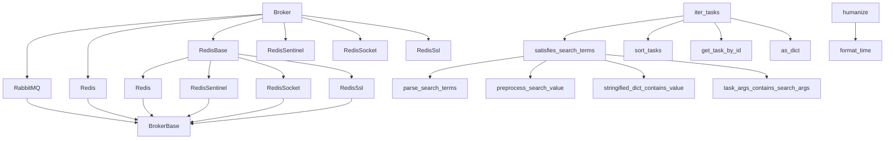

# `flower.utils`

## Tree:
    utils/
    ├── __init__.py
    ├── broker.py
    ├── search.py
    ├── tasks.py
    └── template.py

## Role:
    Provides common utility functions and classes for handling message brokers, searching and sorting tasks, and formatting data for display.

## Description:
    The utils module serves as a collection of reusable helper components that support various aspects of the Flower application. It provides abstractions for different message broker types (AMQP, Redis, etc.), utilities for searching and filtering task data, and formatting functions for displaying information in templates. This module acts as a shared foundation for other parts of the application that need these common functionalities.

    Primary consumers include:
    - The web UI components that display task information
    - The event processing system that handles task events
    - The broker monitoring features that fetch queue information
    - Template rendering systems that format data for display

    The cohesion principle is based on shared functionality around message broker interactions, task management, and data formatting - all essential utilities for a Celery monitoring tool.

## Components:
    * abs_path(path) - Converts a path to absolute path using current working directory
    * bugreport(app=None) - Generates a bug report string with version information
    * gen_cookie_secret() - Generates a secure cookie secret
    * prepend_url(url, prefix) - Prepends a URL prefix to a given URL
    * strtobool(val) - Converts string representation of truth to boolean
    * Broker(broker_url, *args, **kwargs) - Factory class that creates specific broker implementations based on URL scheme
    * BrokerBase(broker_url, *args, **kwargs) - Base class for broker implementations
    * RabbitMQ(broker_url, http_api, io_loop=None, **__) - Broker implementation for RabbitMQ
    * Redis(broker_url, *args, **kwargs) - Broker implementation for Redis
    * RedisBase(broker_url, *args, **kwargs) - Base class for Redis broker implementations
    * RedisSentinel(broker_url, *args, **kwargs) - Broker implementation for Redis Sentinel
    * RedisSocket(broker_url, *args, **kwargs) - Broker implementation for Redis Unix socket connections
    * RedisSsl(broker_url, *args, **kwargs) - Broker implementation for Redis SSL connections
    * parse_search_terms(raw_search_value) - Parses search terms from a raw search string
    * preprocess_search_value(raw_value) - Preprocesses a raw search value
    * satisfies_search_terms(task, search_terms) - Checks if a task satisfies search terms
    * stringified_dict_contains_value(key, value, str_dict) - Checks if a stringified dictionary contains a value
    * task_args_contains_search_args(task_args, search_args) - Checks if task arguments contain search arguments
    * as_dict(task) - Converts a task object to dictionary representation
    * get_task_by_id(events, task_id) - Retrieves a task by its ID from events
    * iter_tasks(events, limit=None, offset=0, type=None, worker=None, state=None, sort_by=None, received_start=None, received_end=None, started_start=None, started_end=None, search=None) - Iterates over tasks with filtering and sorting options
    * sort_tasks(tasks, sort_by) - Sorts tasks according to specified criteria
    * format_time(time, tz) - Formats timestamp into readable time string
    * humanize(obj, type=None, length=None) - Humanizes objects for display in templates

## Public API:
    * abs_path(path) - Converts a path to absolute path using current working directory
    * bugreport(app=None) - Generates a bug report string with version information
    * gen_cookie_secret() - Generates a secure cookie secret
    * prepend_url(url, prefix) - Prepends a URL prefix to a given URL
    * strtobool(val) - Converts string representation of truth to boolean
    * Broker(broker_url, *args, **kwargs) - Factory class that creates specific broker implementations based on URL scheme
    * BrokerBase(broker_url, *args, **kwargs) - Base class for broker implementations
    * RabbitMQ(broker_url, http_api, io_loop=None, **__) - Broker implementation for RabbitMQ
    * Redis(broker_url, *args, **kwargs) - Broker implementation for Redis
    * RedisBase(broker_url, *args, **kwargs) - Base class for Redis broker implementations
    * RedisSentinel(broker_url, *args, **kwargs) - Broker implementation for Redis Sentinel
    * RedisSocket(broker_url, *args, **kwargs) - Broker implementation for Redis Unix socket connections
    * RedisSsl(broker_url, *args, **kwargs) - Broker implementation for Redis SSL connections
    * parse_search_terms(raw_search_value) - Parses search terms from a raw search string
    * preprocess_search_value(raw_value) - Preprocesses a raw search value
    * satisfies_search_terms(task, search_terms) - Checks if a task satisfies search terms
    * stringified_dict_contains_value(key, value, str_dict) - Checks if a stringified dictionary contains a value
    * task_args_contains_search_args(task_args, search_args) - Checks if task arguments contain search arguments
    * as_dict(task) - Converts a task object to dictionary representation
    * get_task_by_id(events, task_id) - Retrieves a task by its ID from events
    * iter_tasks(events, limit=None, offset=0, type=None, worker=None, state=None, sort_by=None, received_start=None, received_end=None, started_start=None, started_end=None, search=None) - Iterates over tasks with filtering and sorting options
    * sort_tasks(tasks, sort_by) - Sorts tasks according to specified criteria
    * format_time(time, tz) - Formats timestamp into readable time string
    * humanize(obj, type=None, length=None) - Humanizes objects for display in templates

## Dependencies:
    * Internal imports:
        * None (this is a standalone utility module)
    * External imports:
        * os - for path operations
        * base64 - for cookie secret generation
        * uuid - for cookie secret generation
        * urllib.parse - for URL parsing in broker implementations
        * json - for JSON parsing in RabbitMQ broker
        * socket - for socket error handling in RabbitMQ broker
        * tornado.httpclient - for HTTP requests in RabbitMQ broker
        * tornado.ioloop - for I/O loop in RabbitMQ broker
        * redis - for Redis broker implementations
        * numbers - for numeric type checking in Redis broker
        * re - for regular expressions in search utilities
        * datetime - for time formatting in template utilities
        * humanize - for natural time formatting
        * time - for time conversion in task iteration
        * logging - for logging errors in broker implementations

## Constraints:
    * When using Broker factory class, ensure the broker URL scheme is supported (amqp, redis, rediss, redis+socket, sentinel)
    * When using Redis-based brokers, ensure the redis library is installed
    * When using Redis Sentinel, ensure broker_options contains 'master_name'
    * When using Redis SSL, ensure broker_use_ssl is provided in broker_options
    * When using search utilities, ensure search terms are properly formatted
    * When using task iteration, be aware of performance implications with large datasets
    * All broker implementations require proper authentication credentials in URLs

---

## Files

- [`__init__.py`](utils/__init__.md)
- [`broker.py`](utils/broker.md)
- [`search.py`](utils/search.md)
- [`tasks.py`](utils/tasks.md)
- [`template.py`](utils/template.md)

