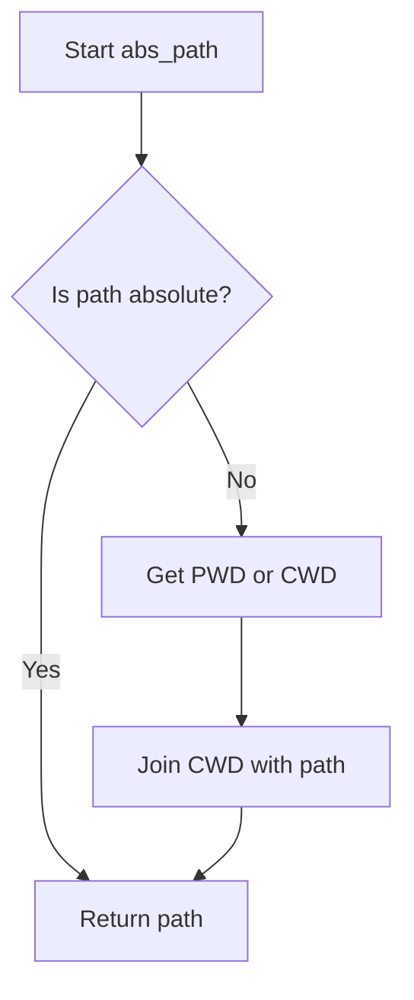

# `__init__.py`

## `flower.utils.__init__.gen_cookie_secret` · *function*

## Summary:
Generates a cryptographically secure random cookie secret using UUID4 random bytes encoded in base64 format.

## Description:
Creates a secure cookie secret by combining two randomly generated UUID4 identifiers and encoding the result in base64. This function is designed to produce cryptographically strong secrets suitable for use in web applications' session cookies or similar security-sensitive contexts.

## Args:
    None

## Returns:
    bytes: A base64-encoded byte string containing 48 bytes of random data (derived from two UUID4 identifiers).

## Raises:
    None

## Constraints:
    Preconditions:
    - The system must have access to the `uuid` and `base64` modules
    - The system must support the `uuid.uuid4()` function for generating random UUIDs
    
    Postconditions:
    - The returned value is always 48 bytes long (after base64 decoding)
    - The returned value contains cryptographically random data
    - The returned value is safe for use as a cookie secret

## Side Effects:
    None

## Control Flow:
```mermaid
flowchart TD
    A[Start gen_cookie_secret()] --> B[Generate first UUID4]
    B --> C[Generate second UUID4]
    C --> D[Concatenate UUID bytes]
    D --> E[Base64 encode concatenated bytes]
    E --> F[Return encoded secret]
```

## Examples:
```python
# Basic usage
secret = gen_cookie_secret()
print(secret)  # b'...' (base64-encoded bytes)

# Usage in a web application context
cookie_secret = gen_cookie_secret()
# This would typically be set in application configuration
# app_settings['cookie_secret'] = cookie_secret
```

## `flower.utils.__init__.bugreport` · *function*

## Summary:
Generates a formatted bug report string containing version information for Flower, Tornado, Humanize, and Celery dependencies.

## Description:
This function creates a diagnostic string that includes version numbers for the Flower application, Tornado web framework, Humanize library, and Celery task queue. It's designed to help diagnose environment issues by providing a snapshot of installed dependency versions. The function handles missing or improperly installed dependencies gracefully by catching ImportError and AttributeError exceptions.

## Args:
    app (celery.Celery, optional): A Celery application instance. If None, a new Celery instance is created using celery.Celery(). Defaults to None.

## Returns:
    str: A formatted string containing version information in the format "flower   -> flower:{version} tornado:{tornado_version} humanize:{humanize_version}{celery_bugreport_output}", or an error message if dependencies are missing.

## Raises:
    ImportError: When required modules (celery, humanize, tornado) cannot be imported.
    AttributeError: When required attributes (__version__, VERSION) are missing from the humanize module or when the app doesn't have a bugreport method.

## Constraints:
    Preconditions:
        - The function should be called in an environment where Python packages can be imported
        - Required modules (celery, humanize, tornado) should be installed
    Postconditions:
        - Returns a string with version information or an error message
        - Does not modify any global state or external resources

## Side Effects:
    - No I/O operations
    - No external state mutations
    - No external service calls
    - Only imports modules temporarily during execution

## Control Flow:
```mermaid
flowchart TD
    A[Start bugreport()] --> B{app is None?}
    B -- Yes --> C[Create celery.Celery()]
    B -- No --> D[Use provided app]
    C --> E[Import modules]
    D --> E
    E --> F[Try to get versions]
    F --> G{ImportError/AttributeError?}
    G -- Yes --> H[Return error message]
    G -- No --> I[Construct result string]
    I --> J[Return formatted string]
    H --> J
```

## Examples:
```python
# Basic usage
report = bugreport()
print(report)
# Output: "flower   -> flower:1.0.0 tornado:6.1.0 humanize:3.12.0<celery_bugreport_info>"

# With custom app
from celery import Celery
app = Celery('myapp')
report = bugreport(app)
print(report)
# Output: "flower   -> flower:1.0.0 tornado:6.1.0 humanize:3.12.0<custom_app_bugreport_info>"
```

## `flower.utils.__init__.abs_path` · *function*

## Summary:
Converts a file path to an absolute path by expanding user home directories and resolving relative paths against the current working directory.

## Description:
This utility function ensures that any given file path is converted to an absolute path. It handles paths that begin with '~' (home directory) by expanding them using `os.path.expanduser()`, and resolves relative paths by joining them with the current working directory. This function is particularly useful when working with file operations where absolute paths are required for consistency and reliability.

## Args:
    path (str): A file path that may be relative, contain user home directory references (~), or absolute.

## Returns:
    str: An absolute file path that represents the same location as the input path.

## Raises:
    OSError: Raised if the current working directory cannot be determined when the path is relative and PWD environment variable is not set.

## Constraints:
    Preconditions:
    - The input path must be a string
    - The current working directory must be accessible
    
    Postconditions:
    - The returned path is always absolute (starts with '/')

## Side Effects:
    None

## Control Flow:


## Examples:
    >>> abs_path("~/documents/file.txt")
    "/home/user/documents/file.txt"
    
    >>> abs_path("relative/path/file.txt")
    "/current/working/directory/relative/path/file.txt"
    
    >>> abs_path("/absolute/path/file.txt")
    "/absolute/path/file.txt"
    
    >>> abs_path("~")
    "/home/user"
```

## `flower.utils.__init__.prepend_url` · *function*

## Summary:
Combines a URL path with a prefix string, ensuring proper slash formatting.

## Description:
Prepends a URL path with a given prefix, normalizing the prefix by removing leading and trailing slashes while maintaining a single leading slash in the result. This function is designed to handle URL path construction consistently.

## Args:
    url (str): The URL path to prepend the prefix to. Should not start with a forward slash.
    prefix (str): The prefix string to prepend to the URL. Leading and trailing slashes will be stripped.

## Returns:
    str: A combined URL path starting with a forward slash, formed by concatenating '/' + prefix + url.

## Raises:
    None: This function does not explicitly raise any exceptions.

## Constraints:
    Preconditions:
        - The url parameter should not start with a forward slash to avoid double slashes in the result.
        - Both url and prefix parameters should be strings.
    
    Postconditions:
        - The returned string always starts with a forward slash.
        - The prefix is normalized by stripping leading/trailing slashes.
        - The resulting string contains the prefix followed by the url.

## Side Effects:
    None: This function has no side effects.

## Control Flow:
```mermaid
flowchart TD
    A[prepend_url(url, prefix)] --> B{url starts with '/'?}
    B -- Yes --> C[Strip leading slash from url]
    B -- No --> C
    C --> D[Strip leading/trailing slashes from prefix]
    D --> E[Concatenate '/' + prefix + url]
    E --> F[Return result]
```

## Examples:
    >>> prepend_url('users/123', 'api/v1')
    '/api/v1users/123'
    
    >>> prepend_url('/users/123', 'api/v1/')
    '/api/v1users/123'
    
    >>> prepend_url('users/123', '/api/v1/')
    '/api/v1users/123'
```

## `flower.utils.__init__.strtobool` · *function*

## Summary:
Converts string representations of truth to integer boolean values (1 for true, 0 for false).

## Description:
This utility function standardizes string inputs representing truth values into numeric boolean equivalents. It accepts common string representations of true and false values and converts them to 1 and 0 respectively. The function is designed to handle configuration values, environment variables, or user inputs that may be expressed as strings but need to be interpreted as boolean values in numeric contexts.

The logic is extracted into its own function to provide a centralized, reusable way to parse truth-like strings while maintaining consistent behavior across the application. This avoids duplication of parsing logic and ensures uniform handling of boolean string representations.

## Args:
    val (str): String representation of a truth value to convert. Must be a string.

## Returns:
    int: Returns 1 for truthy values and 0 for falsy values. Specifically:
        - Truthy values: 'y', 'yes', 't', 'true', 'on', '1' (case-insensitive)
        - Falsy values: 'n', 'no', 'f', 'false', 'off', '0' (case-insensitive)

## Raises:
    ValueError: Raised when the input string does not match any recognized truth value pattern. The error message includes the invalid input value.

## Constraints:
    Preconditions:
        - Input must be a string type
        - Input must not be None
    Postconditions:
        - Return value is always either 0 or 1
        - Function is case-insensitive for input strings

## Side Effects:
    None: This function has no side effects. It performs no I/O operations, modifies global state, or makes external service calls.

## Control Flow:
```mermaid
flowchart TD
    A[Start strtobool] --> B{Input val}
    B --> C{val.lower() in truthy set?}
    C -->|Yes| D[Return 1]
    C -->|No| E{val.lower() in falsy set?}
    E -->|Yes| F[Return 0]
    E -->|No| G[Raise ValueError]
```

## Examples:
    >>> strtobool('yes')
    1
    >>> strtobool('NO')
    0
    >>> strtobool('true')
    1
    >>> strtobool('false')
    0
    >>> strtobool('maybe')
    ValueError: invalid truth value 'maybe'
```

