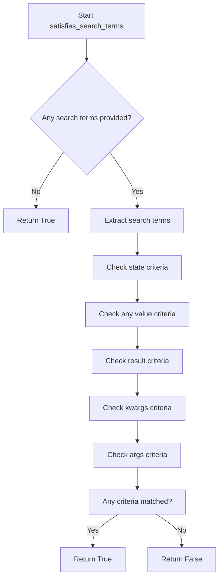

# `search.py`

## `flower.utils.search.parse_search_terms` · *function*

## Summary:
Parses a raw search string into structured search terms categorized by prefixes or general matches.

## Description:
Extracts and categorizes search terms from a raw string input, supporting special prefixes like 'result:', 'args:', 'kwargs:', and 'state:' to organize search parameters into a structured dictionary. Handles quoted strings properly by treating spaces within quotes as literal characters rather than delimiters.

## Args:
    raw_search_value (str): The raw search string to parse, potentially containing space-separated terms with optional prefixes.

## Returns:
    dict: A dictionary containing parsed search terms organized by category:
        - 'result': Single value for result filtering
        - 'args': List of positional argument values
        - 'kwargs': Dictionary mapping keyword argument names to values
        - 'state': List of state values
        - 'any': Single general value when no prefix is matched

## Raises:
    None explicitly raised, though ValueError may be raised internally by str.split() in kwargs processing which is caught and ignored.

## Constraints:
    Preconditions:
        - Input should be a string or None/empty string
    Postconditions:
        - Returns a dictionary with at least one key ('any') if input contains non-prefix terms
        - All values are processed through preprocess_search_value function
        - Empty or None input returns empty dictionary

## Side Effects:
    None

## Control Flow:
```mermaid
flowchart TD
    A[Start parse_search_terms] --> B{raw_search_value empty?}
    B -- Yes --> C[Return empty dict]
    B -- No --> D[Initialize parsed_search dict]
    D --> E[Find all query parts with regex]
    E --> F[For each query_part]
    F --> G{query_part starts with 'result:'?}
    G -- Yes --> H[Set parsed_search['result']]
    G -- No --> I{query_part starts with 'args:'?}
    I -- Yes --> J[Append to parsed_search['args']]
    I -- No --> K{query_part starts with 'kwargs:'?}
    K -- Yes --> L[Try split by '=' for key-value]
    L --> M{ValueError caught?}
    M -- Yes --> N[Continue to next part]
    M -- No --> O[Add to parsed_search['kwargs']]
    K -- No --> P{query_part starts with 'state:'?}
    P -- Yes --> Q[Append to parsed_search['state']]
    P -- No --> R[Set parsed_search['any']]
    R --> S[Return parsed_search]
```

## Examples:
    >>> parse_search_terms('result:success args:1 args:2')
    {'result': 'success', 'args': ['1', '2']}
    
    >>> parse_search_terms('kwargs:name="John Doe" kwargs:age=30')
    {'kwargs': {'name': 'John Doe', 'age': '30'}}
    
    >>> parse_search_terms('state:pending state:running')
    {'state': ['pending', 'running']}
    
    >>> parse_search_terms('simple term with spaces')
    {'any': 'simple term with spaces'}
    
    >>> parse_search_terms('')
    {}

## `flower.utils.search.satisfies_search_terms` · *function*

## Summary:
Determines whether a task matches specified search criteria across multiple fields including state, arguments, keyword arguments, and result values.

## Description:
This function evaluates if a task object satisfies various search terms by checking multiple criteria simultaneously. It's designed to support filtering and searching capabilities in task monitoring systems, allowing users to find tasks matching specific patterns or values across different task attributes.

The function extracts search terms from a dictionary and applies them to different aspects of the task object. It returns True if any of the search criteria match, making it useful for implementing flexible search functionality.

## Args:
    task (object): A task object with attributes including name, uuid, state, worker, args, kwargs, and result
    search_terms (dict): Dictionary containing search criteria with optional keys:
        - 'any' (str, optional): Search term that must appear in any of the task's string fields
        - 'result' (str, optional): Search term that must appear in the task's result
        - 'args' (list, optional): List of argument values that must be present in task arguments
        - 'kwargs' (dict, optional): Dictionary of keyword argument key-value pairs that must be present
        - 'state' (list, optional): List of task states that the task must match

## Returns:
    bool: True if the task matches any of the specified search criteria, False otherwise. Returns True when no search terms are provided.

## Raises:
    None explicitly raised

## Constraints:
    Preconditions:
        - task must be a valid object with the expected attributes (name, uuid, state, worker, args, kwargs, result)
        - search_terms must be a dictionary (or None, which gets handled gracefully)
    
    Postconditions:
        - Always returns a boolean value
        - When no search terms are provided, returns True (matches all tasks)

## Side Effects:
    None

## Control Flow:


## Examples:
    # Basic usage with state filtering
    search_terms = {'state': ['SUCCESS', 'FAILURE']}
    result = satisfies_search_terms(task, search_terms)
    
    # Search for specific result content
    search_terms = {'result': 'error'}
    result = satisfies_search_terms(task, search_terms)
    
    # Search across all fields
    search_terms = {'any': 'important_task'}
    result = satisfies_search_terms(task, search_terms)
    
    # Combined search criteria
    search_terms = {
        'state': ['PENDING'],
        'kwargs': {'priority': 'high'},
        'args': ['process_data']
    }
    result = satisfies_search_terms(task, search_terms)

## `flower.utils.search.stringified_dict_contains_value` · *function*

## Summary:
Checks if a stringified dictionary contains a specific key-value pair by parsing the string representation manually.

## Description:
This function parses a string representation of a dictionary to determine if a given key exists with a matching value. It's designed to work with dictionaries serialized as strings in a specific format, extracting values by locating keys and comparing them against expected values. The function handles quoted string values and properly strips quotes during comparison.

## Args:
    key (str): The key to search for within the stringified dictionary
    value (Any): The value to compare against the value found for the given key
    str_dict (str): String representation of a dictionary, expected to be in format like '{"key": "value"}'

## Returns:
    bool: True if the key exists in the stringified dictionary and its value matches the provided value, False otherwise

## Raises:
    None explicitly raised - uses try/except blocks to handle missing keys or delimiters

## Constraints:
    Preconditions:
        - str_dict should be a valid string representation of a dictionary with quoted keys and values
        - key should be a string that exists in the dictionary structure  
        - The str_dict format should follow JSON-like syntax with quoted keys and values
        - str_dict should not be None or empty
    
    Postconditions:
        - Function returns boolean indicating key-value match status
        - No modifications are made to input parameters

## Side Effects:
    None - This function is pure and has no side effects

## Control Flow:
```mermaid
flowchart TD
    A[Start] --> B{str_dict is empty or None?}
    B -- Yes --> C[Return False]
    B -- No --> D[value = str(value)]
    D --> E[Find key in str_dict]
    E -- Not found --> F[Return False]
    E -- Found --> G[Calculate key_index = index(key) + len(key) + 3]
    G --> H{Find comma after key_index?}
    H -- No --> I[Find '}' after key_index]
    H -- Yes --> I
    I --> J[Extract value substring: str_dict[key_index:comma_index]]
    J --> K[Strip quotes from value: strip('"\'')]
    K --> L[Compare stripped value with str(value)]
    L --> M[Return comparison result]
```

## Examples:
    # Basic usage with string values
    result = stringified_dict_contains_value('name', 'John', '{"name": "John", "age": 30}')
    # Returns True
    
    # Usage with numeric values (converted to string internally)
    result = stringified_dict_contains_value('age', 30, '{"name": "John", "age": 30}')
    # Returns True
    
    # Key not found
    result = stringified_dict_contains_value('height', 175, '{"name": "John", "age": 30}')
    # Returns False
    
    # Value mismatch
    result = stringified_dict_contains_value('name', 'Jane', '{"name": "John", "age": 30}')
    # Returns False
    
    # Empty dictionary
    result = stringified_dict_contains_value('key', 'value', '{}')
    # Returns False
```

## `flower.utils.search.preprocess_search_value` · *function*

## Summary:
Strips leading and trailing quotation marks and whitespace from a search value.

## Description:
This function processes raw search input by removing surrounding quotation marks and whitespace characters. It serves as a preprocessing step to normalize search terms before indexing or matching operations. The function is designed to handle edge cases where search input might contain unnecessary formatting characters.

## Args:
    raw_value (str, optional): The raw search input string that may contain surrounding quotation marks and whitespace. Can be None or empty string.

## Returns:
    str: The processed search value with leading/trailing quotation marks and whitespace removed. Returns empty string if input is None or empty.

## Raises:
    None: This function does not raise any exceptions.

## Constraints:
    Preconditions:
        - Input can be any string or None
        - No validation is performed on input type beyond checking truthiness
    
    Postconditions:
        - Output string contains no leading or trailing quotation marks (single or double)
        - Output string contains no leading or trailing whitespace characters
        - Empty string is returned when input is None or empty

## Side Effects:
    None: This function has no side effects.

## Control Flow:
```mermaid
flowchart TD
    A[Start] --> B{raw_value is truthy?}
    B -- Yes --> C[strip('" ')]
    B -- No --> D[Return empty string]
    C --> E[Return result]
    D --> E
```

## Examples:
    >>> preprocess_search_value(' "hello world" ')
    'hello world'
    
    >>> preprocess_search_value('"test"')
    'test'
    
    >>> preprocess_search_value(" 'quoted' ")
    "'quoted'"
    
    >>> preprocess_search_value('')
    ''
    
    >>> preprocess_search_value(None)
    ''

## `flower.utils.search.task_args_contains_search_args` · *function*

## Summary:
Determines whether all specified search arguments are present in the task arguments collection.

## Description:
Checks if every element in the search_args iterable is contained within the task_args iterable. This utility function is commonly used to validate that a task contains all required arguments before processing.

## Args:
    task_args (iterable): Collection of arguments that may contain the search terms
    search_args (iterable): Collection of arguments to search for within task_args

## Returns:
    bool: True if all elements in search_args are found in task_args, False otherwise

## Raises:
    None

## Constraints:
    Preconditions:
        - Both task_args and search_args should be iterable objects
        - The function assumes that both parameters support the 'in' operator
    
    Postconditions:
        - Returns a boolean value indicating membership of all search_args in task_args
        - Empty search_args always returns True (vacuous truth)

## Side Effects:
    None

## Control Flow:
```mermaid
flowchart TD
    A[Start] --> B{task_args is empty?}
    B -- Yes --> C[Return False]
    B -- No --> D[Check all(search_args in task_args)]
    D --> E{All elements found?}
    E -- Yes --> F[Return True]
    E -- No --> G[Return False]
```

## Examples:
    >>> task_args_contains_search_args(['a', 'b', 'c'], ['a', 'b'])
    True
    >>> task_args_contains_search_args(['a', 'b', 'c'], ['a', 'd'])
    False
    >>> task_args_contains_search_args([], ['a'])
    False
    >>> task_args_contains_search_args(['a', 'b'], [])
    True
```

