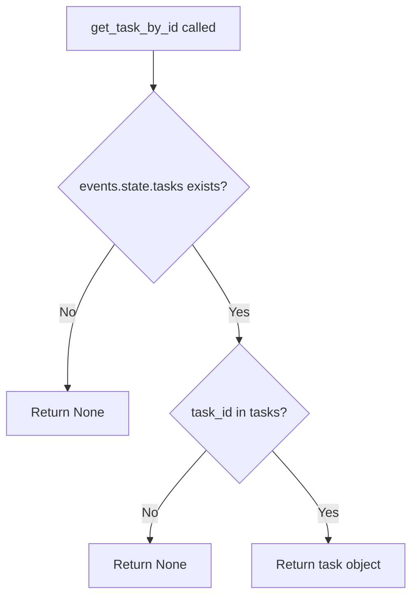

# `tasks.py`

## `flower.utils.tasks.iter_tasks` · *function*

## Summary:
Generates filtered and sorted task records from event data, supporting pagination and multiple filter criteria.

## Description:
This function iterates through task events and applies various filters to produce a subset of tasks matching specified criteria. It supports filtering by task type, worker hostname, task state, date ranges for task reception and start times, search terms, and sorting. The function implements pagination through limit and offset parameters and yields task UUIDs and task objects that meet all specified conditions.

The function is extracted to separate the task filtering and iteration logic from the presentation layer, allowing reuse across different views and APIs that need to display filtered task lists.

## Args:
    events: Task event data container with state attribute containing tasks_by_timestamp() method
    limit (int, optional): Maximum number of tasks to yield. If None, no limit is applied
    offset (int): Number of initial tasks to skip before yielding results. Defaults to 0
    type (str, optional): Filter tasks by task name/type. If None, no filtering by type is applied
    worker (str, optional): Filter tasks by worker hostname. If None, no filtering by worker is applied
    state (str, optional): Filter tasks by task state. If None, no filtering by state is applied
    sort_by (str, optional): Sort key for ordering tasks. Prefix with '-' for descending order
    received_start (str, optional): Filter tasks received after this datetime string in format 'YYYY-MM-DD HH:MM'
    received_end (str, optional): Filter tasks received before this datetime string in format 'YYYY-MM-DD HH:MM'
    started_start (str, optional): Filter tasks started after this datetime string in format 'YYYY-MM-DD HH:MM'
    started_end (str, optional): Filter tasks started before this datetime string in format 'YYYY-MM-DD HH:MM'
    search (dict, optional): Search term filters to apply to tasks

## Returns:
    Generator of tuples containing (uuid, task) for tasks matching all filter criteria

## Raises:
    AssertionError: When sort_by parameter contains invalid sort key

## Constraints:
    Preconditions:
    - events parameter must have a state attribute with tasks_by_timestamp() method
    - sort_by parameter must contain valid sort keys (defined in sort_keys constant)
    - Date string parameters must be in format 'YYYY-MM-DD HH:MM' if provided
    
    Postconditions:
    - All yielded tasks satisfy all specified filter criteria
    - Tasks are yielded in the specified sort order
    - Pagination respects limit and offset parameters

## Side Effects:
    None

## Control Flow:
```mermaid
flowchart TD
    A[Start iter_tasks] --> B{sort_by provided?}
    B -- Yes --> C[Sort tasks with sort_tasks]
    B -- No --> C
    C --> D[Initialize counter i=0]
    D --> E[Get tasks from events.state.tasks_by_timestamp()]
    E --> F[Parse search terms]
    F --> G{Loop through tasks}
    G --> H{type filter set?}
    H -- Yes --> I{task.name != type?}
    I -- Yes --> J[Skip to next task]
    H -- No --> J
    J --> K{worker filter set?}
    K -- Yes --> L{task.worker and hostname != worker?}
    L -- Yes --> M[Skip to next task]
    K -- No --> M
    M --> N{state filter set?}
    N -- Yes --> O{task.state != state?}
    O -- Yes --> P[Skip to next task]
    N -- No --> P
    P --> Q{received_start set?}
    Q -- Yes --> R{task.received < converted_start?}
    R -- Yes --> S[Skip to next task]
    Q -- No --> S
    S --> T{received_end set?}
    T -- Yes --> U{task.received > converted_end?}
    U -- Yes --> V[Skip to next task]
    T -- No --> V
    V --> W{started_start set?}
    W -- Yes --> X{task.started < converted_start?}
    X -- Yes --> Y[Skip to next task]
    W -- No --> Y
    Y --> Z{started_end set?}
    Z -- Yes --> AA{task.started > converted_end?}
    AA -- Yes --> AB[Skip to next task]
    Z -- No --> AB
    AB --> AC{search terms defined?}
    AC -- Yes --> AD{satisfies_search_terms returns false?}
    AD -- Yes --> AE[Skip to next task]
    AC -- No --> AE
    AE --> AF{i >= offset?}
    AF -- Yes --> AG[Yield (uuid, task)]
    AF -- No --> AH[Continue]
    AG --> AI[i += 1]
    AI --> AJ{limit set?}
    AJ -- Yes --> AK{i == limit + offset?}
    AK -- Yes --> AL[Break loop]
    AJ -- No --> AM[Continue loop]
    AH --> AM
    AM --> G
    AL --> AN[End]
```

## Examples:
    # Get all tasks with pagination
    for uuid, task in iter_tasks(events, limit=10, offset=20):
        print(f"Task {uuid}: {task.name}")
    
    # Get tasks of specific type received in last 24 hours
    from datetime import datetime, timedelta
    yesterday = (datetime.now() - timedelta(days=1)).strftime('%Y-%m-%d %H:%M')
    for uuid, task in iter_tasks(events, type='my_task', received_start=yesterday):
        print(f"Recent task: {task.name}")
    
    # Get sorted tasks by start time
    for uuid, task in iter_tasks(events, sort_by='-started'):
        print(f"Task {uuid} started at {task.started}")

## `flower.utils.tasks.sort_tasks` · *function*

## Summary:
Generates task tuples in sorted order based on a specified attribute, supporting both ascending and descending sort orders.

## Description:
This generator function sorts task objects by a specified attribute and yields them in the resulting order. It's designed to work with task data structures where each task is represented as a tuple containing an index and a task object with attributes. The function supports both ascending and descending sort orders through a leading minus sign in the sort parameter. This logic is extracted into a separate function to provide a reusable sorting mechanism for task collections.

## Args:
    tasks (iterable): An iterable of tuples where each tuple contains (index, task_object) where task_object has attributes to sort by.
    sort_by (str): The attribute name to sort by. Can be prefixed with '-' for descending order.

## Returns:
    generator: A generator yielding tuples of (index, task_object) in the specified sort order.

## Raises:
    AssertionError: When the sort_by parameter doesn't correspond to a valid sort key in the global sort_keys dictionary.

## Constraints:
    Preconditions:
        - The tasks parameter must be iterable containing tuples of (index, task_object)
        - The task_object must have the attribute specified in sort_by
        - The global variable sort_keys must be defined as a dictionary mapping sort field names to functions that return appropriate default values
        - The sort_by parameter must reference a valid key in the sort_keys dictionary
    
    Postconditions:
        - The returned generator yields items in the requested sort order
        - All items from the input tasks are yielded exactly once

## Side Effects:
    None

## Control Flow:
```mermaid
flowchart TD
    A[Start sort_tasks] --> B{sort_by starts with '-'}
    B -- Yes --> C[Remove '-' prefix from sort_by]
    B -- No --> C
    C --> D[Set reverse=True if descending]
    D --> E[Validate sort_by key exists in sort_keys]
    E --> F{Key valid?}
    F -- No --> G[Assertion Error]
    F -- Yes --> H[For each task in sorted(tasks, key=getattr(x[1], sort_by) or sort_keys[sort_by]())]
    H --> I[Yield task tuple]
    I --> J[End]
```

## Examples:
```python
# Sort tasks by creation time (ascending)
sorted_tasks = sort_tasks(task_list, 'created_at')

# Sort tasks by priority (descending)
sorted_tasks = sort_tasks(task_list, '-priority')
```

## `flower.utils.tasks.get_task_by_id` · *function*

## Summary:
Retrieves a specific task from the events state by its unique identifier.

## Description:
This function provides access to a task stored within the events state collection using the task's unique identifier. It serves as a centralized accessor for retrieving individual tasks from the broader task management system by delegating to the underlying dictionary's get() method.

## Args:
    events: An object containing state information with a tasks collection
    task_id: The unique identifier of the task to retrieve

## Returns:
    The task object matching the provided task_id if found, or None if no matching task exists

## Raises:
    None explicitly raised - delegates to dict.get() which may raise TypeError if called with incompatible argument types

## Constraints:
    Preconditions:
    - The events parameter must be a valid object with a state attribute
    - The events.state must contain a tasks attribute that supports the get() method
    - The task_id parameter should be of a type compatible with the tasks dictionary keys
    
    Postconditions:
    - The function returns either a task object or None without modifying the underlying data structure

## Side Effects:
    None - performs only a lookup operation without I/O or state mutation

## Control Flow:


## Examples:
    # Retrieve an existing task
    task = get_task_by_id(events, "task_123")
    if task:
        print(f"Found task: {task.name}")
    
    # Handle case where task doesn't exist
    task = get_task_by_id(events, "nonexistent_task")
    if task is None:
        print("Task not found")

## `flower.utils.tasks.as_dict` · *function*

## Summary:
Delegates to a task object's as_dict() method to convert it into a dictionary representation.

## Description:
This function acts as a simple wrapper that calls the `as_dict()` method on the provided task object. It serves as an abstraction layer that allows for consistent conversion of task objects to dictionary format regardless of the specific task implementation.

## Args:
    task (object): A task object that must implement an `as_dict()` method. The exact type and structure of this object is determined by the application's task implementation.

## Returns:
    dict: The result of calling `task.as_dict()`. The structure of this dictionary depends entirely on the implementation of the task's `as_dict()` method.

## Raises:
    AttributeError: If the provided task object does not have an `as_dict()` method.

## Constraints:
    Preconditions:
    - The task parameter must be a valid object (not None)
    - The task object must implement an `as_dict()` method
    
    Postconditions:
    - Returns whatever value is returned by `task.as_dict()`
    - The returned value should be a dictionary

## Side Effects:
    None

## Control Flow:
```mermaid
flowchart TD
    A[as_dict(task)] --> B{task has as_dict method?}
    B -- Yes --> C[task.as_dict()]
    B -- No --> D[AttributeError]
    C --> E[Return dict]
    D --> F[Exception Raised]
```

## Examples:
```python
# Basic usage
task = SomeTaskImplementation()
result = as_dict(task)
# Returns whatever task.as_dict() returns

# Error handling
try:
    invalid_task = None
    as_dict(invalid_task)
except AttributeError as e:
    print(f"Error: {e}")
```

