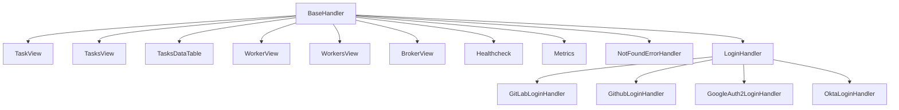

# `flower.views`

## Tree:
```
views/
├── __init__.py
├── auth.py
├── broker.py
├── error.py
├── monitor.py
├── tasks.py
└── workers.py
```

## Role:
Provides HTTP request handlers and view controllers for the Flower web interface that visualizes and manages Celery task queues and workers.

## Description:
This module implements the web interface views for Flower, a web-based monitoring tool for Celery distributed task queues. It handles all HTTP requests and responses for displaying task information, worker statistics, broker details, and authentication flows. The module serves as the presentation layer that bridges the Celery application with the user-facing web interface.

The views are organized by functionality:
- Authentication handlers for various OAuth providers
- Task management views for viewing individual tasks and task lists
- Worker monitoring views for tracking worker status and performance
- Broker inspection views for examining message queues
- System monitoring endpoints for health checks and metrics

Primary consumers include the main Flower application server and web clients accessing the monitoring dashboard.

## Components:
*   `BaseHandler` - Base request handler with common functionality like authentication, error handling, and task formatting
*   `GitLabLoginHandler` - OAuth2 login handler for GitLab authentication
*   `GithubLoginHandler` - OAuth2 login handler for GitHub authentication
*   `GoogleAuth2LoginHandler` - OAuth2 login handler for Google authentication
*   `LoginHandler` - Factory class that instantiates appropriate authentication handler
*   `OktaLoginHandler` - OAuth2 login handler for Okta authentication
*   `NotFoundErrorHandler` - Handler for 404 errors
*   `BrokerView` - View for displaying broker queue information
*   `Healthcheck` - Endpoint for system health monitoring
*   `Metrics` - Prometheus metrics endpoint
*   `Comparable` - Helper class for sorting tasks
*   `TaskView` - View for displaying individual task details
*   `TasksDataTable` - Data table handler for task listings with filtering and sorting
*   `TasksView` - Main view for task listing page
*   `WorkerView` - View for displaying individual worker details
*   `WorkersView` - View for displaying worker list and statistics



## Public API:
*   `BaseHandler` - Base class for all view handlers providing common functionality
*   `TaskView.get(task_id)` - Render detailed view for a specific task by ID
*   `TasksView.get()` - Render the main tasks listing page
*   `TasksDataTable.get()` - Provide JSON data for DataTables JavaScript component with filtering and sorting capabilities
*   `WorkerView.get(name)` - Render detailed view for a specific worker by name
*   `WorkersView.get()` - Render the main workers listing page with worker statistics
*   `BrokerView.get()` - Render broker queue information for AMQP brokers
*   `Healthcheck.get()` - Return system health status ("OK") for health monitoring
*   `Metrics.get()` - Return Prometheus metrics in text format
*   `LoginHandler` - Factory for creating authentication handlers based on configuration
*   `GitLabLoginHandler.get()` - Handle GitLab OAuth2 authentication flow
*   `GithubLoginHandler.get()` - Handle GitHub OAuth2 authentication flow
*   `GoogleAuth2LoginHandler.get()` - Handle Google OAuth2 authentication flow
*   `OktaLoginHandler.get()` - Handle Okta OAuth2 authentication flow

## Dependencies:
*   Internal: `flower.utils.tasks` - Task utility functions for task retrieval and iteration
*   Internal: `flower.utils.broker` - Broker connection utilities for broker inspection
*   Internal: `flower.utils.template` - Template rendering utilities for HTML rendering
*   External: `tornado.web` - Tornado web framework components for HTTP handling
*   External: `tornado.auth` - Tornado authentication mixins for OAuth2 support
*   External: `prometheus_client` - Prometheus metrics collection for monitoring
*   External: `celery` - Celery task queue components for accessing task and worker data

## Constraints:
*   All authenticated views require proper user authentication via either basic auth or OAuth2
*   Views must be accessed through the configured URL prefix if set
*   Task and worker views require valid identifiers (task ID or worker name)
*   Broker views are transport-specific (AMQP only currently)
*   Authentication handlers require proper OAuth2 configuration in environment variables
*   Thread-safe: All handlers are designed to be thread-safe for concurrent access
*   Initialization: Application must be properly initialized with Celery app and event state before serving requests

---

## Files

- [`__init__.py`](views/__init__.md)
- [`auth.py`](views/auth.md)
- [`broker.py`](views/broker.md)
- [`error.py`](views/error.md)
- [`monitor.py`](views/monitor.md)
- [`tasks.py`](views/tasks.md)
- [`workers.py`](views/workers.md)

