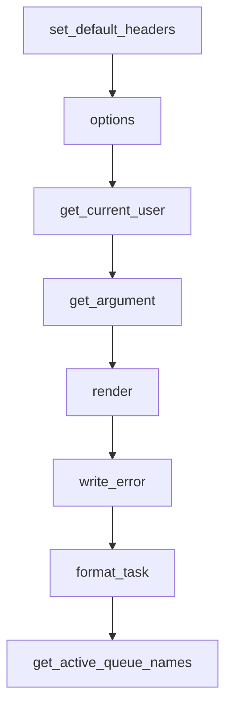

# `__init__.py`

## `flower.views.__init__.BaseHandler` · *class*

## Summary:
BaseHandler is a custom Tornado web request handler that extends the standard RequestHandler with authentication, rendering, error handling, and Celery integration capabilities for the Flower web interface.

## Description:
This class serves as the foundation for all web request handlers in the Flower application. It provides standardized HTTP behavior including CORS headers, authentication mechanisms (basic auth and OAuth2), enhanced argument parsing with type conversion, custom error rendering, and integration with Celery task monitoring features. The class is designed to be subclassed by specific view handlers that implement particular endpoints.

## State:
- application: The Tornado application instance containing configuration options, workers, and Celery app
- request: The current HTTP request being processed
- capp: Property that returns the Celery application object from the application instance
- Various inherited attributes from tornado.web.RequestHandler such as request, response, and cookies

## Lifecycle:
- Creation: Instantiated automatically by Tornado framework when handling HTTP requests
- Usage: Methods are invoked in standard Tornado request processing order:
  1. set_default_headers() - Called once per request to set CORS headers
  2. options() - Handles preflight OPTIONS requests
  3. get_current_user() - Called during authentication process
  4. get_argument() - Parses and validates URL/form arguments
  5. render() - Renders templates with context
  6. write_error() - Handles error responses
- Destruction: Managed automatically by Tornado framework

## Method Map:


## Raises:
- tornado.web.HTTPError: Raised in various methods for authentication failures (401), invalid arguments (400), and HTTP errors
- ValueError: Raised by strtobool when converting string to boolean with invalid values
- TypeError: Raised during type conversion when incompatible types are provided

## Example:
```python
# Typical usage in a subclass
class MyView(BaseHandler):
    def get(self):
        # Access authenticated user
        user = self.get_current_user()
        
        # Get and validate arguments
        task_id = self.get_argument('task_id', type=str)
        
        # Render template with context
        self.render('my_template.html', 
                   task_id=task_id, 
                   user=user)
```

### `flower.views.__init__.BaseHandler.set_default_headers` · *method*

## Summary:
Sets Cross-Origin Resource Sharing (CORS) headers for HTTP responses when authentication is disabled.

## Description:
This method configures CORS headers to allow cross-origin requests from any domain. It is automatically called by the Tornado framework during HTTP response preparation. The CORS headers are only applied when neither basic authentication nor regular authentication is enabled in the application configuration, as authentication-enabled environments may require more restrictive CORS policies.

## Args:
    self: The BaseHandler instance

## Returns:
    None

## Raises:
    None explicitly raised

## State Changes:
    Attributes READ: 
    - self.application.options.basic_auth
    - self.application.options.auth
    
    Attributes WRITTEN:
    - HTTP response headers (via self.set_header calls)

## Constraints:
    Preconditions:
    - self must be an instance of BaseHandler (which inherits from tornado.web.RequestHandler)
    - self.application must have options attribute with basic_auth and auth properties
    
    Postconditions:
    - If authentication is disabled, CORS headers are set on the HTTP response
    - If authentication is enabled, no CORS headers are added to the response

## Side Effects:
    - Modifies HTTP response headers to include CORS configuration
    - No external service calls or I/O operations performed

### `flower.views.__init__.BaseHandler.options` · *method*

## Summary:
Handles HTTP OPTIONS requests by setting a 204 No Content status and completing the response.

## Description:
This method implements the standard HTTP OPTIONS request handler, typically used for CORS preflight requests. It sets the HTTP status code to 204 (No Content) and finishes the response without sending any content back to the client. This is commonly used in web applications to indicate that a particular resource supports certain HTTP methods and headers.

## Args:
    self: The BaseHandler instance
    *_: Variable positional arguments (ignored)
    **__: Variable keyword arguments (ignored)

## Returns:
    None

## Raises:
    None

## State Changes:
    Attributes READ: None
    Attributes WRITTEN: None

## Constraints:
    Preconditions: None
    Postconditions: The HTTP response status is set to 204 and the response is completed

## Side Effects:
    I/O: Writes HTTP response headers and completes the HTTP response

### `flower.views.__init__.BaseHandler.render` · *method*

## Summary:
Updates rendering context with template helper functions and URL prefix before delegating to parent render method.

## Description:
This method extends the standard Tornado RequestHandler render functionality by automatically injecting template helper functions from the template module and setting the URL prefix. It ensures template functions don't conflict with user-provided keyword arguments and then delegates to the parent class's render method.

The method is designed to make template helper functions globally available to all rendered templates without requiring explicit passing in each render call, while also providing consistent URL prefix handling across the application.

## Args:
    *args: Positional arguments passed to parent render method
    **kwargs: Keyword arguments passed to parent render method, with automatic injection of template functions and url_prefix

## Returns:
    None: This method doesn't return a value, but calls the parent render method which typically returns None

## Raises:
    AssertionError: When any template function name conflicts with existing keyword arguments in kwargs

## State Changes:
    Attributes READ: self.application.options, self.application
    Attributes WRITTEN: None - this method doesn't modify instance state

## Constraints:
    Preconditions:
    - self.application must have an options attribute with a url_prefix property
    - template module must be importable and contain functions
    - kwargs must not already contain keys matching template function names
    
    Postconditions:
    - kwargs will contain all template functions from template module
    - kwargs will contain url_prefix key with value from app_options.url_prefix
    - Parent render method will be called with updated kwargs

## Side Effects:
    None: This method doesn't perform I/O operations or mutate external state directly

### `flower.views.__init__.BaseHandler.write_error` · *method*

## Summary:
Handles HTTP error responses by rendering appropriate templates or setting specific headers based on the status code.

## Description:
This method overrides Tornado's default error handling to provide customized responses for different HTTP status codes. It renders specific HTML templates for client errors (404, 403) and server errors (500), sets authentication headers for unauthorized requests (401), and provides plain text error messages for other HTTP errors.

## Args:
    status_code (int): The HTTP status code to handle
    **kwargs: Additional keyword arguments, typically containing 'exc_info' with exception information

## Returns:
    None: This method doesn't return a value but modifies the HTTP response

## Raises:
    None explicitly raised: The method handles exceptions internally through Tornado's error reporting

## State Changes:
    Attributes READ: 
    - self.application.options.debug
    - self.application.options (for debug flag)
    Attributes WRITTEN:
    - HTTP response headers and body through various Tornado methods

## Constraints:
    Preconditions:
    - Must be called from within a Tornado web request context
    - Status code must be an integer representing a valid HTTP status code
    - When exc_info is provided, it should contain exception information in the format (exception_type, exception_instance, traceback)
    
    Postconditions:
    - HTTP response is properly formatted according to the status code
    - Response headers are set appropriately for the error type
    - Response body contains meaningful error information

## Side Effects:
    - Sets HTTP response status code
    - Sets HTTP response headers (WWW-Authenticate for 401 errors)
    - Renders HTML templates for 404, 403, and 500 errors
    - Writes response body content directly to the HTTP connection
    - May trigger template rendering and file I/O operations

### `flower.views.__init__.BaseHandler.get_current_user` · *method*

## Summary:
Retrieves the currently authenticated user by validating either Basic Authentication credentials or OAuth2 session cookies.

## Description:
This method implements authentication logic for the web application, supporting both HTTP Basic Authentication and OAuth2-style session management via secure cookies. It first attempts to validate Basic Authentication credentials from the Authorization header, then falls back to checking a secure 'user' cookie if Basic Auth is not configured or fails. The method is designed to be called by Tornado's authentication system to determine the current user context.

## Args:
    self: The BaseHandler instance containing request and application context

## Returns:
    bool|str|None: Returns True if Basic Authentication is enabled but no credentials were provided, the username string if authentication succeeds via cookie validation, or None if authentication fails or is not configured.

## Raises:
    tornado.web.HTTPError: Raised with status code 401 when Basic Authentication credentials are invalid, malformed, or missing.

## State Changes:
    Attributes READ: 
        - self.application.options.basic_auth
        - self.request.headers
        - self.application.options.auth
        - self.get_secure_cookie()
    Attributes WRITTEN: None

## Constraints:
    Preconditions:
        - self.application.options.basic_auth must be either None or a list/tuple of valid credential strings
        - self.application.options.auth must be either None or a valid regular expression pattern string
        - self.request.headers must be accessible for header parsing
        - self.get_secure_cookie() must be callable and return appropriate cookie data

    Postconditions:
        - If Basic Auth is enabled and valid credentials are provided, the method returns without raising an exception
        - If OAuth2 is configured and valid cookie exists, returns the matching username string
        - If no authentication is configured or none is valid, returns None

## Side Effects:
    - Makes no external I/O operations
    - Does not mutate any application state
    - May raise HTTPError which terminates the request processing

### `flower.views.__init__.BaseHandler.get_argument` · *method*

## Summary:
Retrieves and processes a request argument with optional type conversion and HTML escaping.

## Description:
Extends the parent class's argument retrieval to provide additional processing including HTML escaping for string arguments and automatic type conversion. This method ensures that arguments are properly sanitized and validated according to specified types.

## Args:
    name (str): The name of the argument to retrieve from the request.
    default (list, optional): Default value if argument is not present. Defaults to [].
    strip (bool, optional): Whether to strip whitespace from the argument. Defaults to True.
    type (type, optional): Expected type for the argument. If specified, the argument will be converted to this type. Defaults to None.

## Returns:
    The requested argument value, potentially processed with HTML escaping and type conversion.

## Raises:
    tornado.web.HTTPError: Raised when type conversion fails and the argument is not None and default is not None.

## State Changes:
    Attributes READ: None
    Attributes WRITTEN: None

## Constraints:
    Preconditions: The method assumes the parent class has a working get_argument method.
    Postconditions: If type is specified, the returned value will be of the specified type, or an HTTPError will be raised.

## Side Effects:
    I/O: May raise HTTPError which results in an HTTP response being sent to the client.
    External service calls: None
    Mutations to objects outside self: None

### `flower.views.__init__.BaseHandler.capp` · *method*

## Summary:
Returns the Celery application object associated with the current application instance.

## Description:
This property provides convenient access to the Celery application instance from view handlers. It serves as a shortcut to retrieve the Celery configuration and functionality without having to navigate through the application object hierarchy directly. This is particularly useful in view handlers where Celery-specific operations are needed.

## Args:
    None

## Returns:
    The Celery application object (capp) from the application instance.

## Raises:
    AttributeError: If self.application or self.application.capp does not exist.

## State Changes:
    Attributes READ: self.application, self.application.capp
    Attributes WRITTEN: None

## Constraints:
    Preconditions: 
    - self must be an instance of BaseHandler or a subclass
    - self.application must be initialized and contain a capp attribute
    - self.application.capp must be a valid Celery application instance
    
    Postconditions:
    - Returns a valid Celery application object
    - Does not modify any state on self or self.application

## Side Effects:
    None

### `flower.views.__init__.BaseHandler.format_task` · *method*

## Summary:
Formats a task using a custom formatting function if configured, returning the potentially modified task object.

## Description:
This method applies a custom task formatting function to a task object if one has been configured in the application options. The method creates a shallow copy of the task before formatting to avoid modifying the original task data. If the custom formatting function raises an exception, it logs the error but continues execution.

## Args:
    task (Any): The task object to be formatted. Expected to have a 'uuid' attribute for logging purposes.

## Returns:
    Any: The formatted task object, or the original task if no custom formatter is configured.

## Raises:
    None explicitly raised, though exceptions from custom formatting functions are caught and logged.

## State Changes:
    Attributes READ: 
        - self.application.options.format_task
        - task.uuid (for logging purposes)
    Attributes WRITTEN: None

## Constraints:
    Preconditions:
        - The task object must have a 'uuid' attribute for proper logging if formatting fails
        - The custom formatting function, if configured, must accept a single argument (the task)
    Postconditions:
        - The original task object remains unmodified due to use of copy.copy()
        - The returned task is either the original or the result of custom formatting

## Side Effects:
    - May perform I/O operations through logging if custom formatting fails
    - Calls external custom formatting function if configured

### `flower.views.__init__.BaseHandler.get_active_queue_names` · *method*

## Summary:
Retrieves and returns a sorted list of all active queue names from workers and fallback default queues.

## Description:
This method aggregates queue names from all active workers in the application and falls back to default queue configurations when no active queues are found. It serves as a utility for retrieving available queue names for display or processing in the Flower web interface.

The method collects queue names from worker information and combines them with default queue settings to ensure a complete list of available queues is returned. This approach ensures that even when workers are not reporting active queues, users still see meaningful queue information.

This logic is encapsulated in its own method because it combines data from multiple sources (worker active queues and default configurations) and performs a consistent sorting operation that would be repetitive to inline in multiple locations.

## Args:
    None

## Returns:
    list[str]: A sorted list of unique queue names. Returns an empty list if no queues are available from either workers or default configurations.

## Raises:
    None explicitly raised

## State Changes:
    Attributes READ:
        - self.application.workers: Dictionary containing worker information, where each worker's info contains 'active_queues' key
        - self.capp.conf.task_default_queue: Default queue name from Celery configuration
        - self.capp.conf.task_queues: List of configured queues from Celery configuration

    Attributes WRITTEN:
        - None

## Constraints:
    Preconditions:
        - self.application.workers must be iterable and contain dictionaries with 'active_queues' key
        - self.capp.conf.task_default_queue must be a string or None
        - self.capp.conf.task_queues must be iterable or None

    Postconditions:
        - Returns a sorted list of unique queue names
        - Always returns a list (never None)

## Side Effects:
    None

