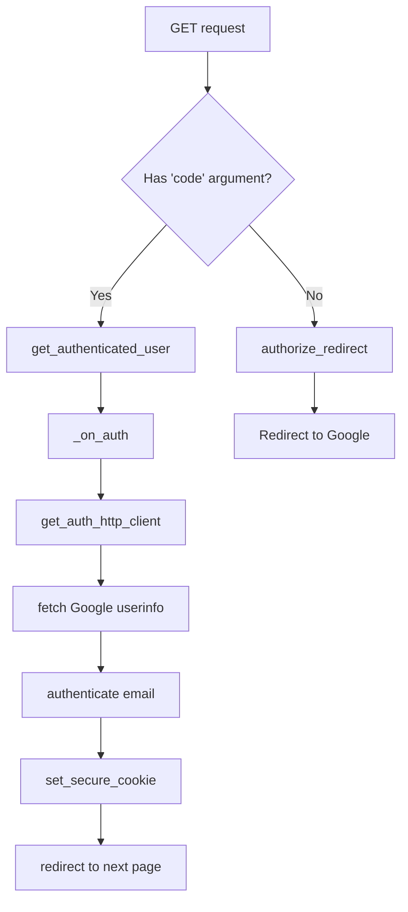
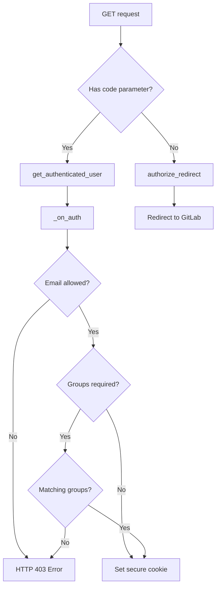

# `auth.py`

## `flower.views.auth.authenticate` · *function*

## Summary:
Validates an email address against various pattern formats including exact match, pipe-separated lists, and wildcard patterns.

## Description:
This utility function performs email validation by matching an email address against different pattern formats. It supports three distinct pattern types: exact string matching, pipe-separated lists of acceptable emails, and wildcard patterns with asterisk (*) for partial matching. The function is designed to be used in authentication contexts where flexible email validation rules are needed.

## Args:
    pattern (str): The authentication pattern to match against. Can be an exact email string, a pipe-separated list of emails (e.g., "user1@example.com|user2@example.com"), or a wildcard pattern (e.g., "*.example.com").
    email (str): The email address to validate against the pattern.

## Returns:
    bool: True if the email matches the pattern according to the specified matching rules, False otherwise.

## Raises:
    None: This function does not explicitly raise exceptions.

## Constraints:
    Preconditions:
    - Both `pattern` and `email` must be strings
    - Pattern should not be empty for meaningful comparison
    
    Postconditions:
    - Returns a boolean value (True or False)
    - Function execution is deterministic for given inputs

## Side Effects:
    None: This function has no side effects and is purely a computational operation.

## Control Flow:
```mermaid
flowchart TD
    A[Start authenticate] --> B{Pattern contains '|'}
    B -- Yes --> C[Split pattern by '|', check if email in list]
    B -- No --> D{Pattern contains '*'}
    D -- Yes --> E[Process wildcard pattern with regex]
    D -- No --> F[Exact string comparison]
    C --> G[Return result]
    E --> G
    F --> G
```

## Examples:
    # Exact match
    authenticate("user@example.com", "user@example.com")  # Returns True
    authenticate("user@example.com", "other@example.com")  # Returns False
    
    # Pipe-separated list
    authenticate("user1@example.com|user2@example.com", "user1@example.com")  # Returns True
    authenticate("user1@example.com|user2@example.com", "user3@example.com")  # Returns False
    
    # Wildcard pattern
    authenticate("*.example.com", "user@example.com")  # Returns True
    authenticate("user.*@example.com", "user.name@example.com")  # Returns True
``

## `flower.views.auth.validate_auth_option` · *function*

## Summary:
Validates authentication pattern strings to ensure proper formatting and prevent invalid configurations.

## Description:
This function performs validation checks on authentication pattern strings to ensure they follow proper syntax rules. It's designed to prevent malformed patterns that could cause authentication issues or security vulnerabilities. The validation ensures that wildcard characters are used appropriately in authentication configurations.

## Args:
    pattern (str): The authentication pattern string to validate, typically containing email-like identifiers or service names with optional wildcards.

## Returns:
    bool: True if the pattern passes all validation checks, False otherwise.

## Raises:
    None: This function does not raise exceptions.

## Constraints:
    Preconditions:
    - The input pattern must be a string
    - The pattern should represent a valid authentication identifier format
    
    Postconditions:
    - Returns a boolean value indicating validity of the pattern
    - No side effects occur during validation

## Side Effects:
    None: This function has no side effects.

## Control Flow:
```mermaid
flowchart TD
    A[Start validate_auth_option] --> B{pattern.count('*') > 1?}
    B -- Yes --> C[Return False]
    B -- No --> D{'*' in pattern AND '|' in pattern?}
    D -- Yes --> E[Return False]
    D -- No --> F{'*' in pattern.rsplit('@', 1)[-1]?}
    F -- Yes --> G[Return False]
    F -- No --> H[Return True]
```

## Examples:
    # Valid patterns
    validate_auth_option("user@example.com")  # Returns True
    validate_auth_option("user*@example.com")  # Returns True
    validate_auth_option("*@example.com")     # Returns True
    
    # Invalid patterns
    validate_auth_option("user*test@example.com")  # Returns False (multiple wildcards)
    validate_auth_option("*|user@example.com")     # Returns False (wildcard and pipe)
    validate_auth_option("user*@example.*")        # Returns False (wildcard in domain)
```

## `flower.views.auth.GoogleAuth2LoginHandler` · *class*

## Summary:
Handles Google OAuth2 authentication flow for the Flower web application.

## Description:
This class implements the Google OAuth2 login handler that manages the authentication process with Google accounts. It serves as the endpoint that receives OAuth2 callbacks from Google, validates the authentication response, fetches user profile information, verifies the user's email against configured authorization patterns, and establishes a secure session cookie for the authenticated user.

The handler is typically invoked when users attempt to access protected resources and need to authenticate via Google. It follows the standard OAuth2 authorization code flow by redirecting users to Google's authorization server and handling the callback with the authorization code.

## State:
- _OAUTH_SETTINGS_KEY: Class constant string 'oauth' used to access OAuth configuration from settings
- Inherits all state from BaseHandler including request/response objects, application reference, and settings
- Instance maintains standard Tornado RequestHandler state including HTTP method, headers, cookies, and URL arguments

## Lifecycle:
- Creation: Instantiated automatically by Tornado's routing mechanism when matching the configured URL pattern
- Usage: Called via HTTP GET requests to the configured endpoint
- The handler processes the OAuth2 flow in two phases:
  1. Initial request without 'code' argument: Redirects user to Google authorization server
  2. Callback request with 'code' argument: Exchanges code for tokens and validates user
- Destruction: Automatic cleanup by Tornado framework after response is sent

## Method Map:


## Raises:
- tornado.web.HTTPError(403): When Google authentication fails, user email is not authorized, or token exchange fails
- tornado.web.HTTPError(400): When invalid arguments are provided (inherited from BaseHandler.get_argument)

## Example:
```python
# Typical usage flow:
# 1. User accesses protected resource requiring authentication
# 2. Handler redirects to Google OAuth2 authorization URL
# 3. User grants permission and Google redirects back with authorization code
# 4. Handler exchanges code for access token and fetches user info
# 5. Handler validates user email against auth pattern
# 6. Handler sets secure cookie and redirects user to original destination
```

### `flower.views.auth.GoogleAuth2LoginHandler.get` · *method*

## Summary:
Handles Google OAuth2 authentication flow by either redirecting users to Google for authorization or processing the OAuth2 callback.

## Description:
This method implements the Google OAuth2 login flow for the Flower web application. When a user accesses the Google login endpoint, this method determines whether to initiate the OAuth2 authorization process or handle the callback from Google after successful authentication. It leverages Tornado's built-in GoogleOAuth2Mixin to handle the OAuth2 protocol details.

The method is part of the GoogleAuth2LoginHandler class which inherits from BaseHandler and tornado.auth.GoogleOAuth2Mixin. It uses the _OAUTH_SETTINGS_KEY constant to retrieve OAuth2 configuration from the application settings.

This method serves as the entry point for the Google OAuth2 authentication flow. When a user first visits the Google login URL, they are redirected to Google for authorization. After Google authenticates the user, it redirects back to this endpoint with an authorization code. This method processes that callback and completes the authentication flow.

## Args:
    None

## Returns:
    None

## Raises:
    tornado.web.HTTPError: Raised with status code 403 when Google authentication fails or when user email is not authorized for access.

## State Changes:
    Attributes READ: 
    - self.settings (via indexing with _OAUTH_SETTINGS_KEY)
    - self.get_argument() (method call)
    
    Methods CALLED:
    - self.get_authenticated_user() (inherited from tornado.auth.GoogleOAuth2Mixin)
    - self.authorize_redirect() (inherited from tornado.auth.GoogleOAuth2Mixin)
    - self._on_auth() (custom method)
    
    Attributes WRITTEN:
    - self.set_secure_cookie() (indirectly via _on_auth)
    - self.redirect() (indirectly via _on_auth)

## Constraints:
    Preconditions:
    - The application must have OAuth2 settings configured under the key specified by _OAUTH_SETTINGS_KEY
    - The OAuth2 settings must include 'redirect_uri' and 'key' fields
    - The application must have authentication patterns configured in options.auth
    
    Postconditions:
    - If authentication succeeds, a secure cookie named "user" will be set containing the authenticated user's email
    - If authentication succeeds, the user will be redirected to either the 'next' parameter or the application's URL prefix

## Side Effects:
    - Makes HTTP requests to Google's OAuth2 endpoints
    - Sets secure cookies on the user's browser
    - Performs HTTP redirects to Google's authorization page or back to the application
    - May make additional HTTP requests to Google's userinfo API to fetch user details

### `flower.views.auth.GoogleAuth2LoginHandler._on_auth` · *method*

## Summary:
Validates Google OAuth2 authentication response, authenticates the user against configured authorization patterns, sets a secure session cookie, and redirects the user to the appropriate page.

## Description:
This asynchronous method processes the successful Google OAuth2 authentication callback. It verifies the access token with Google's userinfo API, validates the user's email against the configured authorization pattern, creates a secure session cookie for the authenticated user, and redirects them to either the requested next page or the application's URL prefix.

The method is separated from the main `get` method to encapsulate the authentication logic and make it reusable. It follows the standard OAuth2 callback flow by validating the token, fetching user information, and performing authorization checks before establishing the user session.

## Args:
    user (dict): Dictionary containing the Google OAuth2 user information including access_token

## Returns:
    None: This method performs redirection and does not return a value

## Raises:
    tornado.web.HTTPError: Raised with status code 403 when:
        - User authentication fails (user is None)
        - Google API request fails
        - User email is not authorized according to the configured auth pattern

## State Changes:
    Attributes READ:
        - self.application.options.auth: Used to validate user email against authorization patterns
        - self.application.options.url_prefix: Used as fallback redirect destination
    Attributes WRITTEN:
        - self.set_secure_cookie("user", str(email)): Creates a secure session cookie for the authenticated user

## Constraints:
    Preconditions:
        - The user parameter must contain a valid access_token field
        - The method must be called from within a Google OAuth2 authentication flow
        - The application must have Google OAuth2 configuration available in settings
        
    Postconditions:
        - A secure cookie named "user" is set with the authenticated user's email
        - The user is redirected to an appropriate location (either 'next' parameter or url_prefix)

## Side Effects:
    - Makes an HTTP request to Google's userinfo API endpoint
    - Sets a secure cookie in the HTTP response
    - Performs an HTTP redirect to a different URL
    - May raise HTTPError exceptions which terminate the request processing

## `flower.views.auth.LoginHandler` · *class*

## Summary:
A dynamic authentication handler factory that instantiates authentication providers based on application configuration.

## Description:
The LoginHandler serves as a factory pattern implementation that delegates authentication handling to a configurable authentication provider. It leverages the `options.auth_provider` configuration to determine which authentication implementation to instantiate, falling back to NotFoundErrorHandler if no provider is specified. This design enables flexible authentication mechanisms without hardcoding specific implementations.

## State:
- `options.auth_provider`: Configuration option that specifies the authentication provider class to instantiate
- `NotFoundErrorHandler`: Default fallback authentication handler when no auth_provider is configured
- The class inherits from BaseHandler, providing standard web request handling capabilities

## Lifecycle:
- Creation: Instantiated automatically by Tornado framework when handling login-related requests
- Usage: The `__new__` method intercepts instantiation and returns an instance of the configured authentication provider
- Destruction: Managed by Python's garbage collection, with cleanup handled by the instantiated provider

## Method Map:
```mermaid
graph TD
    A[LoginHandler.__new__] --> B{options.auth_provider}
    B -->|configured| C[instantiate(auth_provider)]
    B -->|not configured| D[instantiate(NotFoundErrorHandler)]
    C --> E[Auth Provider Instance]
    D --> E
```

## Raises:
- No explicit exceptions raised by `__new__` method itself
- Exceptions may be raised by the instantiated authentication provider during normal operation

## Example:
```python
# Application configuration sets options.auth_provider = "myapp.auth.MyAuthHandler"
# When a login request is made, LoginHandler.__new__ is called
# This returns an instance of MyAuthHandler (or NotFoundErrorHandler if not configured)
login_handler_instance = LoginHandler()  # Returns configured auth provider instance
```

### `flower.views.auth.LoginHandler.__new__` · *method*

## Summary:
Instantiates an authentication handler class specified by the authentication provider option or defaults to NotFoundErrorHandler.

## Description:
This `__new__` method serves as a factory for creating authentication handler instances. It uses `celery.utils.imports.instantiate` to dynamically create an instance of the authentication class specified by `options.auth_provider`, falling back to `NotFoundErrorHandler` when no authentication provider is configured. This provides a flexible mechanism for plugging in different authentication implementations.

The method is invoked during the creation of LoginHandler instances and ensures that the appropriate authentication handler is instantiated based on application configuration.

## Args:
    cls: The class being instantiated (LoginHandler)
    *args: Variable length argument list passed to the authentication handler constructor
    **kwargs: Arbitrary keyword arguments passed to the authentication handler constructor

## Returns:
    An instance of the authentication handler class specified by `options.auth_provider` or `NotFoundErrorHandler` if none is configured

## Raises:
    None explicitly raised - exceptions depend on the specific authentication handler implementation

## State Changes:
    None - This is a `__new__` method that controls object creation rather than modifying existing object state

## Constraints:
    Preconditions:
    - The `options.auth_provider` must be a string representing a valid class path or None
    - The specified authentication handler class must be importable and instantiable
    - The `NotFoundErrorHandler` class must be available in the error module
    
    Postconditions:
    - Returns an instance of the configured authentication handler class
    - If no auth provider is configured, returns an instance of `NotFoundErrorHandler`

## Side Effects:
    None - This method doesn't perform I/O operations or mutate external state

## `flower.views.auth.GithubLoginHandler` · *class*

*No documentation generated.*

### `flower.views.auth.GithubLoginHandler.get_authenticated_user` · *method*

## Summary:
Retrieves authenticated user information from GitHub OAuth by exchanging an authorization code for an access token.

## Description:
This asynchronous method performs the second leg of the OAuth 2.0 authorization code flow by exchanging the temporary authorization code received from GitHub for a permanent access token. It constructs the appropriate POST request with client credentials and handles the response parsing and error conditions.

The method is called during the OAuth callback processing in the `get` method when a valid authorization code is present in the request arguments.

## Args:
    redirect_uri (str): The redirect URI that was used in the initial authorization request
    code (str): The temporary authorization code returned by GitHub after successful user authorization

## Returns:
    dict: A dictionary containing the OAuth token response from GitHub, typically including 'access_token', 'token_type', and other OAuth metadata

## Raises:
    tornado.auth.AuthError: When the HTTP request to GitHub fails or returns an error response

## State Changes:
    Attributes READ: 
    - self.settings
    - self._OAUTH_SETTINGS_KEY
    - self._OAUTH_ACCESS_TOKEN_URL
    
    Attributes WRITTEN: None

## Constraints:
    Preconditions:
    - The method must be called within the context of a GitHub OAuth callback flow
    - The redirect_uri must match the one registered with GitHub for the OAuth application
    - The code parameter must be a valid temporary authorization code from GitHub
    - The OAuth settings must be properly configured in self.settings[self._OAUTH_SETTINGS_KEY] with 'key' and 'secret' fields

    Postconditions:
    - Returns a parsed JSON response containing OAuth token information
    - Raises an exception if the token exchange fails

## Side Effects:
    - Makes an outbound HTTPS request to GitHub's OAuth access token endpoint
    - May raise an exception if the HTTP request fails or returns an error

### `flower.views.auth.GithubLoginHandler.get` · *method*

## Summary:
Handles GitHub OAuth2 authentication flow by either redirecting to GitHub authorization or processing the callback with user authentication.

## Description:
This method implements the GitHub OAuth2 authentication flow for the Flower web interface. When accessed without an authorization code, it redirects the user to GitHub's authorization endpoint. When accessed with an authorization code parameter, it exchanges the code for an access token and completes the authentication process by calling `_on_auth`.

## Args:
    None - This is a method of a Tornado RequestHandler, so it inherits standard request handling parameters

## Returns:
    None - This method performs redirects or sets cookies rather than returning values

## Raises:
    tornado.web.HTTPError: Raised by `_on_auth` when authentication fails (500) or when user has no verified emails matching authentication patterns (403)

## State Changes:
    Attributes READ: 
    - self.settings
    - self._OAUTH_SETTINGS_KEY
    - self.get_argument
    
    Attributes WRITTEN:
    - self.set_secure_cookie (when authentication succeeds)
    - Redirects to different URLs (side effect)

## Constraints:
    Preconditions:
    - The application must have OAuth2 settings configured in self.settings[self._OAUTH_SETTINGS_KEY]
    - The OAuth2 settings must include 'key', 'secret', and 'redirect_uri' fields
    - The application must have authentication patterns configured via options.auth
    
    Postconditions:
    - If authentication succeeds, a secure cookie named "user" is set with the authenticated user's email
    - If authentication succeeds, the user is redirected to the next URL parameter or the application's URL prefix

## Side Effects:
    - Makes HTTP requests to GitHub's OAuth endpoints
    - Sets secure cookies for user authentication
    - Performs HTTP redirects to GitHub authorization URL or back to the application
    - Calls external authentication functions to validate user emails

### `flower.views.auth.GithubLoginHandler._on_auth` · *method*

## Summary:
Processes GitHub OAuth authentication results by validating user emails and setting session cookies.

## Description:
Handles the completion of GitHub OAuth authentication flow by retrieving user email addresses, validating them against configured authorization patterns, setting a secure session cookie, and redirecting to the appropriate page. This method is called after successful OAuth token exchange and serves as the final step in the authentication process.

## Args:
    user (dict): Dictionary containing OAuth user information including access_token. May be None if authentication fails.

## Returns:
    None: This method does not return a value but performs redirection and cookie setting operations.

## Raises:
    tornado.web.HTTPError: Raised with status 500 when user authentication fails (user is None).
    tornado.web.HTTPError: Raised with status 403 when no verified and authorized emails are found for the user.

## State Changes:
    Attributes READ: 
        - self._OAUTH_DOMAIN: Used to construct API endpoint URLs
        - self.application.options.auth: Used for email pattern matching
        - self.application.options.url_prefix: Used for redirect URL construction
        - self.get_argument(): Used to retrieve 'next' parameter
    Attributes WRITTEN:
        - self.set_secure_cookie(): Sets user session cookie
        - self.redirect(): Performs HTTP redirect to next page

## Constraints:
    Preconditions:
        - User must be successfully authenticated via OAuth
        - Access token must be present in user dictionary
        - Application must have authentication configuration set
    Postconditions:
        - If successful, a secure cookie named "user" is set with the validated email
        - If successful, the user is redirected to either the 'next' parameter or the application's URL prefix

## Side Effects:
    - Makes an HTTP request to GitHub's user emails API endpoint
    - Sets a secure cookie in the HTTP response
    - Performs an HTTP redirect to a different URL

## `flower.views.auth.GitLabLoginHandler` · *class*

## Summary:
Handles GitLab OAuth2 authentication for the Flower web interface, enabling users to log in via GitLab accounts with optional group-based access control.

## Description:
This class implements the complete GitLab OAuth2 authentication flow for the Flower monitoring tool. It serves as an authentication handler that redirects users to GitLab for authorization, processes the OAuth callback, validates user credentials, checks email and group permissions, and establishes authenticated sessions via secure cookies.

The handler supports configurable GitLab domains through environment variables, email-based authentication patterns, and optional group membership requirements for access control. It integrates with the existing Flower authentication system through the BaseHandler inheritance and follows standard OAuth2 practices.

## State:
- `_OAUTH_GITLAB_DOMAIN`: Class constant string, defaults to "gitlab.com" but can be overridden via FLOWER_GITLAB_OAUTH_DOMAIN environment variable
- `_OAUTH_AUTHORIZE_URL`: Class constant string, constructed from the domain
- `_OAUTH_ACCESS_TOKEN_URL`: Class constant string, constructed from the domain  
- `_OAUTH_NO_CALLBACKS`: Class constant boolean, set to False indicating callbacks are supported

## Lifecycle:
- Creation: Instantiated automatically by Tornado routing when handling requests to the GitLab login endpoint
- Usage: Called via HTTP GET requests to the configured GitLab login URL
- The flow is: GET request → redirect to GitLab → GitLab callback → validation → session establishment → redirect to original page

## Method Map:


## Raises:
- `tornado.auth.AuthError`: When OAuth token exchange fails
- `tornado.web.HTTPError(500)`: When OAuth authentication fails during callback processing
- `tornado.web.HTTPError(403)`: When GitLab API calls fail or user lacks required permissions
- `tornado.web.HTTPError(400)`: When invalid arguments are provided in the request

## Example:
```python
# Configuration in settings:
# FLOWER_GITLAB_OAUTH_DOMAIN="gitlab.example.com"
# FLOWER_GITLAB_AUTH_ALLOWED_GROUPS="group1/subgroup1,group2"
# FLOWER_GITLAB_MIN_ACCESS_LEVEL="20"

# User visits: /login/gitlab
# Redirects to GitLab OAuth consent screen
# After approval, GitLab redirects back to: /login/gitlab?code=xyz123
# Handler validates token, fetches user info, checks permissions
# Sets secure cookie 'user' with email
# Redirects to previous page or default URL
```

### `flower.views.auth.GitLabLoginHandler.get_authenticated_user` · *method*

## Summary:
Exchanges an OAuth authorization code for an access token from GitLab.

## Description:
This asynchronous method implements the OAuth2 token exchange flow by sending the authorization code received from GitLab to the GitLab OAuth token endpoint in exchange for an access token. It's called during the OAuth callback process when a user has authorized the application.

## Args:
    redirect_uri (str): The redirect URI that was used in the initial authorization request
    code (str): The authorization code returned by GitLab after successful user authorization

## Returns:
    dict: A dictionary containing the OAuth token response from GitLab, typically including 'access_token', 'token_type', 'expires_in', etc.

## Raises:
    tornado.auth.AuthError: When the OAuth token exchange fails due to network issues or invalid credentials

## State Changes:
    Attributes READ: self.settings, self._OAUTH_ACCESS_TOKEN_URL
    Attributes WRITTEN: None

## Constraints:
    Preconditions: 
    - The method must be called during an OAuth callback flow
    - The redirect_uri and code parameters must be valid and not None
    - The application must be properly configured with GitLab OAuth settings in self.settings['oauth']
    
    Postconditions:
    - Returns a parsed JSON response from GitLab's OAuth token endpoint
    - Raises an exception if the token exchange fails

## Side Effects:
    - Makes an external HTTP POST request to GitLab's OAuth token endpoint
    - May raise network-related exceptions during the HTTP request

### `flower.views.auth.GitLabLoginHandler.get` · *method*

## Summary:
Handles GitLab OAuth authentication flow by either redirecting to GitLab for authorization or processing the OAuth callback with user authentication.

## Description:
Implements the GitLab OAuth2 authentication flow for the Flower web interface. When accessed without an authorization code, it redirects the user to GitLab's OAuth authorization endpoint. When accessed with an authorization code parameter, it exchanges the code for user authentication information and processes the authenticated user via the internal _on_auth method. This method is part of the GitLabLoginHandler class that manages GitLab OAuth integration.

## Args:
    None

## Returns:
    None

## Raises:
    tornado.web.HTTPError: When invalid arguments are provided during type conversion in get_argument method

## State Changes:
    Attributes READ: 
    - self.settings (for oauth configuration)
    - self.get_argument (to extract 'code' parameter)
    - self.get_authenticated_user (for exchanging code for user info)
    - self.authorize_redirect (for initiating OAuth flow)
    - self._on_auth (for post-authentication processing)
    
    Attributes WRITTEN:
    - None (this method doesn't directly modify instance state)

## Constraints:
    Preconditions:
    - self.settings['oauth'] must contain 'redirect_uri' and 'key' keys with valid configuration
    - The application must be configured to use GitLab OAuth authentication
    - The OAuth2 callback URL must be properly configured in GitLab settings
    
    Postconditions:
    - Either initiates an OAuth redirect to GitLab or processes authenticated user data
    - Authentication state is handled through the internal _on_auth method

## Side Effects:
    - Initiates HTTP redirects to external GitLab OAuth service (authorize_redirect)
    - Makes asynchronous HTTP requests to GitLab OAuth endpoints (get_authenticated_user)
    - Calls internal authentication processing method (_on_auth) which may modify session state

### `flower.views.auth.GitLabLoginHandler._on_auth` · *method*

## Summary:
Validates GitLab OAuth authentication and authorizes user access based on email patterns and group memberships.

## Description:
This asynchronous method processes the authenticated GitLab user data to validate access permissions. It verifies the user's email against configured authentication patterns and optionally checks group membership requirements. Upon successful validation, it sets a secure cookie with the user's email and redirects to the appropriate page.

The method is called during the OAuth callback processing in the GitLabLoginHandler.get method after successful authentication with GitLab.

## Args:
    user (dict): Dictionary containing GitLab user authentication data, specifically including 'access_token'

## Returns:
    None: This method doesn't return a value but performs redirection and cookie setting operations

## Raises:
    tornado.web.HTTPError: Raised with status code 500 when OAuth authentication fails (user is None)
    tornado.web.HTTPError: Raised with status code 403 when GitLab API calls fail or user access is denied

## State Changes:
    Attributes READ: 
        - self._OAUTH_GITLAB_DOMAIN
        - self.application.options.auth
        - self.application.options.url_prefix
    
    Attributes WRITTEN:
        - Sets secure cookie 'user' with user email
        - Redirects to next URL or default URL prefix

## Constraints:
    Preconditions:
        - User parameter must contain valid GitLab authentication data with access_token
        - GitLab OAuth domain must be properly configured via FLOWER_GITLAB_OAUTH_DOMAIN environment variable
        - Required environment variables FLOWER_GITLAB_AUTH_ALLOWED_GROUPS and FLOWER_GITLAB_MIN_ACCESS_LEVEL may be set for group-based access control
        
    Postconditions:
        - If access is granted, a secure cookie named 'user' is set with the user's email
        - The user is redirected to either the 'next' parameter or the application's URL prefix

## Side Effects:
    - Makes asynchronous HTTP requests to GitLab API endpoints (/api/v4/user and /api/v4/groups)
    - Sets a secure cookie named 'user' in the HTTP response
    - Performs HTTP redirect to a specified URL
    - Reads environment variables for configuration

## `flower.views.auth.OktaLoginHandler` · *class*

## Summary:
OktaLoginHandler implements OAuth2 authentication with Okta for the Flower web interface, enabling secure login through Okta identity provider.

## Description:
This class handles the complete OAuth2 authentication flow with Okta, allowing users to log into the Flower web interface using their Okta credentials. It serves as the entry point for OAuth2 authentication and manages the callback processing, token exchange, and user validation. The handler is designed to work with Tornado's web framework and integrates with the existing authentication system in Flower.

The class is typically instantiated by the Tornado web server when handling OAuth2 callback requests to `/login` endpoint. It leverages the OAuth2Mixin for standard OAuth2 flows and extends BaseHandler for integration with Flower's web infrastructure.

## State:
- `base_url`: Property that retrieves the Okta base URL from environment variable FLOWER_OAUTH2_OKTA_BASE_URL
- `_OAUTH_AUTHORIZE_URL`: Property that constructs the authorization endpoint URL from base_url
- `_OAUTH_ACCESS_TOKEN_URL`: Property that constructs the access token endpoint URL from base_url  
- `_OAUTH_USER_INFO_URL`: Property that constructs the user info endpoint URL from base_url
- `_OAUTH_SETTINGS_KEY`: Class constant identifying the OAuth2 settings key in application settings ('oauth')
- `_OAUTH_NO_CALLBACKS`: Class constant indicating callbacks are enabled (False)

## Lifecycle:
- Creation: Instantiated automatically by Tornado web framework when handling requests to the configured OAuth2 endpoint
- Usage: The `get()` method is invoked when users access the login endpoint. It either processes OAuth2 callback parameters or initiates the authorization flow
- Destruction: Managed by Tornado's request lifecycle; no explicit cleanup required

## Method Map:
```mermaid
graph TD
    A[get()] --> B{Has code parameter?}
    B -- Yes --> C[get_access_token()]
    C --> D[_on_auth()]
    B -- No --> E[authorize_redirect()]
    D --> F[set_secure_cookie("user")]
    D --> G[clear_cookie("oauth_state")]
    D --> H[redirect()]
```

## Raises:
- `tornado.auth.AuthError`: When OAuth2 state tokens don't match or when authentication fails during token exchange
- `tornado.web.HTTPError(403)`: When email verification fails (user not authorized)
- `tornado.web.HTTPError(500)`: When OAuth authentication fails due to invalid access token response

## Example:
```python
# Typical usage flow:
# 1. User accesses /login endpoint
# 2. Handler redirects to Okta authorization URL
# 3. User authenticates with Okta
# 4. Okta redirects back to /login with code parameter
# 5. Handler exchanges code for access token
# 6. Handler fetches user info and validates email
# 7. Handler sets user cookie and redirects to next page

# Configuration required in settings:
# {
#     "oauth": {
#         "key": "okta_client_id",
#         "secret": "okta_client_secret", 
#         "redirect_uri": "http://localhost:5555/login"
#     }
# }

# Environment variable required:
# FLOWER_OAUTH2_OKTA_BASE_URL=https://your-okta-domain.com
```

### `flower.views.auth.OktaLoginHandler.base_url` · *method*

## Summary:
Returns the Okta base URL configured via environment variable for OAuth2 authentication.

## Description:
This property retrieves the base URL used for Okta OAuth2 authentication endpoints. It serves as a central configuration point for all Okta API endpoints used in the authentication flow. The method is called during the OAuth2 authorization process to construct complete URLs for authorize, token, and userinfo endpoints.

## Args:
    None

## Returns:
    str: The Okta base URL from the FLOWER_OAUTH2_OKTA_BASE_URL environment variable, or None if not set.

## Raises:
    None

## State Changes:
    Attributes READ: None
    Attributes WRITTEN: None

## Constraints:
    Preconditions: None
    Postconditions: The returned value is either a string containing the base URL or None if the environment variable is not set.

## Side Effects:
    None

### `flower.views.auth.OktaLoginHandler._OAUTH_AUTHORIZE_URL` · *method*

## Summary:
Returns the OAuth 2.0 authorization endpoint URL for Okta authentication by combining the base URL with the v1/authorize path.

## Description:
This property constructs and returns the complete OAuth 2.0 authorization endpoint URL used in the Okta authentication flow. It combines the base URL configured via the FLOWER_OAUTH2_OKTA_BASE_URL environment variable with the standard "/v1/authorize" path required by Okta's OAuth implementation. This URL is used during the OAuth authorization redirect process to initiate the authentication flow with Okta.

## Args:
    None

## Returns:
    str: The complete OAuth authorization endpoint URL in the format "{base_url}/v1/authorize"

## Raises:
    None

## State Changes:
    Attributes READ: self.base_url
    Attributes WRITTEN: None

## Constraints:
    Preconditions: 
    - The OktaLoginHandler instance must be properly initialized
    - The FLOWER_OAUTH2_OKTA_BASE_URL environment variable should be set for the URL to be meaningful
    Postconditions:
    - Returns a properly formatted URL string
    - The returned URL follows the OAuth 2.0 specification for authorization endpoints

## Side Effects:
    None

### `flower.views.auth.OktaLoginHandler._OAUTH_ACCESS_TOKEN_URL` · *method*

## Summary:
Returns the OAuth 2.0 token endpoint URL for the Okta authentication provider.

## Description:
This property constructs and returns the full URL for the OAuth 2.0 token endpoint by combining the base authorization server URL with the standard "/v1/token" path. It is used during the OAuth 2.0 authorization code flow to exchange an authorization code for an access token.

The method is part of the OAuth 2.0 implementation for Okta authentication and is called by the `get_access_token` method during the authentication process.

## Args:
    None

## Returns:
    str: Full URL to the OAuth 2.0 token endpoint in the format "{base_url}/v1/token"

## Raises:
    None

## State Changes:
    Attributes READ: self.base_url
    Attributes WRITTEN: None

## Constraints:
    Preconditions: 
    - The `base_url` property must return a valid URL string (or None if environment variable is not set)
    - The method should only be called within the context of OAuth 2.0 authentication flow
    
    Postconditions:
    - Returns a properly formatted URL string for the token endpoint
    - The returned URL follows the OAuth 2.0 standard for token endpoint location

## Side Effects:
    None

### `flower.views.auth.OktaLoginHandler._OAUTH_USER_INFO_URL` · *method*

## Summary:
Returns the OAuth 2.0 userinfo endpoint URL for retrieving user profile information from the Okta identity provider.

## Description:
This property constructs and returns the complete URL for the OAuth userinfo endpoint by combining the base authorization URL with the "/v1/userinfo" path segment. This endpoint is used to retrieve authenticated user's profile information during the OAuth authentication flow.

The method is part of the OktaLoginHandler class which implements OAuth 2.0 authentication with Okta as the identity provider. This URL is specifically used in the `_on_auth` method to fetch user information after obtaining an access token.

## Args:
    None

## Returns:
    str: A complete URL string in the format "{base_url}/v1/userinfo" where base_url is retrieved from the FLOWER_OAUTH2_OKTA_BASE_URL environment variable.

## Raises:
    None

## State Changes:
    Attributes READ: self.base_url
    Attributes WRITTEN: None

## Constraints:
    Preconditions: 
    - The OktaLoginHandler instance must have a valid base_url property value
    - The FLOWER_OAUTH2_OKTA_BASE_URL environment variable must be set for proper operation
    
    Postconditions:
    - Returns a properly formatted URL string for the userinfo endpoint
    - The returned URL follows the standard OAuth 2.0 userinfo endpoint pattern

## Side Effects:
    None

### `flower.views.auth.OktaLoginHandler.get_access_token` · *method*

## Summary:
Exchanges an authorization code for an OAuth2 access token from Okta.

## Description:
This asynchronous method performs the second leg of the OAuth2 authorization code flow by exchanging the temporary authorization code received from Okta for a permanent access token. It constructs a POST request to Okta's token endpoint with the required OAuth2 parameters including client credentials and the authorization code.

## Args:
    redirect_uri (str): The redirect URI that was used in the initial OAuth2 authorization request
    code (str): The temporary authorization code returned by Okta after successful user authentication

## Returns:
    dict: A dictionary containing the OAuth2 access token response from Okta, typically including 'access_token', 'token_type', 'expires_in', and other OAuth2 standard fields

## Raises:
    tornado.auth.AuthError: When the HTTP request to Okta's token endpoint fails or returns an error response

## State Changes:
    Attributes READ: 
    - self.settings
    - self._OAUTH_SETTINGS_KEY
    - self._OAUTH_ACCESS_TOKEN_URL
    
    Attributes WRITTEN: None

## Constraints:
    Preconditions:
    - The method assumes that self.settings contains the OAuth2 configuration under the key specified by self._OAUTH_SETTINGS_KEY
    - The authorization code must be valid and not expired
    - The redirect_uri must match the one used in the initial authorization request
    
    Postconditions:
    - On success, returns a parsed JSON response containing OAuth2 tokens
    - On failure, raises an AuthError with details about the authentication failure

## Side Effects:
    - Makes an asynchronous HTTP POST request to Okta's OAuth2 token endpoint
    - Performs network I/O operations
    - May trigger external service authentication failures

### `flower.views.auth.OktaLoginHandler.get` · *method*

## Summary:
Handles OAuth2 authentication flow for Okta login, managing both authorization redirects and callback processing.

## Description:
This method implements the complete OAuth2 authentication flow for Okta integration. When accessed without an authorization code, it initiates the OAuth2 flow by redirecting the user to Okta for authentication. When accessed with an authorization code (as a callback from Okta), it validates the state token, exchanges the authorization code for an access token, retrieves user information, and completes the authentication process.

The method is designed as a separate handler to encapsulate the entire OAuth2 flow logic, making it reusable and testable while maintaining proper security practices like state token validation.

## Args:
    None - This is a method of a Tornado RequestHandler class, so it operates on the instance itself.

## Returns:
    None - This method performs redirects and cookie operations rather than returning a value.

## Raises:
    tornado.auth.AuthError: When OAuth state tokens don't match during callback processing (specifically when returned_state is None or doesn't equal expected_state)
    tornado.web.HTTPError: When authentication fails due to email verification issues (status 403) or general OAuth errors (status 500)

## State Changes:
    Attributes READ:
        - self.settings
        - self._OAUTH_SETTINGS_KEY
        - self.get_argument (for 'code' and 'state')
        - self.get_secure_cookie (for 'oauth_state')
        - self.get_auth_http_client
        - self._OAUTH_USER_INFO_URL
        - self._OAUTH_ACCESS_TOKEN_URL
        - self._OAUTH_AUTHORIZE_URL
    
    Attributes WRITTEN:
        - self.set_secure_cookie (sets 'oauth_state' and 'user' cookies)
        - self.clear_cookie (clears 'oauth_state' cookie)
        - self.redirect (performs final redirect after authentication)

## Constraints:
    Preconditions:
        - The application must be configured with OAuth2 settings in self.settings[self._OAUTH_SETTINGS_KEY]
        - The Okta base URL must be available via environment variable FLOWER_OAUTH2_OKTA_BASE_URL
        - The application must have proper authentication configuration for email validation
        - The method must be called as part of a Tornado web request handling cycle
        
    Postconditions:
        - On successful authentication, a secure cookie named "user" is set with the authenticated email
        - On authentication failure, appropriate HTTP error responses are returned
        - The oauth_state secure cookie is cleared after successful authentication
        - The user is redirected to either the next parameter or the application's URL prefix

## Side Effects:
    - Makes HTTP requests to Okta's authorization, token, and userinfo endpoints
    - Sets secure cookies for state management and user authentication
    - Performs HTTP redirects to Okta authorization endpoint and back to the application
    - May modify the user session state through cookie operations

### `flower.views.auth.OktaLoginHandler._on_auth` · *method*

## Summary:
Processes OAuth authentication callback by validating user credentials and establishing authenticated session.

## Description:
Handles the completion of OAuth authentication flow by fetching user information from the identity provider, validating the user's email against configured authorization patterns, setting authentication cookies, and redirecting to the intended destination.

This method is called as part of the OAuth2 flow when the authentication server redirects back to Flower with an authorization code. It exchanges the code for an access token, retrieves user profile information, verifies email authenticity, and establishes the user session.

## Args:
    access_token_response (dict): Dictionary containing OAuth access token information with 'access_token' key

## Returns:
    None: This method performs redirection and cookie operations but does not return a value

## Raises:
    tornado.web.HTTPError: Raised with status 500 when access_token_response is invalid or missing
    tornado.web.HTTPError: Raised with status 403 when email verification fails

## State Changes:
    Attributes READ: 
        - self._OAUTH_USER_INFO_URL
        - self.get_auth_http_client()
        - self.application.options.auth
        - self.get_argument()
        - self.application.options.url_prefix
    
    Attributes WRITTEN:
        - Sets secure cookie "user" with user email
        - Clears cookie "oauth_state"

## Constraints:
    Preconditions:
        - access_token_response must contain an 'access_token' key
        - OAuth authentication flow must have completed successfully
        - User must have valid email address from OAuth provider
        
    Postconditions:
        - Secure cookie "user" is set with validated email
        - Cookie "oauth_state" is cleared
        - User is redirected to appropriate next page

## Side Effects:
    - Makes asynchronous HTTP request to OAuth user info endpoint
    - Sets secure cookie for user authentication
    - Clears temporary OAuth state cookie
    - Performs HTTP redirect to next page

