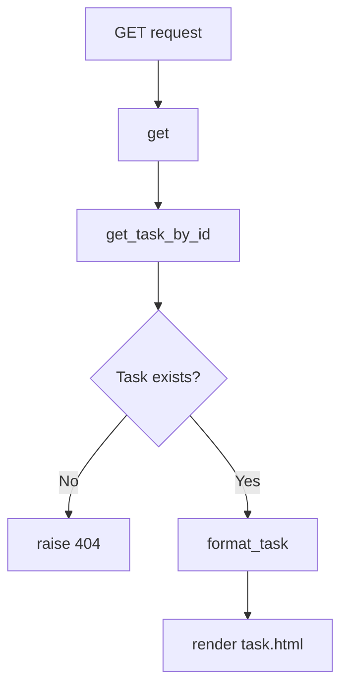
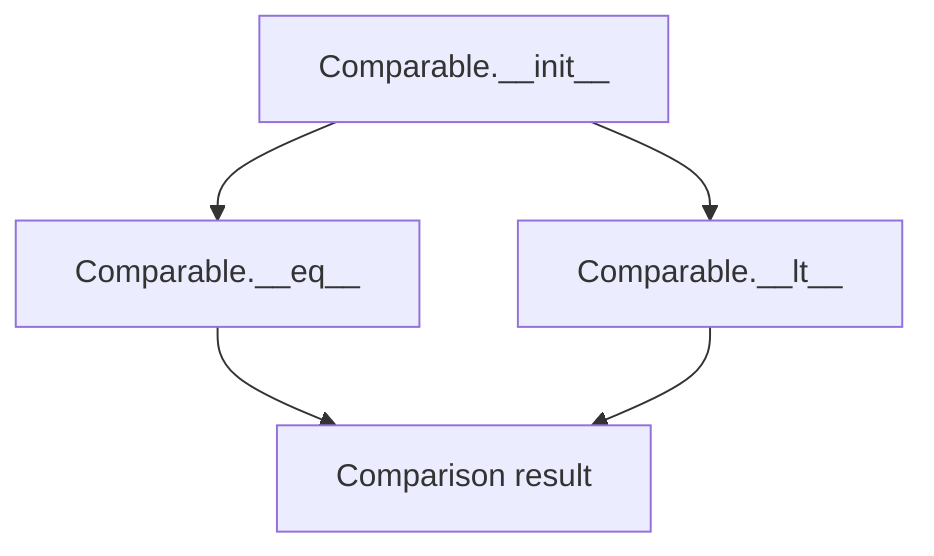
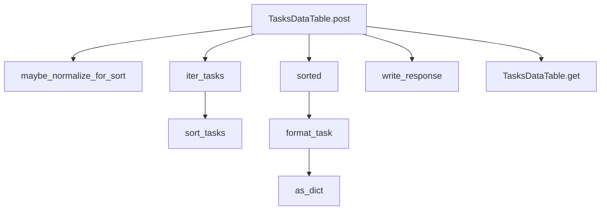

# `tasks.py`

## `flower.views.tasks.TaskView` · *class*

## Summary:
TaskView handles HTTP GET requests to retrieve and display detailed information about a specific task by its ID.

## Description:
This class implements a web handler that displays detailed information about a Celery task. It is designed to be used as part of a web application (likely Flower) that monitors Celery task execution. The view requires authentication and renders a task detail page when a valid task ID is provided.

## State:
- Inherits from BaseHandler, which provides authentication, rendering capabilities, and utility methods
- Accesses self.application.events which contains task event data from Celery
- Uses self.application.options.format_task for custom task formatting if configured

## Lifecycle:
- Creation: Instantiated automatically by the Tornado web framework when handling URL routing
- Usage: Called via HTTP GET requests to URLs matching the pattern that maps to this view
- Destruction: Managed by the web framework lifecycle; no explicit cleanup required

## Method Map:


## Raises:
- tornado.web.HTTPError(404): When the requested task ID does not correspond to any known task
- tornado.web.HTTPError(401): When authentication fails (inherited from BaseHandler)
- tornado.web.HTTPError(403): When access is forbidden (inherited from BaseHandler)

## Example:
```python
# Typical usage would be via HTTP GET to URL like:
# GET /task/12345678-1234-1234-1234-123456789012
# This would retrieve task with UUID "12345678-1234-1234-1234-123456789012"

# The view would:
# 1. Authenticate the user (via @web.authenticated decorator)
# 2. Look up the task in self.application.events
# 3. If found, format it using custom formatting if configured
# 4. Render the task.html template with the formatted task data
```

### `flower.views.tasks.TaskView.get` · *method*

## Summary:
Retrieves and displays detailed information for a specific task by ID, rendering it in the task.html template.

## Description:
Handles HTTP GET requests for individual task details. This method fetches a task from the application's event tracking system, validates its existence, formats it according to configured formatting rules, and renders the task details in a HTML template. It serves as the view endpoint for accessing specific task information in the Flower web interface.

## Args:
    task_id (str): Unique identifier of the task to retrieve and display

## Returns:
    None: This method doesn't return a value directly, but renders an HTML page

## Raises:
    tornado.web.HTTPError: Raised with status code 404 when the specified task_id does not correspond to any existing task

## State Changes:
    Attributes READ:
        - self.application.events: Used to retrieve task information from the event tracking system
        - self.application.options: Used by self.format_task for potential custom formatting
    Attributes WRITTEN: None

## Constraints:
    Preconditions:
        - The task_id parameter must be a valid string identifier for an existing task
        - The application must have event tracking enabled and populated with task data
    Postconditions:
        - If successful, the task data is properly formatted and rendered in the task.html template
        - If task is not found, HTTPError 404 is raised

## Side Effects:
    - Renders an HTML template (task.html) with task data
    - May make calls to custom formatting functions if configured via application options
    - Accesses application's event tracking system to retrieve task data

## `flower.views.tasks.Comparable` · *class*

## Summary:
A wrapper class that provides custom equality and less-than comparison operations for arbitrary values.

## Description:
The Comparable class serves as a wrapper around a value that enables custom comparison behavior. It implements the equality (`__eq__`) and less-than (`__lt__`) comparison operators to allow objects to be compared in a controlled manner. This is particularly useful when dealing with values that might not naturally support comparison operations or when special handling is needed for comparison failures.

This class is designed to be used in contexts where objects need to be sorted or compared, especially when working with potentially incompatible types or when graceful degradation in comparison is desired.

## State:
- value: The wrapped value to be compared. Type can be any object that supports equality and less-than comparisons. Valid range depends on the underlying value type. Invariant: The value is stored as-is and is accessible via the public attribute.

## Lifecycle:
- Creation: Instantiate with any value using `Comparable(value)`
- Usage: Objects can be compared using standard comparison operators (==, <, >, <=, >=)
- Destruction: No special cleanup required; relies on Python's garbage collection

## Method Map:


## Raises:
- TypeError: Raised internally during comparison operations when values cannot be compared, though this is handled gracefully in __lt__ method.

## Example:
```python
# Create comparable objects
obj1 = Comparable(5)
obj2 = Comparable(10)
obj3 = Comparable("hello")

# Basic comparisons
print(obj1 == obj2)  # False
print(obj1 < obj2)   # True
print(obj3 < obj1)   # Raises TypeError, but handled gracefully

# Usage in sorting
items = [Comparable(3), Comparable(1), Comparable(2)]
sorted_items = sorted(items)  # Uses __lt__ method
```

### `flower.views.tasks.Comparable.__init__` · *method*

## Summary:
Initializes a Comparable instance with a value for sorting and comparison operations.

## Description:
This method serves as the constructor for the Comparable class, which wraps a value to enable proper sorting and equality comparisons. The class is designed to work with task data in the flower monitoring interface, particularly for sorting and filtering task lists.

## Args:
    value: The value to be wrapped by this Comparable instance. Can be of any type that supports equality and less-than comparisons.

## Returns:
    None: This method does not return a value.

## Raises:
    None: This method does not raise any exceptions.

## State Changes:
    Attributes READ: None
    Attributes WRITTEN: self.value - stores the provided value for later comparison operations

## Constraints:
    Preconditions: None
    Postconditions: The instance will have a self.value attribute set to the provided value

## Side Effects:
    None: This method performs no I/O operations or external service calls.

### `flower.views.tasks.Comparable.__eq__` · *method*

## Summary:
Compares two Comparable objects for equality based on their value attributes.

## Description:
This method implements the equality comparison operation for Comparable objects. It returns True if the value attributes of both objects are equal, False otherwise. This method is part of a class decorated with @total_ordering, which automatically generates other comparison methods based on this and the __lt__ method.

## Args:
    other (Comparable): Another Comparable instance to compare with this object.

## Returns:
    bool: True if self.value equals other.value, False otherwise.

## Raises:
    AttributeError: If other does not have a value attribute.

## State Changes:
    Attributes READ: self.value, other.value
    Attributes WRITTEN: None

## Constraints:
    Preconditions: 
    - other must be an instance of Comparable class
    - other must have a value attribute
    Postconditions:
    - Returns a boolean value indicating equality of value attributes

## Side Effects:
    None

### `flower.views.tasks.Comparable.__lt__` · *method*

*No documentation generated.*

## `flower.views.tasks.TasksDataTable` · *class*

## Summary:
A Tornado web handler that implements DataTables server-side processing for Celery task data.

## Description:
The TasksDataTable class implements a web endpoint that serves task data in DataTables server-side processing format. It handles HTTP GET and POST requests to provide paginated, searchable, and sortable task information for web-based task monitoring dashboards. The class extracts DataTables-specific parameters from HTTP requests and processes task data accordingly, returning JSON responses formatted for DataTables consumption.

This class specifically implements the server-side processing requirements of the DataTables JavaScript library to efficiently handle large datasets in web interfaces.

## State:
- `self.application`: Reference to the Tornado application instance containing event data and configuration
- `self.request`: Tornado HTTP request object containing query parameters
- `logger`: Logging instance for error reporting (inherited from parent class)

## Lifecycle:
- Creation: Instantiated automatically by Tornado web framework when handling requests to the associated URL route
- Usage: Called via HTTP GET/POST requests with DataTables-specific query parameters
- Destruction: Managed automatically by Tornado framework

## Method Map:


## Raises:
- tornado.web.HTTPError: Raised when invalid arguments are provided (400 status code)
- tornado.web.HTTPError: Raised for authentication failures (401 status code)
- tornado.web.HTTPError: Raised for authorization failures (403 status code)
- tornado.web.HTTPError: Raised for resource not found errors (404 status code)

## Example:
```python
# Typical usage would be via HTTP request to the endpoint
# GET /tasks/data?draw=1&start=0&length=10&search[value]=test&order[0][column]=0&order[0][dir]=asc

# The handler processes these DataTables-specific parameters:
# - draw: DataTables identifier for request-response matching
# - start: Starting index for pagination
# - length: Number of records to return
# - search[value]: Search term for filtering tasks
# - order[0][column]: Column index to sort by
# - order[0][dir]: Sort direction ('asc' or 'desc')

# Returns JSON response with:
# {
#   "draw": 1,
#   "data": [...],  # Formatted task data
#   "recordsTotal": 100,  # Total number of tasks
#   "recordsFiltered": 100  # Number of tasks after filtering
# }
```

### `flower.views.tasks.TasksDataTable.get` · *method*

## Summary:
Processes DataTables AJAX requests to retrieve, filter, sort, and format task data for web display.

## Description:
This method handles server-side DataTables requests for displaying task information in a web interface. It extracts DataTables-specific parameters from the HTTP request, retrieves tasks from the application events, applies server-side filtering and sorting, and returns formatted JSON data that DataTables expects for client-side rendering.

The method implements server-side processing features including pagination (start/length), search filtering (search[value]), and column-based sorting (order[0][column], order[0][dir]). It formats task data appropriately for display and ensures proper sorting by normalizing data types when needed.

## Args:
    None - Parameters are extracted from HTTP request arguments:
    - draw (int): DataTables draw counter for request/response matching
    - start (int): Starting index for pagination
    - length (int): Number of records to return for pagination
    - search[value] (str): Search term for filtering tasks
    - order[0][column] (int): Column index to sort by
    - order[0][dir] (str): Sort direction ('asc' or 'desc')
    - columns[{column}][data] (str): Field name to sort by

## Returns:
    None - Directly writes JSON response to HTTP output stream using self.write()

## Raises:
    tornado.web.HTTPError: Raised when invalid argument types are provided (status code 400)

## State Changes:
    Attributes READ: 
    - self.application (accesses app.events, app.events.state)
    - self.request.arguments (via get_argument calls)
    - self.application.options (for format_task customization)

## Constraints:
    Preconditions:
    - The request must contain valid DataTables parameters
    - The application must have events state available
    - The sort_by field must be one of the supported fields ('name', 'state', 'received', 'started', 'runtime')
    
    Postconditions:
    - The HTTP response contains properly formatted JSON data matching DataTables expectations
    - Response includes draw counter, data array, recordsTotal, and recordsFiltered counts

## Side Effects:
    - Makes calls to external services via app.events.state.tasks_by_timestamp() and iter_tasks()
    - Calls custom formatting function if configured via application options
    - Writes JSON response to HTTP output stream
    - May modify task objects temporarily during normalization for sorting purposes

### `flower.views.tasks.TasksDataTable.maybe_normalize_for_sort` · *method*

*No documentation generated.*

### `flower.views.tasks.TasksDataTable.post` · *method*

## Summary:
Handles POST requests by delegating to the GET handler for retrieving task data in DataTables format.

## Description:
This method serves as the POST endpoint handler for the TasksDataTable view, which is used by the DataTables JavaScript library to fetch paginated and filtered task data. It simply delegates to the GET method to maintain consistency with DataTables' expected behavior while supporting both HTTP methods for compatibility.

## Args:
    None: This method doesn't accept any explicit arguments beyond the standard Tornado RequestHandler parameters.

## Returns:
    None: This method writes the response directly to the HTTP response and doesn't return a value.

## Raises:
    None: This method doesn't explicitly raise exceptions, though underlying framework exceptions may occur.

## State Changes:
    Attributes READ: 
    - self.application: Used to access events and configuration
    - self.request: Used to extract query parameters
    
    Attributes WRITTEN:
    - self: The response is written directly to the HTTP response via self.write()

## Constraints:
    Preconditions:
    - The user must be authenticated (enforced by @web.authenticated decorator)
    - The application must have events and task data available
    - DataTables-specific query parameters must be present in the request
    
    Postconditions:
    - The HTTP response contains JSON-formatted task data in DataTables server-side processing format
    - Response includes draw, data, recordsTotal, and recordsFiltered fields

## Side Effects:
    - Makes calls to self.get_argument() to extract query parameters
    - Writes JSON response data to HTTP response via self.write()
    - Accesses application events and task data

### `flower.views.tasks.TasksDataTable.format_task` · *method*

## Summary:
Formats task arguments using a custom formatter function if available, preserving the task UUID while potentially modifying the argument structure.

## Description:
This method processes task data by applying a custom formatting function to task arguments when configured. It's used in the TasksDataTable view to prepare task data for JSON serialization in DataTable responses. The method ensures that task arguments are safely copied before modification and handles formatting exceptions gracefully by logging them without interrupting the data flow.

## Args:
    task (tuple): A tuple containing (uuid, args) where uuid is the task identifier and args are the task arguments to be formatted

## Returns:
    tuple: A tuple containing (uuid, args) where uuid remains unchanged and args may be modified by the custom formatter if one is configured

## Raises:
    None: This method catches all exceptions during custom formatting and logs them instead of propagating them

## State Changes:
    Attributes READ: 
    - self.application.options.format_task
    Attributes WRITTEN: None

## Constraints:
    Preconditions:
    - The task parameter must be a tuple with exactly two elements (uuid, args)
    - The uuid element should be a string identifier
    - The args element should be a mutable object that can be copied
    
    Postconditions:
    - The returned tuple maintains the original uuid
    - The args in the returned tuple may be modified if a custom formatter is applied
    - No exceptions are raised from this method due to the try-except block

## Side Effects:
    I/O: Writes exception log messages to the application logger when custom formatting fails
    External service calls: None
    Mutations: Creates a shallow copy of args using copy.copy() before applying custom formatting

## `flower.views.tasks.TasksView` · *class*

## Summary:
A Tornado web handler that renders the tasks dashboard page displaying task information.

## Description:
The TasksView class handles HTTP GET requests to display the tasks monitoring interface. It inherits from BaseHandler and provides authentication through the @web.authenticated decorator. This view renders a tasks.html template with configuration parameters but currently does not populate the tasks list from event data - it passes an empty tasks list to the template.

## State:
- Inherits all state from BaseHandler including application context, request handling capabilities, and authentication state
- `self.application`: Reference to the main application instance containing configuration options
- `self.application.options`: Configuration options including tasks_columns, natural_time, and timezone settings
- `self.application.capp`: Celery application instance for accessing task-related configuration

## Lifecycle:
- Creation: Automatically instantiated by Tornado framework when handling HTTP requests to the tasks endpoint
- Usage: Called via HTTP GET request to the tasks URL route, handled by Tornado's request routing and authentication
- Destruction: Managed automatically by Tornado framework lifecycle

## Method Map:
```mermaid
graph TD
    A[TasksView.get] --> B[application.options.natural_time]
    A --> C[application.capp.conf.timezone]
    A --> D[render(tasks.html, ...)]
    B --> E{time format selection}
    C --> E
    E --> F[time string construction]
    F --> D
```

## Raises:
- tornado.web.HTTPError: Raised by BaseHandler's authentication mechanism when access is denied (401) or unauthorized (403)
- tornado.web.HTTPError: Raised by BaseHandler's get_argument method when invalid arguments are provided (400)

## Example:
```python
# This view would be accessed via HTTP GET to the configured tasks URL
# Typical usage scenario:
# GET /tasks HTTP/1.1
# Host: localhost:5555
# Authorization: Basic [credentials]

# Results in rendering tasks.html with:
# - Empty tasks list (currently not populated from events)
# - Columns configuration from app.options.tasks_columns
# - Time formatting based on app.options.natural_time and capp.conf.timezone
```

### `flower.views.tasks.TasksView.get` · *method*

## Summary:
Renders the tasks dashboard page with configured columns and time formatting options.

## Description:
Handles HTTP GET requests to display the tasks management interface. This method prepares the view context for the tasks.html template by configuring time formatting based on application settings and passing column configuration, but does not fetch actual task data.

## Args:
    None

## Returns:
    None (renders HTML template)

## Raises:
    None explicitly raised

## State Changes:
    Attributes READ: 
    - self.application.options.natural_time
    - self.application.options.tasks_columns
    - self.application.capp.conf.timezone
    
    Attributes WRITTEN: None

## Constraints:
    Preconditions:
    - User must be authenticated (due to @web.authenticated decorator)
    - Application must have options configured with tasks_columns attribute
    - Application must have capp with conf timezone configuration
    
    Postconditions:
    - Renders tasks.html template with appropriate context variables

## Side Effects:
    - Renders HTML template to HTTP response
    - Accesses application configuration properties

