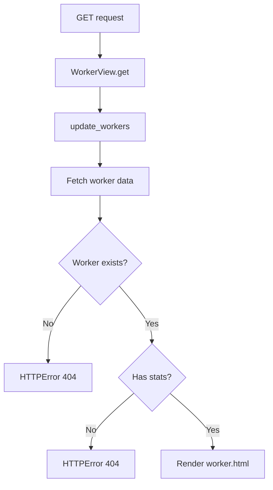

# `workers.py`

## `flower.views.workers.WorkerView` · *class*

## Summary:
WorkerView handles HTTP GET requests to retrieve and display worker statistics information.

## Description:
This class implements a Tornado web handler that serves worker statistics pages. It inherits from BaseHandler and provides authentication via the @web.authenticated decorator. The view fetches worker data from the application's worker registry, validates its existence and completeness, and renders it using a template. It is designed to handle requests for specific worker statistics by name.

## State:
- `name` (str): The worker identifier passed as a URL parameter. Required for instantiation.
- `self.application.workers`: Dictionary containing worker information, accessed via `self.application.workers.get(name)`  
- `self.application.update_workers`: Method that refreshes worker information, called with `workername=name`
- Class invariants: The worker must exist in application.workers and must contain 'stats' key to be valid

## Lifecycle:
- Creation: Instantiated automatically by Tornado routing when a GET request matches the pattern for worker views
- Usage: Called via Tornado's request handling mechanism when accessing worker URLs with the pattern `/worker/{name}`
- Destruction: Managed automatically by Tornado framework

## Method Map:


## Raises:
- `web.HTTPError(404)`: When worker name is unknown or worker lacks stats information
- `Exception`: Caught and logged during update_workers execution but re-raised as HTTPError if not handled properly

## Example:
```python
# Accessing worker stats page
# GET /worker/my_worker_name
# Results in rendering worker.html with worker data

# If worker doesn't exist:
# GET /worker/nonexistent_worker
# Raises HTTPError(404) with message "Unknown worker 'nonexistent_worker'"

# If worker exists but has no stats:
# GET /worker/worker_no_stats
# Raises HTTPError(404) with message "Unable to get stats for 'worker_no_stats' worker"
```

### `flower.views.workers.WorkerView.get` · *method*

*No documentation generated.*

## `flower.views.workers.WorkersView` · *class*

*No documentation generated.*

### `flower.views.workers.WorkersView.get` · *method*

## Summary:
Retrieves and processes worker information, optionally refreshing data and purging offline workers, returning either JSON or HTML representation.

## Description:
Handles HTTP GET requests to retrieve worker status information. This asynchronous method serves as the main endpoint for accessing worker data in the Flower monitoring interface. It supports both JSON and HTML responses, with optional real-time refresh capabilities and automatic cleanup of stale worker entries. The method is part of the WorkersView class and inherits from BaseHandler.

## Args:
    None - All parameters are extracted from HTTP request arguments:
    - refresh (bool, optional): If True, forces refresh of worker data via application.update_workers(). Defaults to False.
    - json (bool, optional): If True, returns data as JSON. If False, renders HTML template. Defaults to False.

## Returns:
    None - This method writes the HTTP response directly via self.write() or self.render() and does not return a value.

## Raises:
    tornado.web.HTTPError - When invalid argument types are provided (400 status code) through BaseHandler.get_argument validation.

## State Changes:
    Attributes READ: 
    - self.application.events.state
    - self.application.options.auto_refresh
    - self.application.capp
    - self.application.options.purge_offline_workers
    - self.application.events.workers
    - self.application.events.counter
    
    Attributes WRITTEN: 
    - None - This method doesn't modify instance attributes directly

## Constraints:
    Preconditions:
    - self.application must have events.state attribute with counter and workers properties
    - self.application must have capp attribute for connection()
    - self.application.options must have auto_refresh and purge_offline_workers attributes
    - self.application.update_workers() method must be callable
    
    Postconditions:
    - If refresh=True, worker data is updated via self.application.update_workers()
    - If json=True, response contains JSON data with workers list in 'data' field
    - If json=False, renders workers.html template with workers data and broker URI

## Side Effects:
    - May call self.application.update_workers() which could involve external service calls
    - Writes HTTP response directly via self.write() or self.render()
    - May log exceptions when updating workers via logger.exception()
    - Makes connection to broker via self.application.capp.connection().as_uri()

### `flower.views.workers.WorkersView._as_dict` · *method*

## Summary:
Converts a worker object into a dictionary representation using either its defined fields or fallback information extraction.

## Description:
This classmethod serves as a flexible utility for transforming worker objects into dictionary format for serialization or display purposes. It first attempts to extract fields from the worker's `_fields` attribute, falling back to a predefined set of information fields if that attribute is not present. This method is primarily used in the WorkersView.get() method to prepare worker data for JSON responses or HTML templates.

## Args:
    cls: The class reference (WorkersView)
    worker: A worker object that may have either a `_fields` attribute or standard worker properties

## Returns:
    dict: Dictionary containing worker information with keys derived from either worker._fields or predefined fields

## Raises:
    AttributeError: If worker object doesn't have required attributes when accessing field values

## State Changes:
    Attributes READ: None - this method only reads from the worker object
    Attributes WRITTEN: None - this method doesn't modify any instance or class attributes

## Constraints:
    Preconditions: 
    - Worker object must be a valid object with accessible attributes
    - If worker has `_fields` attribute, all fields must be accessible via getattr()
    - If worker lacks `_fields`, it must have the standard worker properties expected by _info()

    Postconditions:
    - Returns a dictionary with worker information
    - Dictionary keys are either from worker._fields or predefined fields
    - All returned values are accessible via getattr() on the worker object

## Side Effects:
    None - this method performs only data transformation operations

### `flower.views.workers.WorkersView._info` · *method*

## Summary:
Extracts and returns selected metadata fields from a worker object as a dictionary, filtering out None values.

## Description:
This static method retrieves specific fields from a worker object and returns them as a dictionary. It's designed to extract standardized worker metadata fields while filtering out any fields that have None values. The method is typically called from the `_as_dict` class method when converting worker information to a serializable format.

The method is separated into its own utility function to provide a clean abstraction for worker metadata extraction, making the `_as_dict` method more readable and reusable.

## Args:
    cls: The class reference (typically WorkersView)
    worker: An object representing a worker with attributes such as hostname, pid, freq, heartbeats, clock, active, processed, loadavg, sw_ident, sw_ver, and sw_sys

## Returns:
    dict: A dictionary containing key-value pairs of worker metadata fields that have non-None values. The keys are limited to: 'hostname', 'pid', 'freq', 'heartbeats', 'clock', 'active', 'processed', 'loadavg', 'sw_ident', 'sw_ver', 'sw_sys'

## Raises:
    None explicitly raised

## State Changes:
    Attributes READ: None - this method only reads attributes from the worker parameter
    Attributes WRITTEN: None - this method doesn't modify any instance attributes

## Constraints:
    Preconditions:
    - The worker parameter must be an object with the expected attributes
    - The worker object should have at least some of the fields defined in _fields tuple
    
    Postconditions:
    - Returns a dictionary with only non-None field values
    - The returned dictionary contains only the fields specified in _fields tuple

## Side Effects:
    None - this method performs no I/O operations or external service calls

