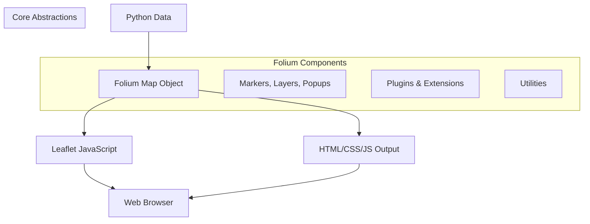

# `folium`

## Repository Overview

### Purpose
Folium is a Python library that enables the creation of interactive Leaflet maps from Python code. It provides a high-level interface for visualizing geospatial data on interactive maps, making it easy to create rich, web-based maps with minimal code. Folium translates Python data structures into JavaScript Leaflet code that renders in web browsers.

### Target Users
- Data scientists and analysts working with geospatial data
- Developers creating web applications with mapping capabilities
- Researchers visualizing geographic information
- Anyone needing to create interactive maps from Python

### Position in Ecosystem
Folium serves as a bridge between Python data processing workflows and web-based interactive mapping. It's designed to work alongside data science libraries like pandas, NumPy, and geospatial libraries such as GeoPandas, making it a valuable tool in the Python geospatial ecosystem.

### Architecture

### Entry Points
1. **API Import**: `import folium` - Provides access to core map components
2. **Direct Map Creation**: `folium.Map()` - Main entry point for creating maps
3. **Data Visualization**: Various layer types (`folium.Marker`, `folium.GeoJson`, etc.)
4. **Plugin Access**: `folium.plugins.*` - Access to extended functionality

### Core Features
1. **Interactive Maps**: Create fully interactive Leaflet maps from Python
2. **Multiple Layer Types**: Support for markers, polygons, lines, heatmaps, etc.
3. **Geospatial Data Integration**: Easy integration with GeoJSON, TopoJSON, and other formats
4. **Customization Options**: Extensive styling and configuration capabilities
5. **Plugin Ecosystem**: Rich collection of plugins for advanced features
6. **Export Capabilities**: Save maps as HTML files or embed in Jupyter notebooks

### Dependencies
- **Leaflet.js**: JavaScript mapping library (via CDN links)
- **JavaScript Libraries**: Various plugins loaded via CDN
- **Python Libraries**: 
  - `jinja2` for templating
  - `numpy` for numerical operations
  - `pandas` for data handling (optional)
  - `requests` for HTTP requests (optional)
  - `selenium` for PNG export (optional)

### Configuration
Folium uses default configurations that can be overridden through constructor parameters. Key configuration options include:
- Map projection (CRS)
- Zoom levels and bounds
- Tile providers
- Styling options for various map elements

### Extension Points
1. **Custom Layers**: Inherit from `folium.Layer` to create custom map layers
2. **Plugins**: Add new functionality through plugin system
3. **Templates**: Override templates for custom rendering behavior
4. **CSS/JS**: Extend with custom CSS and JavaScript assets

---

## Modules

- [`folium`](folium.md)
- [`folium/plugins`](folium/plugins.md)

