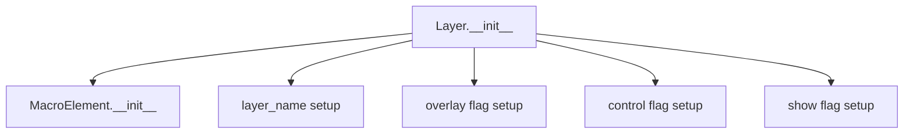
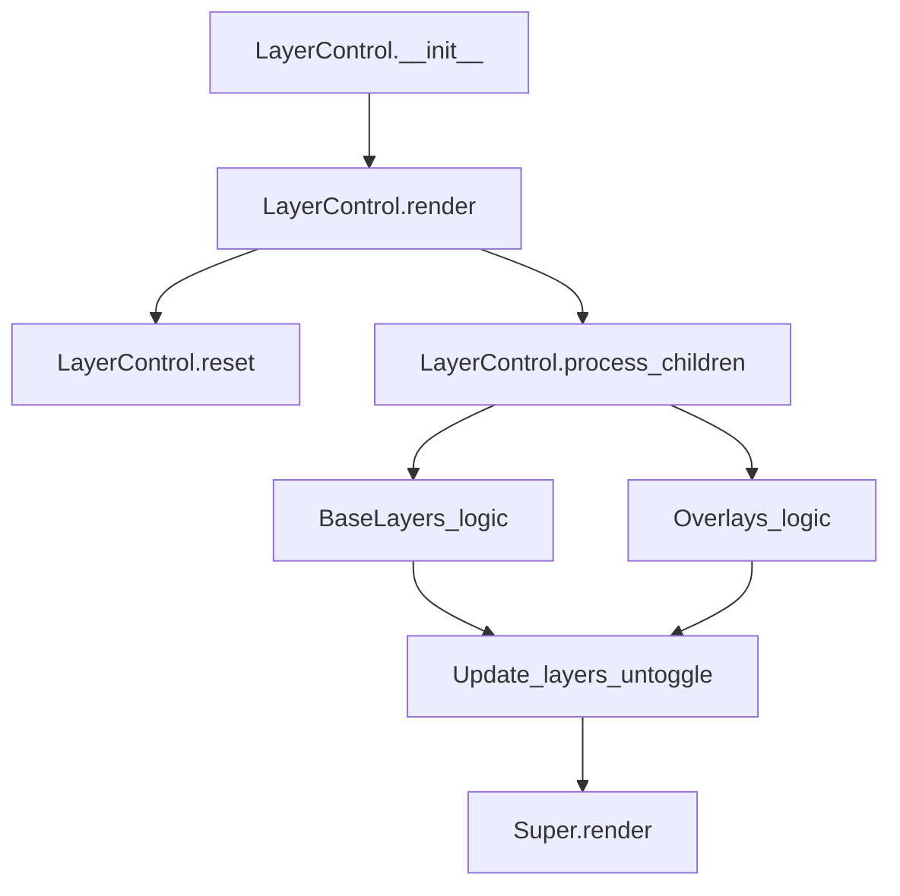
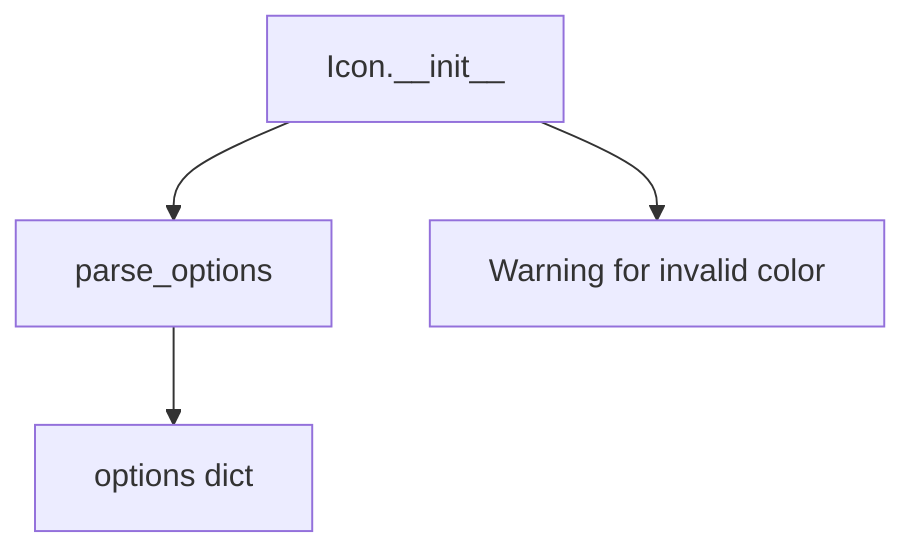
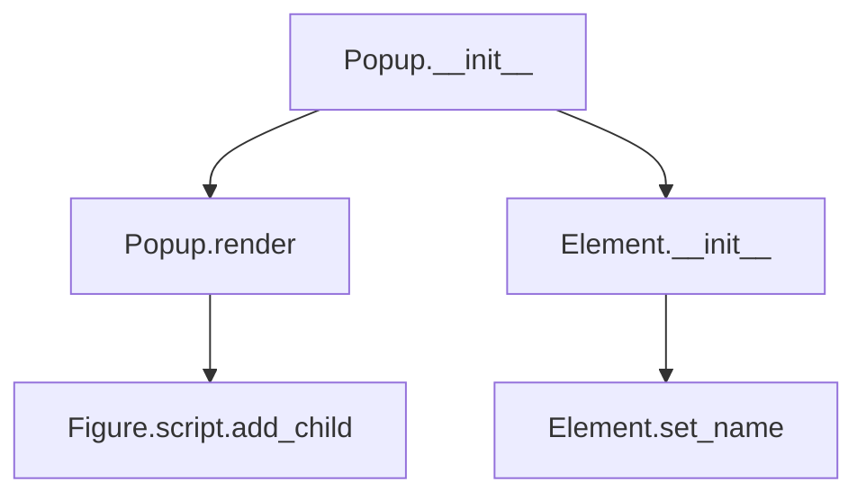
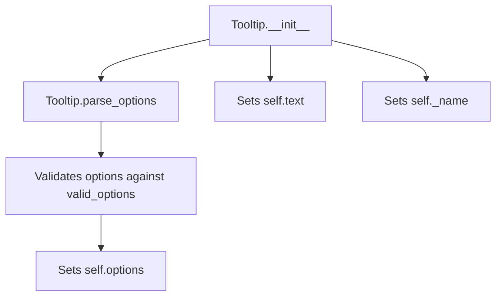

# `map.py`

## `folium.map.Layer` · *class*

## Summary:
Base class for map layers in folium, providing common layer configuration and management capabilities.

## Description:
The Layer class serves as the foundation for various map layer types in folium. It provides standard configuration options for managing how layers appear and behave on interactive maps. Layers can be overlays (displayed on top of base maps) or underlays (used as base layers), and can be controlled via UI elements or shown/hidden programmatically.

This class is typically extended by specific layer implementations such as TileLayer, MarkerLayer, GeoJsonLayer, etc. It provides the common interface and state management for all map layers in the folium ecosystem.

## State:
- layer_name (str): Unique identifier for the layer. If not provided, defaults to the result of get_name() method.
- overlay (bool): Flag indicating whether this is an overlay layer (True) or base layer (False). Defaults to False.
- control (bool): Flag indicating whether this layer should appear in the map controls. Defaults to True.
- show (bool): Flag indicating whether this layer should be visible by default. Defaults to True.

## Lifecycle:
- Creation: Instantiate with optional name, overlay, control, and show parameters
- Usage: Typically used as a base class for specific layer types; instances are managed by Map objects
- Destruction: Managed automatically by Python's garbage collection; no explicit cleanup required

## Method Map:


## Raises:
- No explicit exceptions raised by __init__
- Exceptions may be raised by parent MacroElement.__init__ if invalid parameters are passed

## Example:
```python
# Create a basic layer
layer = Layer(name="my_layer", overlay=True, control=True, show=True)

# Create a layer with default settings
basic_layer = Layer()

# Create an overlay layer
overlay = Layer(name="overlay_layer", overlay=True)
```

### `folium.map.Layer.__init__` · *method*

## Summary:
Initializes a map layer with configurable display properties and control settings.

## Description:
Configures the basic properties of a map layer including its name, overlay status, control visibility, and display state. This constructor establishes the fundamental characteristics that govern how the layer appears and behaves within a Folium map interface.

## Args:
    name (str, optional): Unique identifier for the layer. If None, defaults to the layer's automatically generated name via get_name(). Defaults to None.
    overlay (bool): Indicates whether this layer is an overlay (True) or base layer (False). Defaults to False.
    control (bool): Controls whether the layer appears in the map controls panel. Defaults to True.
    show (bool): Determines if the layer is initially visible on the map. Defaults to True.

## Returns:
    None: This method initializes instance attributes and does not return a value.

## Raises:
    None explicitly raised: Based on the code, no exceptions are explicitly raised by this method.

## State Changes:
    Attributes READ: 
        - self.get_name() (inferred method call)
    Attributes WRITTEN:
        - self.layer_name: Set to the provided name or auto-generated name
        - self.overlay: Set to the provided overlay value
        - self.control: Set to the provided control value
        - self.show: Set to the provided show value

## Constraints:
    Preconditions:
        - The class must inherit from MacroElement (established by super().__init__())
        - The get_name() method must be available in the inheritance chain
    Postconditions:
        - All instance attributes (layer_name, overlay, control, show) are properly initialized
        - The layer is ready for use in a Folium map context

## Side Effects:
    None: This method performs only local attribute assignments and does not cause external I/O or mutations.

## `folium.map.FeatureGroup` · *class*

## Summary:
A FeatureGroup is a layer subclass for organizing map elements in folium.

## Description:
The FeatureGroup class is a subclass of Layer that provides a mechanism for organizing multiple map elements into a single logical group. It inherits all standard layer properties and behaviors from its parent Layer class while setting its own identifying name to "FeatureGroup".

## State:
- _name (str): Set to "FeatureGroup" to identify this specific layer type
- tile_name (str): The name used for the feature group, either from the provided name parameter or auto-generated via get_name()
- options (dict): Parsed keyword arguments that define additional configuration options for the feature group
- layer_name (str): Inherited from Layer, stores the layer name
- overlay (bool): Inherited from Layer, determines if the group appears as an overlay
- control (bool): Inherited from Layer, determines if the group appears in the layer control
- show (bool): Inherited from Layer, determines initial visibility

## Lifecycle:
- Creation: Instantiate with optional name, overlay, control, show parameters, and additional keyword arguments for configuration
- Usage: Add various map features (markers, shapes, etc.) to the group; the group manages their collective display properties
- Destruction: Cleanup happens automatically when the map object is destroyed or when the group is removed from the map

## Method Map:
```mermaid
graph TD
    A[FeatureGroup.__init__] --> B[Layer.__init__]
    B --> C[MacroElement.__init__]
    C --> D[FeatureGroup._name = "FeatureGroup"]
    D --> E[FeatureGroup.tile_name = name or get_name()]
    E --> F[FeatureGroup.options = parse_options(**kwargs)]
```

## Raises:
- AssertionError: When invalid options are passed to parse_options (if the underlying validation is triggered)

## Example:
```python
import folium

# Create a feature group
fg = folium.FeatureGroup(name='My Features', overlay=True, control=True)

# Add features to the group
marker = folium.Marker([51.5, -0.09])
fg.add_child(marker)

polygon = folium.Polygon([[51.5, -0.1], [51.5, -0.05], [51.55, -0.05]])
fg.add_child(polygon)

# Add the feature group to a map
m = folium.Map(location=[51.505, -0.09], zoom_start=13)
m.add_child(fg)
```

### `folium.map.FeatureGroup.__init__` · *method*

## Summary:
Initializes a FeatureGroup object with configurable display properties and options.

## Description:
This constructor method sets up a FeatureGroup instance, which is used to group multiple map elements together. It configures the group's visibility controls, naming, and additional options while ensuring proper inheritance from the Layer base class.

## Args:
    name (str, optional): Name identifier for the feature group. Defaults to None.
    overlay (bool): Whether the feature group should appear as an overlay. Defaults to True.
    control (bool): Whether to include the feature group in the layer control. Defaults to True.
    show (bool): Whether the feature group should be initially visible. Defaults to True.
    **kwargs: Additional keyword arguments passed to configure the feature group options.

## Returns:
    None: This method initializes the object and does not return a value.

## Raises:
    AssertionError: If any of the kwargs contain invalid options or incorrect types (when parse_options validates them).

## State Changes:
    Attributes READ: None
    Attributes WRITTEN: 
    - self._name: Set to "FeatureGroup" string
    - self.tile_name: Set to either the provided name or the result of self.get_name()
    - self.options: Set to parsed keyword arguments via parse_options()

## Constraints:
    Preconditions:
    - All keyword arguments passed to **kwargs must be valid options according to the validation rules in parse_options
    - The provided name parameter, if not None, should be a valid string identifier
    
    Postconditions:
    - self._name is always set to "FeatureGroup"
    - self.tile_name is always set to either the provided name or a generated name from get_name()
    - self.options contains a dictionary of camelized and validated keyword arguments

## Side Effects:
    None: This method performs no I/O operations or external service calls. It only initializes internal object state.

## `folium.map.LayerControl` · *class*

## Summary:
Manages layer controls for a folium map, organizing base layers and overlays with toggle functionality.

## Description:
The LayerControl class provides a mechanism to manage and display layer controls on a folium map. It automatically categorizes child layers into base layers and overlays, and determines which layers should be toggleable based on their properties and the map's configuration. This class is typically instantiated by the folium map system and integrated into the map's rendering pipeline.

## State:
- _name (str): Set to "LayerControl" indicating the type of element
- _template (Template): Inherited from MacroElement, defines the HTML template for rendering (empty in this implementation)
- options (dict): Configuration options parsed from constructor parameters including position, collapsed, and autoZIndex
- base_layers (OrderedDict): Maps layer names to layer identifiers for base layers
- overlays (OrderedDict): Maps layer names to layer identifiers for overlay layers  
- layers_untoggle (OrderedDict): Maps layer names to layer identifiers for layers that should be toggleable

## Lifecycle:
- Creation: Instantiate with optional position, collapsed, and autoZIndex parameters
- Usage: Automatically invoked during map rendering when the parent map contains layers
- Destruction: Managed by the parent map's lifecycle

## Method Map:


## Raises:
- AssertionError: When invalid options are passed to parse_options (though this is handled internally)

## Example:
```python
import folium

# Create a map
m = folium.Map(location=[45.5236, -122.6750], zoom_start=13)

# Add base layer
folium.TileLayer('OpenStreetMap').add_to(m)

# Add overlay layer
folium.TileLayer('CartoDB positron', overlay=True).add_to(m)

# LayerControl is automatically created and managed by folium
# The map will display layer controls for toggling between layers
```

### `folium.map.LayerControl.__init__` · *method*

## Summary:
Initializes a LayerControl object that manages map layers with configurable positioning and display options.

## Description:
The LayerControl constructor sets up the layer management system for folium maps, configuring display options and initializing internal data structures to track base layers, overlays, and layers that can be toggled. This method is responsible for establishing the foundational state of the layer control mechanism.

## Args:
    position (str): Position of the layer control on the map. Defaults to "topright".
    collapsed (bool): Whether the layer control is initially collapsed. Defaults to True.
    autoZIndex (bool): Whether to automatically set z-index values. Defaults to True.
    **kwargs: Additional keyword arguments passed to the layer control configuration.

## Returns:
    None: This method initializes the object's state and does not return a value.

## Raises:
    AssertionError: If any of the provided options are not valid or have incorrect types (when using parse_options).

## State Changes:
    Attributes READ: None
    Attributes WRITTEN: 
        - self._name: Set to "LayerControl"
        - self.options: Set to processed options dictionary from parse_options
        - self.base_layers: Initialized as empty OrderedDict
        - self.overlays: Initialized as empty OrderedDict  
        - self.layers_untoggle: Initialized as empty OrderedDict

## Constraints:
    Preconditions: 
        - The parent class MacroElement must be properly initialized
        - All provided keyword arguments must be valid options for the layer control
    Postconditions:
        - self._name is set to "LayerControl"
        - All three OrderedDict attributes are initialized as empty collections
        - Options are parsed and validated through parse_options function

## Side Effects:
    None: This method performs no I/O operations or external service calls. It only initializes internal object state.

### `folium.map.LayerControl.reset` · *method*

## Summary:
Clears all layer management collections in preparation for rebuilding layer information.

## Description:
Resets the internal state of the LayerControl by clearing three OrderedDict collections that track map layers: base_layers, overlays, and layers_untoggle. This method is typically called at the beginning of the render process to ensure clean state before collecting current layer information from the map's children.

## Args:
    None

## Returns:
    None

## Raises:
    None

## State Changes:
    Attributes READ: None
    Attributes WRITTEN: 
    - self.base_layers: cleared OrderedDict
    - self.overlays: cleared OrderedDict  
    - self.layers_untoggle: cleared OrderedDict

## Constraints:
    Preconditions: None
    Postconditions: All three OrderedDict attributes are empty OrderedDict instances

## Side Effects:
    None

### `folium.map.LayerControl.render` · *method*

## Summary:
Updates and renders the layer control UI elements by collecting available layers from the parent map.

## Description:
This method prepares the layer control interface by scanning all child elements of the parent map, identifying Layer instances that should be displayed in the control, and organizing them into base layers and overlays. It manages the state of which layers are toggleable and ensures proper initialization before rendering.

## Args:
    **kwargs: Additional keyword arguments passed to the parent render method.

## Returns:
    None: This method does not return a value.

## Raises:
    None explicitly raised.

## State Changes:
    Attributes READ:
        - self._parent._children: Collection of child elements from the parent map
        - self._parent: Parent map element containing child layers
        - self.base_layers: Dictionary storing base layer mappings
        - self.overlays: Dictionary storing overlay mappings
        - self.layers_untoggle: Dictionary tracking layers that should be untoggled
        - item.layer_name: Name identifier for each layer
        - item.overlay: Boolean indicating if layer is an overlay
        - item.control: Boolean indicating if layer should appear in control
        - item.show: Boolean indicating if layer is initially shown

    Attributes WRITTEN:
        - self.base_layers: Populated with base layer name mappings
        - self.overlays: Populated with overlay name mappings
        - self.layers_untoggle: Populated with layers that should be untoggled

## Constraints:
    Preconditions:
        - self._parent must be a valid map element with _children attribute
        - self._parent._children must contain Layer instances or compatible objects
        - All Layer instances must have layer_name, overlay, control, and show attributes

    Postconditions:
        - self.base_layers, self.overlays, and self.layers_untoggle are properly initialized and populated
        - The method ensures only layers with control=True are processed
        - Base layers are tracked separately from overlays
        - Layers that should be untoggled are identified based on overlay status and visibility

## Side Effects:
    None: This method does not perform I/O operations or mutate external objects beyond its own state.

## `folium.map.Icon` · *class*

## Summary:
Represents an icon element for use in folium maps, allowing customization of color, icon style, and rotation.

## Description:
The Icon class creates customizable icon elements that can be added to folium maps. It serves as a specialized macro element for displaying visual markers with various styling options. This class is typically instantiated by users or other map components when creating markers with specific visual characteristics.

The class enforces valid color options and provides a clean interface for specifying icon appearance through standard parameters like color, icon type, and rotation angle.

## State:
- color_options: Set of valid color strings that can be used for icon styling
- _name: String identifier set to "Icon" for proper rendering in folium templates
- options: Dictionary of processed icon options created by parse_options function
- All parameters passed to __init__ are stored in the options dictionary after processing

## Lifecycle:
- Creation: Instantiate with optional parameters for color, icon type, rotation, etc.
- Usage: Typically used as part of marker creation in folium maps
- Destruction: Managed automatically by folium's element lifecycle management

## Method Map:


## Raises:
- UserWarning: Issued when the color parameter is not in the valid color_options set

## Example:
```python
# Create a red icon with a star symbol
icon = Icon(color='red', icon='star', angle=45)

# Create a default blue icon
default_icon = Icon()

# Create an icon with custom options
custom_icon = Icon(color='green', icon='heart', prefix='fa')
```

### `folium.map.Icon.__init__` · *method*

## Summary:
Initializes an Icon object with specified visual properties and configuration options.

## Description:
Configures an Icon instance with color, icon appearance, rotation angle, and additional styling options. This method sets up the icon's visual characteristics and prepares the options dictionary for rendering in map interfaces.

## Args:
    color (str): Background color of the icon. Must be one of: {'red', 'darkred', 'lightred', 'orange', 'beige', 'green', 'darkgreen', 'lightgreen', 'blue', 'darkblue', 'cadetblue', 'lightblue', 'purple', 'darkpurple', 'pink', 'white', 'gray', 'lightgray', 'black'}. Defaults to 'blue'.
    icon_color (str): Color of the icon symbol. Defaults to 'white'.
    icon (str): Name of the icon to display. Defaults to 'info-sign'.
    angle (int): Rotation angle in degrees for the icon. Defaults to 0.
    prefix (str): Icon prefix to determine icon library. Defaults to 'glyphicon'.
    **kwargs: Additional keyword arguments passed to the options parser.

## Returns:
    None: This method initializes the object's state and does not return a value.

## Raises:
    None explicitly raised, but warnings may be issued for invalid color values.

## State Changes:
    Attributes READ: None
    Attributes WRITTEN: 
    - self._name: Set to "Icon"
    - self.options: Set to parsed options dictionary containing icon configuration

## Constraints:
    Preconditions:
    - color must be one of the predefined color options defined in Icon.color_options class attribute
    - angle must be an integer representing degrees of rotation
    
    Postconditions:
    - self._name is set to "Icon"
    - self.options contains a properly formatted dictionary of icon configuration options

## Side Effects:
    - Issues a warning via warnings.warn if color is not in Icon.color_options class attribute
    - Calls parse_options utility function to process configuration parameters

## `folium.map.Marker` · *class*

## Summary:
Represents a marker element on a Folium map that can be positioned at a specific geographic coordinate with optional popup, tooltip, and icon elements.

## Description:
The Marker class is used to add interactive markers to Folium maps. It serves as a visual representation of a specific geographic location and can include additional interactive elements such as popups, tooltips, and custom icons. Markers are typically created through map.add_child() or via convenience methods on the Map class, though they can also be instantiated directly.

This class provides the core functionality for placing markers on maps with customizable properties and interactive features. The marker's position is validated to ensure it contains proper latitude and longitude coordinates.

## State:
- location: list[float, float] - Geographic coordinates [latitude, longitude]. Must be a list/tuple with exactly 2 numerical values. Validated using validate_location().
- _name: str - Class identifier set to "Marker" 
- options: dict - Configuration options for the marker including draggable/autoPan settings
- icon: Icon object (optional) - Custom icon to display for the marker
- popup: Popup object (optional) - Interactive popup that appears when marker is clicked
- tooltip: Tooltip object (optional) - Hover tooltip that displays when mouse hovers over marker

## Lifecycle:
- Creation: Instantiate with location parameter (required) and optional parameters including popup, tooltip, icon, and draggable settings
- Usage: Add to a map using map.add_child() or through map.marker() convenience method
- Destruction: Cleanup handled automatically when marker is removed from map or when map is destroyed

## Method Map:
```mermaid
graph TD
    A[Marker.__init__] --> B[validate_location]
    A --> C[parse_options]
    A --> D[add_child]
    D --> E[Popup.__init__]
    D --> F[Tooltip.__init__]
    D --> G[Icon.add_child]
    A --> H[super().__init__]
    I[Marker.render] --> J[super().render]
    I --> K[ValueError check]
```

## Raises:
- ValueError: When render() is called and location is None, indicating the marker hasn't been properly positioned

## Example:
```python
import folium

# Create a map
m = folium.Map(location=[45.5236, -122.6750], zoom_start=13)

# Create a basic marker
marker = folium.Marker(
    location=[45.5236, -122.6750],
    popup='Portland, OR',
    tooltip='Click for info'
)
m.add_child(marker)

# Create a marker with custom icon
icon = folium.Icon(color='red', icon='info-sign')
custom_marker = folium.Marker(
    location=[45.5246, -122.6760],
    popup=folium.Popup('Another location'),
    icon=icon
)
m.add_child(custom_marker)
```

### `folium.map.Marker.__init__` · *method*

## Summary:
Initializes a map marker with optional popup, tooltip, and icon attachments.

## Description:
Configures a marker element for interactive maps by setting its location, draggable options, and attaching associated UI elements like popups, tooltips, and icons. This method serves as the constructor for Marker objects and handles the setup of all marker-related properties and children.

## Args:
    location (list or tuple, optional): Latitude and longitude coordinates [lat, lon]. Defaults to None.
    popup (Popup or str, optional): Popup element or string to display when marker is clicked. Defaults to None.
    tooltip (Tooltip or str, optional): Tooltip element or string to display on hover. Defaults to None.
    icon (Icon, optional): Custom icon for the marker. Defaults to None.
    draggable (bool): Whether the marker can be dragged by the user. Defaults to False.
    **kwargs: Additional options passed to the marker's configuration, such as custom styling or behavior parameters.

## Returns:
    None: This method initializes the object's state and does not return a value.

## Raises:
    ValueError: When location is provided but contains invalid coordinate values (NaN, wrong length, non-numerical).
    TypeError: When location is not a sized variable (list, tuple) or when invalid types are passed for popup/tooltips.

## State Changes:
    Attributes READ: None
    Attributes WRITTEN: 
    - self._name: Set to "Marker" 
    - self.location: Set to validated location or None
    - self.options: Set to parsed options dictionary
    - self.icon: Set to icon instance if provided

## Constraints:
    Preconditions:
    - Location, if provided, must be a sequence of exactly 2 numerical values (latitude and longitude)
    - Popup, if provided, must be a Popup instance or a string that can be converted to HTML
    - Tooltip, if provided, must be a Tooltip instance or a string that can be converted to text
    - Icon, if provided, must be a valid Icon instance
    
    Postconditions:
    - self._name is set to "Marker"
    - self.location is either None or a validated [lat, lon] list
    - self.options contains properly formatted options dictionary
    - Child elements (popup, tooltip, icon) are properly registered via add_child() if provided

## Side Effects:
    - Calls add_child() to register popup, tooltip, and icon as child elements
    - May instantiate Popup objects from string inputs (converting to HTML)
    - May instantiate Tooltip objects from string inputs (using as text)
    - Validates location coordinates using validate_location()
    - Processes options using parse_options() and camelize()

### `folium.map.Marker._get_self_bounds` · *method*

## Summary:
Returns the bounding coordinates for this marker, represented as a list containing the same location twice.

## Description:
This method provides the geographic bounds for the marker by returning a list with the marker's location repeated twice. This follows the convention where bounds are represented as [min_coords, max_coords], and for a single point marker, both coordinates are identical.

## Args:
    None

## Returns:
    list[list[float]]: A list containing two identical coordinate lists [lat, lon], representing the bounding box of this marker.

## Raises:
    None

## State Changes:
    Attributes READ: self.location
    Attributes WRITTEN: None

## Constraints:
    Preconditions: The marker must have a valid location set (validated by validate_location)
    Postconditions: The returned list contains exactly two identical coordinate entries

## Side Effects:
    None

### `folium.map.Marker.render` · *method*

## Summary:
Validates marker location and renders the marker element to the map.

## Description:
This method ensures that a marker has a valid location assigned before rendering it to the map. It is called during the map rendering process when the marker is added directly to a map instance. The method prevents rendering markers without locations, which would result in invalid map elements.

## Args:
    None

## Returns:
    None

## Raises:
    ValueError: When the marker's location attribute is None, indicating that the location has not been assigned when the marker was added directly to a map.

## State Changes:
    Attributes READ: self.location, self._name
    Attributes WRITTEN: None

## Constraints:
    Preconditions: The marker must have a valid location assigned (not None) when added directly to a map
    Postconditions: The method completes successfully only if location is valid, otherwise raises ValueError

## Side Effects:
    None

## `folium.map.Popup` · *class*

## Summary:
A Popup element for displaying interactive content on folium maps.

## Description:
The Popup class creates interactive popup windows that can be displayed on folium map objects. It serves as a container for HTML content and provides configuration options for positioning, sizing, and behavior of the popup. Popups are commonly used to display additional information when users interact with map markers or other map elements.

This class is typically instantiated by map markers or other interactive map components that need to display contextual information. It inherits from Element, making it part of folium's element hierarchy for building interactive maps.

## State:
- _name: str, set to "Popup" - identifies the element type
- header: Element - container for popup header content
- html: Element - container for main popup HTML content  
- script: Element - container for popup JavaScript functionality
- show: bool, default False - determines if popup is initially shown
- lazy: bool, default False - controls lazy loading behavior
- options: dict - parsed configuration options including max_width, autoClose, closeOnClick

The constructor parameters have these defaults and constraints:
- html=None: Content can be None, an Element instance, or string
- parse_html=False: When True, treats HTML as literal content rather than parsing
- max_width="100%": Maximum width of popup in CSS units
- show=False: Whether popup is initially visible
- sticky=False: Whether popup stays open when clicking elsewhere
- lazy=False: Whether popup content is loaded lazily
- **kwargs: Additional configuration options passed to parse_options

## Lifecycle:
Creation: Instantiate with HTML content and configuration options. The html parameter accepts either a string containing HTML or an Element object.

Usage: Call render() method to add the popup to a map's figure. The render process ensures the popup is properly integrated into the map's JavaScript rendering pipeline.

Destruction: Cleanup is handled automatically when the parent Figure is destroyed or when the popup is removed from the map.

## Method Map:


## Raises:
- AssertionError: When the popup is rendered outside of a Figure context (during render())

## Example:
```python
import folium

# Create a map
m = folium.Map([45.5236, -122.6750], zoom_start=13)

# Create popup with HTML content
popup_html = """
<div style="font-size: 12pt">
    <b>Portland, OR</b><br>
    Population: 650,000+
</div>
"""

popup = folium.Popup(
    html=popup_html,
    max_width=300,
    show=True,
    sticky=True
)

# Add marker with popup
folium.Marker(
    [45.5236, -122.6750],
    popup=popup
).add_to(m)

# Render the map
m.save('popup_map.html')
```

### `folium.map.Popup.__init__` · *method*

## Summary:
Initializes a Popup object with HTML content and configuration options for display in folium maps.

## Description:
Configures a Popup instance with HTML content, styling options, and display behavior. This method sets up the internal structure for popup rendering and handles different input types for HTML content while processing configuration parameters. The popup can be configured to show immediately, stay open when clicking the map, or be rendered lazily.

## Args:
    html (str or Element, optional): HTML content for the popup. Can be a string or an Element object. Defaults to None.
    parse_html (bool): If True, treats HTML content as raw HTML without escaping. If False, escapes backticks for safe rendering. Defaults to False.
    max_width (str): Maximum width of the popup in CSS units. Defaults to "100%".
    show (bool): Whether to show the popup immediately upon creation. Defaults to False.
    sticky (bool): Whether the popup stays open when clicking on the map. Defaults to False.
    lazy (bool): Whether to delay popup rendering until needed. Defaults to False.
    **kwargs: Additional keyword arguments passed to the options parser for popup configuration.

## Returns:
    None: This method initializes the object's state and doesn't return anything.

## Raises:
    AssertionError: If invalid options are passed to parse_options (inherited from parent classes).

## State Changes:
    Attributes READ: None
    Attributes WRITTEN: 
    - self._name: Set to "Popup"
    - self.header: Initialized as Element() and assigned as child
    - self.html: Initialized as Element() and assigned as child  
    - self.script: Initialized as Element() and assigned as child
    - self.show: Set to provided show parameter
    - self.lazy: Set to provided lazy parameter
    - self.options: Set by parsing options with parse_options()

## Constraints:
    Preconditions:
    - html parameter must be either None, str, or Element type
    - All kwargs must be valid for the options parser
    Postconditions:
    - self._name is set to "Popup"
    - Header, html, and script elements are properly initialized and linked to parent
    - Options dictionary is properly constructed with parsed parameters
    - When html is a string, backticks are escaped for safe rendering

## Side Effects:
    None: This method performs internal object setup without external I/O or service calls.

### `folium.map.Popup.render` · *method*

## Summary:
Renders the popup element by processing child elements and generating the HTML representation for Leaflet map display.

## Description:
This method is responsible for the complete rendering of a Popup element within the folium map rendering pipeline. It recursively renders all child elements and generates the final HTML/JavaScript representation of the popup that will be displayed on a Leaflet map.

The method is typically called during the map rendering phase when the entire map structure is being built and converted into HTML output. It ensures proper integration with the parent figure's rendering system by adding the rendered popup to the figure's script container.

This logic is separated into its own method rather than being inlined because it handles the complex process of:
- Recursive rendering of nested child elements
- Template-based generation of the popup's HTML representation  
- Proper integration with the parent figure's script management system

## Args:
    **kwargs: Keyword arguments passed through to child element rendering and template rendering processes. These typically include rendering context information such as map coordinates or other display parameters.

## Returns:
    None: This method performs side effects and does not return a value.

## Raises:
    AssertionError: Raised when the popup is not contained within a Figure object, indicating that the popup has not been properly added to a map structure before rendering.

## State Changes:
    Attributes READ: 
    - self._children: Iterated to recursively call render on each child element
    - self._template: Rendered with context variables (this=self, kwargs=kwargs)
    - self.get_name(): Retrieves the unique identifier for the popup element
    - self.get_root(): Accesses the parent Figure container for integration
    
    Attributes WRITTEN:
    - figure.script: Modified by adding the rendered popup element via add_child()

## Constraints:
    Preconditions:
    - The popup must be contained within a Figure object (i.e., added to a map)
    - The popup's _template attribute must be a valid Jinja2 Template object
    - All child elements must have a render method that accepts **kwargs
    - The popup must have been properly initialized with required attributes
    
    Postconditions:
    - The popup's rendered representation is added to the parent figure's script container
    - All child elements have been recursively rendered
    - The popup is ready for display in the Leaflet map interface

## Side Effects:
    - Modifies the parent figure's script container by adding the rendered popup element
    - Triggers recursive rendering of all child elements
    - May involve template rendering operations that could raise template-related exceptions
    - Does not modify any attributes of the popup object itself

## `folium.map.Tooltip` · *class*

## Summary:
A tooltip element for interactive map markers that displays text information when hovering over map features.

## Description:
The Tooltip class creates interactive tooltip elements that appear when users hover over map markers or other interactive elements. It serves as a UI component for providing contextual information without cluttering the map interface. This class extends MacroElement, making it compatible with folium's map rendering system.

## State:
- text (str): The tooltip text content, converted to string during initialization
- style (str, optional): Inline HTML CSS style properties for customizing tooltip appearance
- options (dict): Configuration options validated against valid_options, stored in camelCase format
- _name (str): Class identifier set to "Tooltip" for internal tracking
- _template (Template): Jinja2 template for rendering the tooltip HTML (currently empty)

## Lifecycle:
- Creation: Instantiate with text content, optional style, and configuration options
- Usage: Typically attached to marker elements or other interactive map components
- Destruction: Managed automatically by folium's element lifecycle management

## Method Map:


## Raises:
- AssertionError: When style parameter is not a string
- AssertionError: When option key is not in valid_options
- AssertionError: When option value type doesn't match allowed types

## Example:
```python
# Create a basic tooltip
tooltip = Tooltip('Click for more info')

# Create a styled tooltip
styled_tooltip = Tooltip('Important Location', 
                        style='background-color: red; color: white;')

# Create a tooltip with configuration options
config_tooltip = Tooltip('Hover me', 
                        permanent=True, 
                        direction='top',
                        sticky=False)
```

### `folium.map.Tooltip.__init__` · *method*

## Summary:
Initializes a Tooltip object with text content, styling options, and configuration parameters.

## Description:
Configures a tooltip element that can be attached to map features. This method sets up the basic properties of the tooltip including its text content, styling, and interactive behavior. The tooltip is designed to display information when users interact with map elements.

## Args:
    text (str): The text content to display in the tooltip. Converted to string internally.
    style (str, optional): Inline CSS style properties for the tooltip element. Must be a valid HTML style string. Defaults to None.
    sticky (bool): Whether the tooltip should remain visible when the mouse moves away. Defaults to True.
    **kwargs: Additional options for tooltip configuration including pane, offset, direction, permanent, interactive, opacity, attribution, className.

## Returns:
    None: This method initializes the object's state and does not return a value.

## Raises:
    AssertionError: When style parameter is provided but is not a string type.

## State Changes:
    Attributes READ: None
    Attributes WRITTEN: 
    - self._name: Set to "Tooltip" 
    - self.text: Set to string representation of the text parameter
    - self.options: Set by parsing kwargs through parse_options method
    - self.style: Set only if style parameter is provided and valid

## Constraints:
    Preconditions:
    - If style parameter is provided, it must be a string type
    - All kwargs must be valid options defined in Tooltip.valid_options
    
    Postconditions:
    - self._name is set to "Tooltip"
    - self.text is guaranteed to be a string
    - self.options contains parsed and validated configuration options
    - self.style is set only if provided and valid

## Side Effects:
    None: This method performs no I/O operations or external service calls. It only modifies the object's internal state.

### `folium.map.Tooltip.parse_options` · *method*

## Summary:
Processes and validates keyword arguments for tooltip configuration by converting keys to camelCase and validating option names and types.

## Description:
This method transforms user-provided keyword arguments by converting their keys to camelCase format and validates that each option name is valid and each value matches the expected type according to the class's valid_options specification. This ensures consistent option handling across different tooltip implementations.

## Args:
    kwargs (dict): Dictionary of keyword arguments to process and validate

## Returns:
    dict: Processed keyword arguments with camelCase keys and validated values

## Raises:
    AssertionError: When an option key is not in the available options or when a value doesn't match the expected type

## State Changes:
    Attributes READ: self.valid_options
    Attributes WRITTEN: None

## Constraints:
    Preconditions: 
    - self.valid_options must be defined as a dictionary mapping option names to acceptable types
    - kwargs must be a dictionary-like object
    
    Postconditions:
    - All returned keys will be in camelCase format
    - All returned values will be of the correct type as specified in self.valid_options

## Side Effects:
    None

## `folium.map.FitBounds` · *class*

## Summary:
A FitBounds element that adjusts the map view to fit specified geographical bounds.

## Description:
The FitBounds class is used to configure map bounds settings in folium maps. It allows users to specify geographical boundaries that the map should fit within, along with optional padding and maximum zoom constraints. This class is typically used when initializing or modifying map views programmatically to automatically adjust the map viewport to show specific geographical areas. It functions as a configuration element that communicates bounds settings to the underlying map rendering system.

## State:
- bounds: The geographical bounds to fit the map to, typically represented as a list of two coordinate pairs [[lat1, lng1], [lat2, lng2]] where lat represents latitude and lng represents longitude
- options: Dictionary containing configuration options like max_zoom, padding_top_left, padding_bottom_right, and padding, processed through parse_options
- _name: String identifier set to "FitBounds" for internal tracking
- _template: Empty Jinja2 template, indicating this element doesn't render HTML directly but serves as a configuration parameter

## Lifecycle:
- Creation: Instantiate with bounds parameter and optional configuration parameters
- Usage: Typically added to a folium.Map object to control initial map view
- Destruction: No explicit cleanup required as it's a lightweight configuration element

## Method Map:
```mermaid
graph TD
    A[FitBounds.__init__] --> B[super().__init__]
    A --> C[set _name="FitBounds"]
    A --> D[set bounds]
    A --> E[parse_options for configuration]
```

## Raises:
- AssertionError: If invalid options are provided (though this would be handled by parse_options in the parent class)

## Example:
```python
import folium

# Create a map with specific bounds
bounds = [[45.8, 4.8], [47.8, 6.8]]
fit_bounds = folium.FitBounds(bounds, padding=(10, 10))
map_instance = folium.Map(location=[46.8, 5.8], zoom_start=10)
map_instance.add_child(fit_bounds)
```

### `folium.map.FitBounds.__init__` · *method*

## Summary:
Initializes a FitBounds object that configures map bounds fitting behavior with optional padding and zoom constraints.

## Description:
Configures a map fitting operation that adjusts the viewport to encompass specified geographic bounds while applying optional padding and maximum zoom constraints. This method sets up the internal state for a FitBounds macro element that can be added to folium maps to control viewport positioning.

## Args:
    bounds (list): Geographic bounds as [min_lat, min_lon, max_lat, max_lon] coordinates defining the area to fit.
    padding_top_left (tuple, optional): Padding from top-left corner as (x, y) tuple in pixels. Defaults to None.
    padding_bottom_right (tuple, optional): Padding from bottom-right corner as (x, y) tuple in pixels. Defaults to None.
    padding (tuple, optional): Uniform padding from all sides as (top, right, bottom, left) tuple in pixels. Defaults to None.
    max_zoom (int, optional): Maximum zoom level to constrain the fitting operation. Defaults to None.

## Returns:
    None: This method initializes instance attributes and does not return a value.

## Raises:
    AssertionError: When invalid options are provided to parse_options (though this is handled internally).

## State Changes:
    Attributes READ: None
    Attributes WRITTEN: 
    - self._name: Set to "FitBounds" string identifier
    - self.bounds: Set to the provided bounds parameter
    - self.options: Set to parsed options dictionary from parse_options function

## Constraints:
    Preconditions:
    - bounds parameter must be a list/tuple with 4 numeric values representing [min_lat, min_lon, max_lat, max_lon]
    - padding_top_left, padding_bottom_right, and padding parameters must be tuples of two numeric values if provided
    - max_zoom parameter must be an integer if provided
    
    Postconditions:
    - self._name is set to "FitBounds"
    - self.bounds contains the provided bounds
    - self.options contains processed options dictionary

## Side Effects:
    None: This method performs no I/O operations or external service calls. It only initializes internal object state.

## `folium.map.CustomPane` · *class*

## Summary:
A custom pane element for map visualization that allows layer management and event handling control.

## Description:
The CustomPane class represents a custom layer or pane in a folium map visualization. It provides a way to organize map elements into distinct layers with specific z-index values and pointer event behaviors. This enables fine-grained control over how different map components are rendered and interact with user events.

This class is typically instantiated by developers who want to add custom layers to their maps with specific rendering properties and event handling characteristics. It inherits from MacroElement, which provides base functionality for map elements.

## State:
- _name (str): Set internally to "Pane" by the constructor
- name (str): The identifier name for this pane. Must be a string that uniquely identifies the pane within the map context.
- z_index (int): The stacking order for this pane, with higher values appearing on top. Default is 625. Valid range is typically 0-1000+ depending on map implementation.
- pointer_events (bool): Controls whether pointer events (clicks, hovers, etc.) are passed through to underlying layers. Default is False (events are handled by this pane).
- _template (Template): An empty Jinja2 Template object that serves as a placeholder for defining the HTML structure of this pane.

## Lifecycle:
- Creation: Instantiate with a name string, optional z_index integer, and optional pointer_events boolean
- Usage: Typically added to a folium.Map object using the add_child() method or similar
- Destruction: Managed automatically by the map's lifecycle management system

## Method Map:
```mermaid
graph TD
    A[CustomPane.__init__] --> B[super().__init__]
    A --> C[_name = "Pane"]
    A --> D[name = name]
    A --> E[z_index = z_index]
    A --> F[pointer_events = pointer_events]
```

## Raises:
- None explicitly documented in constructor
- May raise exceptions from parent MacroElement.__init__() if invalid arguments are passed

## Example:
```python
import folium

# Create a custom pane with specific z-index and pointer events
custom_pane = folium.map.CustomPane('overlay-pane', z_index=800, pointer_events=True)

# Create a map and add the custom pane
m = folium.Map([0, 0], zoom_start=2)
m.add_child(custom_pane)

# Elements added to this pane will render in the specified layer
# and respond to pointer events according to the pointer_events setting
```

### `folium.map.CustomPane.__init__` · *method*

## Summary:
Initializes a CustomPane object with specified name, z-index, and pointer event handling configuration.

## Description:
Configures a custom pane for map layers with customizable stacking order and event handling behavior. This method sets up the fundamental properties needed for a pane to function within the folium map rendering system.

## Args:
    name (str): Unique identifier for the pane.
    z_index (int, optional): Stacking order for the pane. Defaults to 625.
    pointer_events (bool, optional): Whether the pane should receive pointer events. Defaults to False.

## Returns:
    None: This method initializes the object's state and does not return a value.

## Raises:
    None: This method does not explicitly raise exceptions.

## State Changes:
    Attributes READ: None
    Attributes WRITTEN: 
        - self._name: Set to "Pane" (hardcoded)
        - self.name: Set to the provided name parameter
        - self.z_index: Set to the provided z_index parameter
        - self.pointer_events: Set to the provided pointer_events parameter

## Constraints:
    Preconditions: 
        - The name parameter should be a valid string identifier
        - z_index should be a valid integer for layer ordering
    Postconditions:
        - The pane object is properly initialized with all required attributes set
        - The _name attribute is always set to "Pane"

## Side Effects:
    None: This method performs only local attribute assignments and does not cause any I/O operations or external service calls.

