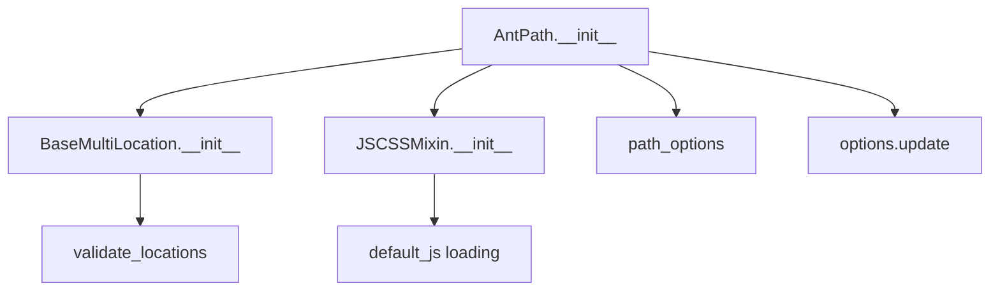

# `antpath.py`

## `folium.plugins.antpath.AntPath` · *class*

## Summary:
Creates animated paths on Leaflet maps using the leaflet-ant-path JavaScript library.

## Description:
The AntPath class implements an animated path visualization on Leaflet maps. It extends the functionality of BaseMultiLocation to handle multiple coordinate locations and integrates with JSCSSMixin for JavaScript/CSS resource management. This class is designed to render animated paths with customizable properties such as delay, color, and animation direction.

## State:
- _name (str): Set to "AntPath" indicating the type of element
- options (dict): Configuration dictionary containing path styling and animation properties including:
  - paused (bool): Whether the animation is paused initially, defaults to False
  - reverse (bool): Whether to animate in reverse direction, defaults to False
  - hardwareAcceleration (bool): Enables hardware acceleration, defaults to False
  - delay (int): Animation delay in milliseconds, defaults to 400
  - dashArray (list): Dash pattern for the path, defaults to [10, 20]
  - weight (int): Path line weight in pixels, defaults to 5
  - opacity (float): Path opacity, defaults to 0.5
  - color (str): Path color in hex format, defaults to "#0000FF"
  - pulseColor (str): Color of the pulse effect, defaults to "#FFFFFF"
- locations (list): Coordinate pairs defining the path, validated through BaseMultiLocation
- popup (Popup or str): Optional popup information for the path
- tooltip (Tooltip or str): Optional tooltip information for the path

## Lifecycle:
- Creation: Instantiate with locations parameter (required), optional popup and tooltip, and additional keyword arguments for styling
- Usage: Add to a folium.Map instance using the add_child() method
- Destruction: Managed automatically through folium's element lifecycle management

## Method Map:


## Raises:
- TypeError: When locations is not an iterable with coordinate pairs
- ValueError: When locations is empty

## Example:
```python
import folium
from folium.plugins import AntPath

# Create a map
m = folium.Map([40.7128, -74.0060], zoom_start=12)

# Define path coordinates
locations = [
    [40.7128, -74.0060],
    [40.7589, -73.9851],
    [40.7505, -73.9934]
]

# Create animated path with custom options
ant_path = AntPath(
    locations,
    popup="Animated Route",
    tooltip="Moving Path",
    color="#FF0000",
    weight=3,
    delay=200,
    pulse_color="#FFFF00"
)

# Add to map
m.add_child(ant_path)
```

### `folium.plugins.antpath.AntPath.__init__` · *method*

## Summary:
Initializes an AntPath object with location coordinates and customizable animation properties for leaflet ant paths.

## Description:
Configures the AntPath visualization element by setting up its location data, name identifier, and various animation-related options. This method serves as the constructor that prepares the object for rendering in a folium map with animated path visualization capabilities.

## Args:
    locations (list): A list of coordinate pairs (latitude, longitude) defining the path to be visualized.
    popup (Popup or str, optional): Popup information to display when clicking on the path. Defaults to None.
    tooltip (Tooltip or str, optional): Tooltip information to display on hover. Defaults to None.
    **kwargs: Additional keyword arguments for customizing path appearance and animation behavior:
        - paused (bool): Whether the animation is paused initially. Defaults to False.
        - reverse (bool): Whether to animate in reverse direction. Defaults to False.
        - hardware_acceleration (bool): Enable hardware acceleration for smoother animations. Defaults to False.
        - delay (int): Animation delay in milliseconds. Defaults to 400.
        - dash_array (list): Dash pattern for the path. Defaults to [10, 20].
        - weight (int): Path line weight in pixels. Defaults to 5.
        - opacity (float): Path opacity level. Defaults to 0.5.
        - color (str): Path color in hex format. Defaults to "#0000FF".
        - pulse_color (str): Color of the pulse effect. Defaults to "#FFFFFF".

## Returns:
    None: This method initializes the object's state and does not return any value.

## Raises:
    None explicitly raised. Exceptions may occur from parent class initialization or validation functions.

## State Changes:
    Attributes READ: None
    Attributes WRITTEN: 
        - self._name: Set to "AntPath" string
        - self.options: Dictionary containing path and animation configuration options

## Constraints:
    Preconditions:
        - locations must be a valid list of coordinate pairs
        - All coordinate values should be within valid geographic ranges
        - Parent class validation functions must accept the provided parameters
    
    Postconditions:
        - self._name is set to "AntPath"
        - self.options contains properly configured path and animation settings
        - The object is ready for rendering in a folium map context

## Side Effects:
    None: This method performs no I/O operations or external service calls. It only configures internal object state.

