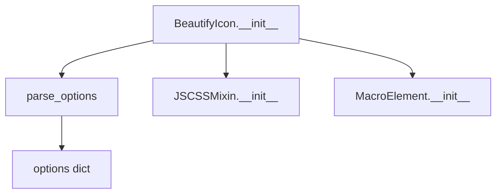

# `beautify_icon.py`

## `folium.plugins.beautify_icon.BeautifyIcon` · *class*

## Summary:
A customizable marker icon class for Folium maps that enhances the appearance of map markers using the BeautifyMarker library.

## Description:
The BeautifyIcon class creates visually enhanced marker icons for Folium maps by leveraging the BeautifyMarker JavaScript library. It allows users to customize various aspects of marker appearance including icon shape, colors, borders, and text content. This class is typically instantiated when creating custom markers for map visualization that require more visual appeal than standard markers.

The class inherits from JSCSSMixin to handle JavaScript and CSS resource loading from CDN, and from MacroElement which provides the base functionality for map elements in Folium.

## State:
- _name: str, set to "BeautifyIcon" - identifies the element type
- options: dict - stores configuration options parsed through parse_options function
- ICON_SHAPE_TYPES: list[str | None] - valid icon shape types including "circle", "circle-dot", "doughnut", "rectangle-dot", "marker", and None
- default_js: list[tuple[str, str]] - CDN URL for BeautifyMarker JavaScript library
- default_css: list[tuple[str, str]] - CDN URL for BeautifyMarker CSS styles

## Lifecycle:
- Creation: Instantiate with desired icon properties; constructor accepts various styling parameters
- Usage: Add to a Folium map using the add_to() method or similar
- Destruction: Managed automatically by Folium's garbage collection when the map is disposed

## Method Map:


## Raises:
- AssertionError: May be raised by parse_options if invalid options are provided (though this depends on the implementation of parse_options in the parent classes)

## Example:
```python
import folium

# Create a map
m = folium.Map(location=[45.5236, -122.6750], zoom_start=13)

# Create a beautified marker
icon = folium.plugins.BeautifyIcon(
    icon='star',
    icon_shape='circle',
    border_color='#FF0000',
    background_color='#FFFF00'
)

# Add marker to map
folium.Marker(
    location=[45.5236, -122.6750],
    icon=icon
).add_to(m)
```

### `folium.plugins.beautify_icon.BeautifyIcon.__init__` · *method*

## Summary:
Initializes a BeautifyIcon object with customizable styling parameters for map markers.

## Description:
Configures a BeautifyIcon instance with visual properties such as icon shape, border styling, colors, and optional numeric labels. This method serves as the constructor that prepares all necessary options for rendering attractive map markers using the BeautifyMarker library.

## Args:
    icon (str, optional): The icon name to display inside the marker. Defaults to None.
    icon_shape (str, optional): Shape of the marker icon. Valid values are 'circle', 'circle-dot', 'doughnut', 'rectangle-dot', 'marker', or None. Defaults to None.
    border_width (int): Width of the marker border in pixels. Defaults to 3.
    border_color (str): Color of the marker border in hex format. Defaults to "#000".
    text_color (str): Color of text inside the marker in hex format. Defaults to "#000".
    background_color (str): Background color of the marker in hex format. Defaults to "#FFF".
    inner_icon_style (str): Additional CSS styles to apply to the inner icon. Defaults to "".
    spin (bool): Whether to spin the icon continuously. Defaults to False.
    number (int, optional): Numeric label to display inside the marker. Defaults to None.
    **kwargs: Additional keyword arguments passed to the parent class initialization.

## Returns:
    None: This method initializes the object's state but does not return a value.

## Raises:
    AssertionError: If any of the validation checks in the parent class's parse_options method fail due to invalid option names or types.

## State Changes:
    Attributes READ: None
    Attributes WRITTEN: 
    - self._name: Set to "BeautifyIcon"
    - self.options: Set to the processed dictionary of options from parse_options

## Constraints:
    Preconditions:
    - The icon_shape parameter must be one of the predefined valid values
    - All color parameters must be valid hex color codes
    - Border width must be a positive integer
    - Number parameter, if provided, must be a valid numeric value
    
    Postconditions:
    - self._name is set to "BeautifyIcon"
    - self.options contains a properly formatted dictionary of all provided parameters
    - The object is ready for use in folium map rendering

## Side Effects:
    None: This method performs no I/O operations or external service calls. It only initializes object attributes.

