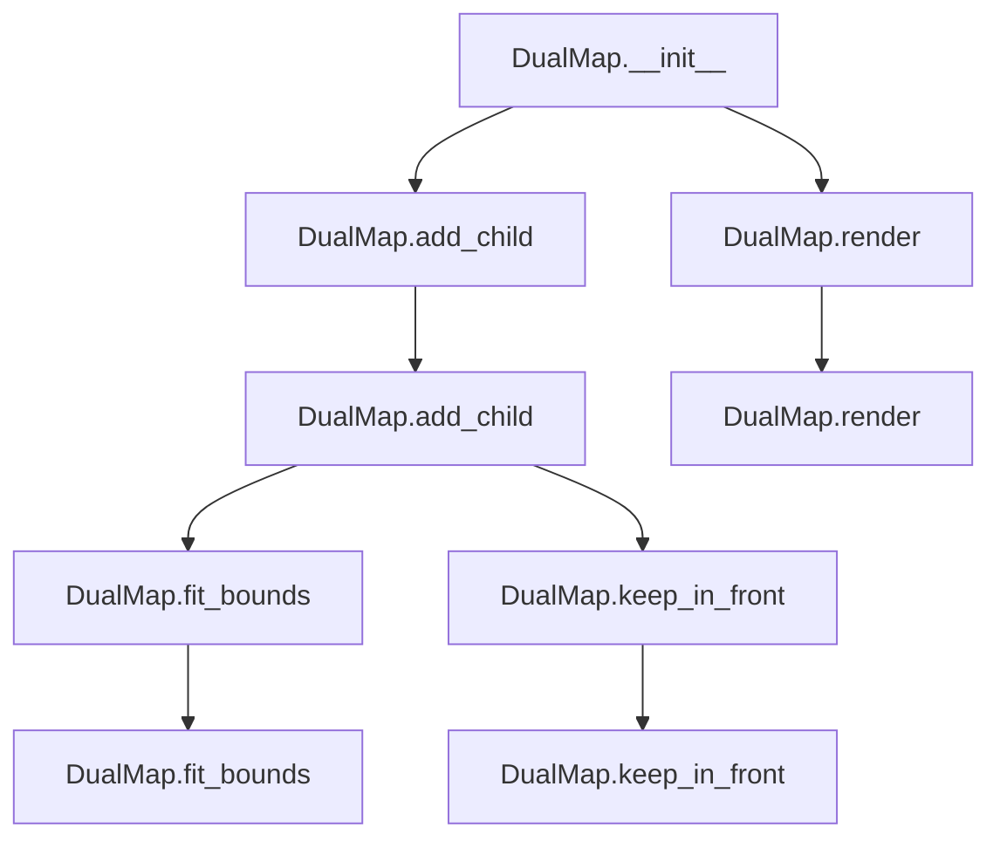

# `dual_map.py`

## `folium.plugins.dual_map.DualMap` · *class*

## Summary:
A dual map visualization component that displays two synchronized map views side-by-side or vertically.

## Description:
The DualMap class creates two synchronized map instances that can be displayed either horizontally (side-by-side) or vertically. It inherits from JSCSSMixin and MacroElement, making it compatible with folium's rendering system. The class manages two internal Map objects (m1 and m2) that are positioned absolutely within a shared container.

## State:
- m1 (Map): First map instance positioned absolutely at the top/left
- m2 (Map): Second map instance positioned absolutely, either to the right (horizontal layout) or bottom (vertical layout)  
- children_for_m2 (list): List of tuples containing (child, name, index) for tracking children to be added to m2
- children_for_m2_copied (list): List of child IDs that have already been copied to m2 to prevent duplication
- layout (str): Either "horizontal" or "vertical" indicating the arrangement of the two maps
- width (str): Width of each map (50% for horizontal, 100% for vertical)
- height (str): Height of each map (100% for horizontal, 50% for vertical)

## Lifecycle:
- Creation: Instantiate with location and layout parameters. The layout parameter determines whether maps appear side-by-side or stacked. The constructor sets up two internal Map instances with appropriate positioning.
- Usage: Add map elements to the DualMap instance (which adds them to m1), and they will be automatically synchronized to m2 during rendering. Call fit_bounds() or keep_in_front() to affect both maps.
- Destruction: Cleanup happens automatically when the object is garbage collected or when used in a context manager.

## Method Map:


## Raises:
- ValueError: When layout parameter is not "horizontal" or "vertical"
- AssertionError: When width, height, left, top, or position arguments are passed to __init__

## Example:
```python
import folium

# Create a dual map with horizontal layout
dual_map = folium.plugins.DualMap(
    location=[45.5236, -122.6750],  # Portland, OR
    layout="horizontal"
)

# Add markers to both maps
folium.Marker([45.5236, -122.6750], popup="Portland").add_to(dual_map)
folium.Marker([45.5236, -122.6751], popup="Nearby").add_to(dual_map)

# Fit bounds to show all markers
dual_map.fit_bounds([[45.5236, -122.6750], [45.5236, -122.6751]])

# Render the map
dual_map._repr_html_()
```

### `folium.plugins.dual_map.DualMap.__init__` · *method*

## Summary:
Initializes a DualMap instance with two Map objects arranged according to the specified layout.

## Description:
Creates a dual map interface containing two separate Map instances positioned either horizontally or vertically. This method validates input parameters, constructs the two maps with appropriate sizing and positioning, and establishes the container structure needed for the dual map functionality.

## Args:
    location (list or tuple, optional): The initial geographical center coordinates [latitude, longitude]. Defaults to None.
    layout (str): Layout orientation for the dual maps. Must be either 'horizontal' or 'vertical'. Defaults to 'horizontal'.
    **kwargs: Additional keyword arguments passed to both Map instances.

## Returns:
    None: This method initializes the object's state and does not return a value.

## Raises:
    ValueError: If the layout parameter is not 'horizontal' or 'vertical'.
    AssertionError: If any of the reserved keys ('width', 'height', 'left', 'top', 'position') are present in kwargs.

## State Changes:
    Attributes READ: None
    Attributes WRITTEN: 
    - self.m1: First Map instance with absolute positioning
    - self.m2: Second Map instance with absolute positioning  
    - self.children_for_m2: List to track children for second map
    - self.children_for_m2_copied: List to track copied children IDs for second map

## Constraints:
    Preconditions:
    - Layout must be either 'horizontal' or 'vertical'
    - kwargs must not contain reserved keys: 'width', 'height', 'left', 'top', 'position'
    
    Postconditions:
    - Two Map instances (m1 and m2) are created and initialized
    - A Figure is set up to contain both maps
    - Tracking lists for children management are initialized

## Side Effects:
    None: This method doesn't perform I/O operations or mutate external objects. It only initializes internal state.

### `folium.plugins.dual_map.DualMap._repr_html_` · *method*

## Summary:
Returns the HTML representation of the DualMap object for Jupyter notebook display, ensuring proper rendering even when the object lacks a parent container.

## Description:
This special method implements the HTML representation protocol for Jupyter notebook integration. It handles the case where the DualMap instance may not yet be attached to a parent container (like a Figure) by temporarily adding itself to a temporary Figure before delegating to the parent's HTML rendering method. This ensures consistent display behavior regardless of the object's attachment state.

## Args:
    **kwargs: Additional keyword arguments passed to the parent's _repr_html_ method for HTML generation customization

## Returns:
    str: HTML string representation of the DualMap object suitable for Jupyter notebook display

## Raises:
    None explicitly raised, though underlying parent._repr_html_ calls may raise exceptions

## State Changes:
    Attributes READ: self._parent
    Attributes WRITTEN: self._parent (temporarily set to None)

## Constraints:
    Preconditions: The object must be a valid folium element with proper parent-child relationship capabilities
    Postconditions: Returns valid HTML string for Jupyter display, with temporary parent state management

## Side Effects:
    Temporary attachment to a Figure object when self._parent is None
    Potential modification of internal parent reference during execution

### `folium.plugins.dual_map.DualMap.add_child` · *method*

## Summary:
Adds a child element to both maps in a dual map configuration, ensuring synchronization between the two map instances.

## Description:
This method handles the addition of child elements to a DualMap instance by adding the element to the first map (m1) immediately and storing the child information for later addition to the second map (m2) during the rendering phase. This ensures proper synchronization between the two maps while maintaining the correct ordering of elements.

The method is separated from inline logic to support the dual-map architecture where elements need to be processed in a specific order during rendering, rather than being added immediately to both maps. This design allows for proper synchronization between the two maps while preserving the expected behavior of folium's element management system.

## Args:
    child: The child element to be added to both maps
    name (str, optional): Name to assign to the child element. Defaults to None.
    index (int, optional): Position at which to insert the child element. Defaults to None.

## Returns:
    None

## Raises:
    None explicitly raised

## State Changes:
    Attributes READ: self.m1, self.m2._children
    Attributes WRITTEN: self.children_for_m2

## Constraints:
    Preconditions: 
    - The DualMap instance must be properly initialized with m1 and m2 maps
    - The child parameter must be a valid folium element that can be added to a map
    
    Postconditions:
    - The child element is added to m1 immediately
    - The child element information is stored in self.children_for_m2 for later processing
    - If index is None, it's calculated as the current length of m2's children

## Side Effects:
    None

### `folium.plugins.dual_map.DualMap.render` · *method*

*No documentation generated.*

### `folium.plugins.dual_map.DualMap.fit_bounds` · *method*

## Summary:
Adjusts the view of both maps in the dual map to fit specified geographical bounds.

## Description:
This method applies the fit_bounds functionality to both map instances (m1 and m2) within the DualMap. It ensures that both maps display the same geographical area when given the same bounds parameters. This method is particularly useful when you want to ensure both maps in a dual-view configuration show the same region at the appropriate zoom level.

The method delegates to the underlying Map.fit_bounds method on both maps, passing through all arguments unchanged. This allows for the same flexibility as calling fit_bounds directly on individual maps.

## Args:
    bounds (list or tuple): A list or tuple of two points defining the geographical bounds to fit. Each point should be in the format [latitude, longitude].
    padding_top_left (tuple, optional): Padding in pixels for the top-left corner of the bounds rectangle.
    padding_bottom_right (tuple, optional): Padding in pixels for the bottom-right corner of the bounds rectangle.
    padding (tuple, optional): Padding in pixels for all sides of the bounds rectangle.
    max_zoom (int, optional): Maximum zoom level to use when fitting bounds.

## Returns:
    None: This method does not return any value.

## Raises:
    Exception: May raise exceptions from the underlying Map.fit_bounds method if invalid parameters are provided.

## State Changes:
    Attributes READ: self.m1, self.m2
    Attributes WRITTEN: None

## Constraints:
    Preconditions: The DualMap instance must have both m1 and m2 attributes initialized as Map objects.
    Postconditions: Both self.m1 and self.m2 will have their view adjusted to fit the specified bounds.

## Side Effects:
    None: This method does not cause any external I/O or mutations beyond calling the fit_bounds method on the contained maps.

### `folium.plugins.dual_map.DualMap.keep_in_front` · *method*

## Summary:
Moves specified map elements to the front of the display layer order in both constituent maps.

## Description:
This method ensures that given map elements remain visually on top of other map elements in both maps of the dual map configuration. It propagates the keep_in_front call to both `self.m1` and `self.m2` instances, maintaining synchronized layer ordering between the two maps.

## Args:
    *args: Variable length argument list representing map elements (layers, markers, etc.) to be kept in front.

## Returns:
    None: This method does not return any value.

## Raises:
    None: This method does not explicitly raise exceptions.

## State Changes:
    Attributes READ: 
    - self.m1: First map instance in the dual map configuration
    - self.m2: Second map instance in the dual map configuration
    
    Attributes WRITTEN:
    - self.m1.objects_to_stay_in_front: Elements added to this list to maintain front positioning
    - self.m2.objects_to_stay_in_front: Elements added to this list to maintain front positioning

## Constraints:
    Preconditions:
    - Both `self.m1` and `self.m2` must be initialized Map instances
    - Arguments passed should be valid map elements that support the keep_in_front functionality
    
    Postconditions:
    - All provided arguments are added to the `objects_to_stay_in_front` lists of both maps
    - The visual layering of these elements is maintained consistently across both maps

## Side Effects:
    None: This method does not perform any I/O operations or external service calls. It only modifies internal state of the map objects.

