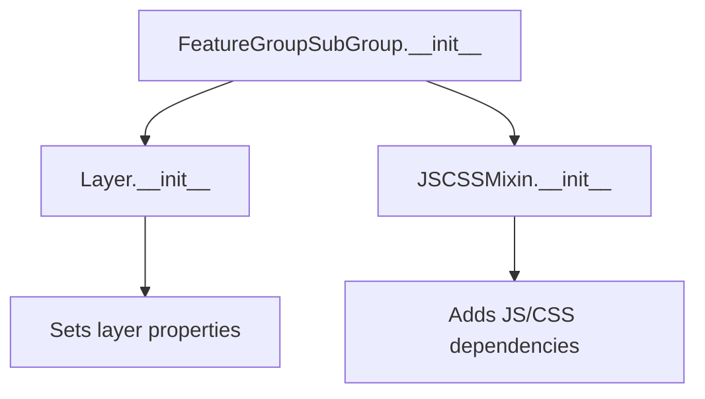

# `feature_group_sub_group.py`

## `folium.plugins.feature_group_sub_group.FeatureGroupSubGroup` · *class*

## Summary:
A Leaflet map layer component that implements the leaflet.featuregroup.subgroup plugin for hierarchical feature grouping.

## Description:
The FeatureGroupSubGroup class is a specialized map layer that integrates with the leaflet.featuregroup.subgroup JavaScript plugin to enable nested grouping of map features. It extends the standard Layer functionality with JavaScript/CSS dependencies required for the subgroup feature. This component serves as a container for organizing map elements within hierarchical feature group structures.

## State:
- `_group`: str - The parent feature group identifier that this subgroup belongs to
- `_name`: str - The name of this subgroup, hardcoded to "FeatureGroupSubGroup"
- `layer_name`: str - Inherited from Layer, represents the layer's name in the map
- `overlay`: bool - Inherited from Layer, determines if this is an overlay layer
- `control`: bool - Inherited from Layer, determines if this layer appears in the layer control
- `show`: bool - Inherited from Layer, controls initial visibility of the layer

## Lifecycle:
- Creation: Instantiate with a parent group identifier and optional configuration parameters
- Usage: Added as a child to a parent FeatureGroup to create nested group hierarchies
- Destruction: Managed through folium's standard layer cleanup mechanisms

## Method Map:


## Raises:
- None explicitly raised in __init__
- May inherit exceptions from parent Layer initialization

## Example:
```python
# Create a main feature group
main_group = folium.FeatureGroup(name="Main Group")

# Create a subgroup within the main group
sub_group = folium.plugins.FeatureGroupSubGroup(
    group="Main Group", 
    name="Sub Group"
)

# Add elements to the subgroup
marker = folium.Marker([0, 0])
sub_group.add_child(marker)

# Add subgroup to main group
main_group.add_child(sub_group)
```

### `folium.plugins.feature_group_sub_group.FeatureGroupSubGroup.__init__` · *method*

## Summary:
Initializes a FeatureGroupSubGroup instance that creates a subgroup within a parent feature group for Leaflet map visualization.

## Description:
This method constructs a FeatureGroupSubGroup object that serves as a container for grouping map elements within a parent feature group. It inherits functionality from both JSCSSMixin and Layer classes to provide proper rendering and map integration capabilities.

## Args:
    group (any): The parent group or feature group to which this subgroup belongs. This parameter defines the hierarchical relationship in the map structure.
    name (str, optional): Name identifier for the subgroup. Defaults to None, which uses the default naming mechanism.
    overlay (bool): Whether the subgroup appears as an overlay layer. Defaults to True.
    control (bool): Whether the subgroup appears in the map controls. Defaults to True.
    show (bool): Whether the subgroup is initially visible. Defaults to True.

## Returns:
    None: This method initializes the object's state and does not return a value.

## Raises:
    None explicitly raised by this method. Exceptions may be raised by parent class constructors.

## State Changes:
    Attributes READ: None
    Attributes WRITTEN: 
    - self._group: Set to the provided group parameter
    - self._name: Hardcoded to "FeatureGroupSubGroup"

## Constraints:
    Preconditions:
    - The group parameter should be a valid map layer or feature group object compatible with Leaflet's featuregroup.subgroup plugin
    - All parameters must be compatible with the parent Layer class initialization requirements
    
    Postconditions:
    - The object is initialized with proper layer properties (overlay, control, show)
    - The parent class initialization is completed successfully
    - The subgroup relationship with the parent group is established

## Side Effects:
    None: This method performs no I/O operations or external service calls. It only initializes object attributes.

