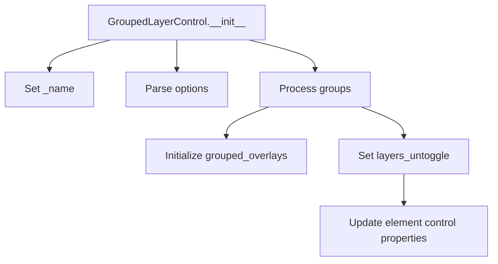

# `groupedlayercontrol.py`

## `folium.plugins.groupedlayercontrol.GroupedLayerControl` · *class*

## Summary:
A Leaflet-based grouped layer control that organizes map layers into logical groups with optional exclusive selection.

## Description:
The GroupedLayerControl class creates a grouped layer control for Leaflet maps in Folium, allowing users to organize map overlays into logical groups. It provides a user interface for managing visibility of different map layers, with support for exclusive groups where only one layer within a group can be active at a time. This component is typically used to enhance map interactivity by providing organized layer management.

## State:
- _name (str): Set to "GroupedLayerControl" indicating the type of control
- options (dict): Parsed options passed during initialization, including exclusiveGroups when applicable
- layers_untoggle (set): Set of layer names that should be initially hidden/unselected
- grouped_overlays (dict): Nested dictionary mapping group names to layer name mappings

## Lifecycle:
- Creation: Instantiate with groups parameter containing layer groups and optional exclusive_groups flag
- Usage: Add to a Folium map using the add_child() method
- Destruction: Managed automatically by Folium's rendering system

## Method Map:


## Raises:
- AssertionError: When invalid options are passed (if inherited from parse_options validation)

## Example:
```python
# Create grouped layers
grouped_control = GroupedLayerControl(
    groups={
        'Base Maps': [layer1, layer2],
        'Overlays': [layer3, layer4]
    },
    exclusive_groups=True
)

# Add to map
m.add_child(grouped_control)
```

### `folium.plugins.groupedlayercontrol.GroupedLayerControl.__init__` · *method*

## Summary:
Initializes a grouped layer control that organizes map overlays into logical groups with optional exclusive selection behavior.

## Description:
Configures a grouped layer control that allows users to manage map overlays in organized groups. When exclusive_groups is enabled, only one layer per group can be active simultaneously. This method processes the provided groups of map elements and sets up internal state for layer management and control behavior.

## Args:
    groups (dict): Dictionary mapping group names to lists of map overlay elements.
    exclusive_groups (bool): If True, enables exclusive selection within groups (only one layer per group active). Defaults to True.
    **kwargs: Additional options passed to the control configuration.

## Returns:
    None: This is a constructor method that initializes instance state.

## Raises:
    None explicitly raised.

## State Changes:
    Attributes READ: None
    Attributes WRITTEN: 
    - self._name: Set to "GroupedLayerControl"
    - self.options: Configured with parsed keyword arguments and exclusive groups list
    - self.layers_untoggle: Set to empty set, populated with layer names that should be initially hidden
    - self.grouped_overlays: Dictionary mapping group names to layer name mappings

## Constraints:
    Preconditions:
    - groups parameter must be a dictionary with string keys and iterable values
    - Each element in groups.values() must have layer_name, get_name(), and show attributes
    - Each element must support setting a control attribute
    
    Postconditions:
    - self._name is set to "GroupedLayerControl"
    - self.options contains parsed kwargs and exclusive groups configuration
    - self.layers_untoggle contains names of layers that should be initially hidden
    - self.grouped_overlays maps group names to layer name mappings

## Side Effects:
    None

