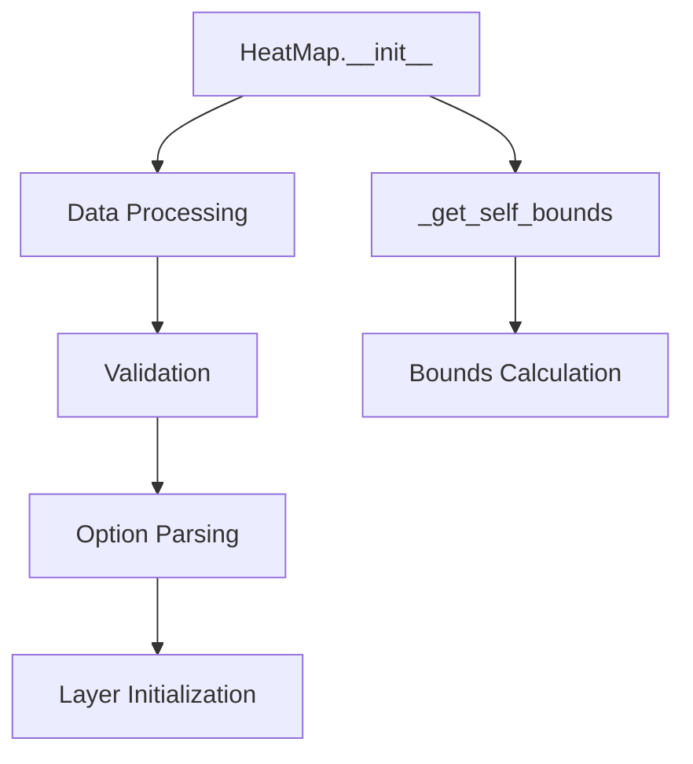

# `heat_map.py`

## `folium.plugins.heat_map.HeatMap` · *class*

## Summary:
A heatmap layer for folium maps that visualizes density or intensity of geographic data points.

## Description:
The HeatMap class creates a heatmap visualization layer that displays the density or intensity of geographic data points on a folium map. It is commonly used to visualize phenomena such as population density, crime incidents, or any spatial distribution data. The class inherits from JSCSSMixin and Layer, making it compatible with folium's layer management system.

This class processes geographic coordinates and intensity values to create a smooth heatmap visualization using Leaflet's heat layer plugin. It handles data conversion from pandas DataFrames to numpy arrays and validates coordinate locations before rendering.

## State:
- data: list of lists containing [latitude, longitude, intensity_value] tuples
  - Type: list[list[float]]
  - Valid range: latitude [-90, 90], longitude [-180, 180]
  - Invariant: All entries must be valid numeric coordinates with no NaN values
  - Structure: Each entry consists of [latitude, longitude, intensity_value] where intensity_value is optional additional data
- options: dict containing heatmap configuration parameters
  - Type: dict
  - Valid keys: min_opacity, max_zoom, radius, blur, gradient, and any additional keyword arguments
  - Invariant: All options must be properly parsed and validated

## Lifecycle:
- Creation: Instantiate with data and optional configuration parameters
- Usage: Add to a folium.Map object using the add_child() method
- Destruction: Automatically handled by folium's layer management system

## Method Map:


## Raises:
- ValueError: When data contains NaN values
- TypeError: When location data is not properly formatted
- ValueError: When location coordinates are invalid (out of range, non-numerical)

## Example:
```python
import folium
import numpy as np

# Create sample data: [latitude, longitude, intensity]
data = [
    [45.5, -122.7, 10],
    [45.6, -122.8, 25],
    [45.7, -122.9, 50]
]

# Create heatmap
heatmap = folium.plugins.HeatMap(data)

# Create map and add heatmap
m = folium.Map([45.6, -122.8], zoom_start=12)
m.add_child(heatmap)

# Display the map
m
```

### `folium.plugins.heat_map.HeatMap.__init__` · *method*

## Summary:
Initializes a heatmap layer with spatial data points and styling options.

## Description:
Configures a heatmap visualization layer by processing input data, validating coordinate locations, and setting rendering options. This method serves as the constructor for the HeatMap class, establishing the foundational configuration needed for displaying heatmaps on folium maps.

## Args:
    data (array-like): Spatial data points where each entry contains at least latitude and longitude coordinates followed by intensity values.
    name (str, optional): Name of the heatmap layer. Defaults to None.
    min_opacity (float): Minimum opacity of the heatmap. Defaults to 0.5.
    max_zoom (int): Maximum zoom level for the heatmap. Defaults to 18.
    radius (int): Radius of each heatmap point in pixels. Defaults to 25.
    blur (int): Blur radius for smoothing the heatmap. Defaults to 15.
    gradient (dict, optional): Color gradient mapping for heatmap colors. Defaults to None.
    overlay (bool): Whether to add the heatmap as an overlay. Defaults to True.
    control (bool): Whether to add the heatmap to the layer control. Defaults to True.
    show (bool): Whether the layer is shown initially. Defaults to True.
    **kwargs: Additional keyword arguments passed to the heatmap rendering engine.

## Returns:
    None: This method initializes the object's state and does not return a value.

## Raises:
    ValueError: If the data contains NaN values.
    TypeError: If location coordinates are not properly formatted.
    ValueError: If location coordinates contain invalid values.

## State Changes:
    Attributes READ: None
    Attributes WRITTEN: 
    - self._name: Set to "HeatMap"
    - self.data: Processed data with validated locations
    - self.options: Dictionary of parsed heatmap options

## Constraints:
    Preconditions:
    - Data must contain valid latitude and longitude coordinates
    - Data cannot contain NaN values
    - Location coordinates must be convertible to float values
    - Latitude values must be between -90 and 90 degrees
    - Longitude values must be between -180 and 180 degrees
    
    Postconditions:
    - self._name is set to "HeatMap"
    - self.data contains validated coordinate pairs with intensity values
    - self.options contains processed styling parameters

## Side Effects:
    - Issues a deprecation warning if max_val parameter is provided
    - Processes input data to convert pandas DataFrames to numpy arrays
    - Validates all coordinate locations for proper formatting and range

### `folium.plugins.heat_map.HeatMap._get_self_bounds` · *method*

## Summary:
Computes the geographic bounding box (min/max latitude/longitude) from the heatmap data points.

## Description:
This method calculates the minimum and maximum latitude and longitude coordinates from the data points stored in `self.data`. It is used internally by the HeatMap class to determine the geographic extent of the heatmap data for proper map rendering and zooming.

The method handles None values appropriately using the `none_min` and `none_max` utility functions, ensuring robust operation even when data points may contain missing coordinate values.

## Args:
    None

## Returns:
    list[list[float or None]]: A nested list representing the bounding box with format [[min_lat, min_lon], [max_lat, max_lon]], where each coordinate can be None if no valid data points exist.

## Raises:
    None

## State Changes:
    Attributes READ: self.data
    Attributes WRITTEN: None

## Constraints:
    Preconditions: 
    - `self.data` must be initialized and contain valid coordinate data
    - Each data point in `self.data` should be a sequence with at least two numeric elements representing latitude and longitude
    
    Postconditions:
    - Returns a properly formatted bounds structure with min/max coordinates
    - Handles None values gracefully through utility functions

## Side Effects:
    None

