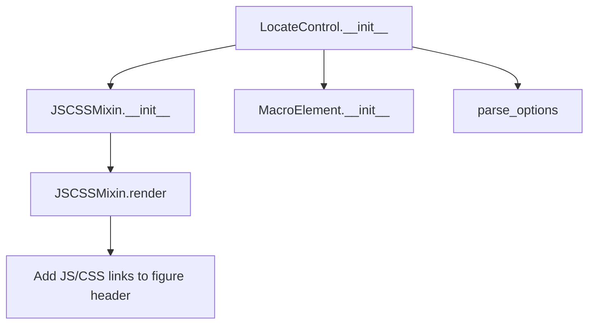

# `locate_control.py`

## `folium.plugins.locate_control.LocateControl` · *class*

## Summary:
A Leaflet map control that enables users to locate their current position on the map.

## Description:
The LocateControl class implements a Leaflet plugin control that provides location tracking functionality for interactive maps. It allows users to easily find and center their current geographic position on the map. This control is typically added to folium maps to provide geolocation capabilities to map viewers.

This class is designed to work with the Leaflet LocateControl plugin, which is loaded from a CDN. It inherits from JSCSSMixin to handle JavaScript and CSS resource management, and MacroElement to integrate properly with folium's element system.

## State:
- auto_start (bool): When True, automatically starts location tracking when the map loads. Defaults to False.
- options (dict): Processed keyword arguments that configure the locate control behavior. These are parsed using folium's parse_options utility.
- _name (str): Set to "LocateControl" to identify this element type in folium's rendering system.

## Lifecycle:
- Creation: Instantiate with optional auto_start parameter and additional configuration options
- Usage: Add to a folium.Map instance using the add_child() method
- Destruction: Managed automatically by folium's element lifecycle management

## Method Map:


## Raises:
- AssertionError: If invalid options are passed to parse_options (when options validation fails)

## Example:
```python
import folium

# Create a map
m = folium.Map(location=[40.7128, -74.0060], zoom_start=12)

# Add locate control that starts automatically
locate_control = folium.plugins.LocateControl(auto_start=True)
m.add_child(locate_control)

# Add locate control with custom options
locate_control_custom = folium.plugins.LocateControl(
    auto_start=False,
    drawCircle=True,
    follow=True
)
m.add_child(locate_control_custom)
```

### `folium.plugins.locate_control.LocateControl.__init__` · *method*

## Summary:
Initializes a LocateControl component that provides map location tracking functionality.

## Description:
Configures a LocateControl instance with optional auto-start behavior and customizable options. This method serves as the constructor for the LocateControl class, setting up the component's basic properties and processing configuration parameters.

## Args:
    auto_start (bool): Whether to automatically start location tracking when the map loads. Defaults to False.
    **kwargs: Additional configuration options passed to the underlying Leaflet LocateControl plugin.

## Returns:
    None: This method initializes the object's state and does not return a value.

## Raises:
    AssertionError: If any of the kwargs contain invalid option names or incorrect types (when used with Tooltip's parse_options method).

## State Changes:
    Attributes READ: None
    Attributes WRITTEN: 
    - self._name: Set to "LocateControl"
    - self.auto_start: Set to the provided auto_start value
    - self.options: Set to parsed kwargs processed by parse_options()

## Constraints:
    Preconditions: None
    Postconditions: The LocateControl instance is properly initialized with the specified configuration.

## Side Effects:
    None: This method performs no I/O operations or external service calls. It only sets internal object attributes.

