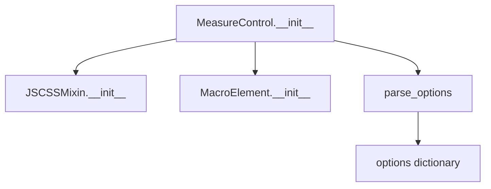

# `measure_control.py`

## `folium.plugins.measure_control.MeasureControl` · *class*

## Summary:
A Folium plugin that adds interactive measurement controls to Leaflet maps, enabling users to measure distances and areas on the map.

## Description:
The MeasureControl class provides an interface for adding measurement functionality to Folium maps by integrating the leaflet-measure library. It allows users to measure distances and areas directly on the map with customizable units and positioning. This class is typically instantiated by developers who want to add measurement capabilities to their interactive maps.

The class serves as a bridge between Folium's Python interface and the JavaScript-based leaflet-measure plugin, handling the configuration and rendering of measurement tools in the browser.

## State:
- `_name`: str, set to "MeasureControl" - identifies the control type in Folium's element hierarchy
- `options`: dict - contains parsed configuration options including:
  - position: str, defaults to "topright" - placement of the control on the map
  - primary_length_unit: str, defaults to "meters" - primary unit for distance measurements
  - secondary_length_unit: str, defaults to "miles" - secondary unit for distance measurements  
  - primary_area_unit: str, defaults to "sqmeters" - primary unit for area measurements
  - secondary_area_unit: str, defaults to "acres" - secondary unit for area measurements
- `default_js`: list of tuples - CDN URLs for the leaflet-measure JavaScript library
- `default_css`: list of tuples - CDN URLs for the leaflet-measure CSS styles
- `_template`: jinja2.Template - HTML template for rendering (currently empty in the implementation)

## Lifecycle:
- Creation: Instantiate with optional configuration parameters for positioning and units
- Usage: Add to a Folium Map object using the standard Folium pattern (map.add_child(measure_control))
- Destruction: Managed automatically by Folium's element lifecycle management

## Method Map:


## Raises:
- AssertionError: When invalid options are passed to parse_options (though this is handled internally by the parse_options utility)

## Example:
```python
import folium
from folium.plugins import MeasureControl

# Create a map
m = folium.Map(location=[45.5236, -122.6750], zoom_start=13)

# Add measurement control with custom settings
measure = MeasureControl(
    position='topleft',
    primary_length_unit='kilometers',
    secondary_length_unit='miles',
    primary_area_unit='sqkm',
    secondary_area_unit='hectares'
)

# Add to map
m.add_child(measure)

# The map now displays measurement controls in the top left corner
```

### `folium.plugins.measure_control.MeasureControl.__init__` · *method*

## Summary:
Initializes a MeasureControl instance with configurable measurement units and positioning options.

## Description:
Configures the measurement control widget for leaflet maps with customizable length and area units, positioning, and additional options. This method sets up the internal state required for rendering the measurement control in a folium map.

## Args:
    position (str): Position of the control on the map. Defaults to "topright".
    primary_length_unit (str): Primary unit for length measurements. Defaults to "meters".
    secondary_length_unit (str): Secondary unit for length measurements. Defaults to "miles".
    primary_area_unit (str): Primary unit for area measurements. Defaults to "sqmeters".
    secondary_area_unit (str): Secondary unit for area measurements. Defaults to "acres".
    **kwargs: Additional keyword arguments passed to the parent class initialization.

## Returns:
    None: This method initializes the object's state but does not return a value.

## Raises:
    AssertionError: If any of the provided options don't match expected types or values as validated by parse_options.

## State Changes:
    Attributes READ: None
    Attributes WRITTEN: 
    - self._name: Set to "MeasureControl"
    - self.options: Set to parsed options dictionary containing position and unit configurations

## Constraints:
    Preconditions: 
    - All unit parameters must be valid string values recognized by the underlying measurement library
    - Position parameter must be a valid position string accepted by leaflet controls
    Postconditions: 
    - self._name is set to "MeasureControl"
    - self.options contains a properly formatted dictionary of configuration options

## Side Effects:
    None: This method performs no I/O operations or external service calls. It only configures internal object state.

