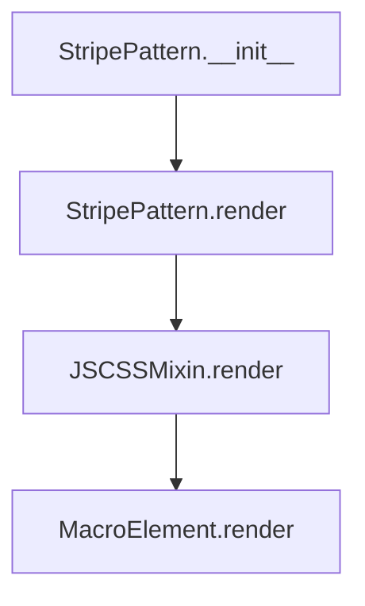
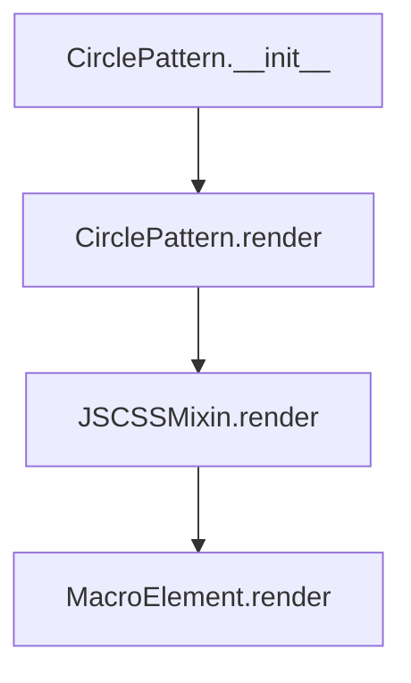

# `pattern.py`

## `folium.plugins.pattern.StripePattern` · *class*

## Summary:
A Folium plugin for creating stripe patterns in Leaflet maps using the leaflet.pattern library.

## Description:
The StripePattern class provides a way to define stripe pattern configurations that can be applied to map features in Folium. It serves as a configuration element that specifies visual properties for stripe patterns such as angle, weight, colors, and opacity. This class is intended to be added to a Folium Map object and will automatically integrate with the Leaflet.pattern JavaScript library when rendered.

The class follows Folium's standard plugin architecture by inheriting from JSCSSMixin and MacroElement, making it compatible with Folium's element management system.

## State:
- angle: float, default 0.5 - Angle of the stripes in radians
- weight: int, default 4 - Width of the stripe lines in pixels
- space_weight: int, default 4 - Width of the spaces between stripes in pixels
- color: str, default "#000000" - Color of the stripe lines (hex color code)
- space_color: str, default "#ffffff" - Color of the spaces between stripes (hex color code)
- opacity: float, default 0.75 - Opacity of the stripe lines (0.0 to 1.0)
- space_opacity: float, default 0.0 - Opacity of the spaces between stripes (0.0 to 1.0)
- parent_map: Map or None - Reference to the parent map instance, set during rendering
- _name: str - Fixed name "StripePattern" identifying this element type
- options: dict - Parsed options dictionary containing all pattern configuration parameters

## Lifecycle:
- Creation: Instantiate with optional styling parameters; no special initialization required
- Usage: Add to a Folium Map object using add_child(); the pattern will be rendered when the map is displayed
- Destruction: Cleanup handled automatically by Folium's element management system

## Method Map:


## Raises:
- AssertionError: When invalid options are passed to parse_options (if validation is enabled)
- ValueError: When get_obj_in_upper_tree cannot find a Map parent during rendering (when the pattern is not properly added to a Map)

## Example:
```python
import folium
from folium.plugins import StripePattern

# Create a map
m = folium.Map([45.5236, -122.6750], zoom_start=13)

# Create a stripe pattern
pattern = StripePattern(
    angle=0.785,  # 45 degrees
    weight=6,
    color="#ff0000",
    opacity=0.8
)

# Add pattern to map
m.add_child(pattern)

# The pattern configuration will be used when rendering map features that reference it
```

### `folium.plugins.pattern.StripePattern.__init__` · *method*

## Summary:
Initializes a StripePattern object with configurable styling parameters for map overlays.

## Description:
Configures the StripePattern instance with visual properties such as angle, weight, colors, and opacities. This method sets up the pattern's configuration options and establishes the basic object state required for rendering on folium maps.

## Args:
    angle (float): Rotation angle of the stripes in radians. Defaults to 0.5.
    weight (int): Width of the stripe lines in pixels. Defaults to 4.
    space_weight (int): Width of the spacing between stripes in pixels. Defaults to 4.
    color (str): Color of the stripe lines in hex format. Defaults to "#000000".
    space_color (str): Color of the background/spaces in hex format. Defaults to "#ffffff".
    opacity (float): Opacity of the stripe lines (0.0 to 1.0). Defaults to 0.75.
    space_opacity (float): Opacity of the background/spaces (0.0 to 1.0). Defaults to 0.0.
    **kwargs: Additional keyword arguments passed to the parent class initialization.

## Returns:
    None: This method initializes the object state and does not return a value.

## Raises:
    AssertionError: If any of the provided options don't match their expected types or aren't in the valid options list (handled by parse_options).

## State Changes:
    Attributes READ: None
    Attributes WRITTEN: 
    - self._name: Set to "StripePattern"
    - self.options: Set to parsed options dictionary from parse_options
    - self.parent_map: Set to None

## Constraints:
    Preconditions: None
    Postconditions: 
    - self._name is set to "StripePattern"
    - self.options contains validated configuration parameters
    - self.parent_map is initialized to None

## Side Effects:
    None: This method performs no I/O operations or external service calls. It only initializes object attributes.

### `folium.plugins.pattern.StripePattern.render` · *method*

## Summary:
Sets the parent Map reference and delegates rendering to the parent class.

## Description:
This method overrides the standard render process to establish a reference to the parent Map instance in the element hierarchy before proceeding with the normal rendering workflow. It is called during the map rendering phase when the pattern element needs to be rendered onto the map.

## Args:
    **kwargs: Additional keyword arguments passed to the parent render method.

## Returns:
    None: This method does not return a value.

## Raises:
    ValueError: Raised by get_obj_in_upper_tree if no Map instance is found in the parent hierarchy.

## State Changes:
    Attributes READ: None
    Attributes WRITTEN: self.parent_map

## Constraints:
    Preconditions: The element must be properly added to a Map instance's element hierarchy before rendering.
    Postconditions: The self.parent_map attribute will contain a reference to the Map instance containing this pattern element.

## Side Effects:
    None: This method does not perform any I/O operations or mutate external objects.

## `folium.plugins.pattern.CirclePattern` · *class*

## Summary:
A circle pattern generator for Folium maps that creates repeatable circular patterns using Leaflet.pattern library.

## Description:
The CirclePattern class provides a mechanism for creating circular patterns that can be applied to map features in Folium. It extends Folium's plugin system to support pattern fills using the Leaflet.pattern JavaScript library. This class configures pattern properties such as circle size, stroke, and fill characteristics.

## State:
- width: int, default 20 - Width of the pattern tile in pixels
- height: int, default 20 - Height of the pattern tile in pixels  
- radius: int, default 12 - Radius of the circle in the pattern
- weight: float, default 2.0 - Stroke width of the circle outline
- color: str, default "#3388ff" - Color of the circle outline
- fill_color: str, default "#3388ff" - Fill color of the circle
- opacity: float, default 0.75 - Opacity of the circle outline
- fill_opacity: float, default 0.5 - Opacity of the circle fill
- parent_map: str or None - Name of the parent map instance, set during rendering

## Lifecycle:
- Creation: Instantiate with optional pattern configuration parameters
- Usage: Add to a Folium Map instance using add_child(), which triggers the rendering process
- Destruction: Managed automatically by Folium's rendering system

## Method Map:


## Raises:
- AssertionError: When invalid options are passed to parse_options (via parent classes)

## Example:
```python
import folium
from folium.plugins import CirclePattern

# Create a map
m = folium.Map([0, 0], zoom_start=2)

# Create a circle pattern with custom settings
pattern = CirclePattern(
    width=30,
    height=30,
    radius=15,
    weight=3.0,
    color="red",
    fill_color="yellow"
)

# Add pattern to map
m.add_child(pattern)

# Render the map
m.save("pattern_map.html")
```

### `folium.plugins.pattern.CirclePattern.__init__` · *method*

## Summary:
Initializes a CirclePattern object with configurable dimensions, radius, stroke properties, and fill settings for use in map patterns.

## Description:
This method constructs a CirclePattern instance by setting up its geometric properties, visual styling options, and pattern configuration. It initializes the pattern with default dimensions of 20x20 pixels and a circle radius of 12 pixels, while allowing customization of stroke weight, colors, and opacities. The method prepares the pattern for rendering in folium maps by configuring both circular and pattern-specific options.

## Args:
    width (int): Width of the pattern area in pixels. Defaults to 20.
    height (int): Height of the pattern area in pixels. Defaults to 20.
    radius (int): Radius of the circle within the pattern in pixels. Defaults to 12.
    weight (float): Stroke weight of the circle outline in pixels. Defaults to 2.0.
    color (str): Color of the circle outline in hex format. Defaults to "#3388ff".
    fill_color (str): Fill color of the circle in hex format. Defaults to "#3388ff".
    opacity (float): Opacity of the circle outline (0.0 to 1.0). Defaults to 0.75.
    fill_opacity (float): Opacity of the circle fill (0.0 to 1.0). Defaults to 0.5.

## Returns:
    None: This is an initialization method that sets up instance attributes.

## Raises:
    None explicitly raised in this method.

## State Changes:
    Attributes READ: None
    Attributes WRITTEN: 
    - self._name: Set to "CirclePattern"
    - self.options_pattern_circle: Configured with parsed circle options including x, y, weight, radius, color, fill_color, opacity, fill_opacity, and fill
    - self.options_pattern: Configured with parsed pattern dimensions (width, height)
    - self.parent_map: Set to None

## Constraints:
    Preconditions: None explicitly checked
    Postconditions: Instance is initialized with all required pattern configuration attributes set

## Side Effects:
    None: This method performs only local attribute assignments and does not cause external I/O or service calls.

### `folium.plugins.pattern.CirclePattern.render` · *method*

## Summary:
Sets the parent map reference and delegates rendering to the parent class.

## Description:
This method establishes the connection between the CirclePattern instance and its parent Map object by retrieving the map's name from the object hierarchy. It then invokes the parent class's render method to complete the rendering process. This method must be called after the CirclePattern has been added to a Map object in the hierarchy.

## Args:
    **kwargs: Additional keyword arguments passed to the parent render method.

## Returns:
    None: This method does not return a value.

## Raises:
    ValueError: If no Map object is found in the parent hierarchy.

## State Changes:
    Attributes READ: None
    Attributes WRITTEN: self.parent_map

## Constraints:
    Preconditions: The CirclePattern instance must be added to a Map object in the hierarchy for successful execution.
    Postconditions: The self.parent_map attribute will contain the name of the parent Map object.

## Side Effects:
    None: This method does not perform any I/O operations or mutate external objects.

