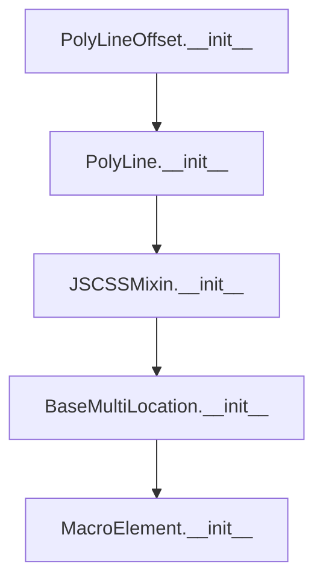

# `polyline_offset.py`

## `folium.plugins.polyline_offset.PolyLineOffset` · *class*

## Summary:
A Folium map element that renders a polyline with configurable offset using the Leaflet Polyline Offset plugin.

## Description:
The PolyLineOffset class extends the standard PolyLine functionality by adding support for offsetting polylines in map visualizations. This is particularly useful for creating parallel lines or avoiding overlap when rendering multiple lines on the same map. It leverages the leaflet-polylineoffset JavaScript library to achieve this effect.

This class should be instantiated when creating map elements that require polyline offset capabilities, typically in geographic visualization applications where multiple lines need to be displayed without overlapping.

## State:
- locations: list of coordinate pairs defining the polyline path
- popup: optional popup element to display on click
- tooltip: optional tooltip element to display on hover  
- offset: int, default 0, controls horizontal offset distance for the polyline
- _name: str, fixed value "PolyLineOffset" identifying this element type
- options: dict containing configuration options including the offset value

## Lifecycle:
Creation: Instantiate with locations list and optional popup/tooltip parameters, plus offset value (default 0)
Usage: Add to a Folium map figure using the standard add_child() method
Destruction: Managed automatically by the Folium figure lifecycle

## Method Map:


## Raises:
- None explicitly raised by __init__
- Inheritance from BaseMultiLocation may raise validation errors for invalid locations

## Example:
```python
import folium

# Create a map
m = folium.Map([45.5236, -122.6750], zoom_start=13)

# Create offset polylines
locations1 = [[45.5236, -122.6750], [45.5237, -122.6751]]
locations2 = [[45.5236, -122.6750], [45.5237, -122.6751]]

# Create two polylines with different offsets
poly1 = folium.plugins.PolyLineOffset(locations1, offset=5)
poly2 = folium.plugins.PolyLineOffset(locations2, offset=-5)

# Add to map
m.add_child(poly1)
m.add_child(poly2)
```

### `folium.plugins.polyline_offset.PolyLineOffset.__init__` · *method*

## Summary:
Initializes a PolyLineOffset object with location coordinates and offset configuration.

## Description:
Constructs a polyline with an offset parameter that allows for drawing parallel lines to the original path. This method sets up the basic polyline structure and configures the offset option for rendering.

## Args:
    locations (list): List of coordinate pairs [latitude, longitude] defining the polyline path.
    popup (Popup or str, optional): Popup information to display on click. Defaults to None.
    tooltip (Tooltip or str, optional): Tooltip information to display on hover. Defaults to None.
    offset (int, optional): Offset distance for the polyline in pixels. Defaults to 0.
    **kwargs: Additional keyword arguments passed to the parent PolyLine class for styling options.

## Returns:
    None: This method initializes the object's state but does not return a value.

## Raises:
    None: This method does not explicitly raise exceptions.

## State Changes:
    Attributes READ: None
    Attributes WRITTEN: 
    - self._name: Set to "PolyLineOffset"
    - self.options: Updated with offset parameter

## Constraints:
    Preconditions:
    - locations must be a valid list of coordinate pairs
    - Each coordinate pair must contain valid latitude and longitude values
    - offset must be a numeric value (integer or float)
    
    Postconditions:
    - self._name is set to "PolyLineOffset"
    - self.options contains the offset configuration
    - The object is properly initialized as a PolyLine with offset capability

## Side Effects:
    None: This method performs no I/O operations or external service calls.

