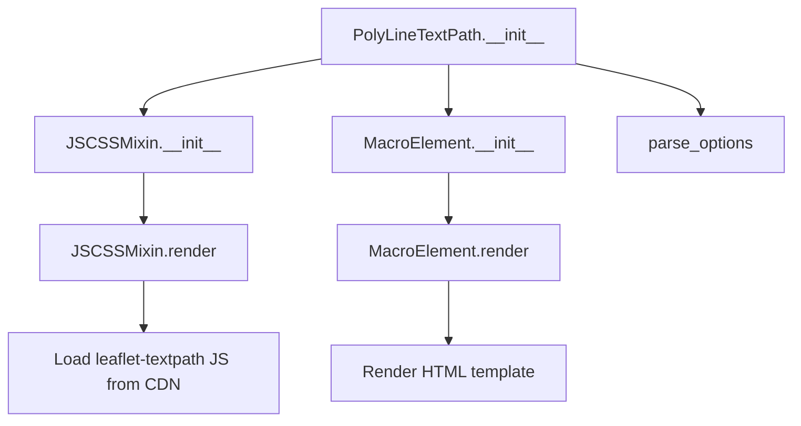

# `polyline_text_path.py`

## `folium.plugins.polyline_text_path.PolyLineTextPath` · *class*

## Summary:
A Folium plugin for rendering text along a polyline on a Leaflet map using the leaflet-textpath JavaScript library.

## Description:
The PolyLineTextPath class enables placing text along the path of a polyline on a Leaflet map. This plugin allows for annotating map features such as routes, paths, or linear geographic features with descriptive text that follows the shape of the polyline. It integrates with the leaflet-textpath JavaScript library to provide this functionality in Folium maps.

This class is typically instantiated when creating map elements that require text annotation along polylines. It should be added to a Folium map alongside the associated polyline to display the text along the path.

## State:
- polyline: The polyline object to which text will be aligned. Type: folium PolyLine object.
- text: The text string to be displayed along the polyline. Type: str.
- options: Dictionary containing configuration options for text positioning and appearance. Type: dict, constructed via parse_options.
- _name: String identifier for the component. Type: str, value is "PolyLineTextPath".
- _template: Jinja2 template for HTML rendering. Type: jinja2.Template (empty in current implementation).
- default_js: List of JavaScript dependencies required for functionality. Type: list of tuples.

## Lifecycle:
- Creation: Instantiate with a polyline and text string, optionally providing positioning parameters.
- Usage: Add to a Folium map using the standard add_child() method.
- Destruction: Managed automatically by Folium's map lifecycle management.

## Method Map:


## Raises:
- AssertionError: If invalid options are provided to parse_options (though this is handled internally by the parent classes).

## Example:
```python
import folium

# Create a map
m = folium.Map([45.5236, -122.6750], zoom_start=13)

# Create a polyline
polyline = folium.PolyLine(
    locations=[[45.5236, -122.6750], [45.5237, -122.6751]],
    color='blue'
)

# Add text along the polyline
text_path = folium.plugins.PolyLineTextPath(
    polyline=polyline,
    text='Sample Route',
    repeat=True,
    offset=10
)

# Add components to map
polyline.add_to(m)
text_path.add_to(m)
```

### `folium.plugins.polyline_text_path.PolyLineTextPath.__init__` · *method*

## Summary:
Initializes a PolyLineTextPath element that renders text along a polyline on a folium map.

## Description:
Configures a text path element that will be rendered along a specified polyline on a folium map. This method sets up the core properties and options needed for rendering text along a geographic polyline.

## Args:
    polyline (object): The polyline object along which text will be rendered.
    text (str): The text string to be displayed along the polyline.
    repeat (bool): Whether to repeat the text along the polyline. Defaults to False.
    center (bool): Whether to center the text on the polyline. Defaults to False.
    below (bool): Whether to place the text below the polyline. Defaults to False.
    offset (int): Offset in pixels for text positioning. Defaults to 0.
    orientation (int): Orientation angle in degrees for text rotation. Defaults to 0.
    attributes (dict): Additional HTML attributes for the text element. Defaults to None.
    **kwargs: Additional keyword arguments passed to the options parser.

## Returns:
    None: This method initializes the object's state and does not return a value.

## Raises:
    None explicitly raised: This method does not raise exceptions directly.

## State Changes:
    Attributes READ: None
    Attributes WRITTEN: 
    - self._name: Set to "PolyLineTextPath"
    - self.polyline: Set to the provided polyline argument
    - self.text: Set to the provided text argument
    - self.options: Set to parsed options dictionary

## Constraints:
    Preconditions:
    - The polyline argument must be a valid polyline object compatible with folium
    - The text argument must be a string
    - All keyword arguments must be valid for the parse_options function
    
    Postconditions:
    - The object is initialized with proper _name attribute set to "PolyLineTextPath"
    - The polyline and text properties are stored for later rendering
    - Options are parsed and stored for rendering configuration

## Side Effects:
    None: This method performs only local object initialization and does not cause external side effects.

