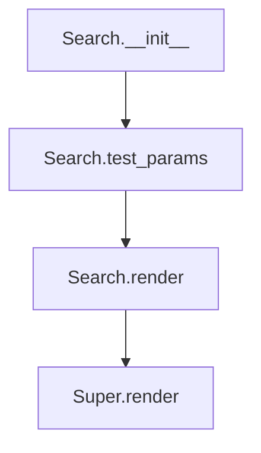

# `search.py`

## `folium.plugins.search.Search` · *class*

## Summary:
The Search class provides a searchable interface for folium map layers, enabling users to find and highlight features on maps by searching through feature properties.

## Description:
The Search class implements a client-side search functionality that allows users to search through geographic features in supported folium layers (FeatureGroup, MarkerCluster, GeoJson, TopoJson). It integrates with Leaflet's search plugin to provide interactive search capabilities on maps. This class serves as a bridge between folium's Python interface and the JavaScript-based search functionality.

The Search class is typically instantiated by developers who want to add search capability to their folium maps, particularly when working with geographic data that has associated properties that can be searched.

## State:
- layer: The folium layer object (FeatureGroup, MarkerCluster, GeoJson, or TopoJson) that will be indexed for searching
- search_label: Optional string specifying which property field to use for searching (defaults to None)
- search_zoom: Optional integer specifying zoom level to set when search results are found (defaults to None)
- geom_type: String indicating geometry type, defaults to "Point"
- position: String indicating where the search control appears on the map, defaults to "topleft"
- placeholder: String shown in the search input box, defaults to "Search"
- collapsed: Boolean indicating if search control starts collapsed, defaults to False
- options: Dictionary of additional options parsed via folium.utilities.parse_options
- _template: Jinja2 template for rendering the JavaScript component (private, implementation detail)
- default_js: List of JavaScript files needed for the search functionality
- default_css: List of CSS files needed for the search styling

## Lifecycle:
- Creation: Instantiate with a supported folium layer and optional configuration parameters
- Usage: Add to a folium Map instance using the standard folium.add_child() method
- Rendering: When the map is rendered, the search control is injected into the HTML output
- Destruction: Cleanup happens automatically when the map is destroyed or the element is removed

## Method Map:


## Raises:
- AssertionError: Raised during __init__ if the layer is not one of the supported types (FeatureGroup, MarkerCluster, GeoJson, TopoJson)
- AssertionError: Raised during test_params if the search_label is specified but not found in the layer's properties
- AssertionError: Raised during test_params if the Search element is not added to a folium Map object

## Example:
```python
import folium
from folium.plugins import Search
from folium.features import GeoJson

# Create a sample map
m = folium.Map([40.7128, -74.0060], zoom_start=12)

# Create a GeoJson layer with properties
geojson_data = {
    "type": "FeatureCollection",
    "features": [
        {
            "type": "Feature",
            "properties": {"name": "Central Park", "type": "park"},
            "geometry": {
                "type": "Polygon",
                "coordinates": [[[-74.01, 40.71], [-74.01, 40.75], [-73.99, 40.75], [-73.99, 40.71], [-74.01, 40.71]]]
            }
        }
    ]
}

geojson_layer = GeoJson(geojson_data)
m.add_child(geojson_layer)

# Add search functionality
search = Search(
    layer=geojson_layer,
    search_label="name",
    placeholder="Search places...",
    position="topright"
)
m.add_child(search)

# The map now has a search control that can search by name property
```

### `folium.plugins.search.Search.__init__` · *method*

## Summary:
Initializes a search plugin for folium maps that enables searching within specified map layers.

## Description:
Configures a search functionality that can index and search features within GeoJson, MarkerCluster, FeatureGroup, or TopoJson layers. This method sets up all configuration parameters and validates that the target layer type is supported for indexing.

## Args:
    layer (GeoJson, MarkerCluster, FeatureGroup, TopoJson): The map layer to index for search functionality. Must be one of these supported layer types.
    search_label (str, optional): Property name to use for search labels. Defaults to None.
    search_zoom (int, optional): Zoom level to set when searching. Defaults to None.
    geom_type (str): Geometry type to search for. Defaults to "Point".
    position (str): Position of the search control on the map. Defaults to "topleft".
    placeholder (str): Placeholder text for the search input field. Defaults to "Search".
    collapsed (bool): Whether the search control is initially collapsed. Defaults to False.
    **kwargs: Additional options passed to the underlying Leaflet Search plugin.

## Returns:
    None: This method initializes the object's state but does not return a value.

## Raises:
    AssertionError: When the layer parameter is not an instance of GeoJson, MarkerCluster, FeatureGroup, or TopoJson.

## State Changes:
    Attributes READ: None
    Attributes WRITTEN: 
    - self.layer: Stores the target map layer to index
    - self.search_label: Stores the property name for search labels
    - self.search_zoom: Stores the zoom level for search results
    - self.geom_type: Stores the geometry type to search for
    - self.position: Stores the position of the search control
    - self.placeholder: Stores the placeholder text for search input
    - self.collapsed: Stores whether the search control is collapsed
    - self.options: Stores processed keyword arguments for Leaflet plugin

## Constraints:
    Preconditions:
    - The layer parameter must be an instance of GeoJson, MarkerCluster, FeatureGroup, or TopoJson
    - The layer must be added to a folium Map object before rendering
    
    Postconditions:
    - All configuration parameters are stored as instance attributes
    - The options dictionary contains processed keyword arguments
    - The object is ready for rendering with valid configuration

## Side Effects:
    None: This method performs no I/O operations or external service calls. It only stores configuration parameters.

### `folium.plugins.search.Search.test_params` · *method*

## Summary:
Validates search parameters including label availability in keys and parent map compatibility.

## Description:
This method performs validation checks for the search functionality. It ensures that when a search label is specified, it exists in the available keys from the indexed layer properties. Additionally, it verifies that the search control can only be added to folium Map objects. This validation occurs during the rendering phase of the search component.

## Args:
    keys (tuple or None): Collection of property keys from the indexed layer data, or None for unsupported layer types.

## Returns:
    None: This method does not return any value.

## Raises:
    AssertionError: When search_label is specified but not found in keys, or when _parent is not a Map instance.

## State Changes:
    Attributes READ: self.search_label, self._parent
    Attributes WRITTEN: None

## Constraints:
    Preconditions: 
    - The Search instance must have a valid layer assigned during initialization
    - The search_label attribute must be either None or a string value
    - The keys parameter should be a tuple of property names or None
    
    Postconditions:
    - The method will raise an AssertionError if validation fails
    - The _parent attribute must reference a Map instance after successful validation

## Side Effects:
    None: This method performs only validation checks and does not cause any I/O operations or external service calls.

### `folium.plugins.search.Search.render` · *method*

## Summary:
Extracts property keys from GeoJson or TopoJson layers for search parameter validation before rendering the search plugin.

## Description:
This method prepares search functionality by extracting available property keys from GeoJson or TopoJson layers to validate the search_label parameter. It serves as a specialized rendering handler that ensures search parameters are compatible with the layer's data structure before proceeding with standard rendering. For GeoJson layers, it accesses the first feature's properties, and for TopoJson layers, it extracts properties from the first geometry in the object's geometries array.

## Args:
    **kwargs: Additional keyword arguments passed through to the parent JSCSSMixin.render() method for standard rendering operations

## Returns:
    None: This method doesn't return a value but performs validation and initiates the rendering process

## Raises:
    AssertionError: When search_label is not found in the layer properties for GeoJson/TopoJson layers, or when the parent is not a Map instance

## State Changes:
    Attributes READ: self.layer, self.search_label, self._parent
    Attributes WRITTEN: None

## Constraints:
    Preconditions:
    - self.layer must be an instance of GeoJson, TopoJson, FeatureGroup, or MarkerCluster
    - self._parent must be an instance of folium.Map
    - For GeoJson/TopoJson layers, the layer must contain features/geometries with properties
    
    Postconditions:
    - The search_label parameter is validated against available properties for GeoJson/TopoJson layers
    - The parent Map object is confirmed to be valid
    - Standard rendering process is initiated via super().render()

## Side Effects:
    None: This method doesn't perform I/O operations or mutate external objects. It only validates parameters and calls parent rendering logic.

