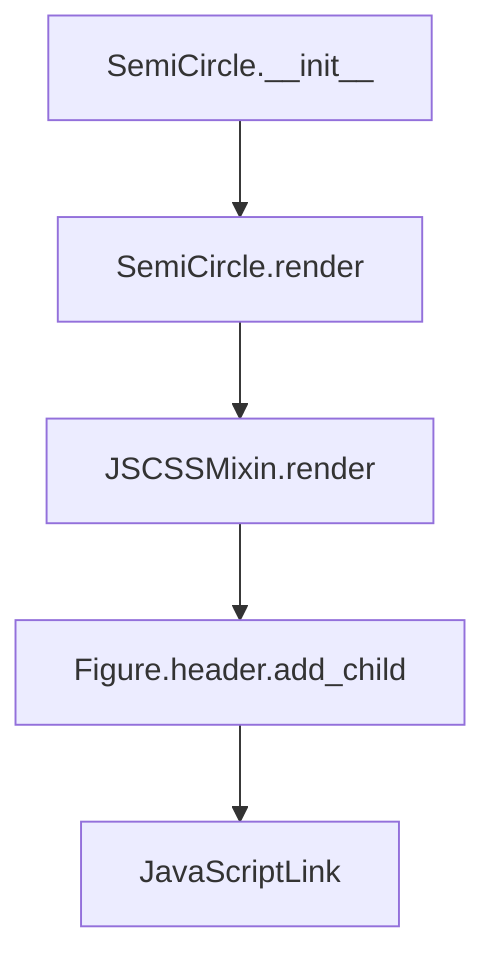

# `semicircle.py`

## `folium.plugins.semicircle.SemiCircle` · *class*

## Summary:
A map marker that renders a semi-circle shape on interactive maps using the Leaflet semicircle plugin.

## Description:
The SemiCircle class creates semi-circular shapes on map interfaces by extending the Marker base class and incorporating JavaScript/CSS dependencies for the leaflet-semicircle plugin. It allows users to define semi-circles either by specifying a direction and arc angle, or by defining start and stop angles. This abstraction provides a clean interface for rendering semi-circular geographic features on interactive maps.

## State:
- location: tuple/list of coordinates [latitude, longitude] - defines the center point of the semi-circle
- radius: float - defines the radius of the semi-circle in meters
- direction: tuple of (float, float) or None - specifies direction and arc for semi-circle construction (when provided, start_angle and stop_angle must be None)
- start_angle: float or None - starting angle in degrees for the semi-circle (when provided, direction and arc must be None)
- stop_angle: float or None - ending angle in degrees for the semi-circle (when provided, direction and arc must be None)
- options: dict - configuration options for the semi-circle rendering including stroke, fill properties, and radius
- _name: str - fixed value "SemiCircle" identifying this element type
- _template: Jinja2.Template - HTML template for rendering the semi-circle element (empty in source, populated by parent classes)

## Lifecycle:
- Creation: Instantiate with location, radius, and either (direction, arc) or (start_angle, stop_angle) parameters
- Usage: Add to a folium.Map instance to render on the map
- Destruction: Managed automatically by the map's lifecycle management

## Method Map:


## Raises:
- ValueError: When invalid argument combinations are provided - must specify either direction/arc OR start_angle/stop_angle, but not both

## Example:
```python
import folium

# Create a map
m = folium.Map([40.7128, -74.0060], zoom_start=12)

# Create a semi-circle using direction and arc
semi_circle1 = folium.plugins.SemiCircle(
    location=[40.7128, -74.0060],
    radius=1000,
    direction=0,  # North direction
    arc=180       # Half circle
)

# Create a semi-circle using start and stop angles
semi_circle2 = folium.plugins.SemiCircle(
    location=[40.7128, -74.0060],
    radius=1000,
    start_angle=0,
    stop_angle=180
)

# Add to map
m.add_child(semi_circle1)
m.add_child(semi_circle2)
```

### `folium.plugins.semicircle.SemiCircle.__init__` · *method*

## Summary:
Initializes a SemiCircle object with location, radius, and angular parameters for drawing a semicircular shape on a map.

## Description:
This method sets up the initial configuration for a semicircle marker by initializing its position, radius, directional parameters, and angular bounds. It ensures proper validation of mutually exclusive parameter combinations and configures the rendering options for the semicircle.

## Args:
    location (list or tuple): Latitude and longitude coordinates [lat, lng] defining the center of the semicircle.
    radius (float): Radius of the semicircle in meters.
    direction (float, optional): Direction angle in degrees for the semicircle orientation. Defaults to None.
    arc (float, optional): Arc size in degrees for the semicircle. Defaults to None.
    start_angle (float, optional): Starting angle in degrees for the semicircle arc. Defaults to None.
    stop_angle (float, optional): Ending angle in degrees for the semicircle arc. Defaults to None.
    popup (Popup, optional): Popup message to display on click. Defaults to None.
    tooltip (Tooltip, optional): Tooltip message to display on hover. Defaults to None.
    **kwargs: Additional keyword arguments passed to path_options for styling.

## Returns:
    None: This method initializes the object's attributes and does not return a value.

## Raises:
    ValueError: When invalid argument combinations are provided. Either both direction and arc must be specified, or both start_angle and stop_angle must be specified, but not a mix of both.

## State Changes:
    Attributes READ: None
    Attributes WRITTEN: 
    - self._name: Set to "SemiCircle"
    - self.direction: Set to tuple (direction, arc) if both are provided, otherwise None
    - self.options: Initialized with path_options and updated with parse_options for angle settings

## Constraints:
    Preconditions:
    - Either provide both direction and arc parameters, OR provide both start_angle and stop_angle parameters
    - Location must be a valid latitude/longitude coordinate pair
    - Radius must be a positive numeric value
    
    Postconditions:
    - self._name is set to "SemiCircle"
    - self.direction is either a tuple of (direction, arc) or None
    - self.options contains properly configured path and angle options for semicircle rendering

## Side Effects:
    None: This method performs no I/O operations or external service calls.

