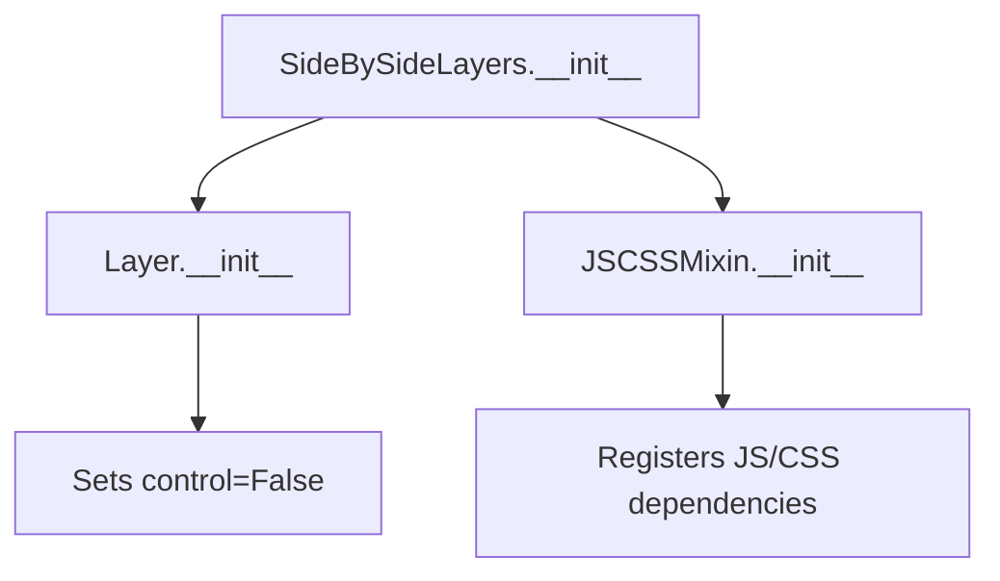

# `side_by_side.py`

## `folium.plugins.side_by_side.SideBySideLayers` · *class*

## Summary:
A Folium plugin that displays two map layers side-by-side with a draggable separator for comparison.

## Description:
The SideBySideLayers class creates a specialized map layer that allows users to compare two different map layers by displaying them side-by-side with a draggable divider. This is commonly used for visualizing changes over time, comparing different data sets, or showing before/after scenarios on maps. It leverages the leaflet-side-by-side JavaScript library to provide the interactive functionality.

This class should be instantiated when creating a Folium map that requires side-by-side layer comparison functionality. It is typically used as a container for two separate map layers that need to be displayed together for comparison purposes.

## State:
- layer_left: Layer object representing the left-hand map layer to display
- layer_right: Layer object representing the right-hand map layer to display
- _name: String identifier set to "SideBySideLayers" for internal tracking
- _template: Empty Jinja2 Template object (likely handled by JavaScript rendering)
- Default JavaScript dependency: leaflet.sidebyside from CDN URL

## Lifecycle:
- Creation: Instantiate with two Layer objects as arguments (layer_left, layer_right)
- Usage: Add to a Folium Map instance using the add_child() method
- Destruction: Managed automatically by Folium's map rendering system

## Method Map:


## Raises:
- None explicitly raised by __init__
- May raise exceptions from parent classes if invalid layer objects are passed

## Example:
```python
import folium
from folium.plugins import SideBySideLayers

# Create two base map layers
layer1 = folium.TileLayer('OpenStreetMap')
layer2 = folium.TileLayer('CartoDB positron')

# Create side-by-side comparison
side_by_side = SideBySideLayers(layer1, layer2)

# Add to map
m = folium.Map(location=[45.5236, -122.6750], zoom_start=13)
side_by_side.add_to(m)
```

### `folium.plugins.side_by_side.SideBySideLayers.__init__` · *method*

## Summary:
Initializes a SideBySideLayers object with two map layers for side-by-side comparison.

## Description:
Configures the SideBySideLayers instance by setting up its internal state with the provided left and right map layers. This method establishes the object's identity and prepares it for rendering in a folium map context.

## Args:
    layer_left (Layer): The left map layer to be displayed in the side-by-side comparison.
    layer_right (Layer): The right map layer to be displayed in the side-by-side comparison.

## Returns:
    None: This method initializes the object's state and does not return a value.

## Raises:
    None: This method does not explicitly raise exceptions.

## State Changes:
    Attributes READ: None
    Attributes WRITTEN: 
    - self._name: Set to "SideBySideLayers"
    - self.layer_left: Set to the provided layer_left argument
    - self.layer_right: Set to the provided layer_right argument

## Constraints:
    Preconditions:
    - Both layer_left and layer_right must be valid folium Layer objects
    - The method should only be called during object instantiation
    
    Postconditions:
    - The object is properly initialized with the specified layers
    - The object's name is set to "SideBySideLayers"
    - The control flag is disabled (control=False)

## Side Effects:
    None: This method does not perform any I/O operations or mutate external objects.

