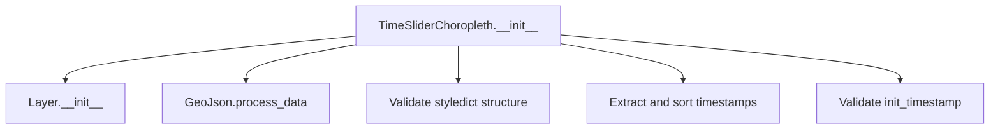

# `time_slider_choropleth.py`

## `folium.plugins.time_slider_choropleth.TimeSliderChoropleth` · *class*

## Summary:
A Folium plugin for creating interactive time-slider choropleth maps that display geographic data with temporal variations.

## Description:
The TimeSliderChoropleth class creates an interactive map layer that visualizes geographic data with color-coded regions that change over time. It allows users to browse through different time periods using a slider control. This class extends the standard Folium Layer functionality with time-series visualization capabilities.

This class is typically instantiated by developers who want to create animated choropleth maps showing geographic data that evolves over time. It's commonly used in applications like tracking disease spread, population changes, or any geographic phenomenon that varies temporally.

## State:
- data: Processed geographic data (GeoJson format) containing spatial features
- styledict: Dictionary mapping geographic features to their styling for different timestamps
- timestamps: Sorted list of available time periods for the visualization
- init_timestamp: Initial time period to display when the map loads
- layer_name: Name of the map layer (inherited from Layer)
- overlay: Boolean indicating if this is an overlay layer (inherited from Layer)
- control: Boolean indicating if this layer should appear in the map controls (inherited from Layer)
- show: Boolean indicating if the layer is initially visible (inherited from Layer)

## Lifecycle:
- Creation: Instantiate with geographic data, styling dictionary, and optional configuration parameters
- Usage: The class is designed to be added to a Folium map object, where it will automatically render with time slider controls
- Destruction: Cleanup is handled automatically when the map is destroyed or the layer is removed

## Method Map:


## Raises:
- ValueError: Raised when styledict is not a dictionary or when any value in styledict is not a dictionary
- AssertionError: Raised when init_timestamp is outside the valid range [-len(timestamps), len(timestamps))

## Example:
```python
import folium
from folium.plugins import TimeSliderChoropleth

# Create sample geographic data
data = {
    "type": "FeatureCollection",
    "features": [
        {
            "type": "Feature",
            "properties": {"id": "region1", "name": "Region 1"},
            "geometry": {
                "type": "Polygon",
                "coordinates": [[[-100, 40], [-100, 50], [-90, 50], [-90, 40], [-100, 40]]]
            }
        }
    ]
}

# Create styling dictionary with time series data
styledict = {
    "region1": {
        "2020": {"color": "red"},
        "2021": {"color": "orange"},
        "2022": {"color": "yellow"}
    }
}

# Create the time slider choropleth layer
time_slider = TimeSliderChoropleth(
    data=data,
    styledict=styledict,
    name="Time Series Choropleth"
)

# Add to map
m = folium.Map(location=[45, -95], zoom_start=4)
time_slider.add_to(m)
```

### `folium.plugins.time_slider_choropleth.TimeSliderChoropleth.__init__` · *method*

## Summary:
Initializes a time slider choropleth layer with geospatial data and temporal styling information.

## Description:
Configures a choropleth map layer that displays geospatial features with styles that change over time. This method processes input data, validates styling dictionaries, extracts temporal information, and sets up the initial timestamp for the time slider functionality.

## Args:
    data (Any): Geospatial data to be displayed on the map, processed by GeoJson.process_data
    styledict (dict): Dictionary mapping feature identifiers to timestamped style dictionaries
    name (str, optional): Name of the layer for identification. Defaults to None.
    overlay (bool): Whether the layer should be an overlay. Defaults to True.
    control (bool): Whether the layer should appear in the layer control. Defaults to True.
    show (bool): Whether the layer should be shown initially. Defaults to True.
    init_timestamp (int): Initial timestamp index to display. Defaults to 0.

## Returns:
    None: This method initializes instance attributes and does not return a value.

## Raises:
    ValueError: If styledict is not a dictionary or if any value in styledict is not a dictionary.

## State Changes:
    Attributes READ: None
    Attributes WRITTEN: 
    - self.data: Processed geospatial data
    - self.timestamps: Sorted list of available timestamps
    - self.styledict: Original styledict parameter
    - self.init_timestamp: Normalized initial timestamp value

## Constraints:
    Preconditions:
    - styledict must be a dictionary where each value is also a dictionary
    - init_timestamp must be within the valid range [-len(timestamps), len(timestamps))
    
    Postconditions:
    - self.data contains processed geospatial data
    - self.timestamps contains sorted unique timestamps from styledict
    - self.styledict preserves the original styledict parameter
    - self.init_timestamp is normalized to a valid positive index

## Side Effects:
    None: This method performs no I/O operations or external service calls.

