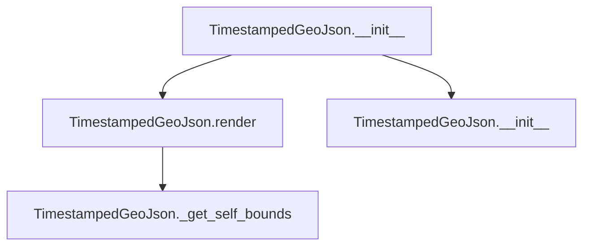

# `timestamped_geo_json.py`

## `folium.plugins.timestamped_geo_json.TimestampedGeoJson` · *class*

## Summary:
A class for displaying timestamped GeoJSON data on interactive folium maps with time-based playback controls.

## Description:
The TimestampedGeoJson class enables the visualization of GeoJSON features that change over time on folium maps. It provides interactive playback controls allowing users to navigate through temporal data sequences. This class is particularly useful for visualizing time-series geospatial data such as weather patterns, movement trajectories, or any spatial data that evolves over time.

This class should be instantiated when creating interactive maps that require temporal visualization capabilities. It is typically used by developers building geospatial dashboards or time-series mapping applications where geospatial features change over time.

## State:
- data: str - The GeoJSON data, either embedded (when read from file-like objects or dicts) or referenced externally (when provided as a string URL)
- embed: bool - Flag indicating whether the GeoJSON data is embedded (True) or referenced via URL (False)
- add_last_point: bool - Whether to add the last point of the time series to the map
- period: str - ISO 8601 period string defining the time interval between data points (default: "P1D")
- date_options: str - Format string for displaying dates in the time slider (default: "YYYY-MM-DD HH:mm:ss")
- duration: str or None - Duration string for the time dimension control, or "undefined" if None
- options: dict - Configuration options for the time dimension player including playback settings
- _name: str - Internal identifier set to "TimestampedGeoJson"

## Lifecycle:
- Creation: Instantiate with GeoJSON data and optional configuration parameters. Data can be a file-like object, dict, or string URL
- Usage: Add to a folium Map instance using add_child(), then render the map
- Destruction: Managed automatically by Python's garbage collection when the map is destroyed

## Method Map:


## Raises:
- ValueError: When attempting to compute bounds of non-embedded GeoJSON data using _get_self_bounds()
- AssertionError: When trying to render outside of a Map context in render()

## Example:
```python
import folium
from folium.plugins import TimestampedGeoJson

# Create a sample GeoJSON with timestamps
geojson_data = {
    "type": "FeatureCollection",
    "features": [
        {
            "type": "Feature",
            "geometry": {
                "type": "Point",
                "coordinates": [-122.4194, 37.7749]
            },
            "properties": {
                "time": "2023-01-01T00:00:00Z",
                "style": {"color": "red"}
            }
        }
    ]
}

# Create map and add timestamped geojson layer
m = folium.Map([37.7749, -122.4194], zoom_start=10)
timestamped_layer = TimestampedGeoJson(
    geojson_data,
    period="P1D",
    transition_time=200,
    auto_play=True
)
m.add_child(timestamped_layer)
m.save('map.html')
```

### `folium.plugins.timestamped_geo_json.TimestampedGeoJson.__init__` · *method*

## Summary:
Initializes a time-series GeoJSON visualization component that displays geospatial data with temporal dimensions on a folium map.

## Description:
Configures the TimestampedGeoJson object for rendering time-enabled GeoJSON data on interactive maps. This method processes input data, sets up visualization parameters, and prepares the component for rendering within a folium Map context. The component supports various data input formats and provides controls for time-based animation and playback.

## Args:
    data (str, dict, or file-like object): The GeoJSON data to display. Can be a string, dictionary, or file-like object with a read() method.
    transition_time (int): Duration in milliseconds for transitions between time steps. Defaults to 200.
    loop (bool): Whether to loop the animation when reaching the end. Defaults to True.
    auto_play (bool): Whether to automatically start playing the animation. Defaults to True.
    add_last_point (bool): Whether to add the last point to the timeline. Defaults to True.
    period (str): ISO 8601 period string defining the time interval. Defaults to "P1D".
    min_speed (float): Minimum playback speed multiplier. Defaults to 0.1.
    max_speed (float): Maximum playback speed multiplier. Defaults to 10.
    loop_button (bool): Whether to show a loop button in the control panel. Defaults to False.
    date_options (str): Format string for displaying dates. Defaults to "YYYY-MM-DD HH:mm:ss".
    time_slider_drag_update (bool): Whether to update time during slider dragging. Defaults to False.
    duration (str or None): Total duration string for the animation. Defaults to None.
    speed_slider (bool): Whether to show a speed control slider. Defaults to True.

## Returns:
    None: This method initializes the object's state and does not return a value.

## Raises:
    None explicitly raised, but may raise exceptions from parent class initialization or data processing.

## State Changes:
    Attributes READ: None
    Attributes WRITTEN: 
    - self._name: Set to "TimestampedGeoJson"
    - self.embed: Boolean flag indicating embedded data
    - self.data: Processed GeoJSON data string
    - self.add_last_point: Boolean flag for last point inclusion
    - self.period: Time period string
    - self.date_options: Date formatting string
    - self.duration: Duration string or "undefined"
    - self.options: Parsed configuration options

## Constraints:
    Preconditions:
    - Input data must be a valid GeoJSON structure or convertible to one
    - Parent object must be a folium Map when rendered
    - All numeric parameters must be positive values
    
    Postconditions:
    - Object is properly initialized with valid configuration
    - Data is processed according to its type (file, dict, or string)
    - All configuration options are parsed and validated

## Side Effects:
    None: This method performs no I/O operations or external service calls. It only sets up internal state for later rendering.

### `folium.plugins.timestamped_geo_json.TimestampedGeoJson.render` · *method*

*No documentation generated.*

### `folium.plugins.timestamped_geo_json.TimestampedGeoJson._get_self_bounds` · *method*

## Summary:
Computes the geographical bounding box of the embedded GeoJSON data.

## Description:
This method calculates the minimum and maximum longitude and latitude coordinates that define the spatial extent of the embedded GeoJSON data. It ensures the data is in proper GeoJSON FeatureCollection format before computing bounds.

## Args:
    None

## Returns:
    list[list[float]]: A nested list representing the bounding box in the format [[min_lon, min_lat], [max_lon, max_lat]], where coordinates are in longitude/latitude order.

## Raises:
    ValueError: When the GeoJSON data is not embedded (self.embed is False).

## State Changes:
    Attributes READ: self.embed, self.data
    Attributes WRITTEN: None

## Constraints:
    Preconditions: 
    - self.embed must be True (data must be embedded)
    - self.data must contain valid JSON-formatted GeoJSON data
    - The GeoJSON data must contain geographic coordinates
    
    Postconditions:
    - Returns a valid bounding box representation
    - Does not modify any instance attributes

## Side Effects:
    None

