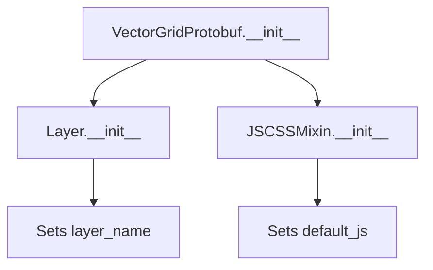

# `vectorgrid_protobuf.py`

## `folium.plugins.vectorgrid_protobuf.VectorGridProtobuf` · *class*

## Summary:
A folium plugin for displaying vector grid data using protobuf format through Leaflet.VectorGrid.

## Description:
The VectorGridProtobuf class creates a map layer that displays vector grid data from a remote source using the Leaflet.VectorGrid library. It extends folium's Layer base class and incorporates JavaScript/CSS dependencies for rendering vector grids in web maps. This class is specifically designed to work with vector tile data in protobuf format, commonly used for efficient rendering of large geographic datasets.

## State:
- layer_name (str): The name of the layer, defaults to "VectorGridProtobufLayer" if not provided
- url (str): The URL endpoint providing the vector grid protobuf data (required)
- _name (str): Internal identifier set to "VectorGridProtobuf"
- options (dict, optional): Configuration options for the vector grid layer
- default_js (list): JavaScript dependencies including Leaflet.VectorGrid library
- _template (Template): Jinja2 template for rendering the layer (intended to be populated with HTML/JS template)

## Lifecycle:
- Creation: Instantiate with a data URL, optional layer name, and optional configuration options
- Usage: Add to a folium.Map instance using the add_child() method or similar
- Destruction: Managed automatically by folium's map rendering system

## Method Map:


## Raises:
- None explicitly raised in __init__
- Exceptions may occur during rendering if URL is invalid or data format is incorrect

## Example:
```python
import folium

# Create a vector grid layer
vector_layer = folium.plugins.VectorGridProtobuf(
    url='https://example.com/tiles/{z}/{x}/{y}.pbf',
    layer_name='MyVectorGrid',
    options={'vectorTileLayerStyles': {'myLayer': {'color': 'red'}}}
)

# Add to map
m = folium.Map([0, 0], zoom_start=2)
m.add_child(vector_layer)
```

### `folium.plugins.vectorgrid_protobuf.VectorGridProtobuf.__init__` · *method*

## Summary:
Initializes a VectorGridProtobuf layer with a specified URL, layer name, and optional configuration options.

## Description:
Configures a vector grid protobuf layer for rendering vector data from a remote source. This method sets up the layer's identification, URL endpoint, and optional styling/configuration parameters while properly initializing the parent Layer class.

## Args:
    url (str): The URL endpoint from which vector grid data will be fetched.
    layer_name (str): The name identifier for this layer. If None or empty, defaults to "VectorGridProtobufLayer".
    options (dict, optional): Additional configuration options for the vector grid layer. Defaults to None.

## Returns:
    None: This method initializes instance attributes and does not return a value.

## Raises:
    None explicitly raised by this method.

## State Changes:
    Attributes READ: None
    Attributes WRITTEN: 
    - self.layer_name: Set to the provided layer_name or default value
    - self.url: Set to the provided URL
    - self._name: Set to "VectorGridProtobuf"
    - self.options: Set to the provided options dict if not None

## Constraints:
    Preconditions:
    - url must be a valid string representing a URL endpoint
    - layer_name, if provided, must be a string
    - options, if provided, must be a dictionary or None
    
    Postconditions:
    - self.layer_name is set to either the provided layer_name or the default value
    - self.url is set to the provided URL
    - self._name is set to "VectorGridProtobuf"
    - self.options is set to the provided options dict or remains unset if None

## Side Effects:
    None: This method performs only local attribute assignments and calls to parent class initialization.

