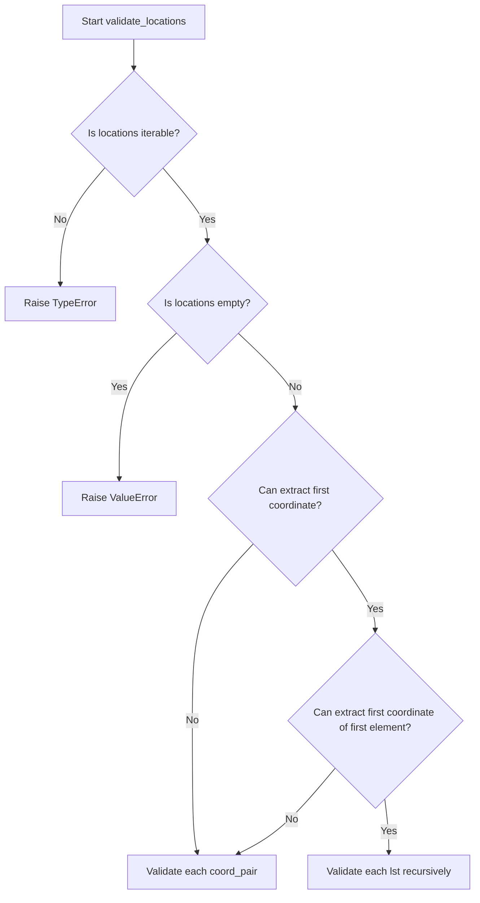
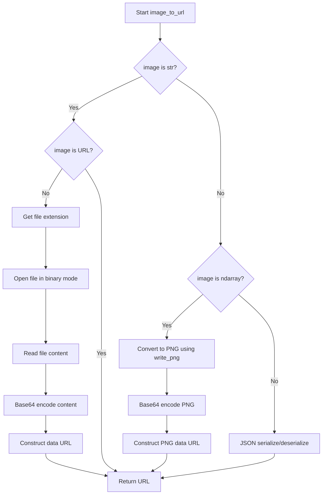
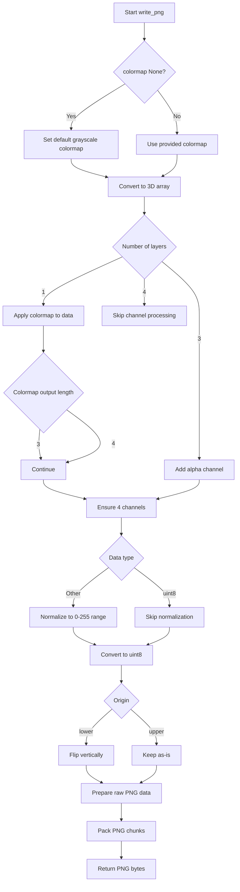
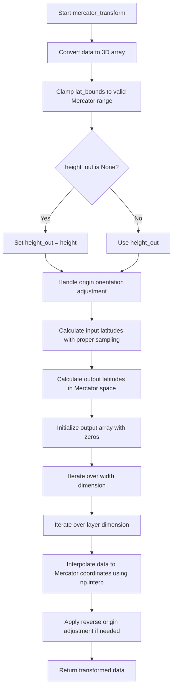
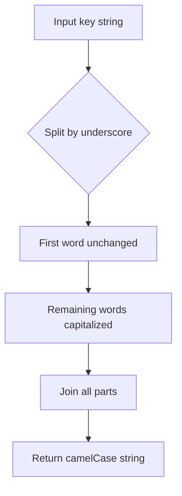
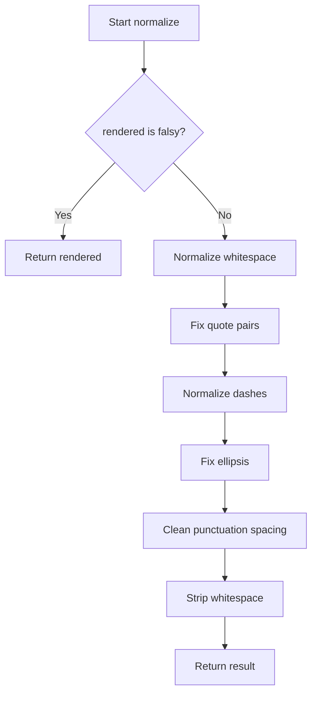
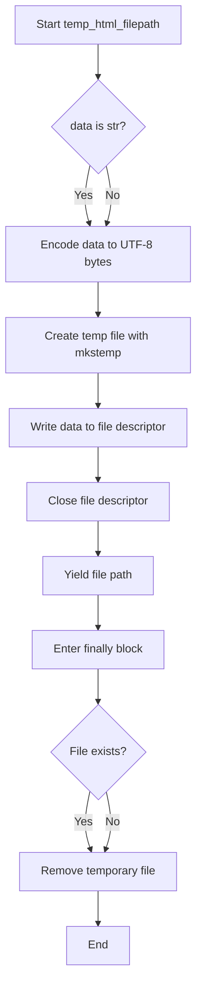
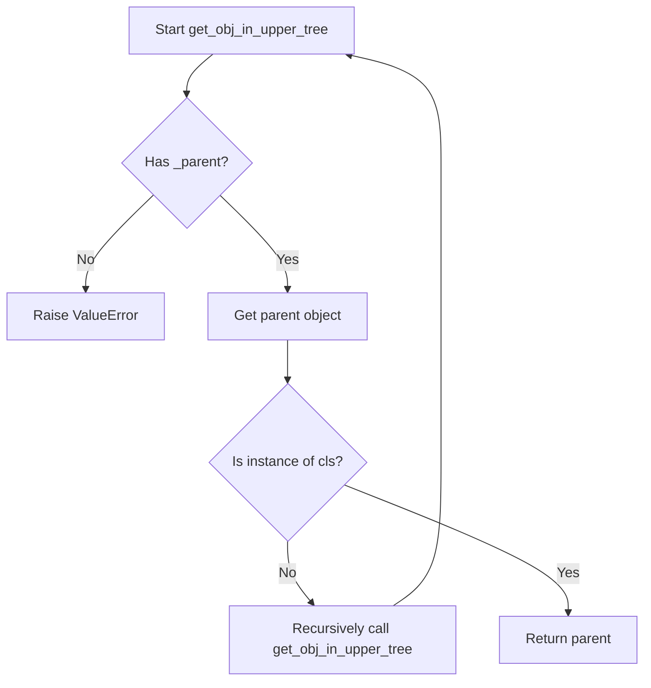

# `utilities.py`

## `folium.utilities.validate_location` · *function*

## Summary:
Validates and normalizes location data containing latitude and longitude coordinates.

## Description:
This function ensures that location data consists of exactly two numerical values representing latitude and longitude. It accepts various input types including lists, tuples, numpy arrays, and pandas DataFrames, converting them to a standardized list format. The function performs comprehensive validation to ensure the data is suitable for geographic coordinate processing.

## Args:
    location: A location descriptor that should contain exactly two numerical values. Can be:
        - A list or tuple of two numerical values
        - A numpy array containing two values
        - A pandas DataFrame with two columns (will be converted to list)

## Returns:
    list[float]: A list containing two float values representing [latitude, longitude]

## Raises:
    TypeError: 
        - When location is not a sized variable (doesn't have __len__ attribute)
        - When location doesn't support indexing operations (no __getitem__ support)
    ValueError: 
        - When location doesn't contain exactly two values
        - When location values cannot be converted to float
        - When location values contain NaN (Not a Number) values

## Constraints:
    Precondition: Location must be a container-like object with exactly two elements
    Postcondition: Returns a list of exactly two float values representing valid geographic coordinates

## Side Effects:
    None

## Control Flow:
```mermaid
flowchart TD
    A[Input location] --> B{Is numpy array?}
    B -- Yes --> C[Convert to list with squeeze()]
    C --> D{Has __len__ attribute?}
    B -- No --> D
    D -- No --> E[Raise TypeError]
    D -- Yes --> F{Length == 2?}
    F -- No --> G[Raise ValueError]
    F -- Yes --> H[Try indexing with [0], [1]]
    H -- Fail --> I[Raise TypeError]
    H -- Success --> J[Validate each coordinate]
    J --> K{Can convert to float?}
    K -- No --> L[Raise ValueError]
    K -- Yes --> M{Is NaN?}
    M -- Yes --> N[Raise ValueError]
    M -- No --> O[Return list of floats]
```

## Examples:
    >>> validate_location([40.7128, -74.0060])
    [40.7128, -74.006]
    
    >>> validate_location((37.7749, -122.4194))
    [37.7749, -122.4194]
    
    >>> import numpy as np
    >>> validate_location(np.array([51.5074, 0.1278]))
    [51.5074, 0.1278]
    
    >>> validate_location([40.7128])  # Raises ValueError
    ValueError: Expected two (lat, lon) values for location, instead got: [40.7128].
    
    >>> validate_location([40.7128, "invalid"])  # Raises ValueError
    ValueError: Location should consist of two numerical values, but 'invalid' of type <class 'str'> is not convertible to float.
```

## `folium.utilities.validate_locations` · *function*

## Summary:
Validates and normalizes location coordinate data for use in folium maps, ensuring proper structure and numerical values.

## Description:
This function processes location data that can be either a single coordinate pair or nested lists of coordinate pairs. It validates that the data structure is appropriate for mapping operations and converts pandas DataFrames to numpy arrays for processing. The validation ensures coordinates are numeric and properly formatted.

## Args:
    locations: A collection of location coordinates that can be:
        - A single coordinate pair (list, tuple, or array-like with two elements)
        - An iterable of coordinate pairs
        - A pandas DataFrame containing coordinate data
        - A nested list structure of coordinate pairs

## Returns:
    A normalized list structure of validated coordinate pairs, where each coordinate pair is converted to a list of two floats representing latitude and longitude.

## Raises:
    TypeError: When locations is not iterable or contains non-coordinate data
    ValueError: When locations is empty or contains invalid coordinate structures

## Constraints:
    Precondition: Locations must be a valid iterable structure containing coordinate data
    Postcondition: Returns a list of properly formatted coordinate pairs as [latitude, longitude]

## Side Effects:
    None

## Control Flow:


## Examples:
```python
# Valid single coordinate
validate_locations([40.7128, -74.0060])  # Returns [[40.7128, -74.0060]]

# Valid list of coordinates
validate_locations([[40.7128, -74.0060], [34.0522, -118.2437]])  # Returns [[40.7128, -74.0060], [34.0522, -118.2437]]

# Valid pandas DataFrame (converted to numpy)
import pandas as pd
df = pd.DataFrame({'lat': [40.7128], 'lon': [-74.0060]})
validate_locations(df)  # Returns [[40.7128, -74.0060]]
```

## `folium.utilities.if_pandas_df_convert_to_numpy` · *function*

## Summary:
Converts pandas DataFrame objects to numpy arrays while preserving other object types.

## Description:
This utility function provides a safe way to handle objects that may be pandas DataFrames. When the input is a pandas DataFrame, it extracts the underlying numpy array representation using the `.values` attribute. For all other object types, it returns the object unchanged. This enables functions to work seamlessly with both pandas DataFrames and numpy arrays.

The function is particularly useful in contexts where data flexibility is needed, allowing code to accept either pandas DataFrame or numpy array inputs without requiring explicit type checking in downstream functions.

## Args:
    obj (Any): An object that may be a pandas DataFrame or other data type.

## Returns:
    numpy.ndarray or Any: If input is a pandas DataFrame, returns the underlying numpy array via `.values` attribute. Otherwise, returns the input object unchanged.

## Raises:
    AttributeError: If the input object does not have a `.values` attribute and is not a DataFrame (though this shouldn't occur given the isinstance check).

## Constraints:
    Preconditions:
        - The function assumes that `pd` refers to the pandas module (available at module level)
        - Input object can be of any type
    
    Postconditions:
        - If input is a pandas DataFrame, output is a numpy array with the same shape and data
        - If input is not a pandas DataFrame, output equals input unchanged

## Side Effects:
    None: This function has no side effects.

## Control Flow:
```mermaid
flowchart TD
    A[Input obj] --> B{Is pd not None AND isinstance(obj, pd.DataFrame)?}
    B -- Yes --> C[obj.values]
    B -- No --> D[obj]
    C --> E[Return numpy array]
    D --> E
```

## Examples:
```python
# With pandas DataFrame
import pandas as pd
df = pd.DataFrame([[1, 2], [3, 4]])
result = if_pandas_df_convert_to_numpy(df)
# result is now a numpy array [[1, 2], [3, 4]]

# With regular object
data = [1, 2, 3]
result = if_pandas_df_convert_to_numpy(data)
# result is still [1, 2, 3]

# With numpy array
import numpy as np
arr = np.array([[1, 2], [3, 4]])
result = if_pandas_df_convert_to_numpy(arr)
# result is still the same numpy array
```

## `folium.utilities.image_to_url` · *function*

## Summary:
Converts various image input formats into data URLs for embedding in HTML.

## Description:
Transforms different types of image inputs (file paths, numpy arrays, or JSON-serializable objects) into base64-encoded data URLs that can be embedded directly in HTML documents. This function serves as a utility for embedding images in folium maps and other web visualizations without requiring external image hosting.

## Args:
    image (str or numpy.ndarray or object): Input image data which can be:
        - A file path string pointing to an image file (not a URL)
        - A numpy array representing image data
        - Any JSON-serializable object that will be converted to a URL
    colormap (callable, optional): Function to map grayscale values to RGB/RGBA colors. Used when converting numpy arrays to PNG format. Defaults to None.
    origin (str): Origin point for image coordinate system. Either "upper" or "lower". Defaults to "upper".

## Returns:
    str: A data URL string in the format "data:image/[format];base64,[base64_encoded_content]" for image files and numpy arrays, or the JSON-serialized representation for other objects.

## Raises:
    ValueError: When numpy array data has invalid dimensions (must be NxM, NxMx3, or NxMx4).
    Exception: When file operations fail or when JSON serialization/deserialization encounters issues.

## Constraints:
    Preconditions:
        - If image is a string, it must be a valid file path or a URL (URLs are passed through unchanged)
        - If image is a numpy array, it must have valid dimensions (NxM, NxMx3, or NxMx4)
        - If image is a numpy array, colormap must be compatible with the data dimensions
    Postconditions:
        - Returned string is a valid data URL format
        - All newlines in returned URL are replaced with spaces

## Side Effects:
    - Reads image files from disk when image is a file path string
    - May perform file I/O operations when processing file paths
    - No external state mutations or service calls

## Control Flow:


## Examples:
```python
# Convert file path to data URL
url = image_to_url("path/to/image.png")
# Returns: "data:image/png;base64,iVBORw0KGgoAAAANSUhEUgAAAAEAAAABCAYAAAAfFcSJAAAADUlEQVR42mP8/5+hHgAHggJ/PchI7wAAAABJRU5ErkJggg=="

# Convert numpy array to data URL
import numpy as np
arr = np.random.rand(10, 10)
url = image_to_url(arr)
# Returns: "data:image/png;base64,iVBORw0KGgoAAAANSUhEUgAAAAEAAAABCAYAAAAfFcSJAAAADUlEQVR42mP8/5+hHgAHggJ/PchI7wAAAABJRU5ErkJggg=="

# Pass through JSON-serializable object
url = image_to_url({"type": "image", "url": "http://example.com/image.jpg"})
# Returns: '{"type": "image", "url": "http://example.com/image.jpg"}'
```

## `folium.utilities._is_url` · *function*

## Summary:
Checks if a given string is a valid URL by examining its scheme against a predefined set of valid URL schemes.

## Description:
This utility function determines URL validity by parsing the input string with `urllib.parse.urlparse` and checking if the resulting scheme is contained in an internal set of valid URL schemes (_VALID_URLS). When URL parsing fails, the function gracefully returns False.

## Args:
    url (str): The string to validate as a URL.

## Returns:
    bool: True if the URL scheme is in the internal _VALID_URLS set, False otherwise.

## Raises:
    None explicitly raised, though any exception during URL parsing results in False return.

## Constraints:
    Preconditions:
    - Input must be a string
    - The string should be parseable by urllib.parse.urlparse
    
    Postconditions:
    - Always returns a boolean value
    - Never raises exceptions due to its exception handling

## Side Effects:
    None

## Control Flow:
```mermaid
flowchart TD
    A[Input URL] --> B{urlparse(url) succeeds?}
    B -- Yes --> C[Get scheme]
    C --> D{scheme in _VALID_URLS?}
    D -- Yes --> E[Return True]
    D -- No --> F[Return False]
    B -- No --> G[Return False]
```

## Examples:
    >>> _is_url("https://www.example.com")
    True
    >>> _is_url("not_a_url")
    False
    >>> _is_url("")
    False
```

## `folium.utilities.write_png` · *function*

## Summary:
Converts multi-dimensional array data into a PNG image format byte string.

## Description:
Transforms numerical data arrays into PNG image format suitable for web display or storage. The function handles various input data formats including grayscale, RGB, and RGBA images, automatically converting between color spaces and applying optional colormaps to monochrome data.

## Args:
    data (array-like): Input data array that can be 1D, 2D, or 3D. Dimensions should represent height, width, and optionally color channels.
    origin (str): Image origin position, either "upper" (default) or "lower". Controls vertical flipping of the image data.
    colormap (callable, optional): Function that maps scalar values to RGBA tuples. If None, a grayscale colormap is used.

## Returns:
    bytes: PNG formatted image data as a byte string containing the complete PNG file structure.

## Raises:
    ValueError: If data dimensions are invalid (not NxM, NxMx3, or NxMx4) or if colormap produces invalid color values.

## Constraints:
    Preconditions:
        - Data must be convertible to a numpy array
        - If colormap is provided, it must accept scalar values and return tuples of length 3 or 4
        - Data values should be finite numbers for proper normalization
    
    Postconditions:
        - Output is always valid PNG byte data
        - Returned data contains complete PNG header, IHDR, IDAT, and IEND chunks

## Side Effects:
    None

## Control Flow:


## Examples:
```python
# Basic grayscale image
import numpy as np
data = np.array([[0, 128, 255], [255, 128, 0]])
png_bytes = write_png(data)

# With custom colormap
def red_colormap(x):
    return (x, 0, 0, 1)
png_bytes = write_png(data, colormap=red_colormap)

# With lower origin
png_bytes = write_png(data, origin="lower")
```

## `folium.utilities.mercator_transform` · *function*

## Summary:
Transforms geographic data from a standard coordinate system to a Mercator projection while preserving spatial relationships.

## Description:
Performs a coordinate transformation that maps latitude values to a Mercator projection space, enabling proper visualization of geographic data on web maps. This function is commonly used when preparing raster data for display on map tiles that use the Web Mercator projection (EPSG:3857).

The function handles the conversion of latitude coordinates using the inverse hyperbolic sine transformation, which is fundamental to the Mercator projection. It also manages data reshaping and interpolation to ensure that the transformed data maintains its spatial integrity.

Known callers within the codebase:
- This function is likely used internally by folium's map rendering components when processing geographic raster data for display on web maps
- It would be invoked during the preparation phase of heatmaps, tile layers, or other geographic visualizations that require proper coordinate mapping

This logic is extracted into its own function rather than being inlined because it encapsulates the complex mathematical transformation required for Mercator projections, making the code more readable and reusable across different geographic visualization components.

## Args:
    data (array-like): Input geographic data that can be converted to a 3D numpy array. Typically contains elevation, temperature, or other geographic measurements. Must support numpy array conversion.
    lat_bounds (tuple): Latitude bounds as (min_lat, max_lat) defining the vertical extent of the data. Values are clamped to valid Mercator projection limits (-85.051128779806589 to 85.051128779806589).
    origin (str, optional): Specifies the data origin orientation. Defaults to "upper". When "upper", assumes data originates from the top of the image; when "lower", assumes bottom origin.
    height_out (int, optional): Output height for the transformed data. If None, uses the input height. Allows for resizing during transformation.

## Returns:
    numpy.ndarray: Transformed data array with shape (height_out, width, nblayers) where the latitude dimension has been remapped according to Mercator projection mathematics. The returned array preserves the data type and spatial relationships of the input data.

## Raises:
    None explicitly raised in the function body.

## Constraints:
    Preconditions:
    - Input data must be convertible to a 3D numpy array
    - lat_bounds must be a tuple with two numeric values representing latitude
    - Latitude values in lat_bounds must be within valid Mercator projection limits (-85.051128779806589 to 85.051128779806589)
    - origin must be either "upper" or "lower"
    
    Postconditions:
    - Output array has the same number of layers as input
    - Output array width matches input width
    - Latitude coordinates in output are properly transformed to Mercator projection space
    - Data values are interpolated to maintain spatial relationships
    - Output data type matches input data type

## Side Effects:
    None.

## Control Flow:


## Examples:
```python
import numpy as np
from folium.utilities import mercator_transform

# Basic usage with default parameters
data = np.random.rand(100, 100, 1)  # 100x100 grid with 1 layer
lat_bounds = (-45, 45)
transformed = mercator_transform(data, lat_bounds)

# Usage with custom output height for different resolution
transformed = mercator_transform(data, lat_bounds, height_out=200)

# Usage with different origin orientation
transformed = mercator_transform(data, lat_bounds, origin="lower")

# Working with multi-layer geographic data (e.g., RGB imagery)
multi_layer_data = np.random.rand(50, 50, 3)  # RGB image data
transformed_multi = mercator_transform(multi_layer_data, (-60, 60))

# Handling extreme latitude bounds
extreme_bounds = (-80, 80)  # Within valid Mercator limits
transformed_extreme = mercator_transform(data, extreme_bounds)
```

## `folium.utilities.none_min` · *function*

## Summary:
Returns the minimum of two values while safely handling None values by returning the non-None value when one is None.

## Description:
This utility function computes the minimum of two comparable values, but with special handling for None values. When one of the values is None, it returns the other value instead of raising an error. This is particularly useful in data processing scenarios where some values might be missing or undefined.

## Args:
    x (Any): First value to compare, can be None
    y (Any): Second value to compare, can be None

## Returns:
    Any: The minimum of x and y if both are not None, otherwise returns the non-None value. Returns None if both values are None.

## Raises:
    TypeError: If both x and y are non-None but not comparable (e.g., comparing str and int)

## Constraints:
    Preconditions: Both arguments can be any type, including None
    Postconditions: Returns either x, y, or min(x, y) depending on None status

## Side Effects:
    None

## Control Flow:
```mermaid
flowchart TD
    A[none_min(x,y)] --> B{x is None?}
    B -->|Yes| C[Return y]
    B -->|No| D{y is None?}
    D -->|Yes| E[Return x]
    D -->|No| F[Return min(x,y)]
```

## Examples:
    >>> none_min(5, 3)
    3
    >>> none_min(None, 5)
    5
    >>> none_min(5, None)
    5
    >>> none_min(None, None)
    None
    >>> none_min('a', 'b')
    'a'
    >>> none_min(None, 'b')
    'b'
```

## `folium.utilities.none_max` · *function*

## Summary:
Returns the maximum of two values, treating None as less than any non-None value.

## Description:
This utility function compares two values and returns the larger one. When one or both values are None, it returns the non-None value, or None if both are None. This is particularly useful for finding maximum values in data processing where some values might be missing (represented as None).

## Args:
    x (Any): First value to compare, can be None
    y (Any): Second value to compare, can be None

## Returns:
    Any: The maximum of x and y, or the non-None value if one is None, or None if both are None

## Raises:
    TypeError: If the values cannot be compared (e.g., comparing incompatible types like str and int)

## Constraints:
    Preconditions: Both arguments must be comparable or None
    Postconditions: Returns either x, y, or None based on comparison logic

## Side Effects:
    None

## Control Flow:
```mermaid
flowchart TD
    A[none_max(x,y)] --> B{x is None?}
    B -->|Yes| C{y is None?}
    C -->|Yes| D[Return None]
    C -->|No| E[Return y]
    B -->|No| F{y is None?}
    F -->|Yes| G[Return x]
    F -->|No| H[Return max(x,y)]
```

## Examples:
    >>> none_max(5, 3)
    5
    >>> none_max(None, 3)
    3
    >>> none_max(5, None)
    5
    >>> none_max(None, None)
    None
    >>> none_max("apple", "banana")
    "banana"

## `folium.utilities.iter_coords` · *function*

## Summary:
Generates coordinate tuples from GeoJSON-like objects by recursively traversing nested coordinate structures, though with a logical flaw in coordinate extraction.

## Description:
Extracts and yields individual coordinate tuples from various GeoJSON formats including FeatureCollections, Features, and Geometry objects. This utility function attempts to normalize coordinate data from different GeoJSON structures into a consistent iterable format. Note: The implementation contains a logical flaw in the coordinate extraction process.

## Args:
    obj (any): A GeoJSON-like object that may contain coordinates in various formats including:
        - Direct tuple or list of coordinates
        - GeoJSON FeatureCollection with features containing geometries
        - GeoJSON Feature with geometry property
        - GeoJSON Geometry object
        - GeoJSON GeometryCollection

## Returns:
    generator: A generator yielding coordinate tuples from the input object. Each yielded item represents a coordinate set, though due to implementation flaws, the exact behavior may vary.

## Raises:
    None explicitly raised, but may raise KeyError or TypeError if the input structure doesn't match expected GeoJSON formats.

## Constraints:
    Preconditions:
    - Input object must have a valid GeoJSON-like structure
    - Coordinate values must be numeric (float or int) when reaching leaf nodes
    
    Postconditions:
    - Generator will attempt to yield coordinate tuples in a consistent format
    - Function handles nested coordinate structures recursively

## Side Effects:
    None

## Control Flow:
```mermaid
flowchart TD
    A[Start iter_coords] --> B{isinstance(obj, (tuple,list))}
    B -- Yes --> C[coords = obj]
    B -- No --> D{features in obj}
    D -- Yes --> E[coords = [geom["geometry"]["coordinates"] for geom in obj["features"]]]
    D -- No --> F{geometry in obj}
    F -- Yes --> G[coords = obj["geometry"]["coordinates"]]
    F -- No --> H{geometries in obj and coordinates in obj["geometries"][0]}
    H -- Yes --> I[coords = obj["geometries"][0]["coordinates"]]
    H -- No --> J[coords = obj.get("coordinates", obj)]
    J --> K[for coord in coords]
    K --> L{isinstance(coord, (float,int))}
    L -- Yes --> M[yield tuple(coords); break]
    L -- No --> N[yield from iter_coords(coord)]
```

## Examples:
    # Basic usage with simple coordinates
    coords = [(10, 20), (30, 40)]
    for coord in iter_coords(coords):
        print(coord)  # May yield (10, 20) then (30, 40) or exhibit unexpected behavior due to implementation bug
    
    # Usage with GeoJSON Feature
    feature = {
        "type": "Feature",
        "geometry": {
            "type": "Point",
            "coordinates": [10, 20]
        }
    }
    for coord in iter_coords(feature):
        print(coord)  # May yield unexpected results due to implementation flaw
``

## `folium.utilities._locations_mirror` · *function*

## Summary:
Reverses the order of elements in nested iterable geographic coordinate structures while preserving container hierarchy.

## Description:
Processes nested iterable objects containing geographic coordinates, reversing element order at the deepest level while maintaining the overall hierarchical structure. This utility function is primarily used for coordinate system transformations where latitude and longitude order needs to be inverted (e.g., converting from [lat, lng] to [lng, lat] format).

## Args:
    x: Input data that may be iterable (list, tuple, etc.) containing geographic coordinates or nested coordinate structures

## Returns:
    - If input is iterable and first element is iterable: recursively processes nested structures and returns list with mirrored inner structures
    - If input is iterable and first element is not iterable: returns list with elements in reversed order (using slice [::-1])
    - If input is not iterable: returns input unchanged

## Raises:
    IndexError: When input is iterable but empty (x[0] access fails)
    TypeError: When input is not iterable but indexing operation is attempted

## Constraints:
    - Precondition: Input must support the `__iter__` attribute for hasattr checks
    - Precondition: If input is iterable, it must have at least one element for first element checking
    - Postcondition: Structure of nested containers is preserved, only ordering of elements is reversed at the deepest level

## Side Effects:
    None

## Control Flow:
```mermaid
flowchart TD
    A[Input x] --> B{hasattr(x, "__iter__")}
    B -- Yes --> C{hasattr(x[0], "__iter__")}
    C -- Yes --> D[map(_locations_mirror, x)]
    C -- No --> E[list(x[::-1])]
    B -- No --> F[return x]
    D --> G[Return processed nested structure]
    E --> G
    F --> G
```

## Examples:
    >>> _locations_mirror([1, 2, 3])
    [3, 2, 1]
    
    >>> _locations_mirror([[1, 2], [3, 4]])
    [[2, 1], [4, 3]]
    
    >>> _locations_mirror("hello")
    "hello"
    
    >>> _locations_mirror((1, 2, 3))
    [3, 2, 1]
    
    >>> # Geographic coordinate example
    ... _locations_mirror([[40.7128, -74.0060], [34.0522, -118.2437]])
    [[-74.0060, 40.7128], [-118.2437, 34.0522]]
```

## `folium.utilities.get_bounds` · *function*

## Summary
Computes the bounding box coordinates that encompass all provided geographic locations.

## Description
Calculates the minimum and maximum latitude/longitude values across a collection of geographic coordinates to determine the spatial boundaries. This function iterates through coordinate data using the `iter_coords` helper function and maintains running minimum and maximum values for longitude and latitude.

## Args
- locations: Collection of geographic coordinates in various formats (list, tuple, GeoJSON objects, etc.)
- lonlat: Boolean flag indicating whether to swap longitude and latitude order (default: False)

## Returns
Nested list containing two coordinate pairs representing the bounding box:
- First pair: [min_longitude, min_latitude] 
- Second pair: [max_longitude, max_latitude]
Returns [[None, None], [None, None]] when no valid coordinates are provided

## Raises
No explicit exceptions are raised by this function, though underlying helper functions may raise exceptions for malformed input.

## Constraints
Preconditions:
- Input locations must be iterable
- Coordinate values should be numeric (float or int)
- Helper functions like `iter_coords` expect valid geographic data structures

Postconditions:
- Returned bounds represent valid geographic boundaries
- All input coordinates are considered in the calculation
- When lonlat=True, longitude and latitude values are swapped in the result

## Side Effects
No I/O operations or external state mutations occur.

## Control Flow
```mermaid
flowchart TD
    A[Start get_bounds] --> B[Initialize bounds = [[None,None],[None,None]]]
    B --> C[Iterate through coordinates via iter_coords]
    C --> D{Point available?}
    D -->|Yes| E[Update bounds with none_min/none_max]
    E --> F[Continue iteration]
    D -->|No| G[End iteration]
    F --> H{lonlat=True?}
    H -->|Yes| I[Apply _locations_mirror transformation]
    H -->|No| J[Return bounds]
    I --> J
```

## Examples
```python
# Basic usage with list of coordinates
coords = [[10, 20], [30, 40], [50, 60]]
bounds = get_bounds(coords)
# Returns: [[10, 20], [50, 60]]

# Usage with GeoJSON-like structure
geojson = {
    "type": "FeatureCollection",
    "features": [
        {"geometry": {"coordinates": [10, 20]}},
        {"geometry": {"coordinates": [30, 40]}}
    ]
}
bounds = get_bounds(geojson)
# Returns: [[10, 20], [30, 40]]

# With lonlat=True for different coordinate order
bounds = get_bounds(coords, lonlat=True)
# Returns: [[20, 10], [60, 50]] (latitude/longitude swapped)
```

## `folium.utilities.camelize` · *function*

## Summary:
Converts a snake_case string to camelCase format by capitalizing words after the first one.

## Description:
Transforms identifiers from snake_case notation (words separated by underscores) to camelCase notation (first word lowercase, subsequent words capitalized). This utility is commonly used when interfacing with JavaScript libraries or APIs that expect camelCase naming conventions.

## Args:
    key (str): A string in snake_case format to be converted to camelCase.

## Returns:
    str: The input string converted to camelCase format where the first word remains lowercase and subsequent words are capitalized.

## Raises:
    None: This function does not raise any exceptions.

## Constraints:
    Preconditions:
        - Input must be a string
    Postconditions:
        - Output is always a string in camelCase format
        - Empty strings return empty strings
        - Strings with no underscores return unchanged (except first letter lowercase)

## Side Effects:
    None: This function has no side effects.

## Control Flow:


## Examples:
    >>> camelize("foo_bar_baz")
    'fooBarBaz'
    
    >>> camelize("my_variable_name")
    'myVariableName'
    
    >>> camelize("single")
    'single'
    
    >>> camelize("")
    ''
```

## `folium.utilities._parse_size` · *function*

## Summary:
Parses a size specification into numeric value and unit type, supporting pixel and percentage formats.

## Description:
Converts a size value into a standardized format consisting of a numeric value and its unit type ('px' for pixels or '%' for percentages). This utility function handles both numeric inputs (interpreted as pixels) and string inputs ending with '%' (interpreted as percentages). The function extracts the numeric portion from percentage strings and validates the range constraints for each unit type.

## Args:
    value (int, float, or str): Size specification that can be either a numeric value (interpreted as pixels) or a string ending with '%' (interpreted as percentage). When a string, it must contain a valid numeric value followed by '%'.

## Returns:
    tuple[float, str]: A tuple containing (numeric_value, unit_type) where:
        - numeric_value (float): The parsed numeric size value
        - unit_type (str): Either 'px' for pixels or '%' for percentages

## Raises:
    ValueError: When the input cannot be parsed as either a valid pixel value (> 0) or percentage value (0-100%).

## Constraints:
    Precondition: Input must be convertible to a numeric value
    Postcondition: Returned tuple contains a positive numeric value with appropriate unit type

## Side Effects:
    None

## Control Flow:
```mermaid
flowchart TD
    A[Start _parse_size] --> B{isinstance(value, (int,float))?}
    B -- Yes --> C[value_type = "px"]
    B -- No --> D[value_type = "%"]
    C --> E[value = float(value)]
    E --> F[assert value > 0]
    D --> G[value = float(value.strip("%"))]
    G --> H[assert 0 <= value <= 100]
    F --> I[return value, value_type]
    H --> I
    I --> J[End]
    F -- AssertionError --> K[Raise ValueError]
    H -- AssertionError --> K
    E -- Exception --> K
    G -- Exception --> K
    K --> L[End]
```

## Examples:
    >>> _parse_size(100)
    (100.0, 'px')
    
    >>> _parse_size("50%")
    (50.0, '%')
    
    >>> _parse_size("75.5%")
    (75.5, '%')
    
    >>> _parse_size(-10)
    ValueError: Cannot parse value -10 as 'px'
    
    >>> _parse_size("120%")
    ValueError: Cannot parse value 120.0 as '%'

## `folium.utilities.compare_rendered` · *function*

## Summary:
Compares two rendered objects by normalizing their content before performing equality check.

## Description:
This function performs a normalized comparison between two rendered objects, typically used to determine if two rendered outputs are functionally equivalent despite minor formatting differences. It leverages the normalize utility function to standardize whitespace, quotes, hyphens, and punctuation spacing before comparing the results.

## Args:
    obj1 (Any): First rendered object to compare. Can be string, dict, list, or other serializable objects.
    obj2 (Any): Second rendered object to compare. Must be of compatible type with obj1.

## Returns:
    bool: True if the normalized representations of both objects are equal, False otherwise.

## Raises:
    None: This function does not explicitly raise exceptions, though underlying serialization or normalization operations may raise exceptions.

## Constraints:
    Preconditions:
        - Both arguments should be serializable objects that can be processed by the normalize function
        - The normalize function handles None values gracefully
    
    Postconditions:
        - Returns a boolean value indicating normalized equality
        - Does not modify the original input objects

## Side Effects:
    None: This function is pure and has no side effects.

## Control Flow:
```mermaid
flowchart TD
    A[compare_rendered(obj1, obj2)] --> B{obj1 is None or obj2 is None?}
    B -- Yes --> C[Return obj1 == obj2]
    B -- No --> D[Call normalize(obj1)]
    D --> E[Call normalize(obj2)]
    E --> F[Compare normalized values]
    F --> G[Return comparison result]
```

## Examples:
```python
# Basic string comparison
result = compare_rendered("Hello   world!", "Hello world!")
# Returns True (normalized versions are equal)

# Comparison with None values
result = compare_rendered(None, None)
# Returns True

# Complex object comparison (assuming serialization works)
result = compare_rendered({"key": "value"}, {"key": "value"})
# Returns True if normalized representations are equal
```

## `folium.utilities.normalize` · *function*

## Summary:
Normalizes text formatting by cleaning whitespace, quotes, dashes, and punctuation spacing.

## Description:
Processes input text to standardize formatting by removing extra whitespace, fixing quote pairs, normalizing dash characters, and ensuring proper spacing around punctuation marks. This function is designed to clean up inconsistent text formatting that may occur during data processing or rendering.

## Args:
    rendered (str or None): Input text to normalize. May be None or empty string.

## Returns:
    str or None: Normalized text with standardized formatting, or the original value if None/empty.

## Raises:
    None explicitly raised.

## Constraints:
    Preconditions:
        - Input can be a string, None, or empty string
        - No validation of input type is performed beyond truthiness check
    
    Postconditions:
        - Whitespace is normalized to single spaces
        - Quote pairs are fixed ('""' becomes '"', "''" becomes "'")
        - Dash characters are normalized ('–' and '—' become '-')
        - Ellipsis ('...') is converted to period ('.')
        - Punctuation spacing is standardized
        - Leading/trailing whitespace is removed

## Side Effects:
    None.

## Control Flow:


## Examples:
    >>> normalize("Hello   world")
    'Hello world'
    
    >>> normalize('He said ""hello"" to me')
    'He said "hello" to me'
    
    >>> normalize("This is—test")
    'This is-test'
    
    >>> normalize("Hello...world")
    'Hello.world'
    
    >>> normalize("Hello , world !")
    'Hello, world!'
    
    >>> normalize(None)
    None

## `folium.utilities.temp_html_filepath` · *function*

## Summary:
Creates a temporary HTML file from provided data and ensures automatic cleanup within a context manager.

## Description:
A context manager generator that creates a temporary HTML file with a unique filename, writes the provided data to it, and automatically removes the file when exiting the context. This function is used internally by folium to manage temporary HTML files during map rendering and display operations.

## Args:
    data (str or bytes): The HTML content to write to the temporary file. If a string is provided, it will be encoded to UTF-8 bytes before writing.

## Returns:
    Generator[str]: A context manager that yields the absolute path to the temporary HTML file. The file is automatically deleted when leaving the context.

## Raises:
    None explicitly raised, but underlying OS operations may raise exceptions (e.g., PermissionError, OSError).

## Constraints:
    Preconditions:
    - The data parameter must be either a string or bytes object
    - The system must have write permissions to the temporary directory
    
    Postconditions:
    - A temporary HTML file is created with the provided data
    - The file is automatically deleted when leaving the context

## Side Effects:
    - Creates a temporary file on the filesystem
    - Writes data to the temporary file
    - Removes the temporary file upon context exit
    - Uses the system's temporary directory

## Control Flow:


## Examples:
```python
# Basic usage
with temp_html_filepath("<html><body>Hello World</body></html>") as filepath:
    print(f"Temporary file created at: {filepath}")
    # File is automatically cleaned up after this block

# With binary data
html_bytes = b"<html><body>Hello World</body></html>"
with temp_html_filepath(html_bytes) as filepath:
    # Process the temporary file
    pass
```

## `folium.utilities.deep_copy` · *function*

## Summary:
Creates a deep copy of a hierarchical object while maintaining parent-child relationships and assigning new unique identifiers.

## Description:
This function performs a deep copy operation on objects that may have hierarchical structures with parent-child relationships. It ensures that when copying such objects, the new copy gets a fresh unique identifier and all child objects are properly copied with updated parent references. This is particularly useful for map visualization components where objects need to maintain their structural relationships after duplication.

## Args:
    item_original: The original object to be deeply copied. Must have an _id attribute and potentially a _children dictionary containing child objects.

## Returns:
    A new copy of the input object with a fresh _id and properly linked child objects. The returned object maintains the same structure as the original but with independent copies of child elements.

## Raises:
    AttributeError: If the input object doesn't have the expected attributes (_id, _children) or methods (get_name()) when accessed.

## Constraints:
    Preconditions:
    - The input object must be copyable via copy.copy()
    - If the object has _children, it must be iterable and support .values() method
    - Child objects must have a get_name() method that returns a string key
    - All child objects must be compatible with the deep_copy function
    
    Postconditions:
    - The returned object is a copy of the original with a new unique _id
    - Parent-child relationships are preserved in the copy
    - Child objects are recursively copied with updated parent references
    - The _children dictionary is rebuilt as an OrderedDict with proper naming

## Side Effects:
    None

## Control Flow:
```mermaid
flowchart TD
    A[Start deep_copy] --> B{item has _children?}
    B -- Yes --> C[Create new OrderedDict]
    B -- No --> F[Return item]
    C --> D[Iterate through item._children.values()]
    D --> E{subitem has children?}
    E -- Yes --> G[Recursively call deep_copy]
    E -- No --> G
    G --> H[Set subitem._parent = item]
    H --> I[Add to children_new with key=subitem.get_name()]
    I --> J[Loop to next child]
    J --> K{All children processed?}
    K -- No --> D
    K -- Yes --> L[Replace item._children with children_new]
    L --> F
```

## Examples:
    # Basic usage with a simple object
    original_obj = SomeMapComponent()
    copied_obj = deep_copy(original_obj)
    
    # Usage with hierarchical structure
    parent_component = MapLayerGroup()
    child_component = TileLayer()
    parent_component.add_child(child_component)
    copied_parent = deep_copy(parent_component)
    # copied_parent has new _id and child_component is also copied with proper parent reference
```

## `folium.utilities.get_obj_in_upper_tree` · *function*

## Summary:
Finds and returns the nearest parent object of a specified class in the hierarchical tree structure.

## Description:
Traverses upward through a tree-like structure by following `_parent` references until either finding an object of the specified class or reaching the root of the tree. This utility function is commonly used in folium to navigate parent-child relationships in map element hierarchies.

## Args:
    element: The starting object in the tree hierarchy that has a `_parent` attribute.
    cls: The class type to search for among parent objects in the hierarchy.

## Returns:
    The first parent object in the tree hierarchy that is an instance of the specified class.

## Raises:
    ValueError: When the top of the tree is reached without finding an object of the specified class.

## Constraints:
    Preconditions:
        - The element parameter must have a `_parent` attribute
        - The tree structure must be properly connected through `_parent` references
    Postconditions:
        - Returns an object that is an instance of cls or raises ValueError

## Side Effects:
    None

## Control Flow:


## Examples:
```python
# Find the Map object that contains a Marker
marker = folium.Marker([0, 0])
map_obj = get_obj_in_upper_tree(marker, folium.Map)

# Find the FeatureGroup that contains a GeoJson
geojson = folium.GeoJson(data)
feature_group = get_obj_in_upper_tree(geojson, folium.FeatureGroup)
```

## `folium.utilities.parse_options` · *function*

## Summary:
Converts keyword arguments from snake_case to camelCase while filtering out None values.

## Description:
Processes keyword arguments by converting all parameter names from snake_case to camelCase format and excluding any parameters with None values. This utility function standardizes parameter naming for JavaScript-compatible APIs while maintaining clean parameter sets.

## Args:
    **kwargs: Arbitrary keyword arguments with snake_case parameter names

## Returns:
    dict: Dictionary with camelCase keys and non-None values from the input arguments

## Raises:
    None: This function does not raise any exceptions

## Constraints:
    Preconditions:
    - All keyword argument keys must be strings
    - Input values can be of any type except None (which gets filtered out)
    
    Postconditions:
    - All returned keys are in camelCase format
    - No None values appear in the returned dictionary
    - Original kwargs remain unmodified

## Side Effects:
    None: This function has no side effects

## Control Flow:
```mermaid
flowchart TD
    A[Start parse_options] --> B{Any kwargs provided?}
    B -- Yes --> C[Iterate through kwargs.items()]
    B -- No --> D[Return empty dict]
    C --> E{Is value None?}
    E -- Yes --> F[Skip this key-value pair]
    E -- No --> G[Apply camelize to key]
    G --> H[Add key-value to result dict]
    F --> I[Continue to next item]
    I --> J{More items?}
    J -- Yes --> C
    J -- No --> K[Return result dict]
    D --> K
```

## Examples:
```python
# Basic usage
result = parse_options(title="My Map", max_zoom=18, min_zoom=1)
# Returns: {'title': 'My Map', 'maxZoom': 18, 'minZoom': 1}

# With None values (filtered out)
result = parse_options(title="Test", center=None, zoom=10)
# Returns: {'title': 'Test', 'zoom': 10}

# Empty call
result = parse_options()
# Returns: {}
```

## `folium.utilities.escape_backticks` · *function*

## Summary:
Escapes backticks in text by prefixing unescaped backticks with backslashes.

## Description:
Processes input text to escape backticks that are not already escaped, ensuring they are properly formatted for contexts where backticks have special meaning such as markdown rendering or code display. This prevents unintended interpretation of backticks as formatting markers.

## Args:
    text (str): The input text containing backticks that may need escaping.

## Returns:
    str: The text with unescaped backticks replaced by escaped backticks (prefixed with backslash).

## Raises:
    None: This function does not raise any exceptions.

## Constraints:
    Preconditions:
        - Input text must be a string type
    Postconditions:
        - All unescaped backticks in the input are escaped with backslashes
        - Already escaped backticks (preceded by backslash) remain unchanged

## Side Effects:
    None: This function has no side effects.

## Control Flow:
```mermaid
flowchart TD
    A[Input text] --> B{Contains backticks?}
    B -- Yes --> C[Find unescaped backticks]
    C --> D[Replace with escaped backticks]
    D --> E[Return modified text]
    B -- No --> E
```

## Examples:
    >>> escape_backticks("This is `code` and `more code`")
    "This is \\`code\\` and \\`more code\\`"
    
    >>> escape_backticks("Already \\`escaped\\` backticks")
    "Already \\`escaped\\` backticks"
    
    >>> escape_backticks("Mixed `unescaped` and \\`escaped\\` backticks")
    "Mixed \\`unescaped\\` and \\`escaped\\` backticks"

## `folium.utilities.escape_double_quotes` · *function*

## Summary:
Escapes double quotation marks in text by replacing them with escaped sequences for safe inclusion in HTML or JavaScript contexts.

## Description:
This utility function converts all double quotation characters in the input text to their escaped representation (\"), which is necessary when embedding text containing quotes into HTML attributes or JavaScript strings to prevent syntax errors or injection vulnerabilities.

## Args:
    text (str): The input string that may contain unescaped double quotation marks.

## Returns:
    str: A copy of the input string with all double quotation marks replaced by their escaped equivalents.

## Raises:
    None: This function does not raise any exceptions.

## Constraints:
    Preconditions:
        - Input must be a string type
    Postconditions:
        - Output string contains no unescaped double quotation marks
        - All existing content is preserved except for quote characters

## Side Effects:
    None: This function is pure and has no side effects.

## Control Flow:
```mermaid
flowchart TD
    A[Input text] --> B{Is text a string?}
    B -->|No| C[Return unchanged]
    B -->|Yes| D[Replace " with \\"]
    D --> E[Return escaped string]
```

## Examples:
    >>> escape_double_quotes('He said "Hello World"')
    'He said \\"Hello World\\"'
    
    >>> escape_double_quotes('No quotes here')
    'No quotes here'
    
    >>> escape_double_quotes('"Start" and "End"')
    '\\"Start\\" and \\"End\\"'

## `folium.utilities.javascript_identifier_path_to_array_notation` · *function*

## Summary:
Converts a dot-notation property path into JavaScript array-style bracket notation.

## Description:
Transforms a string path using dot notation (e.g., "data.items[0].name") into JavaScript bracket notation (e.g., ["data"]["items"][0]["name"]) for safe property access in JavaScript contexts. This function is particularly useful when dealing with nested object properties that may contain special characters or when generating JavaScript code dynamically.

## Args:
    path (str): A dot-separated path string representing a nested property access. Each segment is treated as a JavaScript identifier or array index. Must be a non-empty string.

## Returns:
    str: A JavaScript expression using bracket notation for accessing nested properties. Special double quotes in path segments are escaped to prevent JavaScript syntax errors.

## Raises:
    None: This function does not explicitly raise exceptions.

## Constraints:
    Preconditions:
        - Input path must be a string
        - Each segment of the path should be a valid JavaScript identifier or array index
    
    Postconditions:
        - Output is always a valid JavaScript bracket notation string
        - Double quotes within path segments are properly escaped
        - Empty path segments are handled gracefully (resulting in empty brackets)

## Side Effects:
    None: This function has no side effects.

## Control Flow:
```mermaid
flowchart TD
    A[Input path string] --> B{Split by "."}
    B --> C[Process each segment]
    C --> D[Escape double quotes]
    D --> E[Wrap in ["..."] notation]
    E --> F[Join all segments]
    F --> G[Return result]
```

## Examples:
    >>> javascript_identifier_path_to_array_notation("data.items")
    '["data"]["items"]'
    
    >>> javascript_identifier_path_to_array_notation("config.settings.debug")
    '["config"]["settings"]["debug"]'
    
    >>> javascript_identifier_path_to_array_notation('data."quoted".field')
    '["data"][\\"quoted\\"]["field"]'
    
    >>> javascript_identifier_path_to_array_notation("")
    ''
    
    >>> javascript_identifier_path_to_array_notation("a.b..c")
    '["a"]["b"][""]["c"]'

