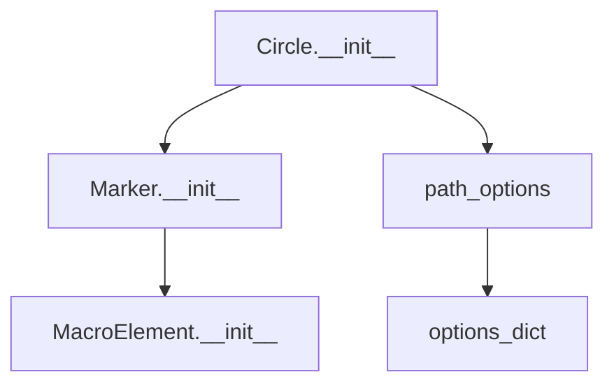
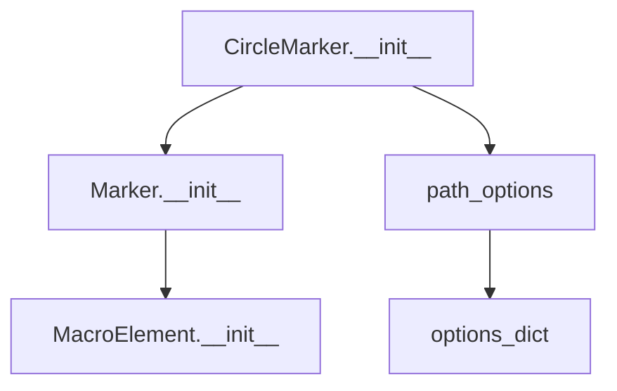

# `vector_layers.py`

## `folium.vector_layers.path_options` · *function*

## Summary:
Processes and standardizes styling options for vector path elements in folium maps.

## Description:
This function normalizes various styling parameters for vector paths (lines, polygons, circles) in folium maps. It handles conversion of snake_case parameter names to camelCase, manages conditional styling options based on whether the element is a line or has a radius, and establishes default values for common styling properties.

## Args:
    line (bool): When True, enables line-specific styling options such as smoothFactor and noClip.
    radius (bool or int or float): When provided, adds radius property to the options dictionary.
    **kwargs: Additional styling parameters in snake_case format that will be converted to camelCase.

## Returns:
    dict: A dictionary containing standardized styling options for vector path elements, including:
        - Stroke properties (stroke, color, weight, opacity, lineCap, lineJoin, dashArray, dashOffset)
        - Fill properties (fill, fillColor, fillOpacity, fillRule)
        - Bubbling mouse events
        - Line-specific options (smoothFactor, noClip) when line=True
        - Radius option when radius is provided
        - Gradient option when gradient is provided

## Raises:
    None explicitly raised.

## Constraints:
    Preconditions:
    - All parameter names in kwargs should be valid snake_case strings
    - radius parameter should be numeric when provided
    
    Postconditions:
    - Returns a dictionary with standardized camelCase keys
    - All provided kwargs are consumed or appropriately handled
    - Default values are applied for missing parameters

## Side Effects:
    None.

## Control Flow:
```mermaid
flowchart TD
    A[Start path_options] --> B{line=True?}
    B -- Yes --> C[Set extra_options with smoothFactor, noClip]
    B -- No --> D[extra_options = {}]
    C --> E{radius provided?}
    D --> E
    E -- Yes --> F[Update extra_options with radius]
    E -- No --> G[Continue]
    F --> G
    G --> H[Process color and fill_color]
    H --> I[Handle gradient]
    I --> J[Set default options]
    J --> K[Merge extra_options with defaults]
    K --> L[Return result]
```

## Examples:
```python
# Basic usage with line styling
options = path_options(line=True, color="#ff0000", weight=5)
# Returns: {'stroke': True, 'color': '#ff0000', 'weight': 5, 'opacity': 1.0, ...}

# Usage with radius
options = path_options(radius=10, fill=True, fillColor="#00ff00")
# Returns: {'stroke': True, 'color': '#3388ff', 'weight': 3, 'opacity': 1.0, 'fill': True, 'fillColor': '#00ff00', 'fillOpacity': 0.2, 'radius': 10, ...}

# Usage with gradient
options = path_options(gradient=["red", "blue"], stroke=False)
# Returns: {'stroke': False, 'color': '#3388ff', 'weight': 3, 'opacity': 1.0, 'fill': False, 'fillColor': '#3388ff', 'fillOpacity': 0.2, 'gradient': ['red', 'blue'], ...}
```

## `folium.vector_layers.BaseMultiLocation` · *class*

## Summary:
BaseMultiLocation is an abstract base class for vector layers that manage multiple geographic locations with optional popups and tooltips.

## Description:
This class serves as a foundation for creating vector map layers that handle collections of geographic coordinates. It provides common functionality for validating location data, managing associated popups and tooltips, and calculating bounding boxes for the locations. The class is designed to be inherited by concrete implementations such as markers, polygons, or other geographic features that require multiple location points.

Known callers/factories that create instances include various vector layer implementations in folium that represent geographic features with multiple points like polylines, polygons, or multi-point markers.

The motivation for this abstraction is to centralize common functionality for handling multiple geographic locations while maintaining flexibility for specific implementations. It enforces the responsibility boundary of managing location data validation, popup/tooltip association, and spatial bounds calculation.

## State:
- locations: list or array-like of coordinate pairs, validated through validate_locations() function
- popup: Popup object or string that will be converted to a Popup instance if needed
- tooltip: Tooltip object or string that will be converted to a Tooltip instance if needed

__init__ parameters:
- locations (required): Iterable containing geographic coordinate pairs (latitude, longitude) or nested structures
- popup (optional, default=None): Either a Popup instance or string that gets converted to a Popup
- tooltip (optional, default=None): Either a Tooltip instance or string that gets converted to a Tooltip

Class invariants:
- All locations must be valid coordinate pairs after validation by validate_locations()
- Popup and Tooltip objects are properly managed when provided
- Bounds calculation from locations is consistent with the stored location data

## Lifecycle:
Creation: Instantiate with a valid locations iterable and optional popup/tooltip parameters. This class is intended to be used as a base class for inheritance rather than direct instantiation.
Usage: Typically used as a base class where subclasses implement rendering logic via the MacroElement inheritance
Destruction: Cleanup is handled automatically through the MacroElement parent class's lifecycle management

## Method Map:
```mermaid
graph TD
    A[BaseMultiLocation.__init__] --> B[validate_locations]
    A --> C[add_child(Popup)]
    A --> D[add_child(Tooltip)]
    E[BaseMultiLocation._get_self_bounds] --> F[get_bounds]
    F --> G[iter_coords]
    G --> H[none_min/none_max]
```

## Raises:
- TypeError: Raised by validate_locations when locations is not an iterable with coordinate pairs
- ValueError: Raised by validate_locations when locations is empty

## Example:
```python
# This class is typically used as a base class for concrete implementations
# For example, a subclass might be created like:
# class MyVectorLayer(BaseMultiLocation):
#     def __init__(self, locations, popup=None, tooltip=None):
#         super().__init__(locations, popup, tooltip)
#         # Additional implementation here

# Basic usage pattern with existing folium vector layers:
# locations = [[45.5, -122.7], [45.6, -122.8], [45.7, -122.9]]
# popup = Popup("Sample popup")
# tooltip = Tooltip("Sample tooltip")
# 
# # Actual usage would be through a subclass implementation
# # base_layer = MyVectorLayer(locations, popup=popup, tooltip=tooltip)
#
# # Get bounds for the locations
# # bounds = base_layer._get_self_bounds()
```

### `folium.vector_layers.BaseMultiLocation.__init__` · *method*

## Summary:
Initializes a BaseMultiLocation object with validated locations and optional popup/tooltip elements.

## Description:
Constructs a BaseMultiLocation instance by processing input locations through validation and setting up associated interactive elements (popup and tooltip). This method serves as the primary initialization point for multi-location vector layers in Folium, ensuring proper data validation and element registration for map rendering.

## Args:
    locations (iterable): Iterable containing coordinate pairs or nested location structures to be validated and stored.
    popup (Popup or str, optional): Popup element or string to display when interacting with the location. Defaults to None.
    tooltip (Tooltip or str, optional): Tooltip element or string to display on hover. Defaults to None.

## Returns:
    None: This method initializes the object state and does not return a value.

## Raises:
    TypeError: When locations is not an iterable with coordinate pairs.
    ValueError: When locations is empty.

## State Changes:
    Attributes READ: None
    Attributes WRITTEN: 
    - self.locations: Set to validated locations from the locations parameter

## Constraints:
    Preconditions:
    - locations must be an iterable containing valid coordinate pairs
    - popup, if provided, must be either a Popup instance or convertible to string
    - tooltip, if provided, must be either a Tooltip instance or convertible to string
    
    Postconditions:
    - self.locations contains validated coordinate data
    - Popup and Tooltip elements are registered with the parent element if provided

## Side Effects:
    - Calls validate_locations() to process and validate input locations
    - Registers popup and tooltip elements with the parent element when provided

### `folium.vector_layers.BaseMultiLocation._get_self_bounds` · *method*

## Summary:
Computes and returns the geographic bounding box for all locations in this multi-location vector layer.

## Description:
This method calculates the minimum and maximum latitude/longitude coordinates across all locations in the vector layer, returning them as a bounding box. It serves as a standardized interface for retrieving spatial bounds of multi-location elements in the map visualization.

## Args:
    None

## Returns:
    list[list[float | None]]: A nested list representing the bounding box with format [[min_lat, min_lon], [max_lat, max_lon]], where None values indicate missing coordinate data.

## Raises:
    None explicitly raised

## State Changes:
    Attributes READ: self.locations
    Attributes WRITTEN: None

## Constraints:
    Preconditions: 
    - self.locations must be a valid location structure that can be processed by get_bounds
    - Locations should contain valid geographic coordinate data (latitude/longitude pairs)
    
    Postconditions:
    - Returns a consistent bounding box format regardless of input data structure
    - Handles None values gracefully in coordinate calculations

## Side Effects:
    None

## `folium.vector_layers.PolyLine` · *class*

## Summary:
Represents a polyline vector layer that can be added to folium maps for drawing connected line segments.

## Description:
The PolyLine class creates a vector-based polyline that connects multiple geographic coordinates on a map. It serves as a specialized visualization element for displaying routes, paths, or linear features on interactive maps. This class is part of folium's vector layer system and inherits from BaseMultiLocation to handle location management and optional UI elements like popups and tooltips. The class utilizes Leaflet.js polyline functionality through folium's templating system.

## State:
- locations: list of coordinate pairs (latitude, longitude) defining the polyline path
- popup: optional Popup object or string to display when clicking on the polyline
- tooltip: optional Tooltip object or string to display when hovering over the polyline
- _name: string identifier set to "PolyLine" for internal tracking
- options: dictionary of styling options configured via path_options function
- _template: Jinja2 template for rendering the polyline in HTML output (defined in parent class)

## Lifecycle:
- Creation: Instantiate with a list of coordinate pairs, optionally including popup and tooltip objects
- Usage: Add to a folium.Map instance using the add_child() method or similar
- Destruction: Managed automatically by the map's lifecycle; no explicit cleanup required

## Method Map:
```mermaid
graph TD
    A[PolyLine.__init__] --> B[BaseMultiLocation.__init__]
    B --> C[validate_locations]
    A --> D[path_options]
    A --> E[set _name="PolyLine"]
```

## Raises:
- TypeError: When locations parameter contains invalid coordinate data
- ValueError: When locations parameter is empty or contains malformed coordinate pairs

## Example:
```python
import folium

# Create a map
m = folium.Map([45.5236, -122.6750], zoom_start=13)

# Define coordinates for a route
route_coordinates = [
    [45.5236, -122.6750],
    [45.5246, -122.6755],
    [45.5256, -122.6760]
]

# Create and add a polyline
polyline = folium.PolyLine(route_coordinates, color='blue', weight=3)
m.add_child(polyline)

# Add popup and tooltip
polyline_with_ui = folium.PolyLine(
    route_coordinates,
    popup='Route Segment',
    tooltip='Click for info'
)
m.add_child(polyline_with_ui)
```

### `folium.vector_layers.PolyLine.__init__` · *method*

*No documentation generated.*

## `folium.vector_layers.Polygon` · *class*

*No documentation generated.*

### `folium.vector_layers.Polygon.__init__` · *method*

## Summary:
Initializes a Polygon vector layer with location coordinates and styling options.

## Description:
Configures a polygon vector layer by setting up its location data, popup, tooltip, and rendering options. This method establishes the basic structure and properties needed for rendering a polygon on a Folium map.

## Args:
    locations (list): A list of coordinate pairs defining the polygon vertices.
    popup (Popup or str, optional): Popup information to display when clicking the polygon. Defaults to None.
    tooltip (Tooltip or str, optional): Tooltip information to display on hover. Defaults to None.
    **kwargs: Additional styling options passed to the path_options function for configuring polygon appearance.

## Returns:
    None: This method initializes the object's state and does not return a value.

## Raises:
    None explicitly raised, but may propagate exceptions from validate_locations() or path_options() functions.

## State Changes:
    Attributes READ: None
    Attributes WRITTEN: 
    - self._name: Set to "Polygon" to identify the layer type
    - self.options: Set to the result of path_options() function call
    - self.locations: Set via parent class initialization
    - self.popup: Set via parent class initialization (if provided)
    - self.tooltip: Set via parent class initialization (if provided)

## Constraints:
    Preconditions:
    - locations must be a valid list of coordinate pairs
    - popup, if provided, must be a Popup instance or convertible to string
    - tooltip, if provided, must be a Tooltip instance or convertible to string
    
    Postconditions:
    - self._name is set to "Polygon"
    - self.options contains properly formatted styling options
    - self.locations contains validated coordinate data

## Side Effects:
    None: This method performs no I/O operations or external service calls. It only modifies internal object state.

## `folium.vector_layers.Rectangle` · *class*

## Summary:
Represents a rectangular shape on a map that can be rendered using Leaflet.js vector layers.

## Description:
The Rectangle class is used to create rectangular shapes on interactive maps by leveraging Leaflet.js vector rendering capabilities. It inherits from BaseMultiLocation and is designed to display rectangles defined by geographic bounds. This class serves as a specialized visualization element for mapping applications where rectangular regions need to be highlighted or displayed.

## State:
- bounds: list of coordinate pairs defining the rectangle's geographic boundaries
- _name: string identifier set to "rectangle" for Leaflet.js integration
- options: dictionary containing styling and configuration options for the rectangle rendering
- locations: inherited from BaseMultiLocation, stores validated coordinate data

## Lifecycle:
- Creation: Instantiate with bounds parameter (list of coordinate pairs) and optional popup/tooltip
- Usage: The class handles automatic integration with Leaflet.js through the inherited MacroElement infrastructure
- Destruction: Managed automatically through the parent class's lifecycle management

## Method Map:
```mermaid
graph TD
    A[Rectangle.__init__] --> B[BaseMultiLocation.__init__]
    B --> C[validate_locations]
    A --> D[path_options]
    D --> E[camelize]
    A --> F[_name = "rectangle"]
```

## Raises:
- TypeError: When bounds parameter contains invalid coordinate data that cannot be processed by validate_locations
- ValueError: When bounds parameter is empty or contains invalid coordinate pairs

## Example:
```python
import folium
from folium.vector_layers import Rectangle

# Create a map
m = folium.Map([40.7128, -74.0060], zoom_start=12)

# Define bounds for rectangle (southwest, northeast coordinates)
bounds = [[40.70, -74.02], [40.72, -74.00]]

# Create rectangle with styling options
rectangle = Rectangle(
    bounds=bounds,
    popup="Central Park",
    tooltip="Park Boundary",
    color="#ff0000",
    weight=2,
    fill_opacity=0.3
)

# Add to map
rectangle.add_to(m)
```

### `folium.vector_layers.Rectangle.__init__` · *method*

## Summary:
Initializes a rectangle vector layer with specified bounds and styling options.

## Description:
Configures a rectangle vector layer for display on a Leaflet map by setting up its geometric bounds, optional popup and tooltip elements, and styling parameters. This method establishes the core properties needed for rendering rectangles in vector layers.

## Args:
    bounds (list): A list of two coordinate pairs defining the rectangle's boundaries in [southwest, northeast] format.
    popup (Popup or str, optional): Popup element or string to display when clicking the rectangle. Defaults to None.
    tooltip (Tooltip or str, optional): Tooltip element or string to display on hover. Defaults to None.
    **kwargs: Additional styling options that are processed by path_options function including stroke, color, weight, opacity, fill properties, etc.

## Returns:
    None: This method initializes the object's state and does not return a value.

## Raises:
    None explicitly raised: The method delegates validation to parent classes and path_options function.

## State Changes:
    Attributes READ: None
    Attributes WRITTEN: 
    - self._name: Set to "rectangle" string
    - self.options: Set to dictionary of styling options generated by path_options function

## Constraints:
    Preconditions:
    - bounds must be a valid list of coordinate pairs
    - popup and tooltip must be Popup/Tooltip objects or strings
    - All kwargs must be valid styling parameters for vector layers
    
    Postconditions:
    - self._name is set to "rectangle"
    - self.options contains a complete set of styling parameters
    - The object is ready for rendering on a Leaflet map

## Side Effects:
    None: This method performs only local state initialization and does not cause external I/O or mutations.

## `folium.vector_layers.Circle` · *class*

## Summary:
Represents a circular marker element in folium's vector layers system for displaying circular shapes on interactive maps.

## Description:
The Circle class extends Marker to create circular elements on maps. It's designed to be used within folium's vector layer system for displaying circular markers with customizable radius and styling options. This class inherits basic marker functionality while adding circle-specific properties like radius.

## State:
- location: list[float] or None - Latitude and longitude coordinates for the circle center, validated through validate_location
- radius: int - Radius of the circle in meters, defaults to 50
- _name: str - Fixed value "circle" indicating the element type
- options: dict - Configuration options for rendering the circle, created by path_options function with line=False and radius parameter
- popup: Popup or None - Optional popup element associated with the circle
- tooltip: Tooltip or None - Optional tooltip element associated with the circle

## Lifecycle:
- Creation: Instantiate with location coordinates, optional radius, and standard marker parameters
- Usage: Add to a folium.Map instance to render on the map
- Destruction: Managed automatically by the map's lifecycle management

## Method Map:


## Raises:
- TypeError: When location is not a sized variable (list, tuple, etc.) or when invalid parameters are passed to parent classes
- ValueError: When location doesn't contain exactly 2 numerical values, contains NaNs, or when invalid parameters are passed to parent classes

## Example:
```python
import folium

# Create a circle with default radius
circle1 = folium.Circle(
    location=[45.5236, -122.6750],
    radius=100
)

# Create a circle with custom styling
circle2 = folium.Circle(
    location=[45.5236, -122.6750],
    radius=200,
    color='red',
    fill=True,
    fill_color='red'
)

# Add to map
m = folium.Map([45.5236, -122.6750], zoom_start=13)
m.add_child(circle1)
m.add_child(circle2)
```

### `folium.vector_layers.Circle.__init__` · *method*

## Summary:
Initializes a Circle vector layer with specified location, radius, and optional popup/tooltip.

## Description:
Configures a circular marker element for vector layers by setting up its geometric properties and styling options. This method serves as the constructor for Circle objects, establishing the basic structure and visual characteristics of the circle on the map.

## Args:
    location (list or tuple, optional): Latitude and longitude coordinates [lat, lon]. Defaults to None.
    radius (int, optional): Radius of the circle in meters. Defaults to 50.
    popup (Popup or str, optional): Popup message to display on click. Defaults to None.
    tooltip (Tooltip or str, optional): Tooltip message to display on hover. Defaults to None.
    **kwargs: Additional styling options passed to path_options function.

## Returns:
    None: This method initializes the object's state and does not return a value.

## Raises:
    TypeError: If location is not a sized variable (list, tuple, etc.).
    ValueError: If location doesn't contain exactly 2 numerical values or contains NaNs.

## State Changes:
    Attributes READ: None
    Attributes WRITTEN: 
    - self._name: Set to "circle"
    - self.options: Configured with path_options settings

## Constraints:
    Preconditions:
    - Location, if provided, must be a list or tuple containing exactly 2 numerical values
    - Radius must be a positive number
    - All kwargs must be valid styling parameters for vector layers
    
    Postconditions:
    - self._name is set to "circle"
    - self.options contains properly configured styling parameters for a circle

## Side Effects:
    None: This method performs no I/O operations or external service calls. It only configures internal object state.

## `folium.vector_layers.CircleMarker` · *class*

## Summary:
A vector layer element representing a circular marker on a map with customizable radius and styling options.

## Description:
CircleMarker is a specialized marker class that inherits from Marker and renders circular shapes on interactive maps. It extends the base marker functionality to create circular markers with configurable radius and visual properties.

The class is designed to be instantiated directly or through map.add_child() methods, and integrates seamlessly with folium's map rendering system. It supports all standard marker features like popups and tooltips while adding the specific functionality of circular shape rendering.

## State:
- location: list[float, float] - Geographic coordinates [latitude, longitude] for the marker position. Must be validated to contain exactly two numerical values.
- radius: int - Radius of the circle in pixels. Default is 10. Must be a positive number.
- _name: str - Class identifier set to "CircleMarker" to distinguish it from other marker types.
- options: dict - Configuration dictionary containing styling options for the circle marker, including stroke, fill, color, weight, opacity, etc. Generated by path_options function.

## Lifecycle:
- Creation: Instantiate with location coordinates and optional radius, popup, tooltip, and styling parameters
- Usage: Add to a folium.Map instance using add_child() or similar methods
- Destruction: Cleanup handled automatically when the map is rendered or destroyed

## Method Map:


## Raises:
- TypeError: When location is not a sized variable (list, tuple, etc.)
- ValueError: When location doesn't contain exactly two values, contains non-numerical values, or contains NaN values

## Example:
```python
import folium

# Create a map
m = folium.Map([45.5236, -122.6750], zoom_start=13)

# Create a CircleMarker
circle_marker = folium.CircleMarker(
    location=[45.5236, -122.6750],
    radius=15,
    popup='Portland',
    tooltip='Portland'
)

# Add to map
m.add_child(circle_marker)
```

### `folium.vector_layers.CircleMarker.__init__` · *method*

## Summary:
Initializes a CircleMarker object with location, radius, and optional popup/tooltip.

## Description:
Configures a CircleMarker instance by setting its location, radius, and associated UI elements. This method serves as the constructor that establishes the basic properties and options for rendering circular markers on vector layers.

## Args:
    location (list or tuple, optional): Latitude and longitude coordinates [lat, lon]. Defaults to None.
    radius (int, optional): Radius of the circle marker in pixels. Defaults to 10.
    popup (Popup or str, optional): Popup message to display on click. Defaults to None.
    tooltip (Tooltip or str, optional): Tooltip message to display on hover. Defaults to None.
    **kwargs: Additional options for styling and configuration, such as color, weight, opacity, etc.

## Returns:
    None: This method initializes the object's state and does not return a value.

## Raises:
    TypeError: If location is not a sized variable (list, tuple, etc.).
    ValueError: If location does not contain exactly two numerical values or contains NaNs.

## State Changes:
    Attributes READ: None
    Attributes WRITTEN: 
    - self._name: Set to "CircleMarker"
    - self.options: Set to dictionary of path options including radius and styling parameters

## Constraints:
    Preconditions:
    - Location, if provided, must be a sequence of exactly two numerical values (latitude and longitude)
    - Radius must be a positive number
    - All keyword arguments must be valid styling parameters for vector layers
    
    Postconditions:
    - self._name is set to "CircleMarker"
    - self.options contains properly formatted path options with radius and other styling parameters

## Side Effects:
    None: This method performs no I/O operations or external service calls.

