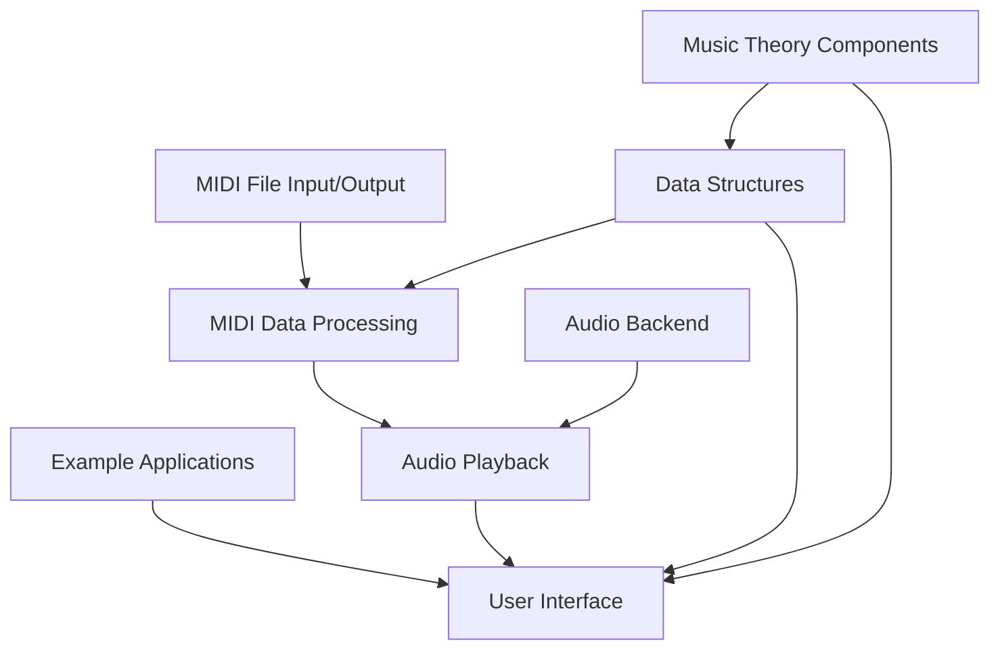

# `mingus`

## Repository Overview

This repository provides a comprehensive Python framework for music theory manipulation, MIDI file handling, and audio synthesis. It enables developers to work with musical concepts programmatically, create MIDI files, and play music through various audio backends.

### Tree Structure

```
mingus/
├── mingus/                 # Main library modules
│   ├── core/               # Music theory components
│   ├── containers/         # Musical data structures  
│   ├── midi/               # MIDI file I/O and playback functionality
│   └── extra/              # Additional utilities and extensions
├── mingus_examples/        # Example applications demonstrating usage
└── scripts/                # Utility scripts including documentation generator
```

### Purpose

The mingus library addresses the need for programmatic music manipulation in Python. It serves as a bridge between abstract musical concepts and concrete digital audio representations. The system allows developers to:
- Represent and manipulate musical elements
- Create and modify MIDI files programmatically
- Play music through various audio backends
- Build music applications with rich musical functionality

### Target Users

- Music application developers
- Audio programming enthusiasts
- Educational software creators
- Algorithmic composition researchers
- MIDI file processing specialists

### Position in Ecosystem

This is a standalone Python library designed for music-related programming tasks. It can be integrated into larger audio applications, educational tools, or music analysis systems. It provides both low-level MIDI manipulation and high-level music theory constructs.

### Architecture



Key architectural patterns:
- **Pipeline**: Data flows from MIDI parsing → music theory processing → audio playback
- **Abstraction Layers**: Separation between music theory concepts and MIDI implementation
- **Plugin Architecture**: Audio backend support through modular design

### Entry Points

#### CLI Commands
- `scripts/api_doc_generator.py`: Generates API documentation for Python packages
- Example usage: `python scripts/api_doc_generator.py /path/to/output/directory`

#### Importable APIs
- `mingus.core.*`: Music theory components
- `mingus.containers.*`: Musical data structures
- `mingus.midi.*`: MIDI file handling and playback functionality
- `mingus.extra.*`: Additional utilities

### Core Features

1. **Music Theory Representation** - Implements scales, chords, keys, and intervals with mathematical precision
2. **MIDI File Creation** - Read and write standard MIDI files with full event support
3. **MIDI Playback** - Play music through various audio backends (FluidSynth, Windows MIDI)
4. **Audio Synthesis** - Generate audio samples using FluidSynth synthesizer
5. **Music Data Structures** - Rich container classes for notes, bars, tracks, and compositions
6. **Sequencing Engine** - Advanced timing and playback control for complex musical arrangements

### Dependencies

- **Python 2.7+** (based on code structure)
- **pyfluidsynth** (for FluidSynth audio synthesis)
- **pygame** (for example applications)
- **numpy** (for audio processing in pyfluidsynth)
- **six** (for Python 2/3 compatibility)
- **win32api** (Windows-specific MIDI support)

### Configuration

The system supports configuration through:
- Environment variables for audio settings
- Runtime parameters for MIDI file handling
- Audio backend selection (FluidSynth, Windows MIDI, etc.)

### Extension Points

1. **Audio Backends**: Implement custom sequencer classes inheriting from `Sequencer`
2. **MIDI Formats**: Extend MIDI file readers/writers for custom formats
3. **Music Theory**: Add new scale types, chord definitions, or key signatures
4. **Data Containers**: Create custom musical data structures
5. **Playback Observers**: Implement custom sequencer observers for monitoring playback events

---

## Modules

- [`mingus`](mingus.md)
- [`mingus/containers`](mingus/containers.md)
- [`mingus/core`](mingus/core.md)
- [`mingus/extra`](mingus/extra.md)
- [`mingus/midi`](mingus/midi.md)
- [`mingus_examples`](mingus_examples.md)
- [`mingus_examples/pygame-drum`](mingus_examples/pygame-drum.md)
- [`mingus_examples/pygame-piano`](mingus_examples/pygame-piano.md)
- [`scripts`](scripts.md)

