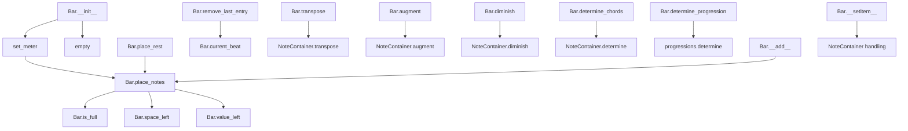

# `bar.py`

## `mingus.containers.bar.Bar` · *class*

## Summary:
A musical bar container that manages notes, rests, and timing within a specific meter and key.

## Description:
The Bar class represents a musical bar (or measure) that contains musical notes and rests arranged according to a specific time signature (meter) and key. It provides methods for placing notes, managing timing, and performing musical operations like transposition and chord determination. The class is designed to work with the mingus music theory library to construct musical compositions.

This class is typically instantiated by music composition systems or when building musical structures programmatically. It serves as a fundamental building block for representing musical time periods in a structured way, allowing for precise control over musical timing and organization.

## State:
- key (keys.Key): The musical key of the bar, defaults to "C". Can be a string or Key object.
- meter (tuple): The time signature as (beats_per_measure, beat_unit), defaults to (4, 4). Valid beat units are powers of 2 (1, 2, 4, 8, 16, etc.).
- current_beat (float): The current position within the bar in beats, starts at 0.0. Represents how much of the bar has been filled.
- length (float): The total length of the bar in beats, calculated from meter. Zero indicates an unlimited-length bar.
- bar (list): Internal storage of musical entries as [beat_position, duration, note_container]. Each entry represents a musical event at a specific time.

## Lifecycle:
- Creation: Instantiate with optional key and meter parameters. The key can be a string or Key object, and meter should be a tuple of (beats_per_measure, beat_unit).
- Usage: Place notes using place_notes() or place_rest(), then manipulate with various methods like transpose(), augment(), diminish(), etc.
- Destruction: No explicit cleanup required, uses standard Python garbage collection.

## Method Map:


## Raises:
- MeterFormatError: When an invalid meter tuple is provided that doesn't conform to valid beat durations (powers of 2 for beat unit).

## Example:
```python
# Create a bar with default settings
bar = Bar()

# Place notes in the bar
bar.place_notes("C-E-G", 4)  # Place a C major triad for a whole note

# Add notes using the + operator
from mingus.containers import NoteContainer
nc = NoteContainer("D-F-A")
bar + nc  # Adds the notes with default duration based on meter

# Check if bar is full
if bar.is_full():
    print("Bar is complete")

# Get musical information
chords = bar.determine_chords()
note_names = bar.get_note_names()

# Manipulate musical content
bar.transpose("M2")  # Transpose all notes up by a major second
bar.augment()  # Increase the duration of all notes
```

### `mingus.containers.bar.Bar.__init__` · *method*

## Summary:
Initializes a Bar object with a musical key and meter, setting up the internal state for note placement.

## Description:
The `__init__` method configures a Bar instance by converting string keys to Key objects, setting the musical meter, and initializing the bar's internal state. This method serves as the primary constructor for Bar objects, establishing the fundamental musical context and preparing the bar for note placement operations.

## Args:
    key (str or Key, optional): The musical key of the bar. Defaults to "C". If a string is provided, it gets converted to a keys.Key object.
    meter (tuple, optional): The meter signature as (beats_per_measure, beat_unit). Defaults to (4, 4).

## Returns:
    None: This method initializes the object's state but does not return a value.

## Raises:
    MeterFormatError: Raised by `set_meter()` when the meter argument is not a valid representation of a musical meter.

## State Changes:
    Attributes READ: None
    Attributes WRITTEN: 
    - self.key: Set to either the provided Key object or converted from a string
    - self.meter: Set by calling `set_meter()`
    - self.current_beat: Reset to 0.0 by calling `empty()`
    - self.length: Set by calling `set_meter()`
    - self.bar: Reset to empty list by calling `empty()`

## Constraints:
    Preconditions:
    - The key parameter must be either a string representing a musical key or a valid keys.Key object
    - The meter parameter must be a tuple representing a valid musical meter or (0, 0) for unspecified meter
    
    Postconditions:
    - self.key is properly initialized as a Key object
    - self.meter is properly set according to the meter parameter
    - self.length is calculated based on the meter
    - self.current_beat is reset to 0.0
    - self.bar is initialized as an empty list

## Side Effects:
    None: This method performs no I/O operations or external service calls. It only manipulates the object's internal state.

### `mingus.containers.bar.Bar.empty` · *method*

## Summary:
Clears the bar's note content and resets the current beat position to zero.

## Description:
Resets the internal bar representation to an empty list and sets the current beat position back to zero. This method is typically used to prepare a bar for new content or to clear existing content. It is automatically called during Bar initialization and can be used manually to reset the bar state.

## Args:
    None

## Returns:
    list: An empty list representing the cleared bar content.

## Raises:
    None

## State Changes:
    Attributes READ: None
    Attributes WRITTEN: self.bar, self.current_beat

## Constraints:
    Preconditions: The Bar instance must be properly initialized.
    Postconditions: The bar attribute will be an empty list and current_beat will be 0.0.

## Side Effects:
    None

### `mingus.containers.bar.Bar.set_meter` · *method*

## Summary:
Sets the meter and calculates the corresponding length for a musical bar.

## Description:
Configures the time signature (meter) of the bar and computes its total length in beats. This method validates the meter format and updates both the meter tuple and the calculated length attribute. The meter is represented as a tuple (beats_per_measure, beat_unit) where beat_unit indicates the note value that represents one beat.

## Args:
    meter (tuple): A tuple representing the meter in the form (beats_per_measure, beat_unit). The beat_unit should be a valid beat duration according to the music theory module.

## Returns:
    None: This method modifies the object's state in-place and does not return a value.

## Raises:
    MeterFormatError: When the meter argument is not a valid tuple representation of a meter, specifically when:
        - The meter is not a tuple
        - The beat unit is not a valid beat duration
        - The meter does not match the special case (0, 0)

## State Changes:
    Attributes READ: None
    Attributes WRITTEN: 
        - self.meter: Updated to the provided meter tuple
        - self.length: Recalculated as meter[0] * (1.0 / meter[1])

## Constraints:
    Preconditions:
        - The meter parameter must be a tuple
        - For valid meters, the second element (beat_unit) must be a valid beat duration
        - Special case (0, 0) is accepted for resetting meter to zero
    Postconditions:
        - self.meter is updated to the provided meter tuple
        - self.length is updated to reflect the computed length in beats

## Side Effects:
    None: This method only modifies the internal state of the Bar instance.

### `mingus.containers.bar.Bar.place_notes` · *method*

## Summary:
Places musical notes into a bar at the current beat position, updating the bar's state and advancing the beat counter.

## Description:
This method adds notes to a musical bar structure, handling various input formats for notes and ensuring proper placement according to the bar's meter constraints. It's designed to be called during musical composition or playback construction phases where notes need to be sequentially added to a bar.

## Args:
    notes: Musical notes in various formats - either an object with a "notes" attribute, an object with a "name" attribute, a string representation, or a list of notes
    duration: Numeric duration value representing the note length (e.g., 1 for whole note, 2 for half note, 4 for quarter note)

## Returns:
    bool: True if notes were successfully placed in the bar, False if there's insufficient space

## Raises:
    MeterFormatError: If the meter configuration is invalid (though this would be caught during Bar initialization)
    UnexpectedObjectError: If notes parameter cannot be converted to a NoteContainer due to unexpected object types

## State Changes:
    Attributes READ: self.current_beat, self.length, self.bar
    Attributes WRITTEN: self.bar, self.current_beat

## Constraints:
    Preconditions: 
    - The bar must be properly initialized with a meter
    - Duration must be a valid beat duration (checked via meter.valid_beat_duration)
    - Notes parameter must be convertible to a NoteContainer
    
    Postconditions:
    - If successful, the bar contains the new note entry at the current beat position
    - If successful, the current_beat is advanced by 1.0/duration
    - If unsuccessful, the bar and current_beat remain unchanged

## Side Effects:
    None - this method only modifies the internal state of the Bar instance

### `mingus.containers.bar.Bar.place_notes_at` · *method*

## Summary:
Appends notes to existing musical notes at a specific beat position within the bar.

## Description:
Searches through the bar's internal note sequence for an entry matching the specified beat position and adds the provided notes to the existing notes at that position. This method modifies the internal structure of the bar by extending the note container at the matching beat position.

## Args:
    notes: A note or collection of notes to be added to existing notes at the specified position
    at: The beat position where notes should be added (must match an existing entry's beat position)

## Returns:
    None: This method modifies the object in-place and does not return a value

## Raises:
    AttributeError: If an entry in self.bar has insufficient structure (x[0] is not a list with at least 3 elements)

## State Changes:
    Attributes READ: self.bar
    Attributes WRITTEN: self.bar (modifies the notes portion of an existing entry at the specified beat position)

## Constraints:
    Preconditions: 
    - The bar must have been initialized with valid structure
    - The `at` parameter must correspond to an existing beat position in the bar
    - Entries in self.bar must have structure where x[0] is a list with at least 3 elements
    - The `notes` parameter must be compatible with the += operation on the note container
    
    Postconditions:
    - If a matching beat position exists, the notes at that position are extended with the new notes
    - If no matching beat position exists, no modifications occur to the bar

## Side Effects:
    None: This method only modifies the internal state of the Bar object and does not perform I/O or external service calls

### `mingus.containers.bar.Bar.place_rest` · *method*

## Summary:
Places a rest (silence) of the specified duration in the musical bar.

## Description:
This method provides a convenient way to add rests (musical silences) to a musical bar. It delegates to the underlying `place_notes` method with `None` as the notes parameter, effectively creating a rest of the specified duration. This method is particularly useful for building musical compositions where silence needs to be explicitly represented.

## Args:
    duration (float): The duration of the rest to be placed in the bar. This typically corresponds to musical note values like 1.0 for whole notes, 0.5 for half notes, 0.25 for quarter notes, etc.

## Returns:
    bool: True if the rest was successfully placed within the bar's capacity, False if there was insufficient space.

## Raises:
    None explicitly raised by this method. Any exceptions are propagated from the underlying `place_notes` method.

## State Changes:
    Attributes READ: self.current_beat, self.length, self.bar
    Attributes WRITTEN: self.bar, self.current_beat

## Constraints:
    Preconditions: The bar must have a valid meter configuration and sufficient space for the rest of the specified duration.
    Postconditions: If successful, the rest is added to the bar's internal representation and the current beat position is updated accordingly.

## Side Effects:
    None beyond modifying the internal state of the Bar instance.

### `mingus.containers.bar.Bar.remove_last_entry` · *method*

## Summary:
Removes the last musical entry from the bar and adjusts the current beat position backward by the duration of the removed entry.

## Description:
This method removes the most recently added musical entry (note or rest) from the bar's internal list and updates the current beat position to reflect the removal. It's designed to support dynamic bar construction and modification by allowing the removal of the last added element. The bar stores entries as lists in the format [beat_position, duration, note_container].

## Args:
    None

## Returns:
    float: The updated current beat position after removing the last entry

## Raises:
    IndexError: When attempting to remove an entry from an empty bar (accessing self.bar[-1] when bar is empty)

## State Changes:
    Attributes READ: self.bar, self.current_beat
    Attributes WRITTEN: self.bar, self.current_beat

## Constraints:
    Preconditions: The bar must contain at least one entry (self.bar must not be empty)
    Postconditions: The bar will have one fewer entry, and self.current_beat will be reduced by 1.0 / self.bar[-1][1]

## Side Effects:
    None

### `mingus.containers.bar.Bar.is_full` · *method*

## Summary:
Determines whether a musical bar has reached its maximum capacity based on current beat position and total length.

## Description:
Checks if the bar is full by comparing the current beat position against the bar's total length, accounting for floating-point precision issues. This method is used to determine when a musical measure has been completely filled with notes. The method returns False for empty bars or bars with zero length, and True when the current beat position is close to or exceeds the bar's total length (within a tolerance of 0.001).

## Args:
    None

## Returns:
    bool: True if the bar is full (current beat >= length - 0.001 and bar has content), False otherwise.

## Raises:
    None

## State Changes:
    Attributes READ: self.length, self.bar, self.current_beat
    Attributes WRITTEN: None

## Constraints:
    Preconditions: 
    - self.length must be a numeric value representing the total duration of the bar
    - self.bar must be a list-like object containing musical entries
    - self.current_beat must be a numeric value representing the current position in the bar
    
    Postconditions:
    - Returns False if self.length equals 0.0 (empty bar)
    - Returns False if self.bar is empty
    - Returns True if self.current_beat is greater than or equal to self.length minus a small epsilon (0.001)
    - Returns False in all other cases

## Side Effects:
    None

### `mingus.containers.bar.Bar.change_note_duration` · *method*

## Summary:
Modifies the duration of a note at a specific beat position, attempting to adjust subsequent note timings accordingly.

## Description:
This method attempts to change the duration of a note located at a specified beat position within the musical bar structure. It validates the new duration against valid beat durations and then searches through the bar's note entries to find and modify the specified note. The method also attempts to recalculate timing for subsequent notes to maintain proper musical structure.

## Args:
    at (float): The beat position where the note duration should be changed
    to (numeric): The new duration value to apply to the note at position 'at'

## Returns:
    None: This method modifies the bar in-place and does not return a value

## Raises:
    None explicitly raised: The method relies on _meter.valid_beat_duration() validation but doesn't raise exceptions directly

## State Changes:
    Attributes READ: self.bar
    Attributes WRITTEN: self.bar (modifies note duration and attempts to adjust subsequent note positions)

## Constraints:
    Preconditions:
    - The target position 'at' must exist in the bar structure
    - The new duration 'to' must be a valid beat duration according to _meter.valid_beat_duration()
    - The bar structure must be properly initialized
    
    Postconditions:
    - If a note exists at position 'at', its duration field will be updated to 'to'
    - Subsequent note positioning adjustments are attempted but may not function correctly due to implementation bugs

## Side Effects:
    None: This method only modifies the internal state of the Bar object

## Implementation Notes:
    The current implementation contains structural inconsistencies:
    - The code incorrectly assumes that elements in self.bar have structure [position, duration] when they are actually [beat_position, duration, notes]
    - Indexing errors prevent proper adjustment of subsequent notes
    - The method may not correctly locate or modify notes due to these structural mismatches

### `mingus.containers.bar.Bar.get_range` · *method*

## Summary:
Returns the minimum and maximum MIDI note values present in the bar's musical content.

## Description:
This method analyzes all notes contained within the bar's musical events and determines the pitch range spanned by those notes. It is particularly useful for musical analysis, display purposes, and determining the vertical range of musical content within a bar. The method iterates through all musical events in the bar and examines the notes associated with each event.

## Args:
    None

## Returns:
    tuple[int, int]: A tuple containing (minimum_note_value, maximum_note_value) where each value is the MIDI integer representation of a note (C4 = 60, C#4 = 61, etc.). If the bar contains no notes, returns (100000, -1) as a sentinel value indicating an empty range.

## Raises:
    None

## State Changes:
    Attributes READ: self.bar
    Attributes WRITTEN: None

## Constraints:
    Preconditions: The bar should contain valid musical data with notes in the expected format where each note can be converted to an integer via the Note.__int__() method.
    Postconditions: The returned tuple contains valid MIDI note integer values representing the pitch range of all notes in the bar. If no notes exist, returns sentinel values (100000, -1).

## Side Effects:
    None

### `mingus.containers.bar.Bar.space_left` · *method*

## Summary:
Calculates the remaining space in the bar in terms of beats.

## Description:
Returns the difference between the total bar length and the current beat position, indicating how many beats of space remain for placing notes. This method is essential for determining whether additional musical elements can be added to the bar without exceeding its capacity.

## Args:
    None

## Returns:
    float: The number of beats remaining in the bar. Returns negative values when the bar has exceeded its capacity.

## Raises:
    None

## State Changes:
    Attributes READ: self.length, self.current_beat
    Attributes WRITTEN: None

## Constraints:
    Preconditions: The Bar instance must be properly initialized with valid meter and length values.
    Postconditions: The returned value represents the mathematical difference between bar length and current beat position.

## Side Effects:
    None

### `mingus.containers.bar.Bar.value_left` · *method*

## Summary:
Returns the reciprocal of the remaining space in the musical bar.

## Description:
Calculates the inverse of the remaining beat space in the bar. This value represents the "remaining value" metric, which is useful for determining proportional space availability in musical composition contexts.

## Args:
    None

## Returns:
    float: The reciprocal of the remaining space in the bar (1.0 / space_left()). Returns positive infinity when no space remains.

## Raises:
    None

## State Changes:
    Attributes READ: self.length, self.current_beat
    Attributes WRITTEN: None

## Constraints:
    Preconditions: The Bar instance must have valid meter and current_beat values.
    Postconditions: The returned value represents 1.0 divided by the difference between bar length and current beat position.

## Side Effects:
    None

### `mingus.containers.bar.Bar.augment` · *method*

## Summary:
Applies the augment operation to all notes contained within the bar's note containers.

## Description:
This method iterates through all musical entries in the bar and applies the `augment()` operation to each note container. The augmentation increases the pitch of each note by a semitone (sharpens it). This method is part of a family of transformation methods that modify all notes in the bar uniformly.

## Args:
    None

## Returns:
    None

## Raises:
    None

## State Changes:
    Attributes READ: self.bar
    Attributes WRITTEN: None

## Constraints:
    Preconditions: The bar must contain note containers in its `bar` attribute, where each entry is a list of format [beat_position, duration, note_container].
    Postconditions: All notes within the bar's note containers will have been augmented (sharpened by one semitone).

## Side Effects:
    Mutates the note objects within the bar's note containers by modifying their pitch.

### `mingus.containers.bar.Bar.diminish` · *method*

## Summary:
Reduces the duration of all notes in the bar by halving their durations.

## Description:
This method iterates through all musical entries in the bar and reduces the duration of each note by calling the `diminish()` method on the associated NoteContainer. This operation effectively halves the duration of all notes currently stored in the bar.

## Args:
    None

## Returns:
    None

## Raises:
    None

## State Changes:
    Attributes READ: self.bar
    Attributes WRITTEN: None

## Constraints:
    Preconditions: The bar must contain valid musical entries with notes that support the diminish operation
    Postconditions: All notes in the bar will have their durations reduced by half

## Side Effects:
    Mutates the duration properties of notes within the bar's NoteContainers

### `mingus.containers.bar.Bar.transpose` · *method*

## Summary:
Transposes all notes in the bar by the specified interval, either upward or downward.

## Description:
This method applies a musical transposition to all notes contained within the bar. It iterates through each note container in the bar and calls the transpose method on each one, effectively shifting all notes by the specified interval amount. This is useful for changing the key of a musical phrase or adjusting pitch for harmonization purposes.

## Args:
    interval (str): The interval by which to transpose (e.g., 'P5', 'm3', 'M2'). 
    up (bool, optional): Direction of transposition. True for upward, False for downward. Defaults to True.

## Returns:
    None: This method modifies the bar in-place and does not return a value.

## Raises:
    None explicitly raised by this method, though underlying Note.transpose() may raise exceptions from the intervals module.

## State Changes:
    Attributes READ: self.bar
    Attributes WRITTEN: Modifies the notes within each NoteContainer in self.bar

## Constraints:
    Preconditions: The bar must contain valid note containers with notes that can be transposed.
    Postconditions: All notes in the bar will have been transposed by the specified interval in the specified direction.

## Side Effects:
    None: This method only modifies the internal state of notes within the bar and does not perform any I/O or external service calls.

### `mingus.containers.bar.Bar.determine_chords` · *method*

## Summary:
Determines the chord representation for each musical event in the bar.

## Description:
Processes each musical event in the bar to identify the chord formed by the notes at that position. This method extracts chord information from note containers stored in the bar's events.

## Args:
    shorthand (bool): When True, returns chord names in shorthand notation. Defaults to False.

## Returns:
    list[list]: A list of chord representations, where each element is [beat_position, chord_determination].

## Raises:
    None explicitly raised.

## State Changes:
    Attributes READ: self.bar
    Attributes WRITTEN: None

## Constraints:
    Preconditions: The bar must contain valid musical events with note containers.
    Postconditions: Returns a list of chord determinations corresponding to each event in the bar.

## Side Effects:
    None.

### `mingus.containers.bar.Bar.determine_progression` · *method*

## Summary:
Determines the harmonic progression of chords within the bar by analyzing note sequences and mapping them to standard musical progressions.

## Description:
This method analyzes the musical content of each chord entry in the bar and translates it into standard musical progression terminology (I, ii, iii, IV, V, vi, vii). It operates on the bar's internal structure where each entry represents a chord at a specific beat position. The method is separated from inline logic to provide a clean interface for progression analysis and to maintain consistency with similar methods like `determine_chords`.

## Args:
    shorthand (bool): When True, returns abbreviated progression labels (e.g., "V7"); when False, returns full names (e.g., "dominant seventh"). Defaults to False.

## Returns:
    list[list]: A list of lists where each inner list contains [beat_position, progression_name] representing the harmonic progression at each beat position in the bar.

## Raises:
    None explicitly raised by this method, though underlying functions may raise exceptions.

## State Changes:
    Attributes READ: self.bar, self.key.key
    Attributes WRITTEN: None

## Constraints:
    Preconditions: 
    - self.bar must contain properly formatted entries with NoteContainer objects
    - Each entry in self.bar should be structured as [beat_position, duration, NoteContainer]
    - NoteContainer objects must have valid note data
    
    Postconditions:
    - Returns a list of progression mappings for all chords in the bar
    - The returned list preserves the order of chords as they appear in the bar

## Side Effects:
    None

### `mingus.containers.bar.Bar.get_note_names` · *method*

## Summary:
Returns a list of unique note names contained within all note containers in the bar.

## Description:
Extracts and deduplicates note names from all musical elements stored in the bar's note containers. This method provides a convenient way to obtain all distinct pitches present in a musical bar without duplicates.

## Args:
    None

## Returns:
    list[str]: A list of unique note name strings (e.g., ['C', 'E', 'G']) in alphabetical order, representing all distinct pitches present in the bar.

## Raises:
    None

## State Changes:
    Attributes READ: self.bar
    Attributes WRITTEN: None

## Constraints:
    Preconditions: The bar must be properly initialized and contain valid note containers in self.bar
    Postconditions: Returns a list of unique note names sorted in the order they first appear in the note containers

## Side Effects:
    None

### `mingus.containers.bar.Bar.__add__` · *method*

## Summary:
Places a note container into the bar according to the bar's meter specification.

## Description:
This special method enables the use of the `+` operator with Bar objects, allowing notes to be added to a bar. When a note container is added to a bar, it attempts to place the notes according to the bar's meter specification. If the bar has a valid meter (non-zero denominator), it uses that meter's beat duration; otherwise, it defaults to a duration of 4.

## Args:
    note_container: A note container object that can be a NoteContainer, note name string, list of notes, or object with a 'notes' attribute

## Returns:
    bool: True if the note container was successfully placed in the bar, False if there was insufficient space or the placement failed

## Raises:
    None explicitly raised

## State Changes:
    Attributes READ: self.meter, self.length, self.current_beat, self.bar
    Attributes WRITTEN: self.bar, self.current_beat

## Constraints:
    Preconditions: The bar object must be properly initialized with a valid meter configuration
    Postconditions: If successful, the note container is added to the bar's internal structure and current_beat is updated accordingly

## Side Effects:
    Mutates the bar's internal state by modifying self.bar and self.current_beat
    May modify the note_container by converting it to a NoteContainer if needed

### `mingus.containers.bar.Bar.__getitem__` · *method*

## Summary:
Returns a musical entry from the bar at the specified index position.

## Description:
Provides indexed access to musical entries stored in the bar. Each entry consists of a beat position, duration, and associated notes represented as a NoteContainer. This method enables iteration and direct access to individual musical events within the bar structure. The method serves as a standard Python container interface for accessing bar contents.

## Args:
    index (int): The zero-based index of the musical entry to retrieve.

## Returns:
    list: A list containing [beat_position, duration, NoteContainer] representing the musical entry at the specified index. Modifications to the returned list affect the internal bar state.

## Raises:
    IndexError: When the index is out of bounds for the bar's entries.

## State Changes:
    Attributes READ: self.bar
    Attributes WRITTEN: None

## Constraints:
    Preconditions: The index must be a valid integer within the range [0, len(self.bar)).
    Postconditions: The returned list is a reference to the internal data structure, so modifications to its contents will affect the bar's state.

## Side Effects:
    None

### `mingus.containers.bar.Bar.__setitem__` · *method*

*No documentation generated.*

### `mingus.containers.bar.Bar.__repr__` · *method*

## Summary:
Returns a string representation of the bar's internal note container data structure.

## Description:
This method provides a string representation of the bar's internal note container data, which consists of musical notes arranged by beat position, duration, and note container objects. It is automatically called by Python's built-in functions like `repr()` and when printing Bar objects directly. The returned string shows the internal list structure containing [beat_position, duration, note_container] tuples.

## Args:
    None

## Returns:
    str: A string representation of the internal `self.bar` list structure, which contains lists of [beat_position, duration, note_container] entries where:
        - beat_position (float): The musical beat position (e.g., 0.0, 0.5, 1.0)
        - duration (int): The note duration (e.g., 4 for quarter note, 8 for eighth note)
        - note_container (NoteContainer): Object containing the actual musical notes

## Raises:
    None

## State Changes:
    Attributes READ: self.bar
    Attributes WRITTEN: None

## Constraints:
    Preconditions: The Bar object must be initialized with valid state.
    Postconditions: The returned string accurately reflects the current state of the bar's note containers.

## Side Effects:
    None

### `mingus.containers.bar.Bar.__len__` · *method*

*No documentation generated.*

### `mingus.containers.bar.Bar.__eq__` · *method*

## Summary:
Compares two Bar objects for equality by checking if their note containers are identical, though with critical implementation bugs.

## Description:
This method implements the equality operator (`==`) for Bar objects. It compares the internal note container lists of two Bar instances to determine if they contain the same musical content. However, the implementation contains critical bugs that affect its correctness.

## Args:
    other (object): Another object to compare with this Bar instance for equality.

## Returns:
    bool: True if the bars are equal (comparing elements up to the shorter bar's length, excluding the last element of the shorter bar due to implementation bug), False otherwise.

## Raises:
    AttributeError: If `other` does not have a `bar` attribute.
    IndexError: If `other.bar` is shorter than `self.bar` and the comparison reaches beyond the bounds of `other.bar`.

## State Changes:
    Attributes READ: 
    - self.bar: The internal list of note containers in this Bar instance
    - other.bar: The internal list of note containers in the other Bar instance

## Constraints:
    Preconditions:
    - Both self and other must have a `bar` attribute
    - The `bar` attribute must be a list-like object that supports indexing
    - The `other` object must be comparable to self (though no explicit type checking)
    
    Postconditions:
    - Returns a boolean indicating equality of the bar contents (up to second-to-last element of the shorter bar)
    - The comparison stops early if elements differ, or returns True if all compared elements match
    - The implementation bug causes it to skip the last element in the bar list

## Side Effects:
    None

## Known Issues:
    This implementation has multiple critical bugs:
    1. It only compares elements from index 0 to len(self.bar) - 2, effectively skipping the last element in the bar list
    2. It doesn't properly handle cases where bars have different lengths (can cause IndexError)
    3. It lacks explicit type checking for the other parameter
    4. It assumes `other` has a `bar` attribute without checking, causing AttributeError if not present
    5. Two otherwise identical bars could be considered unequal if their last elements differ

