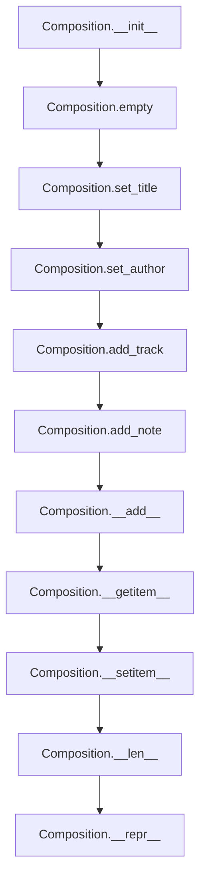

# `composition.py`

## `mingus.containers.composition.Composition` · *class*

## Summary:
Represents a musical composition containing multiple tracks and associated metadata.

## Description:
The Composition class serves as a container for musical compositions, managing a collection of tracks and their metadata. It allows users to build compositions by adding tracks and notes, set composition metadata such as title and author information, and provides indexing capabilities to access individual tracks. This class acts as the central abstraction for organizing musical content in the mingus library.

## State:
- title (str): The main title of the composition, defaults to "Untitled"
- subtitle (str): The subtitle of the composition, defaults to empty string
- author (str): The author of the composition, defaults to empty string
- email (str): The author's email address, defaults to empty string
- description (str): A description of the composition, defaults to empty string
- tracks (list): List of Track objects contained in this composition, defaults to empty list
- selected_tracks (list): Indices of currently selected tracks for note addition, defaults to empty list

## Lifecycle:
Creation: Instantiate with Composition() to create an empty composition with default metadata.
Usage: Add tracks using add_track() or the + operator, add notes to selected tracks using add_note(), set metadata using set_title() and set_author(). Access tracks via indexing with [].
Destruction: No explicit cleanup required; Python's garbage collector handles memory management.

## Method Map:


## Raises:
- UnexpectedObjectError: Raised in add_track() when attempting to add an object that doesn't have a "bars" attribute, indicating it's not a valid Track object.

## Example:
```python
# Create a new composition
comp = Composition()

# Set composition metadata
comp.set_title("My Great Song", "A beautiful melody")

# Add tracks (assuming Track objects exist)
track1 = Track()
track2 = Track()
comp.add_track(track1)
comp.add_track(track2)

# Add notes to selected tracks
comp.add_note(note)

# Access tracks
first_track = comp[0]
comp[0] = updated_track

# Get composition length
num_tracks = len(comp)
```

### `mingus.containers.composition.Composition.__init__` · *method*

## Summary:
Initializes a Composition object by clearing all tracks from the composition.

## Description:
This method serves as the constructor for the Composition class, initializing the object's state by clearing all existing tracks. It delegates the initialization logic to the empty() method, ensuring that the tracks list is reset to an empty state.

## Args:
    None

## Returns:
    None

## Raises:
    None

## State Changes:
    Attributes READ: None
    Attributes WRITTEN: self.tracks

## Constraints:
    Preconditions: Object instantiation process
    Postconditions: self.tracks is initialized as an empty list

## Side Effects:
    None

### `mingus.containers.composition.Composition.empty` · *method*

## Summary:
Clears all tracks from the composition by resetting the tracks list to empty.

## Description:
Removes all tracks from the composition by setting the tracks attribute to an empty list. This method is typically called during initialization or when resetting the composition state to a clean slate.

## Args:
    None

## Returns:
    None

## Raises:
    None

## State Changes:
    Attributes READ: None
    Attributes WRITTEN: self.tracks

## Constraints:
    Preconditions: None
    Postconditions: The tracks attribute will be an empty list with length 0

## Side Effects:
    None

### `mingus.containers.composition.Composition.reset` · *method*

## Summary:
Resets the composition to its initial state by clearing tracks and resetting title and author metadata.

## Description:
This method provides a convenient way to reset a composition object to its default state. It clears all tracks from the composition and resets the title and author metadata to their default values. This method is typically used when creating a new composition or when wanting to clear existing content while preserving the object structure.

The reset operation consists of three sequential operations:
1. Calls `empty()` to clear all tracks from the composition
2. Calls `set_title()` to reset the title to "Untitled" and subtitle to empty string
3. Calls `set_author()` to reset the author to empty string and email to empty string

This method is designed as a separate utility method rather than inlining these operations because it provides a clean, reusable interface for resetting compositions to their initial state, making the intent clearer and reducing code duplication.

## Args:
    None

## Returns:
    None

## Raises:
    None

## State Changes:
    Attributes READ: None
    Attributes WRITTEN: 
    - self.tracks (cleared to empty list)
    - self.title (set to "Untitled")
    - self.subtitle (set to "")
    - self.author (set to "")
    - self.email (set to "")

## Constraints:
    Preconditions: None
    Postconditions: 
    - self.tracks will be an empty list
    - self.title will be "Untitled"
    - self.subtitle will be ""
    - self.author will be ""
    - self.email will be ""

## Side Effects:
    None

### `mingus.containers.composition.Composition.add_track` · *method*

## Summary:
Adds a musical track to the composition and selects it as the only currently selected track.

## Description:
This method appends a track to the composition's track collection and updates the selection state to include only the newly added track. It performs type validation to ensure that only valid Track objects (those with a "bars" attribute) are added to the composition.

## Args:
    track (object): A musical track object that must have a "bars" attribute. This is typically a mingus.containers.Track instance.

## Returns:
    None: This method does not return any value.

## Raises:
    UnexpectedObjectError: Raised when the provided object does not have a "bars" attribute, indicating it is not a valid Track object.

## State Changes:
    Attributes READ: self.tracks, self.selected_tracks
    Attributes WRITTEN: self.tracks, self.selected_tracks

## Constraints:
    Preconditions: The track parameter must be an object with a "bars" attribute (typically a Track instance)
    Postconditions: The track is appended to self.tracks and self.selected_tracks contains only the index of the newly added track

## Side Effects:
    None: This method only modifies internal object state and does not perform I/O operations or external service calls.

### `mingus.containers.composition.Composition.add_note` · *method*

## Summary:
Adds a musical note to all currently selected tracks in the composition.

## Description:
This method iterates through all tracks identified by the `selected_tracks` attribute and adds the specified note to each track using the track's `__add__` method. This is a convenience method that allows adding notes to multiple tracks simultaneously without having to manually iterate through tracks.

The method is typically called during composition creation or modification workflows when adding musical elements to existing tracks. It's part of the composition's interface for building musical pieces incrementally.

## Args:
    note: A musical note object, string representation of a note, or note container that can be added to a track. This can be a single note, a list of notes, or a chord represented as shorthand.

## Returns:
    None: This method does not return any value.

## Raises:
    None explicitly raised by this method, though underlying operations may raise exceptions from the Track class (e.g., InstrumentRangeError if the note is out of instrument range).

## State Changes:
    Attributes READ: 
        - self.selected_tracks: Used to determine which tracks to modify
        - self.tracks: Accessed via indexing to retrieve tracks for modification
    
    Attributes WRITTEN: 
        - None: This method doesn't modify the Composition's attributes directly, but modifies the track objects contained within.

## Constraints:
    Preconditions:
        - The Composition instance must have tracks in `self.tracks`
        - The `selected_tracks` list must contain valid indices for tracks in `self.tracks`
        - The note parameter must be compatible with the Track class's `__add__` method
        
    Postconditions:
        - The specified note is added to each track in `selected_tracks`
        - The Composition's state remains otherwise unchanged

## Side Effects:
    - Mutates the track objects stored in `self.tracks` by adding notes to them
    - May trigger additional processing within the Track and Bar classes when notes are added
    - No external I/O or service calls are made

### `mingus.containers.composition.Composition.set_title` · *method*

## Summary:
Sets the title and subtitle of a composition object.

## Description:
Configures the title and subtitle attributes of a Composition instance. This method provides a clean interface for updating these metadata fields while maintaining consistency in the object's state.

## Args:
    title (str): The main title of the composition. Defaults to "Untitled".
    subtitle (str): The subtitle of the composition. Defaults to "".

## Returns:
    None: This method does not return any value.

## Raises:
    None: This method does not explicitly raise any exceptions.

## State Changes:
    Attributes READ: None
    Attributes WRITTEN: self.title, self.subtitle

## Constraints:
    Preconditions: The object must be an instance of Composition class.
    Postconditions: The title and subtitle attributes of the Composition object are updated to the provided values.

## Side Effects:
    None: This method only modifies the object's internal state and has no external side effects.

### `mingus.containers.composition.Composition.set_author` · *method*

## Summary:
Sets the author name and email for a composition.

## Description:
Configures the author information for a musical composition by setting both the author name and email address. This method provides a centralized way to update author metadata while maintaining consistency with the Composition class's design patterns.

## Args:
    author (str): The name of the composition's author. Defaults to empty string.
    email (str): The email address of the composition's author. Defaults to empty string.

## Returns:
    None: This method does not return any value.

## Raises:
    None: This method does not explicitly raise any exceptions.

## State Changes:
    Attributes READ: None
    Attributes WRITTEN: self.author, self.email

## Constraints:
    Preconditions: The method can be called on any Composition instance.
    Postconditions: The Composition's author and email attributes are updated to the provided values.

## Side Effects:
    None: This method only modifies the local object's attributes and has no external side effects.

### `mingus.containers.composition.Composition.__add__` · *method*

## Summary:
Adds a track or note to the composition using the `+` operator, enabling intuitive composition building through arithmetic operations.

## Description:
This method implements the `__add__` magic method to enable adding musical elements to a Composition object using the `+` operator. When adding an element to a composition, the method inspects the object being added to determine whether it's a musical track (which has a "bars" attribute) or a note (which does not). This allows for natural syntax when building compositions, such as `composition + track` or `composition + note`.

The method serves as a convenient interface that delegates to either `add_track()` or `add_note()` based on the type of object being added, providing a unified way to extend compositions.

## Args:
    value (object): Either a Track object (with "bars" attribute) or a Note object (without "bars" attribute)

## Returns:
    Composition: The current Composition instance, allowing for method chaining

## Raises:
    UnexpectedObjectError: When attempting to add a track that doesn't have a "bars" attribute

## State Changes:
    Attributes READ: self.tracks, self.selected_tracks
    Attributes WRITTEN: self.tracks, self.selected_tracks

## Constraints:
    Preconditions: The Composition object must be properly initialized
    Postconditions: The composition will contain the added track or note, and the selected_tracks will be updated appropriately

## Side Effects:
    None

### `mingus.containers.composition.Composition.__getitem__` · *method*

## Summary:
Retrieves a track from the composition's track collection by index position.

## Description:
Provides indexed access to the tracks stored in this composition. This method enables iteration over tracks and direct access to specific tracks using bracket notation (e.g., composition[0]).

## Args:
    index (int): The zero-based index position of the track to retrieve

## Returns:
    Track: The track object at the specified index position

## Raises:
    IndexError: When the index is out of bounds for the tracks list

## State Changes:
    Attributes READ: self.tracks
    Attributes WRITTEN: None

## Constraints:
    Preconditions: 
    - The index must be within the valid range [0, len(self.tracks))
    - The tracks list must be initialized (should not be None)
    
    Postconditions:
    - Returns a valid Track object from self.tracks
    - Does not modify the composition's state

## Side Effects:
    None

### `mingus.containers.composition.Composition.__setitem__` · *method*

## Summary:
Sets a track at the specified index position in the composition's track list.

## Description:
This method implements Python's container protocol for setting items using bracket notation. It allows assignment of a track object to a specific position in the composition's internal tracks list. This method enables direct manipulation of tracks within the composition using indexing syntax, providing a clean interface for replacing existing tracks or modifying the track collection.

## Args:
    index (int): The zero-based index position where the track should be placed
    value (object): An object to store at the specified index position (typically a Track object)

## Returns:
    None: This method does not return a value

## Raises:
    IndexError: When the index is out of bounds for the tracks list
    TypeError: When the value being assigned is not compatible with the list's internal storage (inherited from list behavior)

## State Changes:
    Attributes READ: self.tracks
    Attributes WRITTEN: self.tracks

## Constraints:
    Preconditions: 
    - The index must be within the valid range of existing tracks (0 to len(tracks)-1) or equal to len(tracks) (for appending)
    - The value should be compatible with the list's internal storage
    
    Postconditions:
    - The track at the specified index is replaced with the provided value
    - If index equals the length of tracks, the value is appended to the list

## Side Effects:
    None: This method only modifies the internal state of the Composition object

### `mingus.containers.composition.Composition.__len__` · *method*

## Summary:
Returns the number of tracks contained in the composition.

## Description:
This method implements the Python `__len__` magic method, allowing the Composition class to support the built-in `len()` function. It provides the count of tracks currently in the composition's track collection.

## Args:
    None

## Returns:
    int: The number of tracks in the composition's tracks list.

## Raises:
    None

## State Changes:
    Attributes READ: self.tracks
    Attributes WRITTEN: None

## Constraints:
    Preconditions: The Composition instance must be properly initialized with a tracks attribute that supports the `len()` function.
    Postconditions: The method returns an integer representing the current count of tracks without modifying the composition's state.

## Side Effects:
    None

### `mingus.containers.composition.Composition.__repr__` · *method*

## Summary:
Returns a string representation of the composition by concatenating string representations of all tracks.

## Description:
This method implements the Python special method `__repr__` to provide a string representation of a Composition object. It iterates through all tracks in the composition and concatenates their string representations to form a single output string. This allows developers to inspect the composition's contents in a readable format.

## Args:
    None beyond implicit self parameter

## Returns:
    str: A concatenated string containing the string representations of all tracks in the composition

## Raises:
    None explicitly raised

## State Changes:
    Attributes READ: self.tracks
    Attributes WRITTEN: None

## Constraints:
    Preconditions: 
    - self.tracks must be iterable (list-like structure)
    - Each item in self.tracks must support str() conversion
    
    Postconditions:
    - Returns a string representation of all tracks
    - Does not modify the composition's state

## Side Effects:
    None

